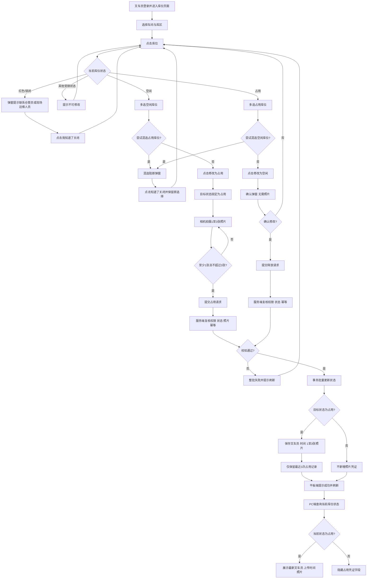

# 库位双向状态修改与现场拍照优化 PRD

> 文档版本：V0.10（内部评审稿）  
> 更新日期：2026-07-22  
> 适用系统：叉车员平板端、可视化库位 PC 端  
> 文档状态：待产品、业务、研发、测试联合评审  
> 原型依据：[平板端最新原型](../tablet-forklift-prototype/index.html)｜[PC端原型](../pc-occupancy-prototype/index.html)｜[最新版整体流程图](../flowcharts/2026-07-22-库位状态双向修改整体流程-flowchart.html)

## 1. 需求背景

现有系统支持查看库位状态，但人工占用和释放库位的现场操作缺少统一流程。库位由空闲修改为占用时，需要现场照片作为占用凭证；库位由占用释放为空闲时，现场操作希望更快捷，不要求上传照片。同时，PC 端需要在库位处于占用状态时快速查看最新的叉车员、上传时间和现场照片。

本次优化将两条业务链路合并到同一平板端操作页面：

- **空闲 → 占用：** 支持批量选择空闲库位，强制现场拍摄 1～3 张照片后提交。
- **占用 → 空闲：** 支持批量选择占用库位，只需弹窗确认，无需上传照片。
- **锁闭/红色库位：** 不可修改，点击后通过独立弹窗提示联系相关人员。
- **PC 端：** 当前状态为占用时展示最新凭证；空闲及其他状态隐藏凭证字段。

## 2. 需求目标

1. 在同一平板页面完成空闲与占用状态的双向修改。
2. 通过同状态批量选择提高叉车员现场操作效率。
3. 对“空闲 → 占用”强制采集真实现场照片。
4. 对“占用 → 空闲”采用确认即提交的轻量流程。
5. 防止空闲、占用库位混选造成目标状态不明确。
6. PC 端能够快速查看当前占用库位的最新凭证。
7. 每个库位保留最近三次成功占用记录，满足基础追溯需要。

## 3. 需求范围

### 3.1 本期范围

- 平板端同时支持空闲库位和占用库位选择。
- 同一批次仅允许选择相同状态的库位。
- 空闲库位批量修改为占用，要求相机现场拍摄 1～3 张照片。
- 占用库位批量修改为空闲，只需确认，无需照片。
- 已拍照片预览、删除和重新拍摄。
- 混选状态独立阻断弹窗。
- 红色锁闭库位独立提示弹窗。
- 批量提交前服务端状态复核、幂等控制及原子事务。
- PC 端展示占用库位最新一次操作凭证。
- 每个库位保留最近三次成功占用记录。

### 3.2 非本期范围

- 叉车员修改锁闭、预留或其他特殊状态。
- 同一批次混选空闲库位和占用库位。
- 从系统相册或文件管理器选择照片。
- “占用 → 空闲”上传照片。
- 平板端展示历史占用凭证。
- PC 端默认展开全部历史记录。
- 照片滤镜、裁剪、标注等编辑能力。

## 4. 用户角色与权限

| 角色 | 使用端 | 权限 |
|---|---|---|
| 叉车员 | 平板端 | 查看库位状态；批量选择同状态库位；将空闲修改为占用；将占用修改为空闲；现场拍照；删除待提交照片 |
| 管理人员 | PC 端 | 查看库位状态；查看占用库位最新一次叉车员、上传时间和照片 |
| 仓管员/现场运维人员 | 现场 | 处理红色锁闭库位等叉车员无权操作的异常状态 |
| 系统管理员 | 后台 | 复用现有权限体系维护用户、角色和基础数据，本期不新增独立页面 |

## 5. 名词及业务对象

| 名词 | 说明 |
|---|---|
| 空闲库位 | 可由叉车员批量修改为占用的库位 |
| 占用库位 | 可由叉车员批量释放为空闲；PC 端展示最新占用凭证 |
| 锁闭库位 | 原型中显示为红色，不允许叉车员修改 |
| 批次操作 | 一次选择一个或多个相同状态库位并统一提交的操作 |
| 占用凭证 | 空闲改占用时产生的叉车员、服务端时间、1～3 张现场照片及关联库位记录 |
| 最新记录 | 按服务端成功提交时间倒序排列的第一条有效占用记录 |

## 6. 核心业务规则

| 编号 | 业务规则 |
|---|---|
| R01 | 空闲和占用库位均可被叉车员选择，锁闭及其他特殊状态不可选择。 |
| R02 | 支持单选或多选库位，但同一批次只能选择相同状态的库位。 |
| R03 | 首次选中的库位状态决定本批次操作类型和目标状态。 |
| R04 | 已选择空闲库位后再点击占用库位，或反向操作时，系统不得改变原选择，并显示混选阻断弹窗。 |
| R05 | 混选弹窗提示“空闲库位和占用库位不可同时选择，请先取消当前选择后再选择”，必须点击“知道了”关闭。 |
| R06 | 点击红色锁闭库位时显示独立弹窗，提示“请联系仓管员或现场运维人员”，必须点击“我知道了”关闭。 |
| R07 | 弹窗打开时点击遮罩不关闭，不自动消失。 |
| R08 | 未选择库位时，修改按钮不可用。 |
| R09 | 选择空闲库位后，操作按钮动态显示“修改为占用”。 |
| R10 | 选择占用库位后，操作按钮动态显示“修改为空闲”。 |
| R11 | 空闲库位只能修改为占用，目标状态固定且不可切换。 |
| R12 | 占用库位只能修改为空闲，目标状态固定且不可切换。 |
| R13 | 空闲改占用时，一次批次操作共用 1～3 张现场照片。 |
| R14 | 照片只能调用当前设备相机拍摄，不允许从相册或文件中选择。 |
| R15 | 空闲改占用时，0 张照片不得提交；达到 3 张后不得继续拍摄。 |
| R16 | 待提交照片支持逐张删除，删除后可重新拍摄。 |
| R17 | 占用改空闲不展示拍照区域、不校验照片，只需确认弹窗。 |
| R18 | 批量状态修改必须保持原子性：全部成功或全部失败。 |
| R19 | 服务端提交时必须再次校验所有库位仍为本批次要求的源状态。 |
| R20 | 平板端不展示叉车员、上传时间、照片和历史记录等凭证详情。 |
| R21 | PC 端仅在当前状态为占用时展示最新占用凭证。 |
| R22 | PC 端在空闲、锁闭及其他状态下隐藏叉车员、上传时间和照片字段。 |
| R23 | 每个库位最多保留最近 3 次成功占用记录；第 4 次占用成功后删除最早记录。 |

## 7. 平板端功能需求

### 7.1 库位页面

1. 延续现有平板端视觉规范，展示车间、库区、库位图和状态图例。
2. 图例至少包含空闲、占用、锁闭、已选四类状态。
3. 空闲和占用库位均可点击选择；再次点击已选库位可取消。
4. 选择数量实时显示，例如“已选 3 个库位”。
5. 未选择库位时，“修改库位状态”按钮置灰。
6. 选择空闲库位后按钮文案变为“修改为占用”。
7. 选择占用库位后按钮文案变为“修改为空闲”。
8. 切换库区时清空当前选择和未提交照片，防止跨库区误操作。
9. 平板主页面不展示占用凭证或历史记录。

### 7.2 同状态选择与混选阻断

1. 首次选择空闲库位后，本批次只允许继续选择空闲库位。
2. 首次选择占用库位后，本批次只允许继续选择占用库位。
3. 尝试混选时弹出独立阻断弹窗：
   - 标题：无法同时选择不同状态。
   - 内容：空闲库位和占用库位不可同时选择，请先取消当前选择后再选择。
   - 按钮：知道了。
4. 弹窗不自动关闭，点击遮罩不关闭。
5. 点击“知道了”后关闭弹窗，保留原有选择，不选中本次点击的异状态库位。

### 7.3 红色锁闭库位提示

1. 点击红色锁闭库位时不选中库位，也不进入修改流程。
2. 显示独立阻断弹窗：
   - 标题：该库位当前不可操作。
   - 内容：请联系仓管员或现场运维人员。
   - 按钮：我知道了。
3. 弹窗不自动消失，点击遮罩不关闭。
4. 点击“我知道了”后关闭弹窗并返回库位页面。

### 7.4 空闲修改为占用

点击“修改为占用”后打开批量修改弹窗，展示：

- 已选空闲库位数量及库位编码。
- 目标状态“占用”，固定不可修改。
- 现场照片数量 `0/3`。
- 调用设备相机的拍照按钮。
- 最多三个照片缩略图和逐张删除按钮。
- “取消”和“完成并修改为占用”按钮。

拍照及提交规则：

1. 一次批次操作共用 1～3 张照片，不要求每个库位分别拍照。
2. 点击拍照直接调用设备相机，不展示相册或文件入口。
3. 拍摄成功后按顺序展示缩略图并更新数量。
4. 达到 3 张后阻止继续添加，提示“最多只能拍摄3张照片”。
5. 删除照片后可继续拍摄。
6. 0 张照片点击提交时提示“请至少拍摄1张现场照片，未上传照片不可提交”，弹窗保持打开。
7. 提交成功后全部所选库位统一变为占用，保存占用凭证，清空选择并刷新库位图。

### 7.5 占用修改为空闲

点击“修改为空闲”后打开确认弹窗，展示：

- 已选占用库位数量及库位编码。
- 目标状态“空闲”，固定不可修改。
- 提示“确认后，所选占用库位将统一修改为空闲状态。本操作无需上传照片。”
- “取消”和“确认修改为空闲”按钮。

确认及提交规则：

1. 弹窗不展示拍照区域，不要求照片。
2. 点击取消时关闭弹窗，库位保持占用状态。
3. 点击“确认修改为空闲”后发起批量提交。
4. 提交成功后全部所选库位统一变为空闲，清空选择并刷新库位图。
5. 释放为空闲不新增照片凭证；原有占用历史记录仍按最近三次规则保存。

### 7.6 共用提交规则

1. 提交期间按钮进入加载状态并禁止重复点击。
2. 服务端按请求类型再次校验所有库位源状态。
3. 任一库位状态已变化时整批失败，不允许部分成功。
4. 失败后提示原因，保留合理的选择和照片以便刷新或重试。
5. 使用请求唯一标识实现幂等，避免重复生成记录或重复修改状态。

## 8. PC 端功能需求

### 8.1 展示位置

在现有可视化库位页面右侧统计/操作区域下方增加“占用信息”卡片，沿用当前 PC 原型布局。

### 8.2 展示条件

- 当前选中库位状态为占用：展示占用信息卡片。
- 当前选中库位为其他状态：隐藏叉车员、上传时间、照片及整个占用详情内容。
- 占用状态但凭证异常缺失：展示“暂无占用凭证”，并记录异常日志。

### 8.3 展示字段

| 字段 | 展示规则 |
|---|---|
| 叉车员 | 最新一次成功占用操作的叉车员姓名，必要时可辅以账号或工号 |
| 上传时间 | 最新占用记录的服务端成功提交时间，格式建议 `YYYY-MM-DD HH:mm:ss` |
| 照片 | 最新占用记录中的 1～3 张现场照片缩略图 |

### 8.4 照片查看

1. 点击缩略图打开大图预览。
2. 多张照片支持上一张、下一张切换。
3. 支持关闭大图预览。
4. 图片加载失败时展示占位图和失败提示，不影响叉车员与时间字段。

### 8.5 状态刷新

- 平板端空闲改占用成功后，PC 端刷新将展示新产生的最新凭证。
- 平板端占用改空闲成功后，PC 端刷新将隐藏占用凭证字段。
- 用户切换库位、主动刷新或系统定时刷新时重新查询当前状态。
- 若现有系统具备实时推送能力，可复用推送机制，但不作为本期强制要求。

## 9. 整体业务流程

完整可交互版本参见：[库位状态双向修改整体流程图](../flowcharts/2026-07-22-库位状态双向修改整体流程-flowchart.html)。

## 10. 数据需求

### 10.1 建议数据模型

#### 占用操作批次表

| 字段 | 说明 |
|---|---|
| batch_id | 批次唯一标识 |
| operator_id | 叉车员用户 ID |
| operator_name | 叉车员姓名快照 |
| operation_type | `OCCUPY` 或 `RELEASE` |
| source_status | 空闲或占用 |
| target_status | 占用或空闲 |
| request_id | 幂等请求标识 |
| submitted_at | 服务端成功提交时间 |
| created_at | 记录创建时间 |

#### 批次库位关联表

| 字段 | 说明 |
|---|---|
| id | 主键 |
| batch_id | 关联批次 ID |
| location_id | 库位 ID |
| location_code | 库位编码快照 |
| before_status | 修改前状态 |
| after_status | 修改后状态 |

#### 占用照片表

| 字段 | 说明 |
|---|---|
| id | 主键 |
| batch_id | 仅关联 `OCCUPY` 类型批次 |
| photo_url / object_key | 图片访问地址或对象存储键 |
| sort_no | 照片顺序，取值 1～3 |
| uploaded_at | 上传完成时间 |

### 10.2 数据保留规则

1. 仅成功的空闲改占用操作产生占用照片凭证。
2. 以单个库位为维度保留最近 3 次成功占用记录。
3. 第 4 次占用成功时，先确保新记录、照片和状态更新成功，再清理最早记录。
4. 占用改空闲不新增照片记录，但应保留必要的状态操作日志。
5. 库位释放为空闲后，历史占用记录可继续保存在数据库中，但 PC 当前状态页面不展示。
6. 一个批次关联多个库位时，清理某库位历史不得误删仍被其他库位引用的照片或批次。
7. 记录排序以服务端成功提交时间为准，不使用平板设备时间。

## 11. 接口及服务端要求

### 11.1 空闲改占用接口

请求至少包含：

- 空闲库位 ID 列表。
- 目标状态“占用”。
- 1～3 张现场照片文件标识。
- 请求唯一标识。

服务端校验：操作者权限、库位列表非空、所有库位仍为空闲、目标状态为占用、照片数量及文件有效性、请求幂等性。

### 11.2 占用改空闲接口

请求至少包含：

- 占用库位 ID 列表。
- 目标状态“空闲”。
- 请求唯一标识。

服务端校验：操作者权限、库位列表非空、所有库位仍为占用、目标状态为空闲、请求幂等性。不得强制要求照片字段。

### 11.3 PC 查询接口

根据库位 ID 返回：

- 当前库位状态。
- 当前状态为占用时返回最新一条占用记录。
- 最新记录包含叉车员、服务端上传时间、1～3 张照片。
- 当前状态非占用时不返回或由前端忽略占用详情字段。

## 12. 异常及边界场景

| 场景 | 处理要求 |
|---|---|
| 未选择库位 | 修改按钮不可用 |
| 已选空闲后点击占用，或反向混选 | 独立弹窗阻断；点击“知道了”关闭；保留原选择 |
| 点击红色锁闭库位 | 弹窗提示联系仓管员或现场运维人员；点击“我知道了”关闭 |
| 点击弹窗遮罩 | 混选和锁闭提示弹窗均不关闭 |
| 空闲改占用但未拍照片 | 阻止提交，提示至少拍摄 1 张，弹窗保持打开 |
| 已有 3 张照片继续拍摄 | 阻止添加并提示最多 3 张 |
| 删除唯一照片后提交占用 | 按 0 张处理并阻止提交 |
| 占用改空闲 | 不展示拍照区域，不校验照片 |
| 相机权限未开启 | 提示开启相机权限，并提供返回或重试入口 |
| 图片上传失败 | 提示失败并允许重试，不更新库位状态 |
| 提交时任一库位源状态变化 | 整批失败，不允许部分成功 |
| 网络中断或超时 | 不直接显示成功；允许查询最终状态或使用相同请求标识安全重试 |
| 连续点击提交 | 前端禁用按钮，服务端幂等防止重复执行 |
| PC 图片加载失败 | 展示占位图及失败提示，其他字段正常展示 |
| 占用状态但无记录 | 展示“暂无占用凭证”并记录异常日志 |
| 切换库区 | 清空当前选择和未提交照片 |

## 13. 非功能与安全要求

1. 服务端不得仅依赖前端限制，必须校验权限、源状态、目标状态、批次一致性和照片规则。
2. 批量更新、操作记录和照片关联必须在事务中完成。
3. 图片访问复用现有登录态和权限控制，避免永久公开链接。
4. 图片在不影响现场辨识的前提下压缩，兼顾弱网上传性能。
5. 操作日志应包含操作者 ID、姓名快照、服务端时间、库位、操作类型和结果。
6. 建议记录并发冲突、重复请求、图片失败和历史清理日志。
7. 未提交临时照片与已提交业务照片应采用不同清理策略。
8. 混选和锁闭提示弹窗应支持键盘焦点落在确认按钮上，避免误操作。

## 14. 验收标准

| 编号 | 验收标准 |
|---|---|
| AC01 | 空闲库位和占用库位均可被点击选中。 |
| AC02 | 支持一次选择多个相同状态库位。 |
| AC03 | 首次选择空闲后只能继续选择空闲；首次选择占用后只能继续选择占用。 |
| AC04 | 尝试混选时不选中本次库位，并显示独立阻断弹窗。 |
| AC05 | 混选弹窗提示词正确，且只有点击“知道了”才关闭。 |
| AC06 | 混选弹窗关闭后保留原有选择。 |
| AC07 | 点击红色锁闭库位不选中，并显示联系人员弹窗。 |
| AC08 | 锁闭弹窗提示“请联系仓管员或现场运维人员”。 |
| AC09 | 锁闭弹窗只有点击“我知道了”才关闭。 |
| AC10 | 未选择库位时修改按钮不可用。 |
| AC11 | 选择空闲库位后按钮显示“修改为占用”。 |
| AC12 | 选择占用库位后按钮显示“修改为空闲”。 |
| AC13 | 空闲改占用弹窗目标状态固定为占用。 |
| AC14 | 空闲改占用只允许调用设备相机，不提供相册入口。 |
| AC15 | 空闲改占用允许上传 1～3 张照片，照片可删除。 |
| AC16 | 0 张照片提交占用时被阻止并显示明确提示。 |
| AC17 | 已有 3 张照片时不能继续添加第 4 张。 |
| AC18 | 空闲改占用成功后全部所选库位变为占用。 |
| AC19 | 占用改空闲弹窗目标状态固定为空闲。 |
| AC20 | 占用改空闲不展示拍照区域且不要求照片。 |
| AC21 | 点击确认后全部所选占用库位变为空闲。 |
| AC22 | 两类批量操作均为全部成功或全部失败。 |
| AC23 | 任一库位在提交时源状态已改变，整批失败并提示刷新。 |
| AC24 | 重复点击或重复请求不会生成重复记录或重复修改。 |
| AC25 | 平板端不展示叉车员、上传时间、照片和历史详情。 |
| AC26 | PC 端选中占用库位时展示占用信息区域。 |
| AC27 | PC 端只展示最新一次成功占用记录。 |
| AC28 | PC 端展示最新叉车员、服务端上传时间和 1～3 张照片。 |
| AC29 | PC 端照片支持大图预览和多图前后切换。 |
| AC30 | PC 端选中空闲、锁闭或其他状态时隐藏占用凭证字段。 |
| AC31 | 每个库位最多保留最近 3 次成功占用记录。 |
| AC32 | 第 4 次占用成功后才清理最早一条记录。 |

## 15. 需求追踪矩阵

| 业务目标 | 对应规则 | 对应验收标准 |
|---|---|---|
| 双向状态修改与同状态批量选择 | R01～R03、R08～R12 | AC01～AC03、AC10～AC13、AC18～AC21 |
| 防止混选和特殊状态误操作 | R04～R07 | AC04～AC09 |
| 强制采集占用现场凭证 | R13～R16 | AC14～AC17 |
| 快速释放占用库位 | R17 | AC19～AC21 |
| 保证批量操作一致性 | R18～R19 | AC22～AC24 |
| PC 端展示最新凭证 | R20～R22 | AC25～AC30 |
| 控制历史数据规模 | R23 | AC31～AC32 |

## 16. 待确认事项

| 编号 | 类型 | 待确认项 | 建议口径 | 是否阻塞开发 |
|---|---|---|---|---|
| P01 | 产品/业务 | 多选是否限制在同一库区 | 首期限制在当前库区；切换库区清空选择 | 是 |
| P02 | 产品/业务 | 释放为空闲后历史占用记录是否继续保留 | 数据库继续保留最近三次，PC 当前页面不展示 | 是 |
| P03 | 产品/研发 | PC 端刷新方式 | 首期复用现有主动/定时刷新，有条件再增加实时推送 | 否 |
| P04 | 研发 | 不同平板系统能否完全禁止相册入口 | 使用平台相机能力；无法保证时明确支持设备范围 | 是 |
| P05 | 研发/运维 | 照片格式、压缩规格、单张大小和存储周期 | 联合现有对象存储能力确定 | 是 |
| P06 | 产品/研发 | 双向修改使用一个接口还是按操作类型拆分接口 | 建议统一领域服务、按 operation_type 分支校验 | 否 |
| P07 | 测试 | 混选弹窗和锁闭弹窗是否支持返回键关闭 | 按最新版原型仅允许点击确认按钮关闭 | 是 |

## 17. 评审与发布

### 17.1 评审角色

- 产品：确认双向流程、弹窗、文案和验收口径。
- 业务：确认叉车员权限、释放流程、锁闭库位处理和历史保留。
- 研发：确认相机能力、事务、幂等、并发控制、接口与数据模型。
- 测试：根据 AC01～AC32 编制正常、异常及并发测试用例。
- 运维/安全：确认图片存储、访问权限、压缩和清理机制。

### 17.2 发布前置条件

1. 阻塞待确认项完成确认。
2. 平板端空闲改占用、占用改空闲两条链路联调通过。
3. PC 端占用展示和非占用隐藏逻辑联调通过。
4. 批量事务、并发冲突、重复提交及历史清理测试通过。
5. 目标平板完成相机权限和兼容性验证。
6. 产品、业务、研发、测试完成评审确认。

## 18. 版本记录

| 版本 | 日期 | 状态 | 说明 |
|---|---|---|---|
| V0.9 | 2026-07-22 | 历史评审稿 | 初版以空闲改占用及 PC 最新凭证展示为主 |
| V0.10 | 2026-07-22 | 当前评审稿 | 按最新平板端双向原型、PC 原型和整体流程图更新；新增占用改空闲、混选弹窗及锁闭弹窗规则 |

---

**门禁结论：** 最新平板原型、PC 原型和整体流程图已完成规则对齐，需求主线与验收标准可进入联合评审；在人工评审和阻塞项确认完成前，不升级为 V1.0 正式版。