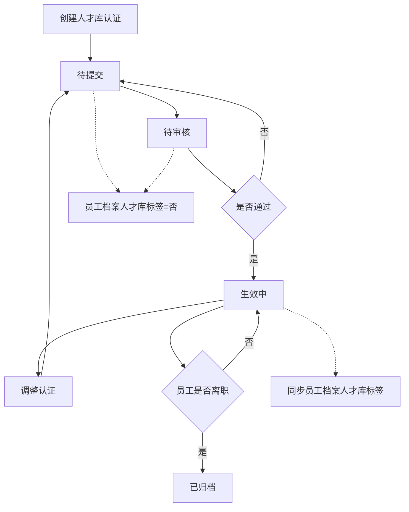
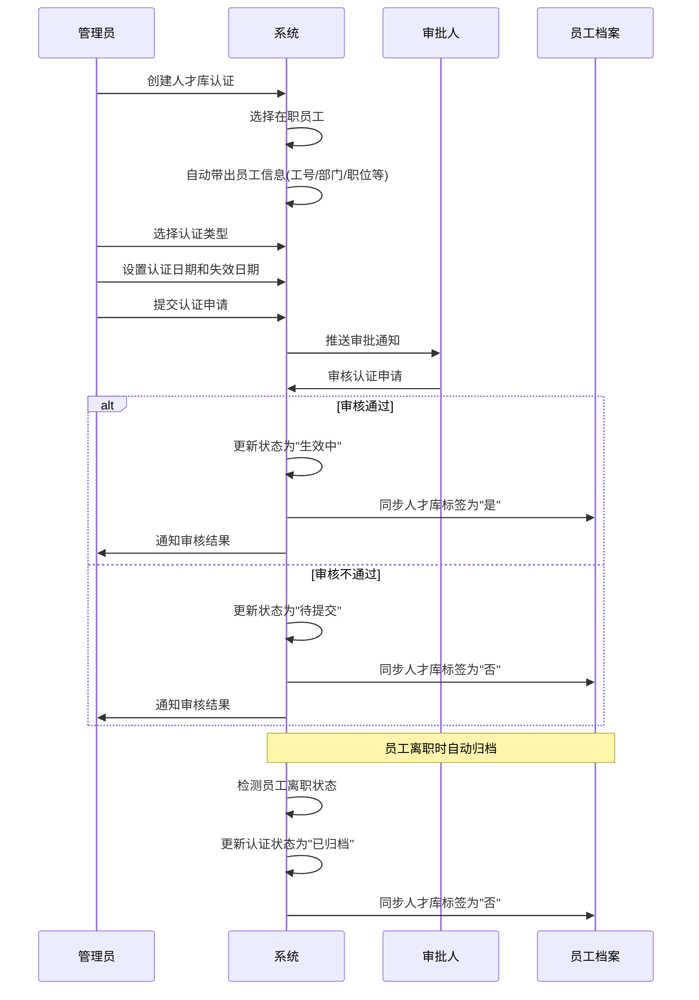

# 人才库认证字段表

---

## 功能业务介绍

人才库认证模块用于管理企业后备人才和储备干部的认证流程。该模块支持为在职员工建立人才库档案，标记其为后备关键人才或储备干部，并记录认证有效期。认证状态会自动同步到员工档案的人才库标签，实现人才信息的统一管理和跟踪。

---

## 业务流程

---

## 字段清单

| 序号 | 字段名称 | 类型 | 长度/精度 | 必填 | 说明/备注 |
|:---:|---------|------|:--------:|:---:|----------|
| 1 | 在职员工 | 字符串（文本） | 50 | 是 | 选择在职员工，关联员工信息 |
| 2 | 工号 | 字符串（文本） | 20 | 否（系统带出/输入） | 员工编号 |
| 3 | 认证编号 | 字符串（文本） | 30 | 否（系统自动生成） | 系统自动生成的认证单据号 |
| 4 | 部门 | 字符串（文本） | 100 | 否 | 员工所属部门 |
| 5 | 入职日期 | 日期 | - | 否 | 员工入职日期 |
| 6 | 职位 | 字符串（文本） | 100 | 否 | 员工当前职位/岗位 |
| 7 | 认证类型 | 枚举/字符串 | 20 | 是 | 下拉选项：后备关键人才、储备干部 |
| 8 | 认证日期 | 日期 | - | 是 | 认证通过的日期 |
| 9 | 失效日期 | 日期 | - | 否 | 认证有效期截止日期 |
| 10 | 认证备注 | 文本（大文本） | 1000 | 否 | 补充说明信息 |
| 11 | 认证附件 | 文件 | 单个≤100M，最多10个 | 否 | 支持格式：jpg、png、gif、jpeg、pdf、zip、rar、docx、doc、xlsx、xls、ppt、pptx、pptm |

---

## 业务规则

### R01 - 员工信息规则
- 在职员工为必填字段，需从员工列表中选择
- 工号可由系统自动带出，也可手动输入，最大长度20字符
- 部门、入职日期、职位从员工档案自动带出

### R02 - 认证编号规则
- 认证编号由系统自动生成，格式为"RC + 年份后两位 + 月份 + 流水号"
- 例如：RC260400001（2026年4月第1号人才库认证单）

### R03 - 认证类型规则
- 认证类型为必填字段，下拉选项：后备关键人才、储备干部
- 支持后续扩展其他认证类型

### R04 - 日期规则
- 认证日期为必填字段
- 失效日期为选填字段，填写时必须大于等于认证日期
- 失效日期到期后认证状态自动变更

### R05 - 状态同步规则
- 认证状态为"生效中"时，自动同步员工档案人才库标签为"是"
- 认证状态不为"生效中"时（待提交、待审核、已归档），自动同步员工档案人才库标签为"否"
- 员工离职时，认证记录自动归档

### R06 - 附件规则
- 支持的文件格式：jpg、png、gif、jpeg、pdf、zip、rar、docx、doc、xlsx、xls、ppt、pptx、pptm
- 单个文件大小不超过100MB
- 最多支持上传10个附件

---

## 业务状态

| 状态名称 | 说明 | 触发条件 | 可执行操作 | 员工档案标签 |
|---------|------|---------|-----------|-------------|
| 待提交 | 认证信息已填写但未提交 | 创建认证记录后 | 编辑、提交、删除 | 否 |
| 待审核 | 认证申请已提交，等待审批 | 管理员提交认证申请 | 审核通过、审核拒绝 | 否 |
| 生效中 | 认证已通过，有效期内 | 审批人审核通过 | 查看详情、编辑、调整认证 | 是 |
| 已归档 | 认证已归档（员工离职等） | 员工离职或手动归档 | 查看详情 | 否 |

---

## 更新记录

| 更新时间 | 更新内容 | 更新人 |
|---------|---------|--------|
| 2026-04-28 | 首次创建人才库认证字段表 | 系统生成 |
