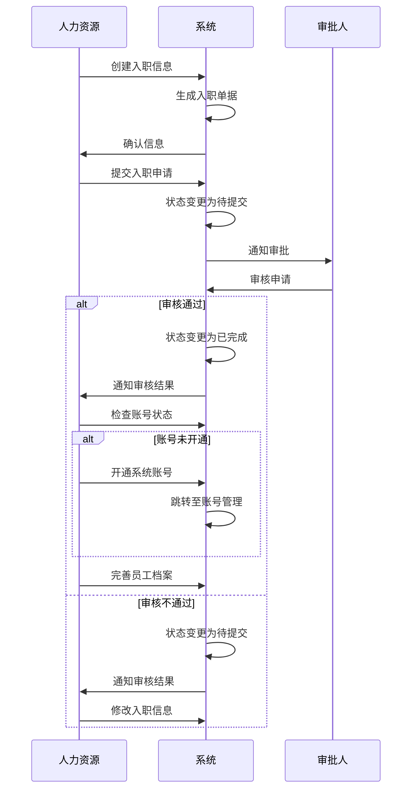

# 入职管理字段表

## 功能业务介绍
入职管理模块用于记录和管理员工的入职信息，包括个人基本信息、联系方式、部门岗位、证件信息等，支持入职流程的全生命周期管理，从创建入职到待提交、待审核、已完成的状态流转，并提供账号开通和员工档案完善的功能。

## 业务流程

## 字段清单

| 字段名称 | 类型 | 长度 | 约束条件 | 说明 |
|---------|------|------|----------|------|
| id | bigint | 20 | 是 | 主键，自增（系统默认字段，图中未展示，用于唯一标识） |
| recruit_related | tinyint | 1 | 是 | 是否关联招聘信息：1 = 关联招聘信息，0 = 不关联招聘信息（单选） |
| emp_id | varchar | 50 | 是 | 工号，示例值： 10040838 |
| emp_name | varchar | 50 | 是 | 姓名，示例值： 卢洁 |
| entry_date | date | - | 是 | 入职日期，示例值： 2026-04-09 |
| phone_account | varchar | 20 | 是 | 手机号 / 账号，示例值： 15335940501 |
| factory_dept | varchar | 100 | 是 | 数智工厂部门，示例值： 品管部一车间 |
| factory_post | varchar | 100 | 是 | 数智工厂岗位，示例值： 化验员 |
| gender | tinyint | 1 | 是 | 性别：1 = 男，2 = 女（单选） |
| id_type | varchar | 50 | 否 | 证件类型，示例值： 身份证号 |
| id_card | varchar | 18 | 是 | 证件号码，示例值： 421223200406184665 |
| birth_date | date | - | 否 | 出生日期，示例值： 2006-06-18 |
| age | int | 3 | 否 | 年龄，支持证件号码自动识别填充 |
| native_place | varchar | 50 | 否 | 籍贯，示例值： 湖北省 |
| nation | varchar | 20 | 否 | 民族，示例值： 汉族 |
| political_status | varchar | 50 | 否 | 政治面貌，示例值： 团员 |
| marital_status | varchar | 20 | 否 | 婚姻状况，示例值： 未婚 |
| school_name | varchar | 100 | 否 | 毕业学校名称，示例值： 武汉生物工程学院 |
| highest_edu | varchar | 20 | 否 | 最高学历，示例值： 专科 |
| entry_status | varchar | 20 | 否 | 入职状态，示例值： 已完成 |
| entry_attach | varchar | 255 | 否 | 入职附件信息，存储文件路径；限制：文件大小≤100M，支持格式：jpg、png、gif、jpeg、pdf、zip、rar、docx、doc、xlsx、ppt、pptx、pptm、xls |
| entry_sign | tinyint | 1 | 否 | 入职签字状态：0 = 未签字，1 = 已签字，示例值： 未签字 |
| sign_time | datetime | - | 是 | 签字时间，支持根据签字时间自动填充 |

## 业务规则
1. **R01**: 工号、姓名、入职日期、手机号/账号、数智工厂部门、数智工厂岗位、性别、证件号码、签字时间为必填字段
2. **R02**: 是否关联招聘信息枚举值为：1 = 关联招聘信息，0 = 不关联招聘信息
3. **R03**: 性别枚举值为：1 = 男，2 = 女
4. **R04**: 入职签字状态枚举值为：0 = 未签字，1 = 已签字
5. **R05**: 年龄字段支持根据证件号码自动识别填充
6. **R06**: 签字时间支持根据签字操作自动填充
7. **R07**: 入职附件限制：文件大小≤100M，支持格式：jpg、png、gif、jpeg、pdf、zip、rar、docx、doc、xlsx、ppt、pptx、pptm、xls
8. **R08**: 入职状态流转规则：待提交→待审核→已完成，审核不通过则返回待提交状态
9. **R09**: 入职状态=已完成，数工厂系统账号=【未开通】时，可点击开通账号，跳转至账号管理模块

## 业务状态
- **待提交**: 初始状态，入职信息已创建但未提交审核
- **待审核**: 入职信息已提交，等待审批人审核
- **已完成**: 审核通过，入职流程完成
  - 已完成状态下，若数工厂系统账号未开通，可点击开通账号跳转至账号管理模块
  - 已完成状态下，可进行完善员工档案操作