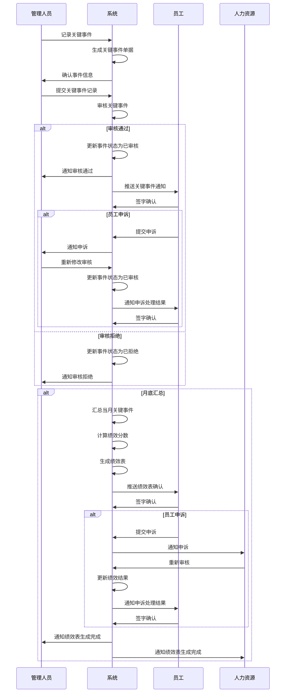

# 关键事件记录表字段表

## 功能业务介绍
关键事件记录表是与综合工时绩效考核相关的核心模块，用于记录综合工时考核员工的加减分项。该模块主要面向生产线上的一线操作员工，当发生加分项和减分项时，及时记录相关信息，作为月底汇总生成绩效表的基础数据。通过关键事件记录，可以实现对员工绩效行为的实时跟踪和量化评估，确保绩效考核的公平性和透明度。

## 业务流程

## 字段清单

### 一、员工信息

| 字段名称 | 类型 | 长度 | 约束条件 | 说明 |
|---------|------|------|----------|------|
| emp_id | varchar | 30 | 是 | 被考核员工工号，示例值：10000763 |
| emp_name | varchar | 50 | 是 | 被考核员工姓名，示例值：杨目娣 |
| doc_no | varchar | 50 | 是 | 单据编号，示例值：GJSJ260427081 |
| dept_name | varchar | 100 | 否 | 所在部门，示例值：储运采购部二车间仓储部 |
| post_name | varchar | 100 | 否 | 所在岗位，示例值：仓管员 |
| audit_type | tinyint | 1 | 是 | 考核类型：1 = 单人考核，2 = 多人考核 |

### 二、关键事件记录

| 字段名称 | 类型 | 长度 | 约束条件 | 说明 |
|---------|------|------|----------|------|
| record_date | date | - | 是 | 记录日期，示例值：2026-04-21 |
| detail_rule | varchar | 200 | 是 | 依据考核细则，示例值：5.2：提出合理化建议被采纳 |
| score_standard | int | 3 | 是 | 分数标准，示例值：3 |
| behavior_record | text | - | 是 | 绩效行为记录，示例值：统一三家热缩膜厂家合格证信息内容，规范了数智工厂中保质期的设定 |
| score_operator | varchar | 2 | 是 | 结果分数运算符：+/- |
| result_score | int | 3 | 是 | 结果分数，示例值：3 |
| handle_scheme | varchar | 50 | 否 | 处理方案，示例值：紫葡萄 |
| event_status | varchar | 20 | 否 | 事件状态，示例值：待审核 |
| attach_path | varchar | 500 | 否 | 记录附件路径，支持最多 10 个文件，单文件≤100M，格式：jpg、png、gif、jpeg、pdf、zip、rar、docx、doc、xlsx、ppt、pptx、pptm、xls |
| auditor_signature | varchar | 500 | 否 | 考核人签字（签名图片路径） |
| employee_signature | varchar | 500 | 否 | 员工签字（签名图片路径） |
| appeal_status | varchar | 20 | 否 | 申诉状态：无/申诉中/申诉通过/申诉驳回 |
| appeal_content | text | - | 否 | 申诉内容 |
| appeal_time | datetime | - | 否 | 申诉时间 |
| appeal_result | text | - | 否 | 申诉处理结果 |

### 三、系统通用字段

| 字段名称 | 类型 | 长度 | 约束条件 | 说明 |
|---------|------|------|----------|------|
| id | bigint | 20 | 是 | 主键 ID，自增 |
| create_time | datetime | - | 是 | 创建时间 |
| update_time | datetime | - | 是 | 更新时间 |
| creator | varchar | 50 | 是 | 创建人 |
| updater | varchar | 50 | 否 | 更新人 |

## 业务规则
1. **R01**: 员工信息中，被考核员工工号、被考核员工姓名、单据编号、考核类型为必填字段
2. **R02**: 关键事件记录中，记录日期、依据考核细则、分数标准、绩效行为记录、结果分数运算符、结果分数为必填字段
3. **R03**: 系统通用字段中，主键ID、创建时间、更新时间、创建人为必填字段
4. **R04**: 考核类型枚举值为：1 = 单人考核，2 = 多人考核
5. **R05**: 结果分数运算符枚举值为：+（加分）、-（减分）
6. **R06**: 附件限制：支持最多 10 个文件，单文件≤100M，支持格式：jpg、png、gif、jpeg、pdf、zip、rar、docx、doc、xlsx、ppt、pptx、pptm、xls
7. **R07**: 关键事件记录作为综合工时绩效考核的基础数据，用于月底汇总生成绩效表
8. **R08**: 事件状态包括：待审核、已审核、已拒绝等
9. **R09**: 关键事件审核通过后，需通知员工并由员工签字确认
10. **R10**: 员工对关键事件有异议的，可提交申诉，申诉期间事件状态暂停
11. **R11**: 申诉处理完成后，需重新通知员工签字确认
12. **R12**: 月底绩效汇总后，需通知员工签字确认绩效结果
13. **R13**: 员工对绩效结果有异议的，可提交申诉，申诉期间绩效状态暂停
14. **R14**: 申诉处理完成后，需重新通知员工签字确认绩效结果

## 业务状态
- **待审核**: 初始状态，关键事件记录已创建但未审核
- **已审核**: 关键事件记录已通过审核，可用于绩效汇总
- **已拒绝**: 关键事件记录未通过审核，不用于绩效汇总