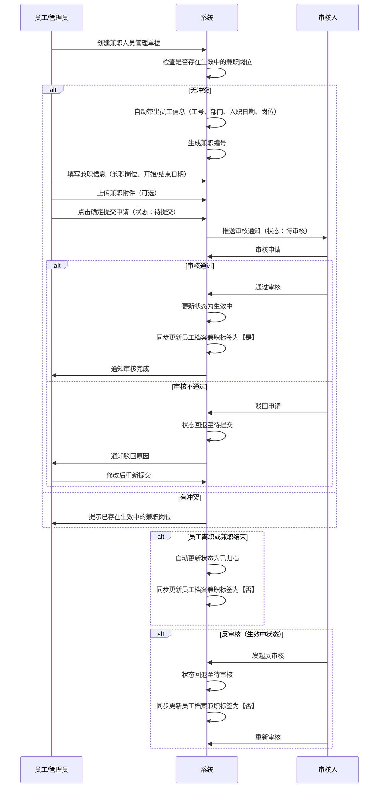
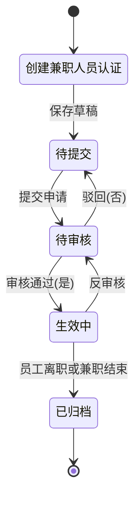

# 兼职人员管理字段表

## 一、业务概述

兼职人员管理模块用于管理员工兼职岗位信息的登记、审核和状态管理。该模块支持员工在保留主岗位的同时，兼任其他岗位，确保兼职信息规范管理。

**重要规则**：
- 一个员工可以存在多条兼职信息，但是不能重复创建正在【生效中】的兼职岗位
- 当对应人员的兼职人员状态为【生效中】时，需要自动同步更新员工档案中兼职人员标签信息；反之不等于【生效中】，则员工档案兼职人员标签变为【否】
- 员工档案状态=已离职，或兼职日期已结束自动归档

## 二、业务流程图

## 三、状态流转图

## 四、状态-员工档案同步规则

| 兼职状态 | 员工档案兼职标签 | 说明 |
| :--- | :--- | :--- |
| 生效中 | 是 | 自动同步更新员工档案 |
| 其他状态（待提交/待审核/已归档） | 否 | 自动同步更新员工档案 |

## 五、字段清单

### 5.1 员工信息模块

| 序号 | 字段名称 | 类型 | 长度/精度 | 必填 | 说明/备注 |
| :--- | :--- | :--- | :--- | :--- | :--- |
| 1 | 员工名称 | 字符串 | 50 | 是 | 点击选择员工名称，为必填项 |
| 2 | 工号 | 字符串 | 20 | 否 | 可输入，也可由选择员工后自动带出 |
| 3 | 兼职编号 | 字符串 | 20 | 否 | 系统自动生成 |
| 4 | 部门 | 字符串 | 100 | 否 | 可输入，也可由选择员工后自动带出 |
| 5 | 入职日期 | 日期 | - | 否 | 可选择，也可由选择员工后自动带出 |
| 6 | 岗位 | 字符串 | 100 | 否 | 可输入，也可由选择员工后自动带出 |

### 5.2 兼职信息模块

| 序号 | 字段名称 | 类型 | 长度/精度 | 必填 | 说明/备注 |
| :--- | :--- | :--- | :--- | :--- | :--- |
| 7 | 兼职岗位 | 枚举（下拉） | 50 | 是 | 下拉选择兼职岗位，为必填项 |
| 8 | 兼职开始日期 | 日期 | - | 是 | 选择兼职开始日期，为必填项 |
| 9 | 兼职结束日期 | 日期 | - | 是 | 选择兼职结束日期，为必填项 |
| 10 | 兼职备注 | 文本 | 500 | 否 | 输入兼职相关备注信息（非必填） |
| 11 | 兼职附件 | 附件上传 | - | 否 | 最多支持10个文件；单文件≤100M；支持格式：jpg、png、gif、jpeg、pdf、zip、rar、docx、doc、xlsx、ppt、pptx、pptm、xls |

### 5.3 操作按钮

| 序号 | 字段名称 | 类型 | 长度/精度 | 必填 | 说明/备注 |
| :--- | :--- | :--- | :--- | :--- | :--- |
| 12 | 取消 | 按钮 | - | - | 放弃本次操作，返回列表页 |
| 13 | 确定 | 按钮 | - | - | 提交本次兼职人员管理信息 |

## 六、业务规则

### R01 - 数据完整性规则
- 员工名称、兼职岗位、兼职开始日期、兼职结束日期为必填字段
- 员工信息（工号、部门、入职日期、岗位）由系统根据选择的员工自动带出

### R02 - 兼职编号生成规则
- 兼职编号格式：JZ + 年份后两位 + 月份 + 日期 + 三位流水号
- 示例：JZ260506001（2026年5月6日第1单）

### R03 - 唯一性规则
- 一个员工可以存在多条兼职信息
- 不能重复创建正在【生效中】的兼职岗位
- 创建时需检查该员工是否已存在生效中的兼职记录

### R04 - 状态流转规则
| 当前状态 | 操作 | 目标状态 | 说明 |
| :--- | :--- | :--- | :--- |
| 待提交 | 提交申请 | 待审核 | 进入审核流程 |
| 待审核 | 审核通过 | 生效中 | 审核流程完成，自动同步员工档案 |
| 待审核 | 审核不通过 | 待提交 | 驳回修改 |
| 生效中 | 员工离职/兼职结束 | 已归档 | 自动归档，同步员工档案 |
| 生效中 | 反审核 | 待审核 | 允许撤销已生效的单据重新审核，同步员工档案 |

### R05 - 员工档案同步规则
- 当兼职状态变更为【生效中】时，自动同步更新员工档案中兼职人员标签为【是】
- 当兼职状态不等于【生效中】时，自动同步更新员工档案中兼职人员标签为【否】

### R06 - 自动归档规则
- 员工档案状态=已离职时，该员工的所有生效中兼职记录自动变为已归档
- 兼职结束日期到期时，该兼职记录自动变为已归档

### R07 - 附件上传规则
- 最多支持10个文件上传
- 单文件大小限制：≤100M
- 支持格式：jpg、png、gif、jpeg、pdf、zip、rar、docx、doc、xlsx、ppt、pptx、pptm、xls

## 七、更新记录

| 日期 | 修改内容 | 修改人 |
| :--- | :--- | :--- |
| 2026-05-06 | 初始创建，包含完整字段清单和业务流程 | 系统管理员 |