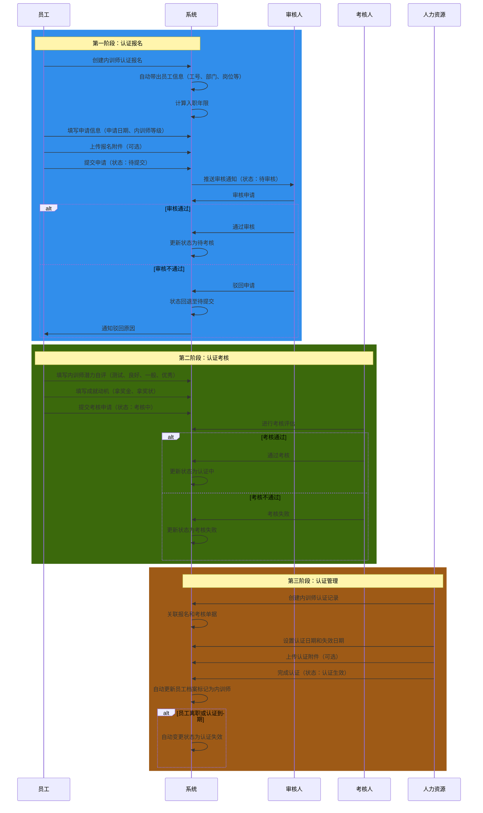
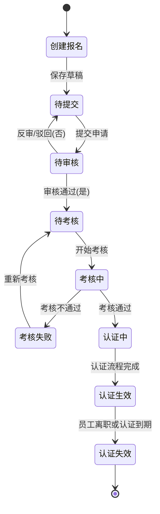

# 内训师认证管理字段表

## 一、业务概述

内训师认证管理模块用于管理员工成为内训师的完整流程，包括三个核心环节：
1. **内训师认证报名** - 员工提交认证申请
2. **内训师认证考核** - 通过报名审核后进行能力考核
3. **内训师认证管理** - 考核通过后完成认证并更新员工档案

整体流程：内训师认证报名 → 报名通过 → 认证考核 → 考核通过 → 成为内训师 → 更新档案信息

**重要规则**：一个员工可以存在多条认证报名信息，但不能重复创建【认证生效】状态的记录。

## 二、业务流程图

## 三、状态流转图

## 四、字段清单

### 4.1 内训师认证报名

#### 4.1.1 基础信息模块

| 序号 | 字段名称 | 类型 | 长度/精度 | 必填 | 说明/备注 |
| :--- | :--- | :--- | :--- | :--- | :--- |
| 1 | 员工名称 | 字符串 | 50 | 是 | 需点击选择员工名称 |
| 2 | 工号 | 字符串 | 20 | 否 | 可输入，也可由选择员工后自动带出 |
| 3 | 业务编号 | 字符串 | 20 | 否 | 系统自动生成 |
| 4 | 部门 | 字符串 | 100 | 否 | 可输入，也可由选择员工后自动带出 |
| 5 | 现岗位 | 字符串 | 100 | 否 | 可输入，也可由选择员工后自动带出 |
| 6 | 入职日期 | 日期 | - | 否 | 可选择，也可由选择员工后自动带出 |
| 7 | 入职年限 | 字符串 | 10 | 否 | 可输入，也可由系统根据入职日期自动计算 |

#### 4.1.2 申请报名信息模块

| 序号 | 字段名称 | 类型 | 长度/精度 | 必填 | 说明/备注 |
| :--- | :--- | :--- | :--- | :--- | :--- |
| 8 | 申请日期 | 日期 | - | 是 | 需选择日期 |
| 9 | 内训师等级 | 枚举（下拉） | 50 | 是 | 下拉选择内训师等级 |
| 10 | 报名备注 | 文本 | 500 | 否 | 非必填，最多500字 |
| 11 | 报名附件 | 附件上传 | - | 否 | 最多支持10个文件；单文件≤100M；支持格式：jpg、png、gif、jpeg、pdf、zip、rar、docx、doc、xlsx、ppt、pptx、pptm、xls |

---

### 4.2 内训师认证考核

#### 4.2.1 基础信息模块

| 序号 | 字段名称 | 类型 | 长度/精度 | 必填 | 说明/备注 |
| :--- | :--- | :--- | :--- | :--- | :--- |
| 1 | 员工名称 | 字符串 | 50 | 是 | 员工姓名，如 "testuser4" |
| 2 | 工号 | 字符串 | 20 | 否（系统带出） | 员工编号，如 "15971" |
| 3 | 业务编号 | 字符串 | 20 | 否（系统生成） | 单据流水号，如 "BM260120002" |
| 4 | 部门 | 字符串 | 100 | 否（系统带出） | 所属部门，如 "行政人事部" |
| 5 | 现岗位 | 字符串 | 100 | 否（系统带出） | 员工岗位，如 "人事经理" |
| 6 | 入职日期 | 日期 | - | 否（系统带出） | 员工入职日期，如 "2024-05-10" |
| 7 | 入职年限 | 字符串 | 20 | 否（系统计算带出） | 如 "1年11月26天" |

#### 4.2.2 申请报名信息模块

| 序号 | 字段名称 | 类型 | 长度/精度 | 必填 | 说明/备注 |
| :--- | :--- | :--- | :--- | :--- | :--- |
| 8 | 申请日期 | 日期 | - | 是 | 申请提交日期，如 "2026-01-20" |
| 9 | 内训师等级 | 枚举（下拉） | 50 | 是 | 下拉选择，如 "二等" |

#### 4.2.3 内训师潜力自评模块（可多选）

| 序号 | 字段名称 | 类型 | 长度/精度 | 必填 | 说明/备注 |
| :--- | :--- | :--- | :--- | :--- | :--- |
| 10 | 测试（多选） | 多选枚举 | - | 是 | 选项示例：选项一、选项二 |
| 11 | 测试补充说明 | 文本 | 500 | 否 | 补充说明，提示 "如有，请输入其他补充信息（非必填）" |
| 12 | 良好（多选） | 多选枚举 | - | 是 | 选项示例：AAA、BBB |
| 13 | 良好补充说明 | 文本 | 500 | 否 | 补充说明，提示 "如有，请输入其他补充信息（非必填）" |
| 14 | 一般（多选） | 多选枚举 | - | 是 | 选项示例：内容1、内容2 |
| 15 | 一般补充说明 | 文本 | 500 | 否 | 补充说明，提示 "如有，请输入其他补充信息（非必填）" |
| 16 | 优秀（多选） | 多选枚举 | - | 是 | 选项示例：666、888 |
| 17 | 优秀补充说明 | 文本 | 500 | 否 | 补充说明，提示 "如有，请输入其他补充信息（非必填）" |

#### 4.2.4 成就动机模块

| 序号 | 字段名称 | 类型 | 长度/精度 | 必填 | 说明/备注 |
| :--- | :--- | :--- | :--- | :--- | :--- |
| 18 | 拿奖金 | 文本 | 500 | 是 | 填写相关说明，如 "12112121.0.012121" |
| 19 | 拿奖状 | 文本 | 500 | 是 | 填写相关说明，如 "121212" |

---

### 4.3 内训师认证管理

#### 4.3.1 基础信息模块

| 序号 | 字段名称 | 类型 | 长度/精度 | 必填 | 说明/备注 |
| :--- | :--- | :--- | :--- | :--- | :--- |
| 1 | 员工姓名 | 字符串 | 50 | 是 | 员工姓名，如 "高维" |
| 2 | 工号 | 字符串 | 20 | 否（系统带出） | 员工编号，如 "0793" |
| 3 | 单据编号 | 字符串 | 20 | 否（系统生成） | 认证单据流水号，如 "RZ260120001" |
| 4 | 部门 | 字符串 | 100 | 否（系统带出） | 所属部门，如 "行政人事部" |
| 5 | 岗位 | 字符串 | 100 | 否（系统带出） | 员工岗位，如 "人事经理" |
| 6 | 关联认证报名 | 字符串 | 20 | 否 | 关联的报名单据编号，如 "BM260120001" |
| 7 | 关联认证考核 | 字符串 | 20 | 否 | 关联的考核单据编号，如 "KH260120001" |

#### 4.3.2 申报考核信息模块

| 序号 | 字段名称 | 类型 | 长度/精度 | 必填 | 说明/备注 |
| :--- | :--- | :--- | :--- | :--- | :--- |
| 8 | 认证日期 | 日期 | - | 是 | 认证生效日期，如 "2026-01-20" |
| 9 | 认证失效日期 | 日期 | - | 是 | 认证到期日期，如 "2026-01-20" |
| 10 | 内训师等级 | 枚举（下拉） | 50 | 是 | 下拉选择，如 "一等" |
| 11 | 认证备注 | 文本 | 500 | 否 | 补充说明信息，如 "23423423" |
| 12 | 认证附件 | 附件上传 | - | 否 | 最多支持10个文件；单文件≤100M；支持格式：jpg、png、gif、jpeg、pdf、zip、rar、docx、doc、xlsx、ppt、pptx、pptm、xls |

## 五、业务规则

### R01 - 数据完整性规则
- 员工名称、申请日期、内训师等级为报名必填字段
- 员工信息（工号、部门、岗位、入职日期）可由系统自动带出
- 入职年限可由系统根据入职日期自动计算

### R02 - 业务编号生成规则
- 报名单据编号格式：BM + 年份后两位 + 月份 + 日期 + 三位流水号，如 "BM260120002"
- 考核单据编号格式：KH + 年份后两位 + 月份 + 日期 + 三位流水号，如 "KH260120001"
- 认证单据编号格式：RZ + 年份后两位 + 月份 + 日期 + 三位流水号，如 "RZ260120001"

### R03 - 状态流转规则
| 当前状态 | 操作 | 目标状态 |
| :--- | :--- | :--- |
| 待提交 | 提交申请 | 待审核 |
| 待审核 | 审核通过 | 待考核 |
| 待审核 | 审核不通过/反审 | 待提交 |
| 待考核 | 开始考核 | 考核中 |
| 考核中 | 考核通过 | 认证中 |
| 考核中 | 考核不通过 | 考核失败 |
| 考核失败 | 重新考核 | 待考核 |
| 认证中 | 认证完成 | 认证生效 |
| 认证生效 | 员工离职/认证到期 | 认证失效 |

### R04 - 唯一性规则
- 同一员工不能同时存在【认证生效】状态的记录
- 员工可以存在多条报名记录，但仅能有一条生效认证

### R05 - 附件上传规则
- 最多支持10个文件上传
- 单文件大小限制：≤100M
- 支持格式：jpg、png、gif、jpeg、pdf、zip、rar、docx、doc、xlsx、ppt、pptx、pptm、xls

### R06 - 档案同步规则
- 当认证状态变更为【认证生效】时，系统自动更新员工档案，标记为内训师
- 当认证状态变更为【认证失效】时，系统自动更新员工档案，取消内训师标记

## 六、更新记录

| 日期 | 修改内容 | 修改人 |
| :--- | :--- | :--- |
| 2026-05-06 | 初始创建，包含内训师认证报名、考核、管理三个模块的完整字段清单和业务流程 | 系统管理员 |