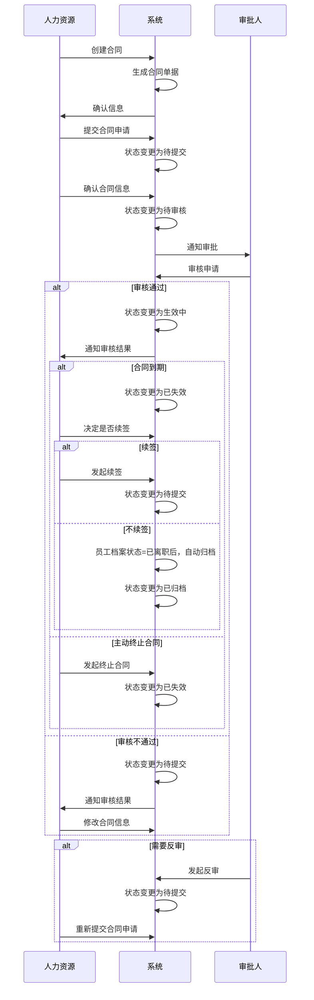

# 合同管理字段表

## 功能业务介绍
合同管理模块用于记录和管理员工的合同信息，包括员工基础信息、合同详细信息和系统通用字段，支持合同流程的全生命周期管理，从创建合同到待提交、待审核、生效中、已失效、已归档的状态流转，并提供续签、反审和主动终止合同的功能。

## 业务流程

## 字段清单

| 字段名称 | 类型 | 长度 | 约束条件 | 说明 |
|---------|------|------|----------|------|
| emp_name | varchar | 50 | 是 | 在职员工姓名，示例值：谌婉芸 |
| emp_id | varchar | 50 | 是 | 工号，示例值：10040711 |
| doc_no | varchar | 50 | 是 | 单据编号，示例值：HT260317003 |
| dept_name | varchar | 100 | 否 | 部门，示例值：品管部 |
| hire_date | date | - | 否 | 入职日期，示例值：2026-03-17 |
| emp_status | varchar | 20 | 否 | 员工状态，示例值：试用 |
| position_name | varchar | 200 | 否 | 职位全称，示例值：湖北生产基地品管部Ⅰ车间化验员 |
| employ_type | varchar | 50 | 否 | 用工形式，示例值：合同用工 |
| contract_no | varchar | 50 | 否 | 合同编号，示例值：10040711 |
| term_type | varchar | 50 | 是 | 期限类型，示例值：三年期限 |
| sign_date | date | - | 否 | 签订日期，示例值：2026-03-17 |
| effective_date | date | - | 是 | 生效日期，示例值：2026-03-17 |
| contract_term | varchar | 20 | 否 | 合同期限，示例值：3年 |
| contract_month | varchar | 20 | 否 | 合同月份补充，界面为 “请选择月份” |
| sign_count | int | 3 | 否 | 签订次数，示例值：1 |
| end_date | date | - | 否 | 终止日期，示例值：2029-03-31 |
| legal_company | varchar | 100 | 否 | 法人公司，示例值：红牛维他命饮料（湖北）有限公司 |
| contract_type | varchar | 50 | 否 | 合同类型，示例值：员工劳动合同 |
| contract_remark | text | - | 否 | 合同备注信息，非必填 |
| probation_end_date | date | - | 否 | 试用转正日期，示例值：2026-06-16 |
| contract_status | varchar | 20 | 否 | 合同状态，示例值：生效中 |
| contract_attach | varchar | 500 | 否 | 合同附件信息，存储文件路径；最多支持 10 个，单文件≤100M，支持格式：jpg、png、gif、jpeg、pdf、zip、rar、docx、doc、xlsx、ppt、pptx、pptm、xls |
| id | bigint | 20 | 是 | 主键 ID，自增 |
| create_time | datetime | - | 是 | 创建时间 |
| update_time | datetime | - | 是 | 更新时间 |
| creator | varchar | 50 | 否 | 创建人 |
| updater | varchar | 50 | 否 | 更新人 |

## 业务规则
1. **R01**: 在职员工姓名、工号、单据编号、期限类型、生效日期、主键ID、创建时间、更新时间为必填字段
2. **R02**: 合同状态流转规则：待提交→待审核→生效中→已失效→已归档
3. **R03**: 审核不通过时，状态返回待提交，可修改后重新提交
4. **R04**: 支持反审功能，生效中状态可反审回待提交状态
5. **R05**: 合同到期后，状态变更为已失效，可选择续签或不续签
6. **R06**: 不续签且员工档案状态=已离职后，合同自动归档
7. **R07**: 支持主动终止合同，状态变更为已失效
8. **R08**: 合同附件限制：最多支持 10 个，单文件≤100M，支持格式：jpg、png、gif、jpeg、pdf、zip、rar、docx、doc、xlsx、ppt、pptx、pptm、xls

## 业务状态
- **待提交**: 初始状态，合同信息已创建但未提交审核
- **待审核**: 合同信息已提交，等待审批人审核
- **生效中**: 审核通过，合同处于有效期内
- **已失效**: 合同到期或主动终止，合同不再有效
- **已归档**: 不续签且员工档案状态=已离职后，合同自动归档