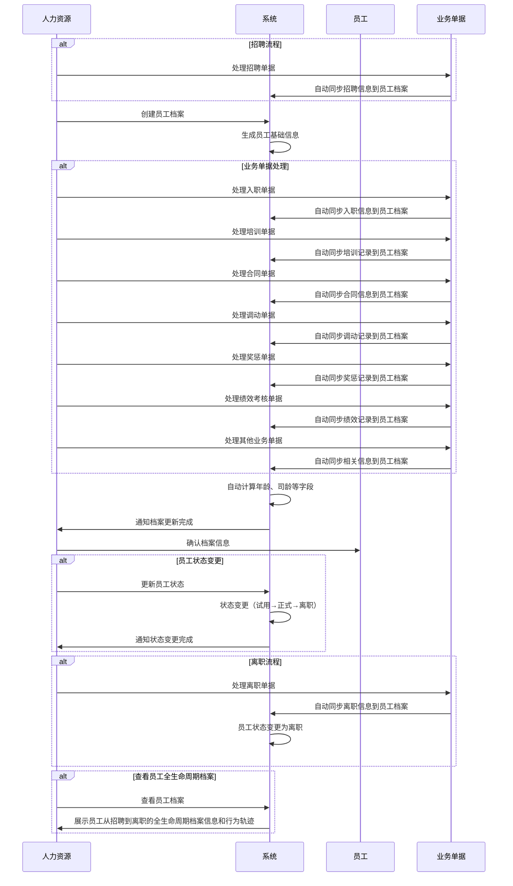

# 员工档案字段表

## 功能业务介绍
员工档案模块用于全面记录和管理员工的各类信息，包括基础信息、个人信息、用工信息、标签信息、培训记录、合同信息、调动记录和奖惩记录等。支持员工全生命周期管理，从招聘到离职的各个阶段，为人力资源管理提供完整的数据支持。所有跟该员工相关产生的单据和业务行为，最终都会生成到员工档案中。员工从招聘到离职这中间在公司所有发生跟该员工相关的业务理论上都会记录在员工档案中，最后可以查看该员工的所有的全生命周期档案信息和在公司所有的行为轨迹。

## 业务流程

## 字段清单

### 一、基础信息（主表）

| 字段名称 | 类型 | 长度 | 约束条件 | 说明 |
|---------|------|------|----------|------|
| emp_id | varchar | 30 | 是 | 工号（主键，唯一标识），示例值：10040710 |
| emp_name | varchar | 50 | 是 | 员工姓名，示例值：黄昊懿 |
| emp_name_pinyin | varchar | 50 | 否 | 员工姓名拼音 |
| gender | tinyint | 1 | 是 | 性别：1 = 男，2 = 女 |
| org_name | varchar | 100 | 否 | 所属机构，示例值：湖北生产基地 |
| factory_dept | varchar | 100 | 是 | 数智工厂部门，示例值：品管部一车间 |
| factory_post | varchar | 100 | 是 | 数智工厂岗位，示例值：化验员 |
| dept_name | varchar | 100 | 否 | 部门名称，示例值：品管部 |
| dept_code | varchar | 20 | 否 | 部门编码，示例值：B0204010 |
| position_full | varchar | 200 | 否 | 职位全称，示例值：湖北生产基地品管部Ⅰ车间化验员 |
| ekp_position | varchar | 200 | 否 | EKP 职位，示例值：湖北生产基地品管部Ⅰ车间化验员 |
| position_name | varchar | 100 | 否 | 职务名称，示例值：化验员 |
| position_code | varchar | 20 | 否 | 职位编码，示例值：47000295 |
| job_grade | varchar | 50 | 否 | 职级 |
| job_family | varchar | 50 | 否 | 职级类别，示例值：专业族 |
| duty_code | varchar | 20 | 否 | 职务编码，示例值：315 |
| login_name | varchar | 50 | 否 | 登录名 |

### 二、个人信息（关联主表 emp_id）

| 字段名称 | 类型 | 长度 | 约束条件 | 说明 |
|---------|------|------|----------|------|
| birth_date | date | - | 否 | 出生日期，示例值：2000-05-27 |
| age | int | 3 | 否 | 年龄，可由出生日期自动计算 |
| nation | varchar | 20 | 否 | 民族 |
| id_type | varchar | 20 | 否 | 证件类型，示例值：身份证号 |
| id_card | varchar | 18 | 否 | 证件号码，示例值：421223200005273210 |
| political_status | varchar | 20 | 否 | 政治面貌 |
| marital_status | varchar | 20 | 否 | 婚姻状况 |
| phone | varchar | 20 | 否 | 手机号码，示例值：13872156549 |
| email | varchar | 50 | 否 | 电子邮箱 |
| school_name | varchar | 100 | 否 | 毕业学校名称 |
| major | varchar | 50 | 否 | 专业 |
| highest_edu | varchar | 20 | 否 | 最高学历 |
| graduate_date | date | - | 否 | 毕业时间 |
| nationality | varchar | 20 | 否 | 国籍 |
| native_place | varchar | 50 | 否 | 籍贯 |
| registered_address | varchar | 200 | 否 | 户籍所在地 |
| registered_type | varchar | 20 | 否 | 户口类别 |
| registered_detail | varchar | 200 | 否 | 户籍地址 |
| residential_address | varchar | 200 | 否 | 居住地址 |
| spouse_parent_addr | varchar | 200 | 否 | 配偶父母居住地 |
| spouse_addr | varchar | 200 | 否 | 配偶居住地 |
| party_org_addr | varchar | 200 | 否 | 党组织关系所在地 |
| home_phone | varchar | 20 | 否 | 家庭电话 |
| office_addr | varchar | 200 | 否 | 办公地址 |
| emergency_contact | varchar | 50 | 否 | 紧急联系人 |
| emergency_relation | varchar | 20 | 否 | 与本人的关系 |
| emergency_phone | varchar | 20 | 否 | 紧急联系人电话 |
| work_place | varchar | 100 | 否 | 工作地点 |
| statutory_retire_date | date | - | 否 | 法定退休日期，示例值：2063-05-27 |

### 三、用工信息（关联主表 emp_id）

| 字段名称 | 类型 | 长度 | 约束条件 | 说明 |
|---------|------|------|----------|------|
| emp_status | tinyint | 1 | 是 | 员工状态：1 = 试用，2 = 正式，3 = 离职 |
| hire_date | date | - | 否 | 入职日期，示例值：2026-03-17 |
| trial_period | int | 3 | 否 | 试用期月数，示例值：6 |
| confirm_date | date | - | 是 | 转正日期，示例值：2026-09-16 |
| total_service_year | int | 3 | 否 | 累计司龄（年） |
| total_service_month | int | 3 | 否 | 累计司龄（月） |
| total_service_day | int | 3 | 否 | 累计司龄（日） |
| first_work_date | date | - | 否 | 参加工作日期，示例值：2024-09-17 |
| employment_type | varchar | 50 | 否 | 雇佣关系，示例值：内部员工 |
| employ_form | varchar | 50 | 否 | 用工形式，示例值：合同用工 |
| dotted_line_manager | varchar | 50 | 否 | 虚线经理 |
| solid_line_manager | varchar | 50 | 否 | 直线经理 |
| solid_line_email | varchar | 50 | 否 | 直线经理邮箱 |
| dotted_line_email | varchar | 50 | 否 | 虚线经理邮箱 |
| old | varchar | 50 | 否 | 旧标识字段 |
| ekp_org_code | varchar | 50 | 否 | 对应部门 EKP 组织代码 |
| level1_org | varchar | 50 | 否 | 一级组织 |
| level2_org | varchar | 50 | 否 | 二级组织 |
| level3_org | varchar | 50 | 否 | 三级组织 |
| level4_org | varchar | 50 | 否 | 四级组织 |
| level5_org | varchar | 50 | 否 | 五级组织 |
| level6_org | varchar | 50 | 否 | 六级组织 |
| level7_org | varchar | 50 | 否 | 七级组织 |
| position_sequence | varchar | 50 | 否 | 职务序列 |
| job_rank | int | 3 | 否 | 职等，示例值：0 |
| emp_id_no_space | varchar | 30 | 否 | 工号（不分词） |
| entry_channel | varchar | 50 | 否 | 入职来源渠道 |

### 四、标签信息（关联主表 emp_id）

| 字段名称 | 类型 | 长度 | 约束条件 | 说明 |
|---------|------|------|----------|------|
| is_core_staff | tinyint | 1 | 否 | 核心人员：0 = 否，1 = 是 |
| is_reserve_talent | tinyint | 1 | 否 | 储备人才：0 = 否，1 = 是 |
| is_internal_trainer | tinyint | 1 | 否 | 内训师：0 = 否，1 = 是 |
| is_safety_staff | tinyint | 1 | 否 | 保全工：0 = 否，1 = 是 |
| is_post_master | tinyint | 1 | 否 | 岗位师傅：0 = 否，1 = 是 |
| is_veteran | tinyint | 1 | 否 | 退伍军人：0 = 否，1 = 是 |
| is_union_member | tinyint | 1 | 否 | 工会委员：0 = 否，1 = 是 |
| is_staff_rep | tinyint | 1 | 否 | 职工代表：0 = 否，1 = 是 |
| is_talent_pool | tinyint | 1 | 否 | 人才库：0 = 否，1 = 是 |
| duty_machine | varchar | 50 | 否 | 责任机台 |
| is_multi_skill | tinyint | 1 | 否 | 多能工：0 = 否，1 = 是 |
| part_time_type | varchar | 50 | 否 | 兼职人员类型 |
| is_post_model | tinyint | 1 | 否 | 岗位标兵：0 = 否，1 = 是 |
| is_excellent_emp | tinyint | 1 | 否 | 优秀员工：0 = 否，1 = 是 |
| post_grade_name | varchar | 50 | 否 | 岗位分级 - 岗位名称 |
| post_grade_level | varchar | 50 | 否 | 岗位分级 - 级别 |
| talent_grade | varchar | 50 | 否 | 人才梯度等级 |
| is_reserve_cadre | tinyint | 1 | 否 | 储备干部：0 = 否，1 = 是 |
| title_level | varchar | 50 | 否 | 职称等级 |
| is_key_post | tinyint | 1 | 否 | 关键岗位：0 = 否，1 = 是 |
| is_team_cultivate | tinyint | 1 | 否 | 班组培养人员：0 = 否，1 = 是 |
| dormitory | varchar | 50 | 否 | 宿舍，示例值：6206(2楼) |
| multi_skill_posts | text | - | 否 | 多能工认证岗位列表（JSON格式），存储认证通过的岗位及星级信息 |
| multi_skill_cert_date | date | - | 否 | 最近多能工认证日期 |
| multi_skill_expire_date | date | - | 否 | 多能工认证有效期截止日期 |
| talent_pool_type | varchar | 20 | 否 | 人才库认证类型：后备关键人才、储备干部 |
| talent_pool_cert_date | date | - | 否 | 人才库认证日期 |
| talent_pool_expire_date | date | - | 否 | 人才库认证有效期截止日期 |

### 五、培训记录（从表，外键 emp_id 关联主表）

| 字段名称 | 类型 | 长度 | 约束条件 | 说明 |
|---------|------|------|----------|------|
| train_id | bigint | 20 | 是 | 培训记录 ID（主键） |
| emp_id | varchar | 30 | 是 | 关联员工工号 |
| train_method | varchar | 20 | 否 | 培训方式，示例值：内训 |
| train_category | varchar | 20 | 否 | 培训类别，示例值：岗位类/安全类 |
| train_date_start | date | - | 否 | 培训开始日期 |
| train_date_end | date | - | 否 | 培训结束日期 |
| train_topic | varchar | 100 | 否 | 培训课题名称 |
| course_hours | decimal | 5,2 | 否 | 课程时长（H），示例值：1.5 |
| trainer | varchar | 50 | 否 | 培训人，示例值：赵晶晶 |
| assessment_method | varchar | 50 | 否 | 考核方式，示例值：试卷考试/现场操作/培训总结 |
| train_result | varchar | 20 | 否 | 培训成绩，示例值：合格 |
| train_remark | text | - | 否 | 备注 |

### 六、合同信息（从表，外键 emp_id 关联主表）

| 字段名称 | 类型 | 长度 | 约束条件 | 说明 |
|---------|------|------|----------|------|
| contract_id | bigint | 20 | 是 | 合同记录 ID（主键） |
| emp_id | varchar | 30 | 是 | 关联员工工号 |
| contract_status | varchar | 20 | 否 | 合同状态，示例值：生效中 |
| term_type | varchar | 20 | 否 | 期限类型，示例值：三年期限 |
| contract_no | varchar | 30 | 否 | 合同编号，示例值：10040710 |
| effective_date | date | - | 否 | 生效日期，示例值：2026-03-17 |
| end_date | date | - | 否 | 终止日期，示例值：2029-03-31 |
| contract_term | varchar | 20 | 否 | 合同期限，示例值：3年 |
| sign_date | date | - | 否 | 签订日期，示例值：2026-03-17 |
| sign_count | int | 3 | 否 | 签订次数，示例值：1 |
| contract_attach | varchar | 500 | 否 | 合同附件路径 |
| contract_remark | text | - | 否 | 合同备注 |

### 七、调动记录（从表，外键 emp_id 关联主表）

| 字段名称 | 类型 | 长度 | 约束条件 | 说明 |
|---------|------|------|----------|------|
| transfer_id | bigint | 20 | 是 | 调动记录 ID（主键） |
| emp_id | varchar | 30 | 是 | 关联员工工号 |
| transfer_no | varchar | 50 | 否 | 调动编号 |
| transfer_date | date | - | 否 | 调动日期 |
| transfer_type | varchar | 20 | 否 | 调动类型 |
| pre_dept | varchar | 100 | 否 | 调动前部门 |
| pre_position | varchar | 100 | 否 | 调动前职务 |
| post_dept | varchar | 100 | 否 | 调动后部门 |
| work_place | varchar | 100 | 否 | 工作地点 |
| post_position | varchar | 100 | 否 | 调动后职务 |
| pre_factory_dept | varchar | 100 | 否 | 调动前部门（数智工厂） |
| pre_factory_post | varchar | 100 | 否 | 调动前岗位（数智工厂） |
| post_factory_dept | varchar | 100 | 否 | 调动后部门（数智工厂） |
| post_factory_post | varchar | 100 | 否 | 调动后岗位（数智工厂） |
| transfer_remark | text | - | 否 | 调动备注 |

### 八、奖惩记录（从表，外键 emp_id 关联主表）

| 字段名称 | 类型 | 长度 | 约束条件 | 说明 |
|---------|------|------|----------|------|
| reward_punish_id | bigint | 20 | 是 | 奖惩记录 ID（主键） |
| emp_id | varchar | 30 | 是 | 关联员工工号 |
| business_no | varchar | 50 | 否 | 业务编号 |
| business_status | varchar | 20 | 否 | 业务状态 |
| apply_date | date | - | 否 | 申报日期 |
| reward_punish_type | varchar | 20 | 否 | 奖惩类型 |
| apply_type | varchar | 20 | 否 | 申报类型 |

### 九、绩效记录（从表，外键 emp_id 关联主表）

| 字段名称 | 类型 | 长度 | 约束条件 | 说明 |
|---------|------|------|----------|------|
| perf_id | bigint | 20 | 是 | 绩效记录 ID（主键） |
| emp_id | varchar | 30 | 是 | 关联员工工号 |
| perf_month | date | - | 是 | 考核年月 |
| perf_type | varchar | 20 | 是 | 考核类型：标准工时/综合工时 |
| final_score | decimal | 5,1 | 否 | 最终得分 |
| final_level | varchar | 10 | 否 | 最终绩效等级 |
| perf_status | varchar | 20 | 否 | 绩效状态 |
| create_time | datetime | - | 否 | 创建时间 |
| update_time | datetime | - | 否 | 更新时间 |

### 十、多能工认证记录（从表，外键 emp_id 关联主表）

| 字段名称 | 类型 | 长度 | 约束条件 | 说明 |
|---------|------|------|----------|------|
| multi_skill_id | bigint | 20 | 是 | 多能工认证记录 ID（主键） |
| emp_id | varchar | 30 | 是 | 关联员工工号 |
| cert_no | varchar | 20 | 否 | 认证编号，示例值：DN260415001 |
| cert_post | varchar | 50 | 是 | 认证岗位，示例值：仓管员 |
| cert_star | varchar | 20 | 否 | 认证星级：一星、二星、三星 |
| exam_type | varchar | 50 | 否 | 考试类型：理论/实操/两者都有 |
| written_score | decimal | 5,1 | 否 | 笔试成绩，示例值：90.5 |
| practical_score | decimal | 5,1 | 否 | 实操成绩 |
| cert_date | date | - | 是 | 认证日期 |
| expire_date | date | - | 否 | 失效日期 |
| cert_status | varchar | 20 | 否 | 认证状态：生效中、已过期、已失效 |
| cert_remark | text | - | 否 | 认证备注 |

### 十一、人才库认证记录（从表，外键 emp_id 关联主表）

| 字段名称 | 类型 | 长度 | 约束条件 | 说明 |
|---------|------|------|----------|------|
| talent_pool_id | bigint | 20 | 是 | 人才库认证记录 ID（主键） |
| emp_id | varchar | 30 | 是 | 关联员工工号 |
| cert_no | varchar | 30 | 否 | 认证编号，示例值：RC260400001 |
| cert_type | varchar | 20 | 是 | 认证类型：后备关键人才、储备干部 |
| cert_date | date | - | 是 | 认证日期 |
| expire_date | date | - | 否 | 失效日期 |
| cert_status | varchar | 20 | 否 | 认证状态：待提交、待审核、生效中、已归档 |
| cert_remark | text | - | 否 | 认证备注 |

## 业务规则
1. **R01**: 工号（emp_id）为全局唯一标识，是主表的主键
2. **R02**: 基础信息中，工号、员工姓名、性别、数智工厂部门、数智工厂岗位为必填字段
3. **R03**: 用工信息中，员工状态、转正日期为必填字段
4. **R04**: 年龄字段可由出生日期自动计算
5. **R05**: 司龄相关字段（total_service_year、total_service_month、total_service_day）可由入职日期自动计算
6. **R06**: 员工状态枚举值为：1 = 试用，2 = 正式，3 = 离职
7. **R07**: 性别枚举值为：1 = 男，2 = 女
8. **R08**: 标签信息中的布尔字段枚举值为：0 = 否，1 = 是
9. **R09**: 子表（培训记录、合同信息、调动记录、奖惩记录、绩效记录）通过 emp_id 外键关联主表
10. **R10**: 法定退休日期用于退休管理模块的自动退休单据生成
11. **R11**: 所有跟该员工相关产生的单据和业务行为，最终都会生成到员工档案中
12. **R12**: 员工从招聘到离职这中间在公司所有发生跟该员工相关的业务理论上都会记录在员工档案中
13. **R13**: 信息是通过单据中跟该员工的相关联的，会自动同步到员工档案当中
14. **R14**: 系统支持查看员工从招聘到离职的全生命周期档案信息和在公司所有的行为轨迹
15. **R15**: 绩效考核结果（包括标准工时和综合工时）会自动同步到员工档案的绩效记录子表中
16. **R16**: 绩效记录子表存储员工的月度绩效考核结果，包括最终得分、绩效等级等信息
17. **R17**: 多能工认证完成后，自动同步认证信息到员工档案的多能工认证记录子表，并更新标签信息中的`is_multi_skill`字段为1
18. **R18**: 人才库认证状态为"生效中"时，自动更新标签信息中的`is_talent_pool`字段为1；状态不为"生效中"时，自动更新为0
19. **R19**: 员工离职时，人才库认证状态自动变更为"已归档"，并同步更新`is_talent_pool`字段为0

## 业务状态
- **试用**: 员工处于试用期阶段，员工状态=1
- **正式**: 员工已转正，员工状态=2
- **离职**: 员工已离开公司，员工状态=3