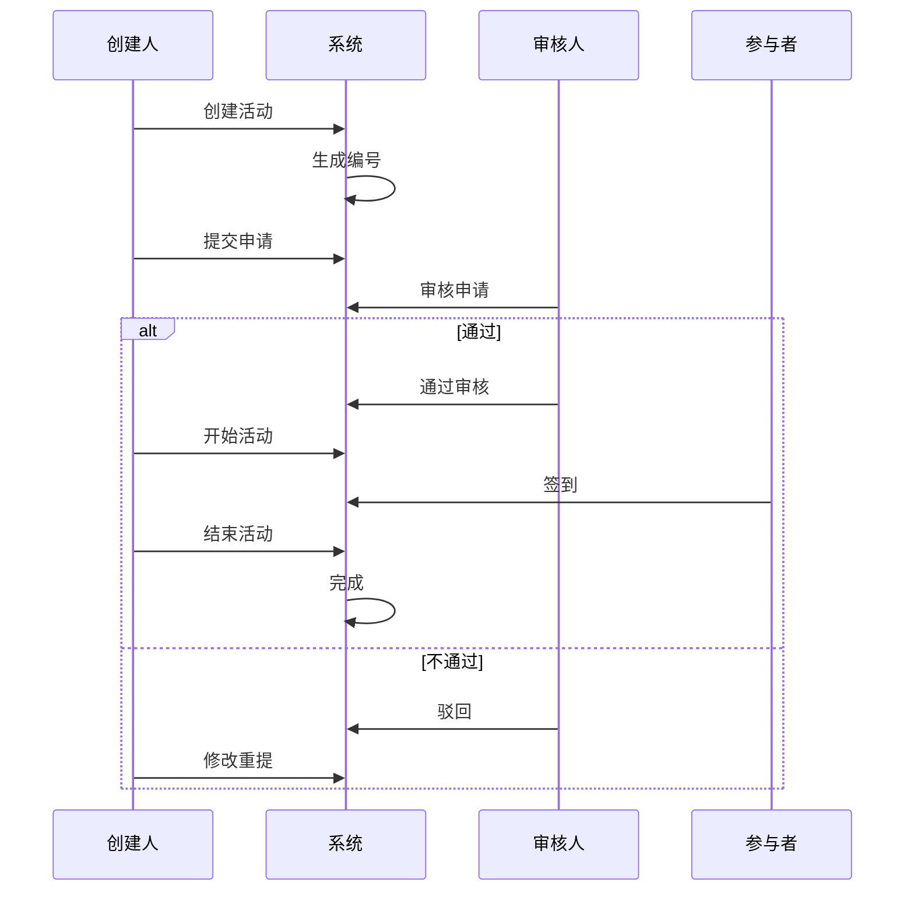
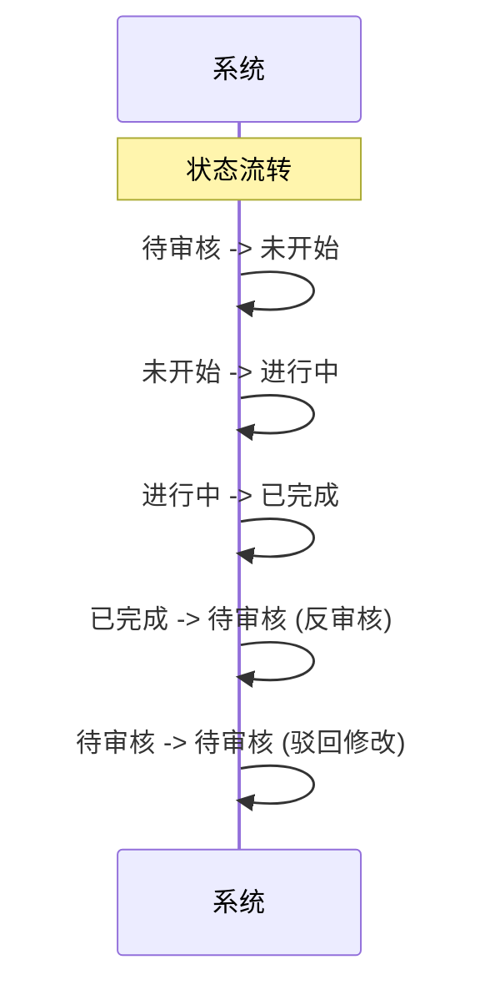

# 团队活动字段表

## 一、业务概述

团队活动模块用于管理公司内部组织的各类团队活动，包括活动策划、参与人员管理、活动执行和费用记录等功能。该模块支持活动从创建到完成的全流程管理，便于组织团队建设和员工互动活动。

## 二、业务流程图

## 三、状态流转图

## 四、状态操作权限表

| 活动状态 | 操作 |
| :--- | :--- |
| 未开始 | 详情、编辑、开始活动、删除 |
| 进行中 | 详情、编辑、签到扫码、结束活动 |
| 待审核 | 详情、审核 |
| 已完成 | 详情、反审核 |

## 五、字段清单

### 5.1 基础信息模块

| 序号 | 字段名称 | 类型 | 长度/精度 | 必填 | 说明/备注 |
| :--- | :--- | :--- | :--- | :--- | :--- |
| 1 | 活动主题 | 字符串 | 100 | 是 | 示例："激发活力，提升士气" |
| 2 | 活动编号 | 字符串 | 20 | 否（系统生成） | 示例："HD260424004" |
| 3 | 活动类别 | 枚举（下拉） | 50 | 是 | 示例："团队活动" |
| 4 | 活动地点 | 字符串 | 100 | 否 | 示例："三车间仓库" |
| 5 | 参加范围 | 人员明细 | 200 | 是 | 示例："合计应参加人数18人"，支持点击 "人员明细" 查看详情 |
| 6 | 活动部门 | 枚举（下拉） | 100 | 是 | 示例："生产部三车间I班" |
| 7 | 活动内容 | 文本 | 1000 | 是 | 示例："活动一：《纸上谈兵》；活动二：吹纸杯接力；活动三：左右跳跳乐" |
| 8 | 活动日期 | 日期区间 | - | 是 | 示例："2026-04-23 ~ 2026-04-23" |
| 9 | 创建人 | 字符串 | 50 | 否（系统带出） | 示例："江华" |
| 10 | 活动费用 | 数值 | (10,2) | 否 | 单位：元，提示 "请输入活动费用" |
| 11 | 备注信息 | 文本 | 500 | 否 | 提示 "请输入活动备注信息（非必填）" |

### 5.2 附件与现场材料模块

| 序号 | 字段名称 | 类型 | 长度/精度 | 必填 | 说明/备注 |
| :--- | :--- | :--- | :--- | :--- | :--- |
| 12 | 附件信息 | 附件上传 | - | 否 | 最多支持10个文件；单文件≤100M；支持格式：jpg、png、gif、jpeg、pdf、zip、rar、docx、doc、xlsx、ppt、pptx、pptm、xls；示例附件："I班2026年04月23日团建活动.docx" |
| 13 | 活动现场照片 | 图片上传 | - | 否 | 支持上传多张现场照片，示例为团建活动实拍图 |

## 六、业务规则

### R01 - 数据完整性规则
- 活动主题、活动类别、参加范围、活动部门、活动内容、活动日期为必填字段
- 创建人由系统自动带出当前登录用户

### R02 - 活动编号生成规则
- 活动编号格式：HD + 年份后两位 + 月份 + 日期 + 三位流水号
- 示例：HD260424004（2026年4月24日第4单）

### R03 - 状态流转规则
| 当前状态 | 操作 | 目标状态 | 说明 |
| :--- | :--- | :--- | :--- |
| 待审核 | 审核通过 | 未开始 | 审核流程完成 |
| 待审核 | 审核不通过 | 创建活动 | 驳回修改 |
| 未开始 | 开始活动 | 进行中 | 活动正式开始 |
| 进行中 | 结束活动 | 已完成 | 活动结束 |
| 已完成 | 反审核 | 待审核 | 允许撤销已完成的活动重新审核 |

### R04 - 活动状态操作规则
- **未开始**：可进行详情、编辑、开始活动、删除操作
- **进行中**：可进行详情、编辑、签到扫码、结束活动操作
- **待审核**：可进行详情、审核操作
- **已完成**：可进行详情、反审核操作

### R05 - 参加范围规则
- 支持选择多个部门或人员参加活动
- 显示合计应参加人数，支持点击查看人员明细

### R06 - 附件上传规则
- 最多支持10个文件上传
- 单文件大小限制：≤100M
- 支持格式：jpg、png、gif、jpeg、pdf、zip、rar、docx、doc、xlsx、ppt、pptx、pptm、xls

### R07 - 现场照片上传规则
- 支持上传多张活动现场照片
- 用于记录活动开展情况

## 七、更新记录

| 日期 | 修改内容 | 修改人 |
| :--- | :--- | :--- |
| 2026-05-06 | 初始创建，包含完整字段清单和业务流程 | 系统管理员 |