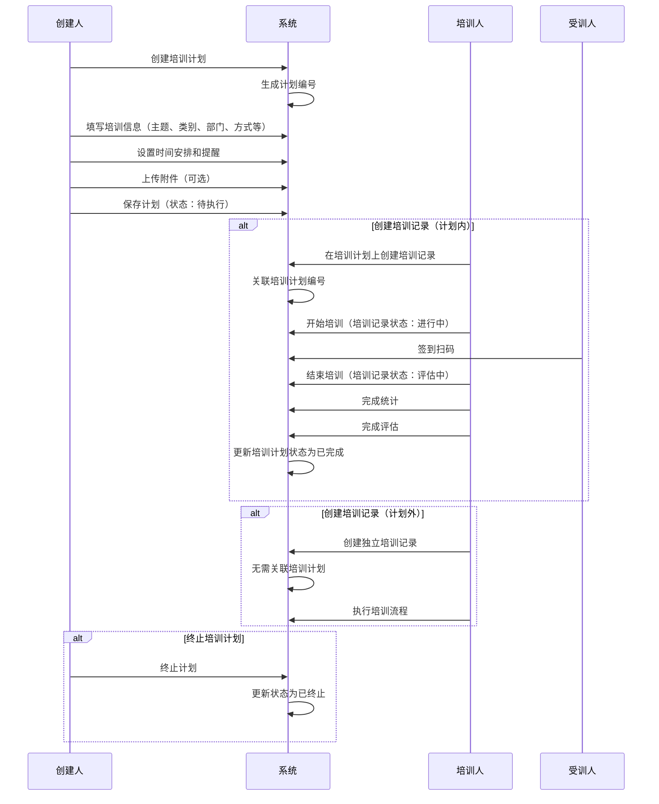
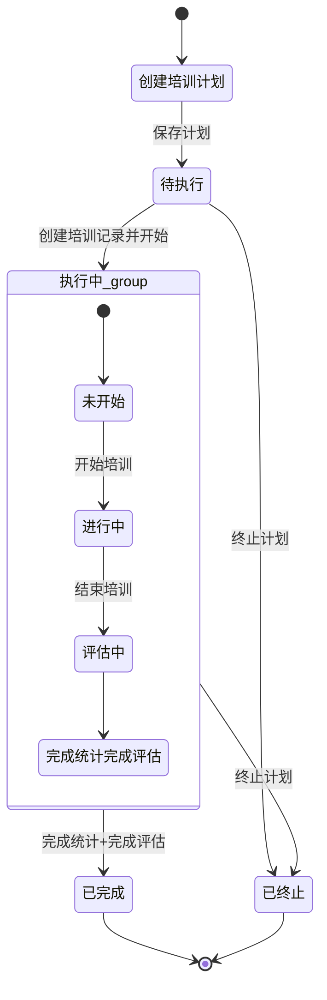

# 培训计划字段表

## 一、业务概述

培训计划模块用于管理企业培训活动的规划和执行。培训计划与培训记录是关联的：
- **计划内培训记录**：需要关联培训计划
- **计划外培训记录**：不需要关联培训计划

培训计划执行流程：待执行 → 执行中（培训记录：未开始→进行中→评估中）→ 已完成/已终止

## 二、业务流程图

## 三、状态流转图

## 四、培训计划与培训记录状态映射表

| 培训计划状态 | 培训记录状态 | 对应培训记录操作 | 备注 |
| :--- | :--- | :--- | :--- |
| 待执行 | 未开始 | 详情、编辑、开始培训、终止、删除 | - |
| 执行中 | 未开始 | 详情、编辑、开始培训、终止、删除 | 确认【开始培训】后，状态变更为进行中 |
| 执行中 | 进行中 | 详情、编辑、签到扫码、结束培训 | 确认【结束培训】后，状态变更为评估中 |
| 执行中 | 评估中 | 详情、完结统计、完成评估 | 只有【完成统计】和【完成评估】两项都确认后状态才会变为已完成，其中一项完成后，按钮置灰不可点击 |
| 已完成 | 已完成 | 详情 | - |
| 已终止 | 已终止 | 详情 | - |

## 五、字段清单

### 5.1 页面标签栏

| 序号 | 字段名称 | 类型 | 长度/精度 | 必填 | 说明/备注 |
| :--- | :--- | :--- | :--- | :--- | :--- |
| 1 | 单据内容 | 标签 | - | - | 当前选中标签 |
| 2 | 关联培训记录 | 标签 | - | - | 关联的培训记录列表 |
| 3 | 单据日志 | 标签 | - | - | 单据操作日志 |
| 4 | 审批流程 | 标签 | - | - | 审批流转状态 |

### 5.2 基础信息模块

| 序号 | 字段名称 | 类型 | 长度/精度 | 必填 | 说明/备注 |
| :--- | :--- | :--- | :--- | :--- | :--- |
| 5 | 培训主题 | 字符串 | 100 | 是 | 如 "三级安全教育培训（班级级）" |
| 6 | 计划编号 | 字符串 | 20 | 否（系统生成） | 如 "PXJH260420002" |
| 7 | 培训类别 | 枚举（下拉） | 50 | 是 | 如 "安全类" |
| 8 | 估算费用 | 数值 | (10,2) | 否 | 单位：元，示例值 "0" |
| 9 | 培训部门 | 枚举（下拉） | 100 | 是 | 如 "品管部" |
| 10 | 培训方式 | 单选枚举 | - | 是 | 选项：内训/外训/公开课，示例选中 "内训" |
| 11 | 培训人 | 字符串 | 50 | 是 | 如 "赵晶晶" |
| 12 | 时间安排 | 日期/年月 | - | 是 | 如 "2026-04" |
| 13 | 受训人 | 字符串 | 200 | 否 | 合计应参加人数，可点击 "人员明细" 查看详情 |
| 14 | 计划提醒 | 多选枚举 | - | 否 | 选项：截止前30天/截止前15天/截止前7天 |
| 15 | 提醒接收人 | 多选人员 | - | 否 | 可多选接收提醒的人员 |
| 16 | 创建人 | 字符串 | 50 | 否（系统带出） | 如 "郑亮" |
| 17 | 计划备注 | 文本 | 500 | 否 | 提示 "请输入培训计划备注信息（非必填）" |
| 18 | 培训地点 | 字符串 | 100 | 否 | 如 "三车间化验室" |
| 19 | 培训时长（min） | 数值 | (5,0) | 否 | 单位：分钟，示例值 "480" |
| 20 | 附件信息 | 附件上传 | - | 否 | 支持添加培训计划附件；文件≤100M；格式：jpg、png、gif、jpeg、pdf、zip、rar、docx、doc、xlsx、ppt、pptx、pptm、xls |
| 21 | 培训交付物 | 枚举（下拉） | 50 | 否 | 提示 "请选择培训交付物" |
| 22 | 培训必学 | 枚举（下拉） | 50 | 否 | 提示 "请选择培训必学" |
| 23 | 培训形式 | 枚举（下拉） | 50 | 否 | 提示 "请选择培训形式" |
| 24 | 是否有教材 | 单选枚举 | - | 否 | 选项：有/无，示例选中 "有" |
| 25 | 培训教材 | 枚举（下拉） | 50 | 否 | 如 "PPT" |
| 26 | 培训类型 | 枚举（下拉） | 50 | 否 | 提示 "请选择培训类型" |
| 27 | 考核方式 | 枚举（下拉） | 50 | 否 | 提示 "请选择考核方式" |
| 28 | 计划状态 | 枚举 | - | 否（系统带出） | 如 "已完成" |

### 5.3 操作按钮

| 序号 | 字段名称 | 类型 | 长度/精度 | 必填 | 说明/备注 |
| :--- | :--- | :--- | :--- | :--- | :--- |
| 29 | 取消 | 按钮 | - | - | 放弃本次操作，返回列表页 |

## 六、业务规则

### R01 - 数据完整性规则
- 培训主题、培训类别、培训部门、培训方式、培训人、时间安排为必填字段
- 创建人由系统自动带出当前登录用户

### R02 - 计划编号生成规则
- 计划编号格式：PXJH + 年份后两位 + 月份 + 日期 + 三位流水号
- 示例：PXJH260420002（2026年4月20日第2单）

### R03 - 培训计划与培训记录关联规则
- **计划内培训记录**：必须关联培训计划编号
- **计划外培训记录**：不需要关联培训计划
- 在培训计划详情页可直接创建关联的培训记录

### R04 - 状态流转规则
| 当前状态 | 操作 | 目标状态 | 说明 |
| :--- | :--- | :--- | :--- |
| 待执行 | 创建培训记录并开始 | 执行中 | 培训记录状态变为进行中 |
| 执行中 | 结束培训 | 执行中 | 培训记录状态变为评估中 |
| 执行中 | 完成统计+完成评估 | 已完成 | 必须两项都确认才能完成 |
| 待执行/执行中 | 终止计划 | 已终止 | 终止后不可恢复 |

### R05 - 培训记录操作规则
- **未开始**：可进行详情、编辑、开始培训、终止、删除操作
- **进行中**：可进行详情、编辑、签到扫码、结束培训操作
- **评估中**：可进行详情、完结统计、完成评估操作，两项都完成后状态变为已完成
- **已完成/已终止**：仅可查看详情

### R06 - 计划提醒规则
- 支持多选提醒时间：截止前30天、截止前15天、截止前7天
- 可选择多个提醒接收人

### R07 - 附件上传规则
- 支持多种格式：jpg、png、gif、jpeg、pdf、zip、rar、docx、doc、xlsx、ppt、pptx、pptm、xls
- 单文件大小限制：≤100M

## 七、更新记录

| 日期 | 修改内容 | 修改人 |
| :--- | :--- | :--- |
| 2026-05-06 | 初始创建，包含完整字段清单和业务流程 | 系统管理员 |