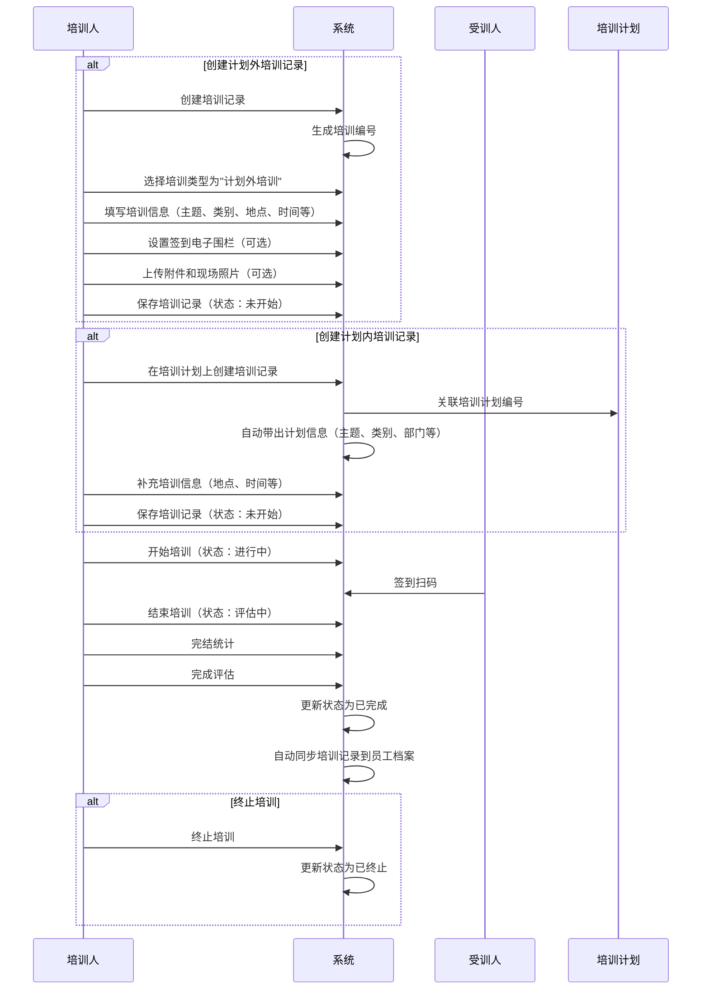
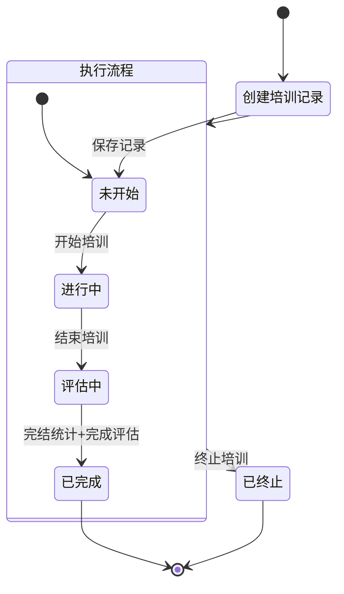

# 培训记录字段表

## 一、业务概述

培训记录模块用于记录和管理实际开展的培训活动。培训记录与培训计划是关联的：
- **计划内培训**：必须关联培训计划，可在培训计划上直接创建
- **计划外培训**：不需要关联培训计划，作为独立培训记录创建

培训记录状态流转：未开始 → 进行中 → 评估中 → 已完成/已终止

**员工档案同步规则**：当培训记录状态变更为【已完成】时，系统自动将培训记录信息更新到参与培训的员工档案中，记录员工的培训经历。

## 二、业务流程图

## 三、状态流转图

## 四、培训计划与培训记录状态映射表

| 培训计划状态 | 培训记录状态 | 对应培训记录操作 | 备注 |
| :--- | :--- | :--- | :--- |
| 待执行 | - | - | - |
| 待执行 | 未开始 | 详情、编辑、开始培训、终止、删除 | - |
| 执行中 | 未开始 | 详情、编辑、开始培训、终止、删除 | 确认【开始培训】后，状态变更为进行中 |
| 执行中 | 进行中 | 详情、编辑、签到扫码、结束培训 | 确认【结束培训】后，状态变更为评估中 |
| 执行中 | 评估中 | 详情、完结统计、完成评估 | 只有【完成统计】和【完成评估】两项都确认后状态才会变为已完成，其中一项完成后，按钮置灰不可点击 |
| 已完成 | 已完成 | 详情 | - |
| 已终止 | 已终止 | 详情 | - |

## 五、字段清单

### 5.1 培训基础信息模块

| 序号 | 字段名称 | 类型 | 长度/精度 | 必填 | 说明/备注 |
| :--- | :--- | :--- | :--- | :--- | :--- |
| 1 | 培训类型（计划外/计划内） | 单选 | - | 是 | 选项：计划外培训/计划内培训，示例选中 "计划外培训" |
| 2 | 培训主题 | 字符串 | 100 | 是 | 示例值："SAP操作管理制度" |
| 3 | 培训编号 | 字符串 | 20 | 否（系统生成） | 示例值："PXJL260506003" |
| 4 | 培训类别 | 枚举（下拉） | 50 | 是 | 示例值："岗位类" |
| 5 | 培训地点 | 字符串 | 100 | 是 | 示例值："三期仓库会议室" |
| 6 | 培训部门 | 枚举（下拉） | 100 | 是 | 示例值："储运采购部" |
| 7 | 组织部门 | 字符串 | 100 | 否 | 示例值："储运采购部三车间仓储班" |
| 8 | 培训人 | 字符串 | 50 | 是 | 示例值："杨玲" |
| 9 | 职务 | 字符串 | 50 | 否 | 示例值："仓管员" |
| 10 | 参加范围 | 字符串/人员明细 | 200 | 否 | 示例值："合计应参加人数12人"，支持点击 "人员明细" 查看详情 |
| 11 | 培训日期 | 日期区间 | - | 是 | 示例值："2026-05-06 ~ 2026-05-06" |
| 12 | 培训内容 | 文本 | 1000 | 是 | 示例值："SAP操作管理制度培训" |
| 13 | 培训时间 | 时间区间 | - | 是 | 示例值："16:20至17:00" |
| 14 | 培训方式 | 单选枚举 | - | 是 | 选项：内训/外训/公开课，示例选中 "内训" |
| 15 | 创建人 | 字符串 | 50 | 否（系统带出） | 示例值："杨玲" |
| 16 | 培训验收人 | 枚举（下拉） | 50 | 否 | 示例：可选择人员 |
| 17 | 培训交付物 | 枚举（下拉） | 50 | 否 | 示例值："笔试" |
| 18 | 是否为复训 | 单选枚举 | - | 否 | 选项：否/是，示例选中 "否" |
| 19 | 是否有教材 | 单选枚举 | - | 否 | 选项：无/有，示例选中 "有" |
| 20 | 是否固定模板 | 单选枚举 | - | 否 | 选项：无/有，示例选中 "有" |
| 21 | 培训时段 | 枚举（下拉） | 50 | 否 | 提示："请选择培训时段" |
| 22 | 培训方法 | 枚举（下拉） | 50 | 否 | 提示："请选择培训方法" |
| 23 | 培训内容划分 | 枚举（下拉） | 50 | 否 | 示例值："基础类" |
| 24 | 培训类型 | 枚举（下拉） | 50 | 否 | 提示："请选择培训类型" |
| 25 | 考核分类 | 枚举（下拉） | 50 | 否 | 提示："请选择考核分类" |
| 26 | 关联培训计划 | 字符串 | 20 | 否（计划内必填） | 计划内培训必须关联培训计划编号，如 "PXJH260420002" |

### 5.2 培训费用与签到模块

| 序号 | 字段名称 | 类型 | 长度/精度 | 必填 | 说明/备注 |
| :--- | :--- | :--- | :--- | :--- | :--- |
| 27 | 签到电子围栏 | 单选 | - | 否 | 选项：关闭/开启，示例选中 "关闭" |
| 28 | 培训费用-选项 | 多选枚举 | - | 否 | 选项：听课费/教材费/培训师补贴/餐补费/其他 |
| 29 | 培训费用-合计金额 | 数值 | (10,2) | 否 | 单位：元，示例值：0 |
| 30 | 备注信息 | 文本 | 500 | 否 | 提示："请输入培训备注信息（非必填）" |

### 5.3 附件与现场材料模块

| 序号 | 字段名称 | 类型 | 长度/精度 | 必填 | 说明/备注 |
| :--- | :--- | :--- | :--- | :--- | :--- |
| 31 | 附件信息 | 附件上传 | - | 否 | 支持添加培训记录附件；文件≤100M；格式：jpg、png、gif、jpeg、pdf、zip、rar、docx、doc、xlsx、ppt、pptx、pptm、xls |
| 32 | 培训现场照片 | 图片上传 | - | 否 | 支持上传现场照片，示例为培训现场实拍图 |

## 六、业务规则

### R01 - 数据完整性规则
- **通用必填字段**：培训类型、培训主题、培训类别、培训地点、培训部门、培训人、培训日期、培训内容、培训时间、培训方式
- **计划内培训必填字段**：关联培训计划（必须选择关联的培训计划编号）
- 创建人由系统自动带出当前登录用户

### R02 - 培训编号生成规则
- 培训编号格式：PXJL + 年份后两位 + 月份 + 日期 + 三位流水号
- 示例：PXJL260506003（2026年5月6日第3单）

### R03 - 培训类型规则
- **计划外培训**：独立创建，不需要关联培训计划
- **计划内培训**：必须在培训计划上创建或关联培训计划编号，系统自动带出计划的基本信息

### R04 - 状态流转规则
| 当前状态 | 操作 | 目标状态 | 说明 |
| :--- | :--- | :--- | :--- |
| 未开始 | 开始培训 | 进行中 | 培训正式开始 |
| 进行中 | 结束培训 | 评估中 | 培训结束，进入评估阶段 |
| 评估中 | 完结统计+完成评估 | 已完成 | 必须两项都确认才能完成 |
| 未开始/进行中/评估中 | 终止培训 | 已终止 | 终止后不可恢复 |

### R05 - 培训记录操作规则
- **未开始**：可进行详情、编辑、开始培训、终止、删除操作
- **进行中**：可进行详情、编辑、签到扫码、结束培训操作
- **评估中**：可进行详情、完结统计、完成评估操作，两项都完成后状态变为已完成
- **已完成/已终止**：仅可查看详情

### R06 - 签到规则
- 支持电子围栏签到功能，可选择开启或关闭
- 开启后受训人员需在指定范围内签到

### R07 - 费用规则
- 培训费用支持多选类型：听课费、教材费、培训师补贴、餐补费、其他
- 合计金额单位为元，保留两位小数

### R08 - 附件上传规则
- 支持多种格式：jpg、png、gif、jpeg、pdf、zip、rar、docx、doc、xlsx、ppt、pptx、pptm、xls
- 单文件大小限制：≤100M
- 支持培训现场照片单独上传

### R09 - 员工档案同步规则
- 当培训记录状态变更为【已完成】时，系统自动将培训记录信息同步更新到参与培训的员工档案中
- **同步字段**：培训主题、培训日期、培训类别、培训方式、培训地点、培训人、培训内容
- 员工档案中记录员工的培训经历，便于后续查询和统计

## 七、更新记录

| 日期 | 修改内容 | 修改人 |
| :--- | :--- | :--- |
| 2026-05-06 | 初始创建，包含完整字段清单和业务流程，体现与培训计划的关联关系 | 系统管理员 |
| 2026-05-06 | 补充员工档案同步规则，培训记录完成后自动更新员工档案 | 系统管理员 |