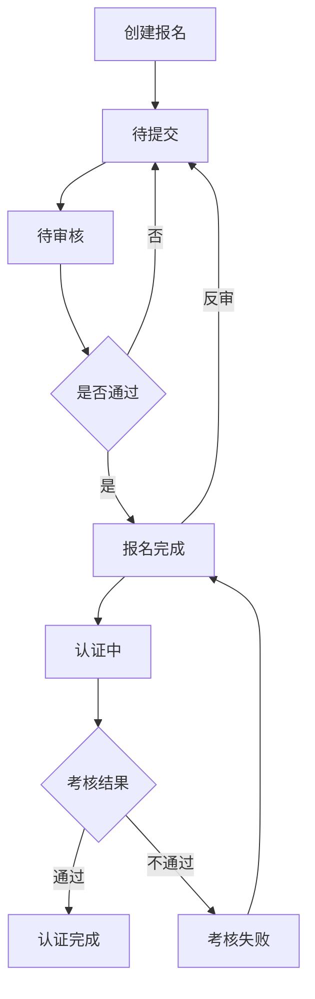
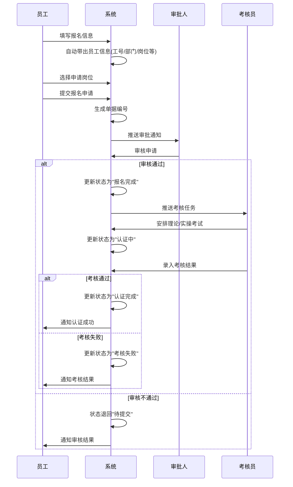

# 多能工报名认证字段表

---

## 功能业务介绍

多能工报名认证模块用于管理员工申请多能工岗位认证的全流程。员工可以通过系统提交报名申请，选择目标认证岗位，并根据岗位要求参加理论考试和实操考试。系统支持完整的审批流程和认证流程，实现从报名申请到认证完成的全生命周期管理。

该模块主要功能包括：
- 员工报名信息录入与管理
- 报名申请审批流程
- 理论/实操考试安排
- 认证状态跟踪与管理
- 报名附件上传与管理

---

## 业务流程

---

## 字段清单

| 序号 | 字段名称 | 类型 | 长度/精度 | 必填 | 说明/备注 |
|:---:|---------|------|:--------:|:---:|----------|
| 1 | 在职员工 | 字符串 | 50 | 是 | 员工姓名，如 "吴宇辉" |
| 2 | 工号 | 字符串 | 20 | 否（系统带出） | 员工编号，如 "10004342" |
| 3 | 单据编号 | 字符串 | 20 | 否（系统生成） | 报名单据号，如 "BM260410019" |
| 4 | 部门 | 字符串 | 100 | 否（系统带出） | 所属部门，如 "生产部 / 生产部二车间 / 生产部二车间 D 班" |
| 5 | 现岗位 | 字符串 | 50 | 否（系统带出） | 当前岗位，如 "操作工 - BZ" |
| 6 | 入职日期 | 日期 | - | 否（系统带出） | 员工入职日期，如 "2012-03-20" |
| 7 | 学历 | 字符串 | 20 | 否（系统带出） | 员工学历，如 "初中及以下" |
| 8 | 申请日期 | 日期 | - | 是 | 报名申请提交日期，如 "2026-04-10" |
| 9 | 报名申请岗位 | 字符串 | 50 | 是 | 申请认证的岗位，如 "机码" |
| 10 | 申请理由 | 字符串 | 100 | 否 | 申请认证的理由，如 "其他" |
| 11 | 理论考试 | 枚举 | - | 是 | 是否需要理论考试，选项：需要/不需要 |
| 12 | 实操考试 | 枚举 | - | 是 | 是否需要实操考试，选项：需要/不需要 |
| 13 | 认证状态 | 字符串 | 20 | 否（系统状态） | 报名流程状态，如 "报名完成" |
| 14 | 报名备注 | 文本（大文本） | 500 | 否 | 额外说明信息，如 "班组人员储备" |
| 15 | 报名附件 | 文件/附件 | 单个≤100M，最多10个 | 否 | 支持格式：jpg、png、gif、jpeg、pdf、zip、rar、docx、doc、xlsx、xls、ppt、pptx、pptm |

---

## 业务规则

### R01 - 基本信息规则
- 在职员工姓名为必填字段，最大长度50字符
- 工号、部门、现岗位、入职日期、学历由系统从员工档案自动带出，不可手动修改

### R02 - 报名申请规则
- 申请日期为必填字段，默认为系统当前日期
- 报名申请岗位为必填字段，需从岗位字典中选择
- 申请理由为选填字段，最大长度100字符

### R03 - 考试配置规则
- 理论考试和实操考试为必填字段，只能选择"需要"或"不需要"
- 至少需要选择一项考试类型（理论或实操）

### R04 - 单据编号规则
- 单据编号由系统自动生成，格式为"BM + 年份后两位 + 月份 + 流水号"
- 例如：BM260410019（2026年4月第10019号报名单）

### R05 - 附件上传规则
- 支持的文件格式：jpg、png、gif、jpeg、pdf、zip、rar、docx、doc、xlsx、xls、ppt、pptx、pptm
- 单个文件大小不超过100MB
- 最多支持上传10个附件

### R06 - 状态流转规则
- 状态流转顺序：待提交 → 待审核 → 报名完成 → 认证中 → 认证完成/考核失败
- 待提交状态可进行编辑和提交操作
- 待审核状态仅审批人可操作（通过/拒绝）
- 报名完成状态可触发反审操作退回待提交
- 认证完成状态由多能工认证流程自动变更

---

## 业务状态

| 状态名称 | 说明 | 触发条件 | 可执行操作 |
|---------|------|---------|-----------|
| 待提交 | 报名信息已填写但未提交 | 创建报名单后 | 编辑、提交、删除 |
| 待审核 | 报名申请已提交，等待审批 | 员工提交报名申请 | 审核通过、审核拒绝 |
| 报名完成 | 报名申请审批通过 | 审批人审核通过 | 查看详情、关联认证、反审 |
| 认证中 | 已进入多能工认证流程 | 启动认证流程 | 录入考核结果 |
| 认证完成 | 考核通过，认证成功 | 考核员录入通过结果 | 查看详情 |
| 考核失败 | 考核未通过 | 考核员录入失败结果 | 重新认证、查看详情 |

---

## 更新记录

| 更新时间 | 更新内容 | 更新人 |
|---------|---------|--------|
| 2026-04-28 | 首次创建多能工报名认证字段表 | 系统生成 |
