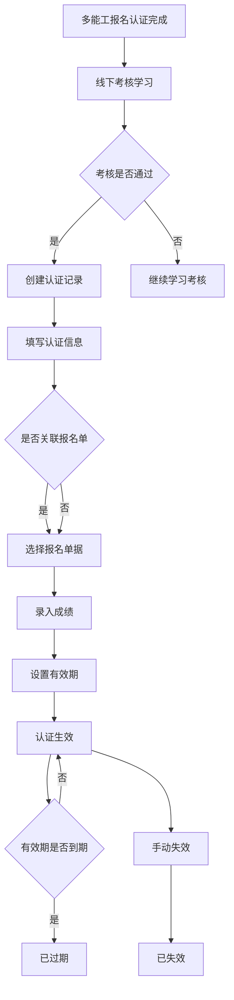
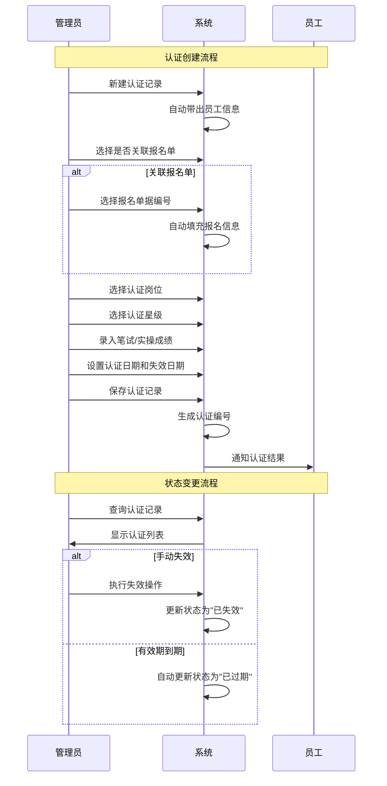

# 多能工管理字段表

---

## 功能业务介绍

多能工管理模块用于管理员工多能工认证的全生命周期。该模块与多能工报名认证模块关联，当报名认证完成后进入线下考核学习期，考核通过后在本模块进行认证记录管理。主要功能包括认证信息录入、认证等级管理、成绩记录、有效期管理等，支持对多能工认证业务数据进行全面管理和维护。

---

## 业务流程

---

## 字段清单

| 序号 | 字段名称 | 类型 | 长度/精度 | 必填 | 说明/备注 |
|:---:|---------|------|:--------:|:---:|----------|
| 1 | 关联多能工认证报名 | 枚举 | - | 是 | 选项：关联/不关联；关联时需选择报名单据 |
| 2 | 已关联报名单据编号 | 字符串 | 20 | 否（关联时必填） | 如：BM260105001，支持取消关联 |
| 3 | 在职员工姓名 | 字符串 | 50 | 是 | 员工姓名，如 "刘珂" |
| 4 | 工号 | 字符串 | 20 | 否（系统带出） | 员工编号，如 "10006118" |
| 5 | 认证编号 | 字符串 | 20 | 否（系统生成） | 认证单据编号，如 "DN260415001" |
| 6 | 部门 | 字符串 | 100 | 否（系统带出） | 所属部门，如 "储运采购部" |
| 7 | 入职日期 | 日期 | - | 否（系统带出） | 员工入职日期，如 "2013-03-11" |
| 8 | 职位 | 字符串 | 100 | 否（系统带出） | 岗位信息，如 "湖北生产基地储运采购部 车间叉车班叉车" |
| 9 | 认证日期 | 日期 | - | 是 | 认证通过的日期，如 "2026-03-17" |
| 10 | 认证星级 | 枚举/字符串 | 20 | 是 | 如 "一星/二星/三星"等，下拉选择 |
| 11 | 认证岗位 | 枚举/字符串 | 50 | 是 | 如 "仓管员"，下拉选择 |
| 12 | 失效日期 | 日期 | - | 是 | 认证有效期截止日，如 "2027-03-16" |
| 13 | 笔试成绩 | 数值（浮点） | (5,1) | 否 | 理论考试分数，如 "90.5" |
| 14 | 实操成绩 | 数值（浮点） | (5,1) | 否 | 实操考试分数 |
| 15 | 认证备注 | 文本 | 1000 | 否 | 非必填，用于补充说明 |
| 16 | 认证状态 | 枚举/字符串 | 20 | 否（系统状态） | 如 "生效中/已过期/已失效" |
| 17 | 认证附件 | 文件/附件 | 单个≤100M，最多10个 | 否 | 支持格式：jpg、png、gif、jpeg、pdf、zip、rar、docx、doc、xlsx、xls、ppt、pptx、pptm |

---

## 业务规则

### R01 - 关联规则
- 关联多能工认证报名为必填字段，可选"关联"或"不关联"
- 选择"关联"时，必须选择已存在的报名单据编号
- 已关联的报名单据支持取消关联操作
- 关联后自动同步报名单据中的员工信息

### R02 - 员工信息规则
- 在职员工姓名为必填字段，最大长度50字符
- 工号、部门、入职日期、职位由系统从员工档案自动带出，不可手动修改

### R03 - 认证编号规则
- 认证编号由系统自动生成，格式为"DN + 年份后两位 + 月份 + 流水号"
- 例如：DN260415001（2026年4月第15001号认证单）

### R04 - 认证信息规则
- 认证日期、认证星级、认证岗位、失效日期为必填字段
- 认证星级下拉选项：一星、二星、三星（可扩展）
- 认证岗位从岗位字典中选择
- 失效日期必须大于等于认证日期

### R05 - 成绩规则
- 笔试成绩和实操成绩为选填字段
- 成绩精度为(5,1)，即最大5位数字，1位小数
- 成绩范围：0-100分

### R06 - 状态规则
- 认证状态由系统自动维护，不可手动修改
- 初始状态为"生效中"
- 失效日期到期自动变更为"已过期"
- 可手动操作变更为"已失效"

### R07 - 附件规则
- 支持的文件格式：jpg、png、gif、jpeg、pdf、zip、rar、docx、doc、xlsx、xls、ppt、pptx、pptm
- 单个文件大小不超过100MB
- 最多支持上传10个附件

---

## 业务状态

| 状态名称 | 说明 | 触发条件 | 可执行操作 |
|---------|------|---------|-----------|
| 生效中 | 认证有效，在有效期内 | 认证记录创建完成 | 查看详情、编辑、失效、删除 |
| 已过期 | 认证有效期已到期 | 系统自动检测失效日期 | 查看详情、重新认证 |
| 已失效 | 认证被手动失效 | 管理员执行失效操作 | 查看详情、重新认证 |

---

## 更新记录

| 更新时间 | 更新内容 | 更新人 |
|---------|---------|--------|
| 2026-04-28 | 首次创建多能工管理字段表 | 系统生成 |
