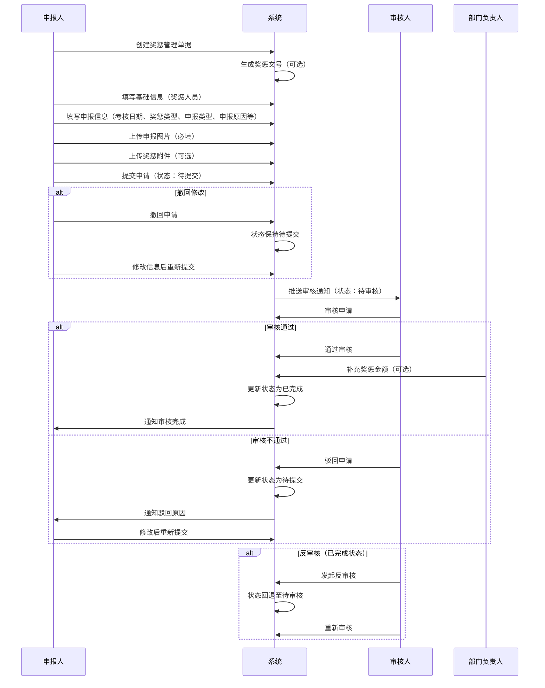
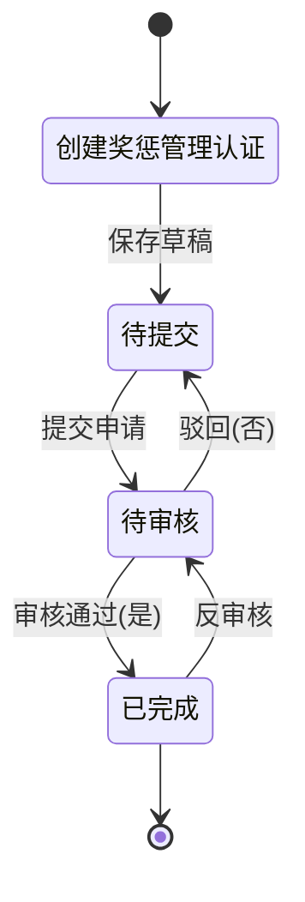

# 奖惩管理字段表

## 一、业务概述

奖惩管理模块用于记录和管理员工的奖励与处罚信息，支持对员工在质量、安全、纪律等方面表现进行奖惩申报和审核。该模块确保奖惩流程规范化、透明化。

## 二、业务流程图

## 三、状态流转图

## 四、字段清单

### 4.1 基础信息模块

| 序号 | 字段名称 | 类型 | 长度/精度 | 必填 | 说明/备注 |
| :--- | :--- | :--- | :--- | :--- | :--- |
| 1 | 奖惩人员 | 字符串 | 50 | 是 | 员工姓名，如 "王雪莲" |
| 2 | 奖惩文号 | 字符串 | 50 | 否 | 如 "流程测试XXXX" |

### 4.2 申报考核信息模块

| 序号 | 字段名称 | 类型 | 长度/精度 | 必填 | 说明/备注 |
| :--- | :--- | :--- | :--- | :--- | :--- |
| 3 | 考核日期 | 日期 | - | 是 | 如 "2026-04-08" |
| 4 | 奖惩类型 | 枚举（下拉） | 20 | 是 | 选项：奖励/处罚 |
| 5 | 申报类型 | 枚举（下拉） | 20 | 是 | 选项：质量/安全/纪律等，示例值 "质量" |
| 6 | 申报原因 | 文本 | 500 | 是 | 如 "流程测试XXXX" |
| 7 | 奖惩金额 | 数值 | (10,2) | 否 | 如 "100"，提示 "由相关部门负责人在审核时补充该信息" |
| 8 | 事件描述 | 文本 | 1000 | 是 | 如 "流程测试XXXX" |
| 9 | 申报图片 | 图片上传 | - | 是 | 单张图片上传，示例为红牛罐照片 |
| 10 | 原因分析 | 字符串 | 500 | 否 | 如 "流程测试XXXX" |
| 11 | 是否经过检测 | 单选枚举 | - | 否 | 选项：是/否，默认选中 "是" |
| 12 | 收益分析 | 字符串 | 500 | 否 | 提示 "请输入涉及数量收益分析信息(非必填)" |
| 13 | 奖惩备注 | 文本 | 500 | 否 | 提示 "请输入奖惩备注信息（非必填）" |
| 14 | 奖惩附件 | 附件上传 | - | 否 | 提示 "添加奖惩附件，最多支持10个"；支持格式：图片、PDF、Office文档等，单文件≤100M |

## 五、业务规则

### R01 - 数据完整性规则
- 奖惩人员、考核日期、奖惩类型、申报类型、申报原因、事件描述、申报图片为必填字段
- 奖惩金额由相关部门负责人在审核时补充

### R02 - 奖惩类型规则
- **奖励**：对员工优秀表现给予的表彰和奖励
- **处罚**：对员工违规行为进行的处罚处理

### R03 - 申报类型规则
- 支持多种申报类型：质量、安全、纪律等

### R04 - 状态流转规则
| 当前状态 | 操作 | 目标状态 | 说明 |
| :--- | :--- | :--- | :--- |
| 待提交 | 提交申请 | 待审核 | 进入审核流程 |
| 待审核 | 审核通过 | 已完成 | 审核流程完成 |
| 待审核 | 审核不通过 | 待提交 | 驳回修改 |
| 已完成 | 反审核 | 待审核 | 允许撤销已完成的单据重新审核 |

### R05 - 默认值规则
- **是否经过检测**：默认选中 "是"

### R06 - 图片上传规则
- 申报图片为必填项，仅支持单张图片上传

### R07 - 附件上传规则
- 最多支持10个文件上传
- 单文件大小限制：≤100M
- 支持格式：图片、PDF、Office文档等

## 六、更新记录

| 日期 | 修改内容 | 修改人 |
| :--- | :--- | :--- |
| 2026-05-06 | 初始创建，包含完整字段清单和业务流程 | 系统管理员 |