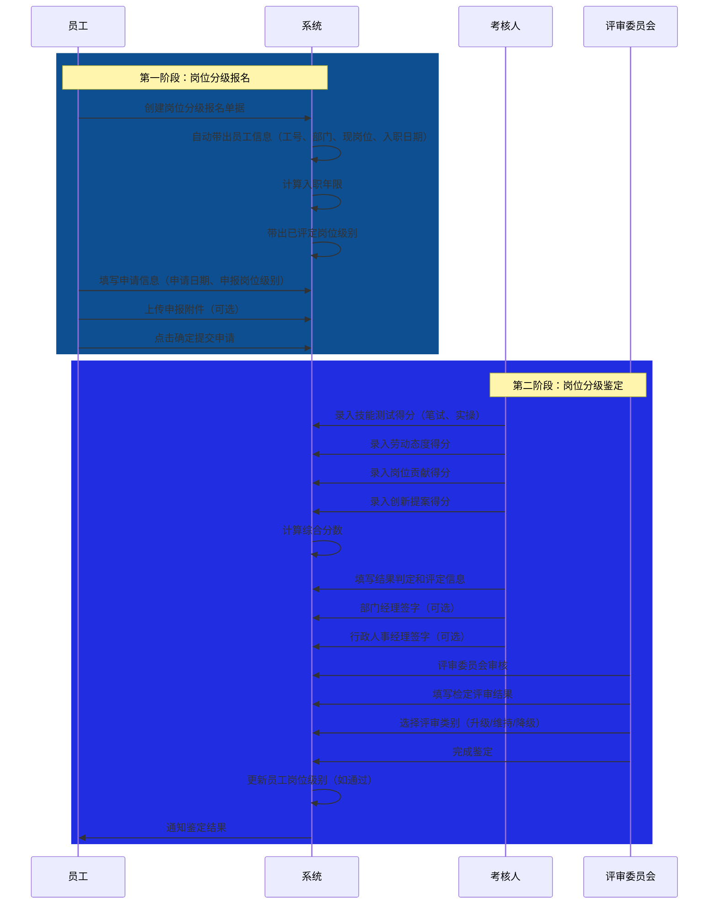
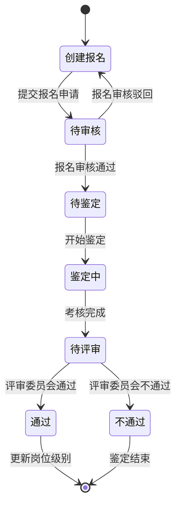

# 岗位分级鉴定管理字段表

## 一、业务概述

岗位分级鉴定管理模块用于管理员工岗位级别的申报和鉴定流程。整体业务逻辑分为两个阶段：
1. **岗位分级报名** - 员工提交岗位级别升级申请
2. **岗位分级鉴定** - 对报名员工进行技能考核和综合评价

鉴定流程包括技能测试（笔试+实操）、劳动态度评估、岗位贡献评估、创新提案评估，最终由评审委员会给出鉴定结果。

## 二、业务流程图

## 三、状态流转图

## 四、字段清单

### 4.1 岗位分级报名

#### 4.1.1 基础信息模块

| 序号 | 字段名称 | 类型 | 长度/精度 | 必填 | 说明/备注 |
| :--- | :--- | :--- | :--- | :--- | :--- |
| 1 | 在职员工 | 字符串 | 50 | 是 | 需点击选择在职员工 |
| 2 | 工号 | 字符串 | 20 | 否 | 可输入，也可由选择员工后自动带出 |
| 3 | 单据编号 | 字符串 | 20 | 否 | 系统自动生成 |
| 4 | 部门 | 字符串 | 100 | 否 | 可输入，也可由选择员工后自动带出 |
| 5 | 现岗位 | 字符串 | 100 | 否 | 可输入，也可由选择员工后自动带出 |
| 6 | 入职日期 | 日期 | - | 否 | 可选择，也可由选择员工后自动带出 |
| 7 | 入职年限 | 字符串 | 10 | 否 | 可输入，也可由系统根据入职日期自动计算 |

#### 4.1.2 申请报名信息模块

| 序号 | 字段名称 | 类型 | 长度/精度 | 必填 | 说明/备注 |
| :--- | :--- | :--- | :--- | :--- | :--- |
| 8 | 申请日期 | 日期 | - | 是 | 需选择申请日期 |
| 9 | 申报岗位级别 | 枚举（下拉） | 50 | 是 | 下拉选择申报的岗位级别 |
| 10 | 已评定岗位级别 | 字符串 | 50 | 否 | 系统带出，显示员工当前已评定的岗位级别 |
| 11 | 申报备注 | 文本 | 500 | 否 | 非必填，最多支持500字 |
| 12 | 申报附件 | 附件上传 | - | 否 | 最多支持10个文件；单文件≤100M；支持格式：jpg、png、gif、jpeg、pdf、zip、rar、docx、doc、xlsx、ppt、pptx、pptm、xls |

#### 4.1.3 操作按钮

| 序号 | 字段名称 | 类型 | 长度/精度 | 必填 | 说明/备注 |
| :--- | :--- | :--- | :--- | :--- | :--- |
| 13 | 取消 | 按钮 | - | - | 放弃本次操作，返回列表页 |
| 14 | 确定 | 按钮 | - | - | 提交本次岗位分级申报信息 |

---

### 4.2 岗位分级鉴定管理

#### 4.2.1 基础信息模块

| 序号 | 字段名称 | 类型 | 长度/精度 | 必填 | 说明/备注 |
| :--- | :--- | :--- | :--- | :--- | :--- |
| 1 | 在职员工 | 字符串 | 50 | 是 | 员工姓名，如 "testuser4" |
| 2 | 工号 | 字符串 | 20 | 否（系统带出） | 员工编号，如 "15971" |
| 3 | 单据编号 | 字符串 | 20 | 否（系统生成） | 单据流水号，如 "PD260209001" |
| 4 | 部门 | 字符串 | 100 | 否（系统带出） | 所属部门，如 "行政人事部" |
| 5 | 现岗位 | 字符串 | 100 | 否（系统带出） | 员工岗位，如 "人事经理" |
| 6 | 入职日期 | 日期 | - | 否（系统带出） | 员工入职日期，如 "2024-05-10" |
| 7 | 入职年限 | 字符串 | 20 | 否（系统计算带出） | 如 "1年11月26天" |

#### 4.2.2 申请报名信息模块

| 序号 | 字段名称 | 类型 | 长度/精度 | 必填 | 说明/备注 |
| :--- | :--- | :--- | :--- | :--- | :--- |
| 8 | 申请日期 | 日期 | - | 是 | 申请提交日期，如 "2026-02-09" |
| 9 | 申报岗位级别 | 枚举（下拉） | 50 | 是 | 下拉选择，如 "高级" |
| 10 | 已评定岗位级别 | 字符串 | 50 | 否（系统带出） | 员工当前已评定的岗位级别，如 "高级" |

#### 4.2.3 考核成绩模块

| 序号 | 字段名称 | 类型 | 长度/精度 | 必填 | 说明/备注 |
| :--- | :--- | :--- | :--- | :--- | :--- |
| 11 | 技能测试得分-笔试 | 数值 | (5,1) | 否 | 如 "8" |
| 12 | 技能测试笔试结果 | 单选枚举 | - | 否 | 选项：合格/不合格，示例 "合格" |
| 13 | 技能测试得分-实操 | 数值 | (5,1) | 否 | 如 "7" |
| 14 | 技能测试实操结果 | 单选枚举 | - | 否 | 选项：合格/不合格，示例 "合格" |
| 15 | 劳动态度得分 | 数值 | (5,1) | 否 | 如 "6" |
| 16 | 劳动态度结果 | 单选枚举 | - | 否 | 选项：合格/不合格，示例 "合格" |
| 17 | 岗位贡献得分 | 数值 | (5,1) | 否 | 如 "7" |
| 18 | 岗位贡献结果 | 单选枚举 | - | 否 | 选项：合格/不合格，示例 "合格" |
| 19 | 创新提案得分 | 数值 | (5,1) | 否 | 如 "8" |
| 20 | 创新提案结果 | 单选枚举 | - | 否 | 选项：合格/不合格，示例 "合格" |

#### 4.2.4 综合评价模块

| 序号 | 字段名称 | 类型 | 长度/精度 | 必填 | 说明/备注 |
| :--- | :--- | :--- | :--- | :--- | :--- |
| 21 | 综合分数 | 数值 | (5,1) | 是 | 如 "77" |
| 22 | 结果判定 | 单选枚举 | - | 是 | 选项：合格/不合格，示例 "合格" |
| 23 | 评定人 | 字符串/签名 | 50 | 是 | 评定人姓名或电子签名 |
| 24 | 评定日期 | 日期 | - | 是 | 评定日期，如 "2026-02-09" |
| 25 | 部门经理签字 | 字符串/签名 | 50 | 否 | 部门经理电子签名 |
| 26 | 行政人事经理签字 | 字符串/签名 | 50 | 否 | 人事经理电子签名 |

#### 4.2.5 鉴定评审委员会意见模块

| 序号 | 字段名称 | 类型 | 长度/精度 | 必填 | 说明/备注 |
| :--- | :--- | :--- | :--- | :--- | :--- |
| 27 | 检定评审结果 | 单选枚举 | - | 是 | 选项：通过/不通过，示例 "通过" |
| 28 | 检定人 | 字符串/签名 | 50 | 是 | 检定人姓名或电子签名 |
| 29 | 检定日期 | 日期 | - | 是 | 检定日期，如 "2026-02-09" |
| 30 | 评审类别 | 枚举（下拉） | 50 | 是 | 下拉选择，如 "升级" |
| 31 | 鉴定备注 | 文本 | 500 | 否 | 补充说明信息，如 "23432432" |

## 五、业务规则

### R01 - 数据完整性规则
- **岗位分级报名**：在职员工、申请日期、申报岗位级别为必填字段
- **岗位分级鉴定**：综合分数、结果判定、评定人、评定日期、检定评审结果、检定人、检定日期、评审类别为必填字段

### R02 - 业务编号生成规则
- 报名单据编号格式：BM + 年份后两位 + 月份 + 日期 + 三位流水号
- 鉴定单据编号格式：PD + 年份后两位 + 月份 + 日期 + 三位流水号，如 "PD260209001"

### R03 - 状态流转规则
| 当前状态 | 操作 | 目标状态 | 说明 |
| :--- | :--- | :--- | :--- |
| 创建报名 | 提交申请 | 待审核 | 进入审核流程 |
| 待审核 | 审核通过 | 待鉴定 | 进入鉴定环节 |
| 待审核 | 审核驳回 | 创建报名 | 可修改后重新提交 |
| 待鉴定 | 开始鉴定 | 鉴定中 | 录入考核成绩 |
| 鉴定中 | 完成考核 | 待评审 | 等待评审委员会审核 |
| 待评审 | 评审通过 | 通过 | 更新员工岗位级别 |
| 待评审 | 评审不通过 | 不通过 | 鉴定结束 |

### R04 - 分数计算规则
- 综合分数由各单项得分（技能测试笔试、技能测试实操、劳动态度、岗位贡献、创新提案）综合计算得出

### R05 - 评审类别规则
- **升级**：员工岗位级别提升
- **维持**：员工岗位级别保持不变
- **降级**：员工岗位级别降低

### R06 - 附件上传规则
- 最多支持10个文件上传
- 单文件大小限制：≤100M
- 支持格式：jpg、png、gif、jpeg、pdf、zip、rar、docx、doc、xlsx、ppt、pptx、pptm、xls

### R07 - 签名规则
- 支持姓名输入或电子签名两种方式
- 评定人签名为必填项
- 部门经理和行政人事经理签名为可选项

## 六、更新记录

| 日期 | 修改内容 | 修改人 |
| :--- | :--- | :--- |
| 2026-05-06 | 初始创建，包含岗位分级报名和鉴定管理两个模块的完整字段清单 | 系统管理员 |