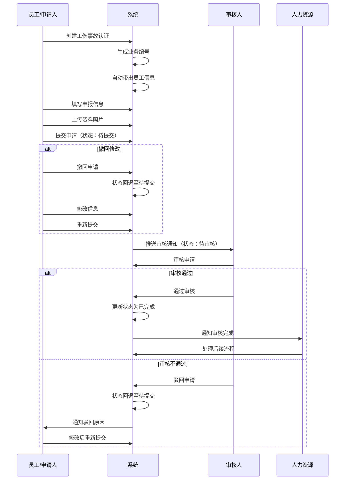
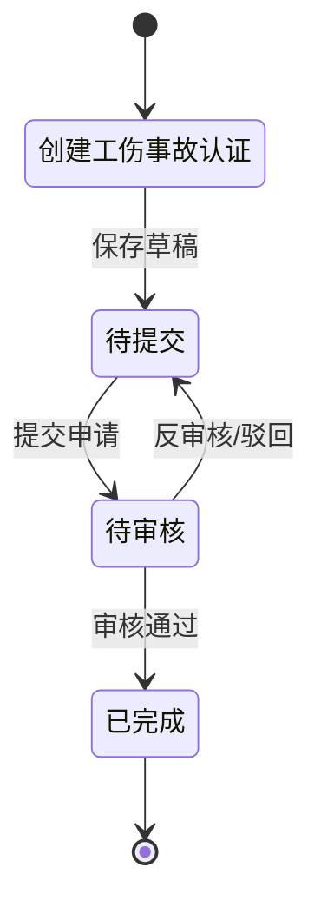

# 工伤事故管理字段表

## 一、业务概述

工伤事故管理模块用于记录和管理员工工伤事故的申报、审核和处理流程。该模块支持工伤认定、医疗资料上传、休假管理等功能，确保工伤处理流程规范化、透明化。

## 二、业务流程图

## 三、状态流转图

## 四、字段清单

### 4.1 员工信息模块

| 序号 | 字段名称 | 类型 | 长度/精度 | 必填 | 说明/备注 |
| :--- | :--- | :--- | :--- | :--- | :--- |
| 1 | 员工名称 | 字符串 | 50 | 是 | 员工姓名，如 "金媛" |
| 2 | 工号 | 字符串 | 20 | 否（系统带出） | 员工编号，如 "10004923" |
| 3 | 业务编号 | 字符串 | 20 | 否（系统生成） | 单据流水号，如 "GS260313001" |
| 4 | 部门 | 字符串 | 100 | 否（系统带出） | 所属部门，如 "品管部/品管部三车间" |
| 5 | 入职日期 | 日期 | - | 否（系统带出） | 员工入职日期，如 "2012-07-19" |
| 6 | 岗位 | 字符串 | 50 | 否（系统带出） | 员工岗位，如 "化验员" |

### 4.2 申报信息模块

| 序号 | 字段名称 | 类型 | 长度/精度 | 必填 | 说明/备注 |
| :--- | :--- | :--- | :--- | :--- | :--- |
| 7 | 事故申报日期 | 日期 | - | 是 | 提交工伤申报的日期，如 "2026-02-19" |
| 8 | 申报险种 | 枚举（下拉） | 50 | 是 | 下拉选择，示例值 "工伤保险" |
| 9 | 受伤地点 | 字符串 | 100 | 是 | 事故发生地点，如 "金桂路与郭桂巷交叉口" |
| 10 | 事情经过 | 文本 | 1000 | 是 | 事故详细描述，如 "2026年2月19日15:20左右，上班途中在金桂路与郭桂巷交叉口处发生交通事故，导致右腿骨折。" |
| 11 | 受伤时间 | 日期时间 | - | 是 | 事故发生的具体时间，如 "2026-02-19 15:11" |
| 12 | 门诊/入院时间 | 日期时间 | - | 是 | 就医的时间，如 "2026-02-19 16:17" |
| 13 | 就诊单位名称 | 字符串 | 100 | 是 | 就医的医院名称，如 "咸宁市中心医院" |
| 14 | 资料照片 | 附件上传 | - | 是 | 上传受伤部位、检查报告等照片，支持多图上传 |
| 15 | 业务状态 | 枚举 | - | 否（系统带出） | 状态：待提交/待审核/已完成 |

### 4.3 休假信息模块

| 序号 | 字段名称 | 类型 | 长度/精度 | 必填 | 说明/备注 |
| :--- | :--- | :--- | :--- | :--- | :--- |
| 16 | 请假时间段-开始时间 | 日期 | - | 否 | 工伤休假的开始日期，由申请人在休假期间审批时补充 |
| 17 | 请假时间段-结束时间 | 日期 | - | 否 | 工伤休假的结束日期，由申请人在休假期间审批时补充 |
| 18 | 备注信息 | 文本 | 1000 | 否 | 补充说明信息 |

## 五、业务规则

### R01 - 数据完整性规则
- 员工名称、事故申报日期、申报险种、受伤地点、事情经过、受伤时间、门诊/入院时间、就诊单位名称、资料照片为必填字段
- 员工信息（工号、部门、入职日期、岗位）由系统根据登录用户自动带出

### R02 - 业务编号生成规则
- 业务编号格式：GS + 年份后两位 + 月份 + 日期 + 三位流水号
- 示例：GS260313001（2026年3月13日第1单）

### R03 - 状态流转规则
- **待提交**：用户创建单据后，未提交前的状态，可修改所有字段
- **待审核**：提交申请后进入审核流程，需等待审核人处理
- **已完成**：审核通过后的最终状态，单据不可修改

### R04 - 审核规则
- 审核人可选择"通过"或"驳回"
- 驳回需填写驳回原因
- 驳回后单据状态回退至"待提交"，申请人可修改后重新提交

### R05 - 附件上传规则
- 支持图片格式：JPG、PNG、GIF
- 支持多图上传（建议不超过10张）
- 单张图片大小限制：5MB

## 六、更新记录

| 日期 | 修改内容 | 修改人 |
| :--- | :--- | :--- |
| 2026-05-06 | 初始创建，包含完整字段清单和业务流程 | 系统管理员 |