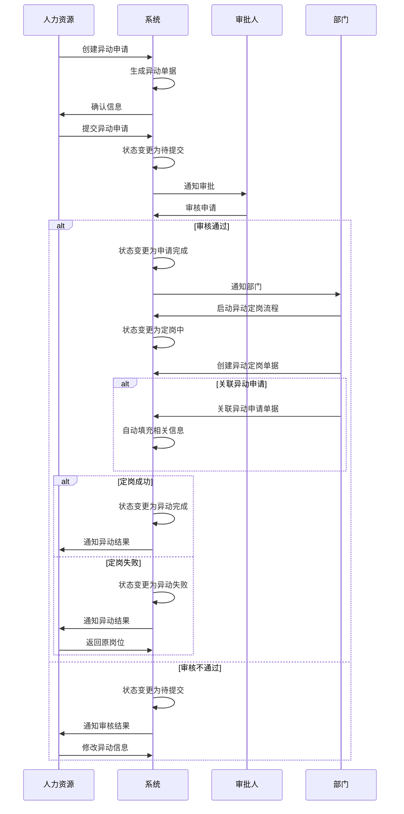

# 异动管理字段表

## 功能业务介绍
异动管理模块用于记录和管理员工的岗位异动信息，包括异动前信息、异动后信息和系统通用字段，支持异动流程的全生命周期管理，从创建异动到待提交、待审核、申请完成、定岗中、异动完成/异动失败的状态流转，并提供异动失败后返回原岗位的功能。同时支持异动定岗单据关联异动申请单据，实现流程的连贯性和数据的一致性。

## 业务流程

## 字段清单

| 字段名称 | 类型 | 长度 | 约束条件 | 说明 |
|---------|------|------|----------|------|
| relate_apply_flag | tinyint | 1 | 是 | 是否关联异动申请：1 = 关联，0 = 不关联（单选） |
| emp_name | varchar | 50 | 是 | 在职员工姓名，示例值：余祖念 |
| emp_id | varchar | 50 | 是 | 工号，示例值：10000537 |
| doc_no | varchar | 50 | 是 | 单据编号，示例值：ZZ20260401001 |
| pre_dept | varchar | 100 | 否 | 异动前部门，示例值：储运采购部 |
| hire_date | date | - | 否 | 入职日期，示例值：2006-06-16 |
| pre_dept_factory | varchar | 100 | 否 | 异动前部门（数智工厂），示例值：储运采购部办公室 |
| pre_job | varchar | 100 | 否 | 异动前职务，示例值：储运管理B |
| pre_position | varchar | 200 | 否 | 职位全称，示例值：湖北生产基地储运采购部储运管理B |
| pre_post_factory | varchar | 100 | 否 | 异动前岗位（数智工厂），示例值：储运管理B |
| change_date | date | - | 是 | 异动日期，示例值：2026-04-01 |
| change_type | varchar | 50 | 是 | 异动类型，示例值：岗位异动 |
| post_dept_factory | varchar | 100 | 是 | 异动后部门（数智工厂），示例值：储运采购部办公室 |
| post_dept | varchar | 100 | 是 | 异动后部门，示例值：储运采购部 |
| post_job | varchar | 100 | 是 | 异动后职务，示例值：储运采购部采购主管 |
| post_post_factory | varchar | 100 | 是 | 异动后岗位（数智工厂），示例值：采购主管 |
| change_remark | text | - | 否 | 异动定岗备注，非必填 |
| post_dept_leader | varchar | 50 | 是 | 异动后部门负责人，示例值：李军 |
| work_place | varchar | 200 | 否 | 工作地点（支持多选），示例值：湖北咸宁 |
| multi_skill_relation | varchar | 100 | 否 | 关联多能工信息 |
| plan_settle_date | date | - | 是 | 计划异动定岗日期，示例值：2026-04-01 |
| actual_settle_date | date | - | 是 | 实际异动转定岗日期，示例值：2026-04-01 |
| change_attach | varchar | 500 | 否 | 异动定岗附件，存储文件路径；最多支持 10 个，单文件≤100M，支持格式：jpg、png、gif、jpeg、zip、pdf、rar、docx、doc、xlsx、ppt、pptx、pptm、xls |
| change_status | varchar | 20 | 否 | 异动状态，示例值：已完成 |
| id | bigint | 20 | 是 | 主键 ID，自增 |
| create_time | datetime | - | 是 | 创建时间 |
| update_time | datetime | - | 是 | 更新时间 |
| creator | varchar | 50 | 是 | 创建人 |
| updater | varchar | 50 | 是 | 更新人 |

## 业务规则
1. **R01**: 是否关联异动申请、在职员工姓名、工号、单据编号、异动日期、异动类型、异动后部门（数智工厂）、异动后部门、异动后职务、异动后岗位（数智工厂）、异动后部门负责人、计划异动定岗日期、实际异动转定岗日期、主键ID、创建时间、更新时间、创建人、更新人为必填字段
2. **R02**: 异动状态流转规则：待提交→待审核→申请完成→定岗中→异动完成/异动失败
3. **R03**: 审核不通过时，状态返回待提交，可修改后重新提交
4. **R04**: 异动失败时，可返回原岗位
5. **R05**: 异动完成状态由异动定岗状态=已完成后自动变更
6. **R06**: 工作地点支持多选
7. **R07**: 异动定岗附件限制：最多支持 10 个，单文件≤100M，支持格式：jpg、png、gif、jpeg、zip、pdf、rar、docx、doc、xlsx、ppt、pptx、pptm、xls
8. **R08**: 是否关联异动申请枚举值为：1 = 关联，0 = 不关联
9. **R09**: 关联异动申请时，系统自动填充相关信息

## 业务状态
- **待提交**: 初始状态，异动信息已创建但未提交审核
- **待审核**: 异动信息已提交，等待审批人审核
- **申请完成**: 审核通过，异动申请流程完成
- **定岗中**: 正在进行异动定岗流程
- **异动完成**: 定岗成功，异动流程完成
- **异动失败**: 定岗失败，可返回原岗位