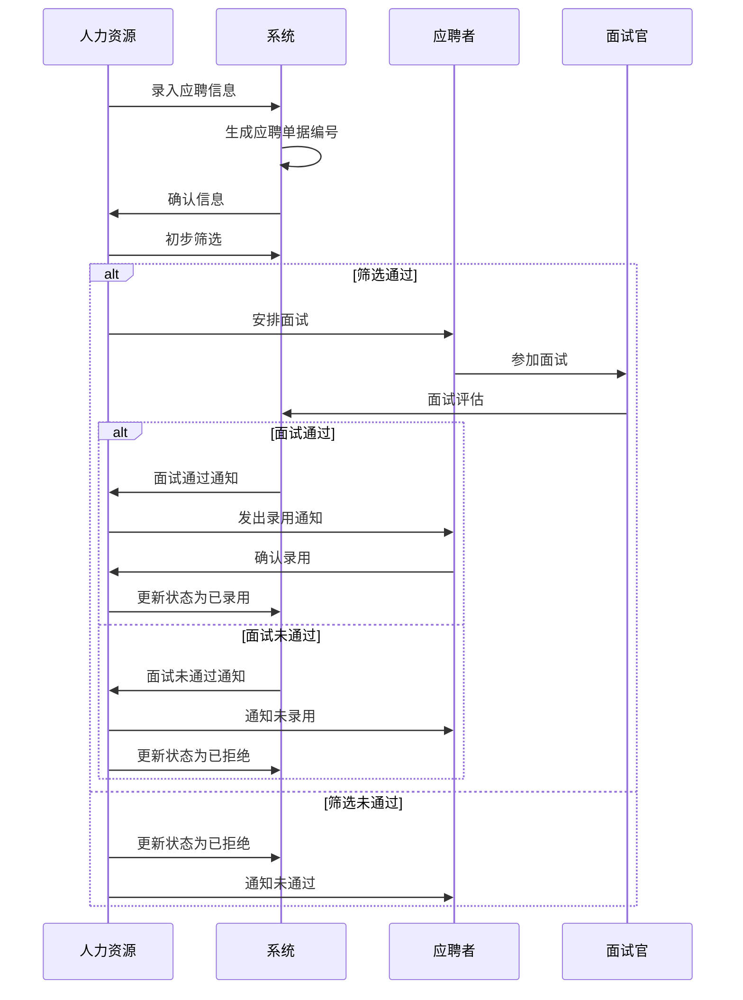

# 招聘管理字段表

## 功能业务介绍
招聘管理模块用于全面记录和管理应聘人员的信息，包括个人基本信息、联系方式、教育背景、工作经历、家庭成员信息等，支持招聘流程的全生命周期管理。该模块通过系统化的信息采集和流程管理，提高招聘效率，确保招聘过程的规范性和可追溯性。

## 业务流程

## 字段清单

| 序号 | 字段名称 | 字段类型 | 字段长度 | 字段描述 | 备注 |
|------|---------|---------|---------|---------|------|
| 1 | id | bigint | 20 | 主键自增 ID | 唯一标识，主键字段 |
| 2 | doc_no | varchar | 30 | 应聘单据编号 | 业务唯一编码，如 ZP260427001 |
| 3 | apply_date | date | - | 应聘日期 | 登记应聘的日期 |
| 4 | name | varchar | 20 | 应聘人姓名 | 必填，应聘者真实姓名 |
| 5 | gender | tinyint | 1 | 性别 | 1 = 男，2 = 女 |
| 6 | birth_date | date | - | 出生日期 | 用于计算年龄及工龄 |
| 7 | id_card | varchar | 18 | 身份证号码 | 唯一约束，18 位标准身份证号 |
| 8 | phone | varchar | 20 | 联系电话 | 必填，常用手机号 / 固话 |
| 9 | email | varchar | 100 | 电子邮箱 | 选填，用于通知沟通 |
| 10 | native_place | varchar | 50 | 籍贯 | 应聘者户籍所在地 |
| 11 | marital_status | varchar | 10 | 婚姻状况 | 可选值：未婚、已婚、离异、丧偶 |
| 12 | political_status | varchar | 20 | 政治面貌 | 可选值：群众、团员、党员、预备党员等 |
| 13 | education | varchar | 20 | 最高学历 | 可选值：大专、本科、硕士、博士、高中及以下 |
| 14 | graduate_school | varchar | 100 | 毕业院校 | 应聘者最高学历毕业院校 |
| 15 | major | varchar | 60 | 所学专业 | 毕业院校对应专业名称 |
| 16 | graduate_date | date | - | 毕业时间 | 完成学业的日期 |
| 17 | school_address | varchar | 100 | 学校所在地 | 院校所在城市 / 地区 |
| 18 | apply_post | varchar | 50 | 应聘岗位 / 职务 | 必填，目标应聘岗位 |
| 19 | expect_salary | int | 10 | 期望薪资 | 单位：元，填 0 表示面议 |
| 20 | recruit_source | varchar | 50 | 招聘信息来源 | 可选值：招聘会、内部推荐、网络招聘、校园招聘等 |
| 21 | foreign_lang_level | varchar | 50 | 外语能力及等级 | 如：大学英语四级、日语 N2、无 |
| 22 | work_specialty | varchar | 200 | 个人工作专长 | 核心技能、专业特长描述 |
| 23 | hobby | varchar | 100 | 个人兴趣爱好 | 选填，个人日常爱好 |
| 24 | high_title | varchar | 50 | 最高职称 | 如：工程师、会计师、无 |
| 25 | assess_year | varchar | 10 | 职称评定年份 | 职称获取年份，选填 |
| 26 | registered_addr | varchar | 200 | 户籍地址 | 身份证登记地址 |
| 27 | contact_addr | varchar | 200 | 现居住通信地址 | 常用联系地址 |
| 28 | need_live | tinyint | 1 | 是否需要住宿 | 0 = 否，1 = 是 |
| 29 | work_company | varchar | 100 | 原工作单位 | 最近一份工作单位名称 |
| 30 | work_post | varchar | 50 | 原担任职位 | 原工作岗位 / 职务 |
| 31 | work_start_date | date | - | 工作开始时间 | 原工作入职日期 |
| 32 | work_end_date | date | - | 工作结束时间 | 原工作离职日期 |
| 33 | old_salary | int | 10 | 原薪资待遇 | 原工作月薪资，单位：元 |
| 34 | resign_reason | varchar | 200 | 离职原因 | 原工作离职原因说明 |
| 35 | family_relation | varchar | 20 | 家庭成员关系 | 如：父亲、母亲、配偶、子女 |
| 36 | family_name | varchar | 20 | 家属姓名 | 家庭成员姓名 |
| 37 | family_age | int | 3 | 家属年龄 | 选填，家庭成员年龄 |
| 38 | family_political | varchar | 20 | 家属政治面貌 | 选填，家属政治身份 |
| 39 | family_work_unit | varchar | 100 | 家属工作单位 | 选填，家属就职单位 |
| 40 | family_post | varchar | 50 | 家属任职职位 | 选填，家属工作职务 |
| 41 | family_phone | varchar | 20 | 家属联系电话 | 紧急联系人电话，必填 |
| 42 | remark | varchar | 500 | 备注信息 | 额外补充说明、特殊要求 |
| 43 | create_time | datetime | - | 创建时间 | 系统自动生成，记录录入时间 |
| 44 | update_time | datetime | - | 修改时间 | 系统自动生成，记录最后修改时间 |
| 45 | del_flag | tinyint | 1 | 逻辑删除标记 | 0 = 正常，1 = 已删除（软删除） |

## 业务规则

1. **R01**：应聘单据编号（doc_no）为业务唯一编码，格式为 ZP + 年月日 + 三位序号，如 ZP260427001。
2. **R02**：身份证号码（id_card）为唯一约束，必须为 18 位标准身份证号。
3. **R03**：性别（gender）枚举值为：1 = 男，2 = 女。
4. **R04**：婚姻状况（marital_status）可选值：未婚、已婚、离异、丧偶。
5. **R05**：政治面貌（political_status）可选值：群众、团员、党员、预备党员等。
6. **R06**：最高学历（education）可选值：大专、本科、硕士、博士、高中及以下。
7. **R07**：招聘信息来源（recruit_source）可选值：招聘会、内部推荐、网络招聘、校园招聘等。
8. **R08**：是否需要住宿（need_live）枚举值为：0 = 否，1 = 是。
9. **R09**：期望薪资（expect_salary）单位为元，填 0 表示面议。
10. **R10**：逻辑删除标记（del_flag）枚举值为：0 = 正常，1 = 已删除（软删除）。
11. **R11**：必填字段：应聘人姓名（name）、联系电话（phone）、应聘岗位 / 职务（apply_post）、家属联系电话（family_phone）。
12. **R12**：创建时间（create_time）和修改时间（update_time）由系统自动生成，无需手动填写。

## 业务状态

### 招聘状态定义
- **待处理**：初始状态，应聘信息已录入但未进行任何处理
- **筛选中**：正在进行简历筛选和初步评估
- **面试中**：已通过初步筛选，正在安排或进行面试
- **待录用**：面试通过，等待发出录用通知
- **已录用**：已发出录用通知并获得确认
- **已拒绝**：因各种原因未通过招聘流程

### 状态转换条件
1. **待处理 → 筛选中**：人力资源部门开始对简历进行初步筛选
2. **筛选中 → 面试中**：简历筛选通过，安排面试
3. **筛选中 → 已拒绝**：简历筛选未通过
4. **面试中 → 待录用**：面试通过，等待发出录用通知
5. **面试中 → 已拒绝**：面试未通过
6. **待录用 → 已录用**：应聘者确认接受录用通知
7. **待录用 → 已拒绝**：应聘者拒绝录用通知或因其他原因无法录用