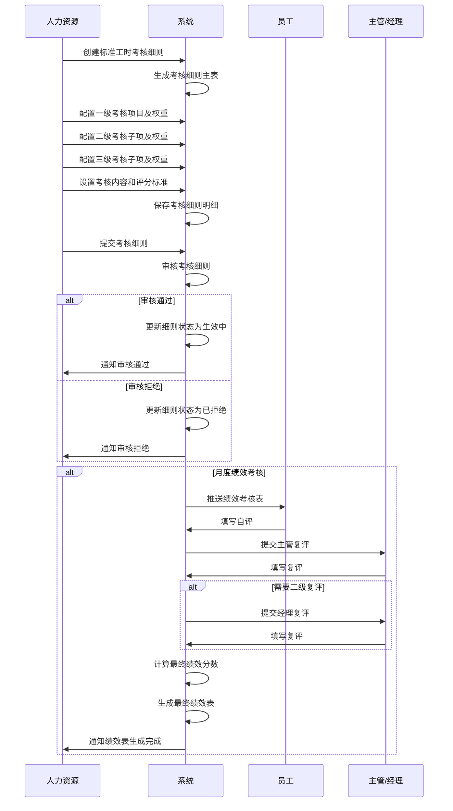

# 标准工时考核细则字段表

## 功能业务介绍
标准工时考核细则是标准工时绩效考核的核心组成部分，用于定义非生产线上办公室人员的绩效考核标准和规则。该模块采用三级考核项目结构（一级考核项目、二级考核子项、三级考核子项），通过设置权重和评分标准，实现对办公室人员的全面、客观评估。标准工时考核细则与绩效考核设置中的标准工时部分关联，为月度绩效汇总提供基础依据。

## 业务流程

## 字段清单

### 一、基础信息（主表）

| 字段名称 | 类型 | 长度 | 约束条件 | 说明 |
|---------|------|------|----------|------|
| id | bigint | 20 | 是 | 主键 ID，自增 |
| rule_title | varchar | 100 | 是 | 考核细则标题，示例值：2026年法务专员绩效考核 |
| rule_no | varchar | 50 | 是 | 细则编号，示例值：BZXZ260424001 |
| apply_post | varchar | 100 | 是 | 适用岗位，示例值：法务专员 |
| rule_remark | text | - | 否 | 备注信息 |
| rule_status | varchar | 20 | 是 | 细则状态，示例值：生效中 |
| rule_attach | varchar | 500 | 否 | 考核细则附件路径；最多支持 10 个文件，单文件≤100M，格式：jpg、png、gif、jpeg、pdf、zip、rar、docx、doc、xlsx、ppt、pptx、pptm、xls |

### 二、考核细则明细（子表，外键关联主表 id）

| 字段名称 | 类型 | 长度 | 约束条件 | 说明 |
|---------|------|------|----------|------|
| detail_id | bigint | 20 | 是 | 明细 ID，自增 |
| rule_id | bigint | 20 | 是 | 关联考核细则主表 ID（外键） |
| first_level_item | varchar | 100 | 是 | 一级考核项目，示例值：专业能力/工作态度 |
| first_level_weight | decimal | 5,2 | 是 | 一级项目权重 (%)，示例值：40/30 |
| second_level_item | varchar | 100 | 否 | 二级考核子项，示例值：法规政策动态跟踪/合规管理 |
| second_level_weight | decimal | 5,2 | 否 | 二级子项权重 (%)，示例值：15/10 |
| third_level_item | varchar | 100 | 否 | 三级考核子项 |
| third_level_weight | decimal | 5,2 | 否 | 三级子项权重 (%) |
| assessment_content | text | - | 是 | 考核内容，示例值：主动关注食品行业新规。针对新规向业务部门进行简短的法律提示或培训 |
| scoring_standard | text | - | 是 | 评分标准，与考核内容对应 |

### 三、系统通用字段

| 字段名称 | 类型 | 长度 | 约束条件 | 说明 |
|---------|------|------|----------|------|
| create_time | datetime | - | 是 | 创建时间 |
| update_time | datetime | - | 是 | 更新时间 |
| creator | varchar | 50 | 是 | 创建人 |
| updater | varchar | 50 | 否 | 更新人 |

## 业务规则
1. **R01**: 基础信息中，考核细则标题、细则编号、适用岗位、细则状态为必填字段
2. **R02**: 考核细则明细中，关联考核细则主表 ID、一级考核项目、一级项目权重、考核内容、评分标准为必填字段
3. **R03**: 系统通用字段中，创建时间、更新时间、创建人为必填字段
4. **R04**: 细则状态包括：生效中、已过期、已废弃等
5. **R05**: 附件限制：最多支持 10 个文件，单文件≤100M，支持格式：jpg、png、gif、jpeg、pdf、zip、rar、docx、doc、xlsx、ppt、pptx、pptm、xls
6. **R06**: 标准工时考核细则与绩效考核设置中的标准工时部分关联，为月度绩效汇总提供基础依据
7. **R07**: 标准工时考核采用三级考核项目结构，一级项目为必填，二、三级项目为可选
8. **R08**: 各级项目权重之和应等于 100%
9. **R09**: 标准工时绩效考核流程包括自评、主管复评（可选）和经理复评（可选）

## 业务状态
- **生效中**: 考核细则处于激活状态，可用于标准工时绩效考核
- **已过期**: 考核细则已超过有效期，不再用于新的绩效考核
- **已废弃**: 考核细则已被废弃，不再使用