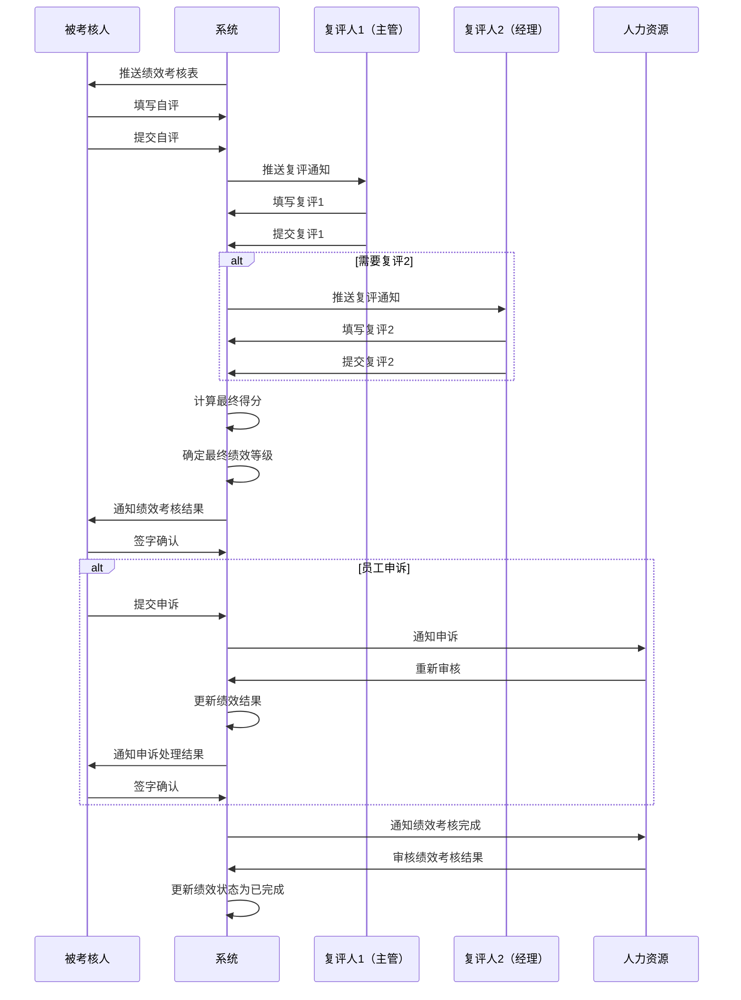

# 标准工时考核绩效表字段表

## 功能业务介绍
标准工时考核绩效表是标准工时绩效考核的执行记录，用于记录非生产线上办公室人员的月度绩效考核结果。该模块与标准工时考核细则关联，记录员工的自评、主管复评和经理复评得分，并根据权重自动计算最终得分和绩效等级。标准工时考核绩效表与绩效考核设置中的标准工时部分关联，最终绩效等级参考绩效评级设置中的等级标准。

## 业务流程

## 字段清单

### 一、统计信息

| 字段名称 | 类型 | 长度 | 约束条件 | 说明 |
|---------|------|------|----------|------|
| id | bigint | 20 | 是 | 绩效记录 ID，主键自增 |
| perf_month | date | - | 是 | 统计年月，示例值：2026-03 |
| emp_id | varchar | 30 | 是 | 被考核人工号，关联员工档案主表 |
| emp_name | varchar | 50 | 是 | 被考核人姓名，示例值：刘娜 |
| post_name | varchar | 100 | 是 | 所属岗位，示例值：品管部负责人 |
| assess_level | varchar | 20 | 是 | 考核级别，示例值：经理级 |
| rule_id | bigint | 20 | 是 | 关联标准工时考核细则 ID（外键） |

### 二、考核细则主表

| 字段名称 | 类型 | 长度 | 约束条件 | 说明 |
|---------|------|------|----------|------|
| main_item_name | varchar | 100 | 是 | 一级考核项目，示例值：重点工作 |
| main_item_weight | decimal | 5,2 | 是 | 一级项目权重 (%)，示例值：50 |

### 三、考核子项明细（子表，外键关联主表 id）

| 字段名称 | 类型 | 长度 | 约束条件 | 说明 |
|---------|------|------|----------|------|
| detail_id | bigint | 20 | 是 | 明细记录 ID，自增 |
| perf_record_id | bigint | 20 | 是 | 关联绩效主表 ID（外键） |
| sub_item_name | varchar | 100 | 是 | 考核子项名称，示例值：管理指标/团队建设 |
| sub_item_weight | decimal | 5,2 | 是 | 子项权重 (%)，示例值：15/10 |
| assess_content | text | - | 是 | 考核内容，示例值：杜绝质量/安全/环保责任事故；杜绝生产环节原因导致的外部投诉... |
| scoring_standard | text | - | 是 | 评分标准，示例值：满分20分；未达成的扣5分/项，不封顶 |
| self_score | decimal | 5,1 | 是 | 自评得分，示例值：15.0/14.0 |
| review1_score | decimal | 5,1 | 是 | 复评 1 得分，示例值：15/12 |
| review2_score | decimal | 5,1 | 否 | 复评 2 得分，示例值：0（未填写） |
| self_review_desc | text | - | 否 | 完成情况 / 具体说明，示例值：本月成品一次合格率为100%；本月协助客服中心处理市场反馈9起，均未形成正式投诉 |

### 四、小计与状态

| 字段名称 | 类型 | 长度 | 约束条件 | 说明 |
|---------|------|------|----------|------|
| self_total_score | decimal | 5,1 | 是 | 自评小计总分，示例值：49 |
| review1_total_score | decimal | 5,1 | 是 | 复评 1 小计总分，示例值：40 |
| review2_total_score | decimal | 5,1 | 否 | 复评 2 小计总分，示例值：0 |
| final_score | decimal | 5,1 | 否 | 最终得分，根据权重自动计算 |
| final_level | varchar | 10 | 否 | 最终绩效等级，关联绩效评级设置 |
| perf_status | varchar | 20 | 是 | 绩效状态：草稿/已提交/已审核/已完成 |

### 五、系统通用字段

| 字段名称 | 类型 | 长度 | 约束条件 | 说明 |
|---------|------|------|----------|------|
| create_time | datetime | - | 是 | 创建时间 |
| update_time | datetime | - | 是 | 更新时间 |
| creator | varchar | 50 | 是 | 创建人（被考核人） |
| reviewer1 | varchar | 50 | 否 | 复评人 1 |
| reviewer2 | varchar | 50 | 否 | 复评人 2 |
| employee_signature | varchar | 500 | 否 | 员工签字（签名图片路径） |
| appeal_status | varchar | 20 | 否 | 申诉状态：无/申诉中/申诉通过/申诉驳回 |
| appeal_content | text | - | 否 | 申诉内容 |
| appeal_time | datetime | - | 否 | 申诉时间 |
| appeal_result | text | - | 否 | 申诉处理结果 |

## 业务规则
1. **R01**: 统计信息中，绩效记录 ID、统计年月、被考核人工号、被考核人姓名、所属岗位、考核级别、关联标准工时考核细则 ID 为必填字段
2. **R02**: 考核细则主表中，一级考核项目、一级项目权重为必填字段
3. **R03**: 考核子项明细中，明细记录 ID、关联绩效主表 ID、考核子项名称、子项权重、考核内容、评分标准、自评得分、复评 1 得分为必填字段
4. **R04**: 小计与状态中，自评小计总分、复评 1 小计总分、绩效状态为必填字段
5. **R05**: 系统通用字段中，创建时间、更新时间、创建人为必填字段
6. **R06**: 标准工时考核绩效表与标准工时考核细则关联，考核项目和权重来自考核细则
7. **R07**: 最终得分根据自评、复评 1、复评 2 的权重自动计算
8. **R08**: 最终绩效等级关联绩效考核设置中的绩效评级设置
9. **R09**: 绩效状态包括：草稿、已提交、已审核、已完成
10. **R10**: 绩效考核结果生成后，需通知员工并由员工签字确认
11. **R11**: 员工对绩效结果有异议的，可提交申诉，申诉期间绩效状态暂停
12. **R12**: 申诉处理完成后，需重新通知员工签字确认绩效结果

## 业务状态
- **草稿**: 绩效考核表已创建但未提交
- **已提交**: 被考核人已提交自评，等待复评
- **已审核**: 复评人已完成复评，等待人力资源审核
- **已完成**: 绩效考核流程已完成，结果已确认