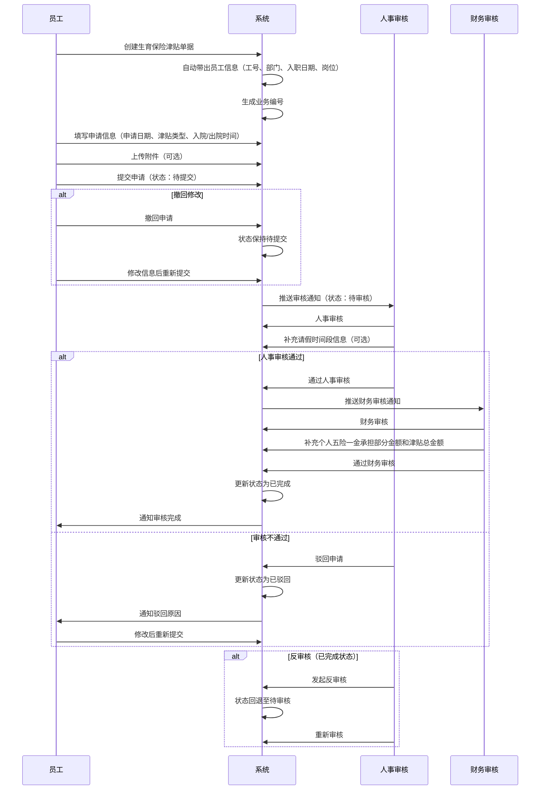
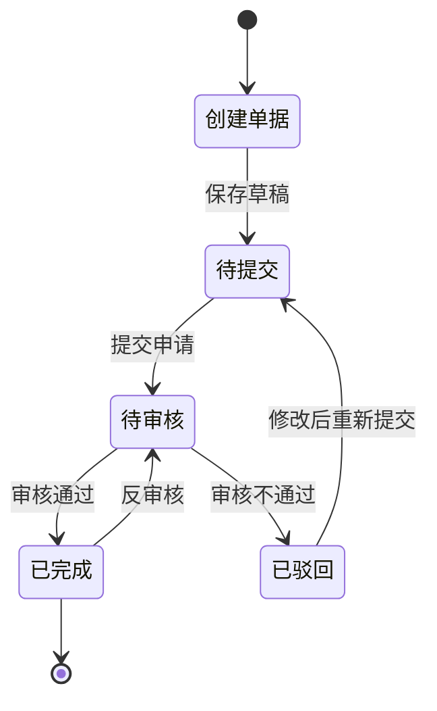

# 生育保险津贴管理字段表

## 一、业务概述

生育保险津贴管理模块用于管理员工生育保险津贴的申请和审核流程。该模块支持员工提交生育保险津贴申请，经过人事和财务审核后完成津贴发放。

**重要规则**：一个员工可以存在多条生育保险津贴信息。

## 二、业务流程图

## 三、状态流转图

## 四、状态操作权限表

| 序号 | 业务状态 | 可操作 |
| :--- | :--- | :--- |
| 1 | 待提交 | 详情、编辑、提交、删除 |
| 2 | 待审核 | 详情、审核 |
| 3 | 已完成 | 详情、反审核 |
| 4 | 已驳回 | 详情、编辑、提交、删除 |

## 五、字段清单

### 5.1 员工信息模块

| 序号 | 字段名称 | 类型 | 长度/精度 | 必填 | 说明/备注 |
| :--- | :--- | :--- | :--- | :--- | :--- |
| 1 | 申请员工 | 字符串 | 50 | 是 | 员工姓名，如 "袁建明" |
| 2 | 工号 | 字符串 | 20 | 否（系统带出） | 员工编号，如 "10012072" |
| 3 | 业务编号 | 字符串 | 20 | 否（系统生成） | 单据流水号，如 "SY260312001" |
| 4 | 部门 | 字符串 | 100 | 否（系统带出） | 所属部门，如 "储运采购部/储运采购部三车间/..." |
| 5 | 入职日期 | 日期 | - | 否（系统带出） | 员工入职日期，如 "2014-09-17" |
| 6 | 岗位 | 字符串 | 50 | 否（系统带出） | 员工岗位，如 "叉车司机" |

### 5.2 申请信息模块

| 序号 | 字段名称 | 类型 | 长度/精度 | 必填 | 说明/备注 |
| :--- | :--- | :--- | :--- | :--- | :--- |
| 7 | 申请日期 | 日期 | - | 是 | 申请提交日期，如 "2026-03-12" |
| 8 | 津贴类型 | 枚举（下拉） | 50 | 是 | 下拉选择，如 "男职工生育保险津贴" |
| 9 | 个人五险一金承担部分金额 | 数值 | (10,2) | 否 | 提示 "由财务审核时补充该信息" |
| 10 | 入院时间 | 日期 | - | 是 | 入院日期，如 "2026-02-13" |
| 11 | 出院时间 | 日期 | - | 是 | 出院日期，如 "2026-02-21" |
| 12 | 津贴总金额 | 数值 | (10,2) | 否 | 如 "4570.05"，提示 "由财务审核时补充该信息" |
| 13 | 请假时间段-开始时间 | 日期 | - | 否 | 如 "2026-02-22"，提示 "由人事审核时补充该信息" |
| 14 | 请假时间段-结束时间 | 日期 | - | 否 | 如 "2026-03-08"，提示 "由人事审核时补充该信息" |
| 15 | 业务状态 | 枚举 | - | 否（系统带出） | 状态示例："已完成" |
| 16 | 备注信息 | 文本 | 500 | 否 | 提示 "请输入备注信息（非必填）" |

### 5.3 附件信息模块

| 序号 | 字段名称 | 类型 | 长度/精度 | 必填 | 说明/备注 |
| :--- | :--- | :--- | :--- | :--- | :--- |
| 17 | 附件信息 | 附件上传 | - | 否 | 最多支持10个文件；单文件≤100M；支持格式：jpg、png、gif、jpeg、pdf、zip、rar、docx、doc、xlsx、ppt、pptx、pptm、xls；示例附件：出生证明.jpg、结婚证.jpg |

## 六、业务规则

### R01 - 数据完整性规则
- 申请员工、申请日期、津贴类型、入院时间、出院时间为必填字段
- 员工信息（工号、部门、入职日期、岗位）由系统根据选择的员工自动带出

### R02 - 业务编号生成规则
- 业务编号格式：SY + 年份后两位 + 月份 + 日期 + 三位流水号
- 示例：SY260312001（2026年3月12日第1单）

### R03 - 状态流转规则
| 当前状态 | 操作 | 目标状态 | 说明 |
| :--- | :--- | :--- | :--- |
| 待提交 | 提交申请 | 待审核 | 进入审核流程 |
| 待提交 | 删除 | - | 直接删除单据 |
| 待审核 | 审核通过 | 已完成 | 人事和财务审核都通过 |
| 待审核 | 审核不通过 | 已驳回 | 人事或财务驳回 |
| 已驳回 | 编辑提交 | 待审核 | 修改后重新提交 |
| 已完成 | 反审核 | 待审核 | 允许撤销已完成的单据重新审核 |

### R04 - 审核流程规则
- **人事审核**：负责审核申请信息真实性，可补充请假时间段信息
- **财务审核**：负责审核金额信息，需补充个人五险一金承担部分金额和津贴总金额
- 审核顺序：先经过人事审核，再经过财务审核

### R05 - 唯一性规则
- 一个员工可以存在多条生育保险津贴信息，无重复限制

### R06 - 附件上传规则
- 最多支持10个文件上传
- 单文件大小限制：≤100M
- 支持格式：jpg、png、gif、jpeg、pdf、zip、rar、docx、doc、xlsx、ppt、pptx、pptm、xls
- 常见附件：出生证明、结婚证等

## 七、更新记录

| 日期 | 修改内容 | 修改人 |
| :--- | :--- | :--- |
| 2026-05-06 | 初始创建，包含完整字段清单和业务流程 | 系统管理员 |