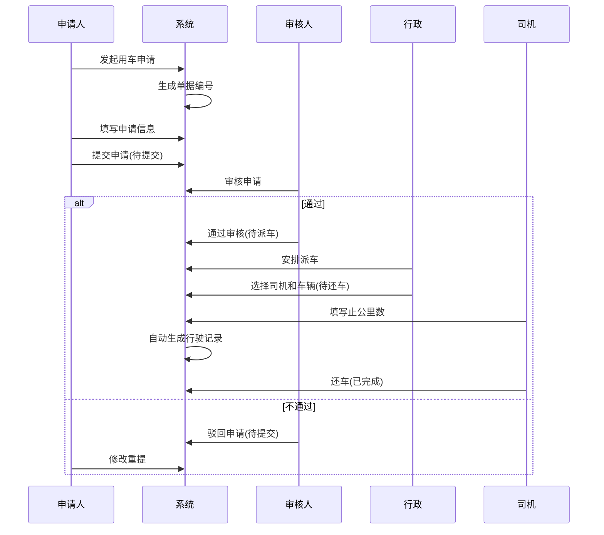

# 用车申请管理字段表

## 一、业务概述

用车申请管理模块用于管理公司车辆的使用申请和调度流程。支持内部人员和外部人员发起用车申请，完整流程如下：

**业务流程**：用车申请人发起申请 → 审核人审核 → 行政派车 → 司机还车（止公里数自动生成车辆行驶记录表）

**状态流转**：待提交 → 待审核 → 待派车 → 待还车 → 已完成

## 二、业务流程图

## 三、状态流转图

## 四、状态操作权限表

| 状态 | 操作 |
| :--- | :--- |
| 待提交 | 详情、编辑、提交审批、删除 |
| 待审核 | 详情、审批 |
| 待派车 | 详情、安排派车 |
| 待还车 | 详情、还车 |
| 已完成 | 详情、复制、反审 |

## 五、字段清单

| 序号 | 字段名称 | 类型 | 必填 | 说明/备注 |
| :--- | :--- | :--- | :--- | :--- |
| 1 | 单据编号 | 文本 | 是 | 示例：SQ260507001，系统自动生成 |
| 2 | 申请类型 | 单选 | 是 | 选项：内部/外部，示例：内部 |
| 3 | 申请人 | 文本 | 是 | 示例：罗莲芳 |
| 4 | 申请部门 | 文本 | 是 | 示例：人事行政部 > 人事行政部办公室 |
| 5 | 用车人 | 文本 | 是 | 示例：罗莲芳 |
| 6 | 用车人类型 | 单选 | 是 | 选项：内部/外部，示例：内部 |
| 7 | 用车人电话 | 文本 | 是 | 示例：18371524526 |
| 8 | 市内/外用车 | 下拉/单选 | 是 | 选项：市内/市外，示例：市内 |
| 9 | 用车事由 | 文本 | 是 | 示例：昨晚送领导们外出办事的用车补报申请 |
| 10 | 行驶路线 | 文本 | 是 | 示例：公司 - 面里花园 - 公司 |
| 11 | 用车起始时间 | 日期时间 | 是 | 示例：2026-05-06 17:50 |
| 12 | 用车结束时间 | 日期时间 | 是 | 示例：2026-05-06 20:30 |
| 13 | 用车时长(H) | 数值 | 是 | 示例：2.7，系统可自动计算 |
| 14 | 乘车人数 | 数值 | 是 | 示例：9 |
| 15 | 星期几 | 文本 | 是 | 示例：星期三，可根据日期自动生成 |
| 16 | 用车备注 | 文本域 | 否 | 非必填 |
| 17 | 用车附件 | 文件上传 | 否 | 最多支持10个，格式限制：jpg/png/gif/jpeg/pdf/zip/rar/doc/docx/xls/xlsx/ppt/pptx/pptm/xls，单文件≤100M |
| 18 | 状态 | 文本 | 是 | 示例：待派车，系统状态字段 |
| 19 | 出车司机 | 文本/人员选择 | 是 | 需选择出车司机 |
| 20 | 派遣车辆号牌 | 下拉/文本 | 是 | 需选择/填写车辆号牌 |
| 21 | 其他要求 | 文本域 | 否 | 非必填 |
| 22 | 止公里数 | 数值 | 是 | 单位：km |
| 23 | 还车备注 | 文本域 | 否 | 非必填 |
| 24 | 操作日志 | 系统模块 | - | 记录申请的操作记录 |
| 25 | 审批流程 | 系统模块 | - | 记录审批节点与状态 |

## 六、业务规则

### R01 - 数据完整性规则
- **必填字段**：单据编号(系统生成)、申请类型、申请人、申请部门、用车人、用车人类型、用车人电话、市内/外用车、用车事由、行驶路线、用车起始时间、用车结束时间、用车时长、乘车人数、星期几、状态、出车司机、派遣车辆号牌、止公里数

### R02 - 单据编号生成规则
- 格式：SQ + 年份后两位 + 月份 + 日期 + 三位流水号
- 示例：SQ260507001（2026年5月7日第1单）

### R03 - 申请类型规则
- **内部**：公司内部员工申请用车
- **外部**：外部人员申请用车

### R04 - 用车人类型规则
- **内部**：公司内部员工用车
- **外部**：外部人员用车

### R05 - 自动计算规则
- **用车时长**：根据用车起始时间和结束时间自动计算
- **星期几**：根据用车起始日期自动生成

### R06 - 状态流转规则
| 当前状态 | 操作 | 目标状态 | 说明 |
| :--- | :--- | :--- | :--- |
| 待提交 | 提交审批 | 待审核 | 进入审核流程 |
| 待审核 | 审批通过 | 待派车 | 审核通过，等待派车 |
| 待审核 | 审批不通过 | 待提交 | 驳回修改 |
| 待派车 | 安排派车 | 待还车 | 指派司机和车辆 |
| 待还车 | 还车 | 已完成 | 填写止公里数，完成还车 |
| 已完成 | 反审 | 待审核 | 撤销重新审核 |

### R07 - 行驶记录生成规则
- 司机还车时填写的止公里数自动生成车辆行驶记录表
- 行驶记录表包含：单据编号、车辆号牌、司机、用车时间、行驶路线、止公里数等信息

### R08 - 附件上传规则
- 最多支持10个文件上传
- 单文件大小限制：≤100M
- 支持格式：jpg、png、gif、jpeg、pdf、zip、rar、doc、docx、xls、xlsx、ppt、pptx、pptm

## 七、更新记录

| 日期 | 修改内容 | 修改人 |
| :--- | :--- | :--- |
| 2026-05-07 | 初始创建，包含完整字段清单和业务流程 | 系统管理员 |