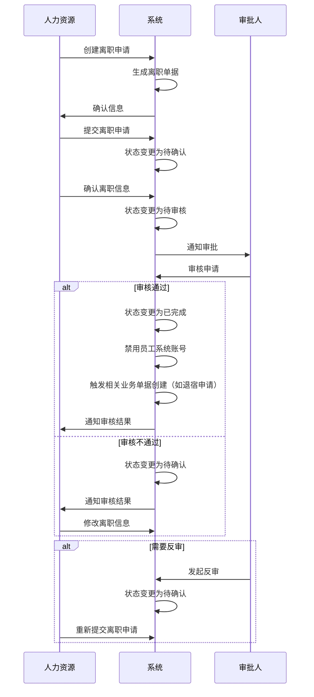

# 离职管理字段表

## 功能业务介绍
离职管理模块用于记录和管理员工的离职信息，包括员工基础信息、离职申请信息、附件信息和系统通用字段，支持离职流程的全生命周期管理，从创建离职到待确认、待审核、已完成的状态流转，并提供反审功能。离职完成后系统会自动禁用员工系统账号，并触发相关业务单据的创建，如退宿申请等。

## 业务流程

## 字段清单

| 字段名称 | 类型 | 长度 | 约束条件 | 说明 |
|---------|------|------|----------|------|
| emp_name | varchar | 50 | 是 | 离职人员姓名，示例值：刘恒 |
| emp_id | varchar | 50 | 是 | 工号，示例值：10040277 |
| leave_no | varchar | 50 | 是 | 离职编号，示例值：LZ20260416001 |
| dept_name | varchar | 100 | 否 | 部门，示例值：食堂班 |
| hire_date | date | - | 否 | 入职日期，示例值：2025-09-02 |
| position_name | varchar | 200 | 否 | 职位全称，示例值：湖北生产基地人事行政部食堂班厨师 |
| employ_type | varchar | 50 | 否 | 用工形式，示例值：合同用工 |
| apply_date | date | - | 是 | 申请日期，示例值：2026-02-28 |
| expected_leave_date | date | - | 是 | 预计离职日期，示例值：2026-02-28 |
| leave_type | varchar | 50 | 否 | 离职类型，示例值：自动离职 |
| leave_reason | varchar | 50 | 是 | 离职原因，示例值：个人原因 |
| leave_remark | text | - | 否 | 离职原因备注（非必填） |
| hr_auditor | varchar | 50 | 是 | HR 审批人，示例值：余茜 |
| creator | varchar | 50 | 否 | 创建人，示例值：余茜 |
| leave_attach | varchar | 500 | 否 | 离职附件信息，存储文件路径；最多支持 10 个，单文件≤100M，支持格式：jpg、png、gif、jpeg、pdf、zip、rar、docx、doc、xlsx、ppt、pptx、pptm、xls |
| id | bigint | 20 | 是 | 主键 ID，自增 |
| create_time | datetime | - | 是 | 创建时间 |
| update_time | datetime | - | 是 | 更新时间 |
| updater | varchar | 50 | 否 | 更新人 |

## 业务规则
1. **R01**: 离职人员姓名、工号、离职编号、申请日期、预计离职日期、离职原因、HR审批人、主键ID、创建时间、更新时间为必填字段
2. **R02**: 离职状态流转规则：待确认→待审核→已完成，审核不通过则返回待确认状态
3. **R03**: 支持反审功能，已完成状态可反审回待确认状态
4. **R04**: 离职附件限制：最多支持 10 个，单文件≤100M，支持格式：jpg、png、gif、jpeg、pdf、zip、rar、docx、doc、xlsx、ppt、pptx、pptm、xls
5. **R05**: 离职状态变更为已完成后，系统自动禁用员工系统账号
6. **R06**: 离职状态变更为已完成后，系统自动触发相关业务单据的创建，如退宿申请等

## 业务状态
- **待确认**: 初始状态，离职信息已创建但未确认
- **待审核**: 离职信息已确认，等待HR审批
- **已完成**: 审核通过，离职流程完成
  - 系统自动禁用员工系统账号
  - 系统自动触发相关业务单据的创建，如退宿申请等