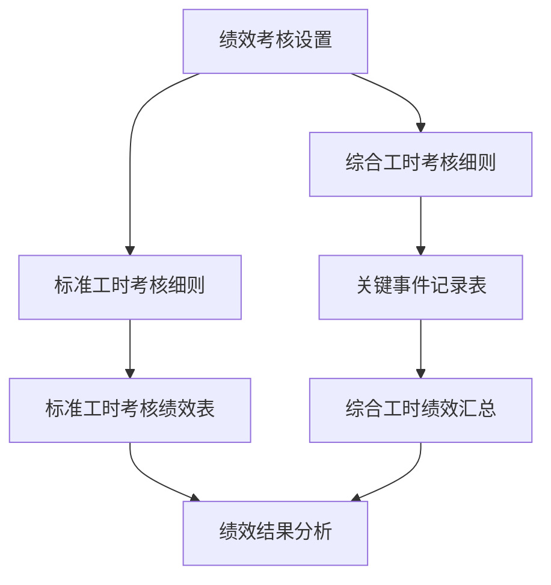
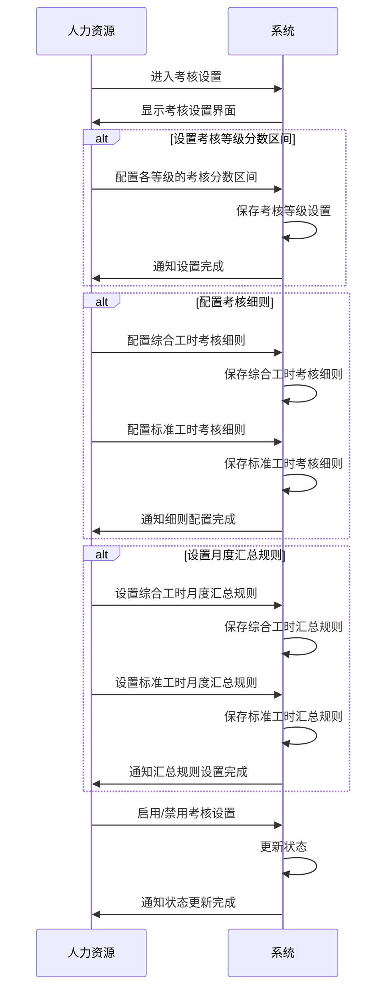
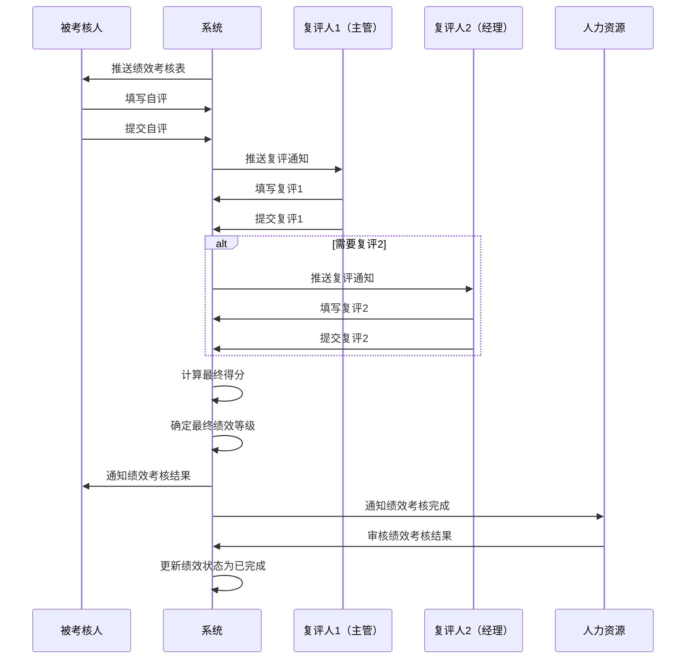
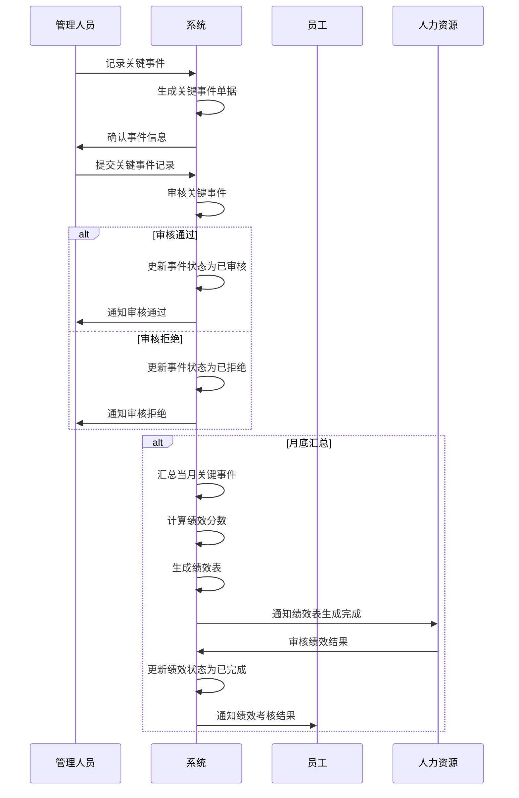

# 绩效管理业务说明

## 1. 业务概述

绩效管理模块是人力资源管理系统的核心组成部分，用于实现对员工绩效的全面管理和评估。该模块支持两种绩效考核模式：综合工时绩效考核（面向生产线上的一线操作员工）和标准工时绩效考核（面向非生产线上的办公室人员），通过完整的考核设置、执行和汇总流程，确保绩效考核的公平性、公正性和透明性。

## 2. 业务架构

### 2.1 核心模块

| 模块名称 | 功能描述 | 适用对象 |
|---------|---------|----------|
| 绩效考核设置 | 配置考核等级分数区间、考核细则和月度汇总规则 | 人力资源管理人员 |
| 标准工时考核细则 | 定义办公室人员的三级考核项目和评分标准 | 人力资源管理人员 |
| 标准工时考核绩效表 | 记录办公室人员的月度绩效考核结果 | 办公室人员、主管、经理 |
| 综合工时考核细则 | 定义生产一线员工的加减分项标准 | 人力资源管理人员 |
| 关键事件记录表 | 记录生产一线员工的关键事件（加减分项） | 生产管理人员 |

### 2.2 模块关系

## 3. 业务流程

### 3.1 绩效考核设置流程

### 3.2 标准工时考核流程

### 3.3 综合工时考核流程

## 4. 核心功能

### 4.1 绩效考核设置

- **考核等级设置**：配置不同绩效等级的分数区间和所占比例
- **考核细则配置**：
  - 标准工时：配置三级考核项目、权重和评分标准
  - 综合工时：配置加减分项的具体标准和分值
- **月度汇总规则**：
  - 标准工时：设置推送日期、复评流程和权重分配
  - 综合工时：设置汇总周期和部门岗位规则

### 4.2 标准工时考核

- **绩效表生成**：根据考核细则自动生成绩效考核表
- **自评与复评**：支持员工自评、主管复评和经理复评
- **分数计算**：根据权重自动计算最终得分
- **绩效评级**：根据得分自动确定绩效等级

### 4.3 综合工时考核

- **关键事件记录**：实时记录员工的加减分项
- **事件审核**：对关键事件进行审核，确保真实性
- **月度汇总**：汇总当月所有关键事件，计算绩效分数
- **绩效评级**：根据得分自动确定绩效等级

## 5. 业务规则

### 5.1 通用规则

- **考核周期**：月度考核，每月生成一次绩效表
- **绩效等级**：根据得分区间确定等级（A/B+/B/B-/C）
- **结果应用**：绩效考核结果作为薪酬调整、晋升和培训的重要依据

### 5.2 标准工时考核规则

- **考核项目**：采用三级结构（一级项目、二级子项、三级子项）
- **权重设置**：各级项目权重之和为100%
- **复评流程**：根据岗位级别确定是否需要多级复评
- **评分标准**：每个考核项目都有明确的评分标准

### 5.3 综合工时考核规则

- **关键事件**：发生加减分项时及时记录
- **审核机制**：关键事件需经过审核才能生效
- **基础分**：设定考核基础分，根据关键事件进行加减
- **汇总计算**：月底汇总所有关键事件，计算最终得分

## 6. 数据流转

### 6.1 标准工时数据流转

1. 人力资源配置标准工时考核细则
2. 系统根据考核细则生成月度绩效考核表
3. 员工填写自评
4. 主管/经理进行复评
5. 系统计算最终得分和绩效等级
6. 人力资源审核绩效结果
7. 绩效结果同步到员工档案

### 6.2 综合工时数据流转

1. 人力资源配置综合工时考核细则
2. 管理人员记录关键事件
3. 系统审核关键事件
4. 月底系统汇总关键事件，计算绩效分数
5. 系统确定绩效等级
6. 人力资源审核绩效结果
7. 绩效结果同步到员工档案

## 7. 系统集成

- **员工档案**：绩效结果同步到员工档案，作为员工历史绩效记录
- **薪酬管理**：绩效等级作为薪酬调整的依据
- **培训管理**：根据绩效结果识别培训需求
- **晋升管理**：绩效结果作为晋升决策的重要参考

## 8. 业务价值

- **公平公正**：通过标准化的考核流程和明确的评分标准，确保绩效考核的公平性
- **数据驱动**：基于实际工作表现和关键事件，实现数据驱动的绩效评估
- **激励机制**：通过加减分项和绩效等级，建立有效的激励机制
- **持续改进**：通过绩效反馈，促进员工和组织的持续改进
- **决策支持**：为人力资源管理决策提供数据支持

## 9. 适用范围

- **标准工时考核**：适用于非生产线上的办公室人员，如管理人员、行政人员、技术人员等
- **综合工时考核**：适用于生产线上的一线操作员工，如操作工、技术员、质检员等

## 10. 实施建议

1. **前期准备**：
   - 明确考核目标和指标体系
   - 制定详细的考核细则和评分标准
   - 培训相关人员熟悉考核流程

2. **实施步骤**：
   - 配置考核设置和细则
   - 试运行考核流程
   - 收集反馈并优化
   - 正式实施

3. **持续优化**：
   - 定期 review 考核细则的有效性
   - 根据业务变化调整考核指标
   - 不断完善考核流程和方法

通过以上业务流程和功能，绩效管理模块能够为组织提供全面、客观、公正的绩效考核体系，促进员工绩效提升和组织目标实现。