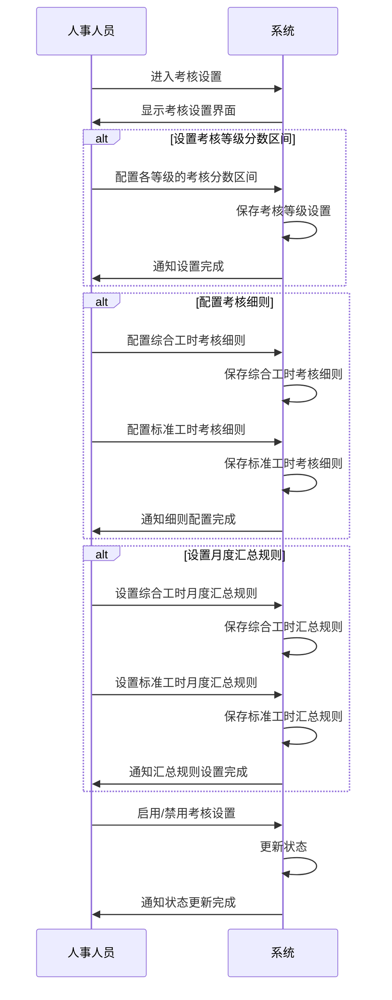

# 绩效考核设置字段表

## 功能业务介绍
绩效考核设置模块用于配置和管理基地的绩效考核体系，包括设置考核等级分数区间、配置考核细则和设置月度汇总规则。基地的绩效考核分为综合工时绩效考核（面向生产线上的一线操作员工）和标准工时绩效考核（面向非生产线上的办公室人员），支持绩效考核的全生命周期管理。

## 业务流程

## 字段清单

### 一、绩效评级主表

| 字段名称 | 类型 | 长度 | 约束条件 | 说明 |
|---------|------|------|----------|------|
| id | bigint | 20 | 是 | 主键 ID，自增 |
| perf_type | tinyint | 1 | 是 | 所属绩效大类：1 = 综合工时，2 = 标准工时 |
| perf_level_name | varchar | 50 | 是 | 绩效评级名称，示例值：综合工时 |
| base_score | int | 3 | 是 | 考核基础分，示例值：76 |
| type_color | varchar | 10 | 是 | 类型颜色（十六进制），示例值：#815799 |
| apply_posts | text | - | 是 | 适用岗位（逗号分隔），示例值：操作工 - SM, 操作工 - CL... |
| status | tinyint | 1 | 是 | 状态：1 = 启用，0 = 禁用 |
| sort | int | 3 | 是 | 显示顺序，数值越大越靠前 |
| remark | varchar | 100 | 否 | 备注信息 |

### 二、绩效分段规则（子表）

| 字段名称 | 类型 | 长度 | 约束条件 | 说明 |
|---------|------|------|----------|------|
| rule_id | bigint | 20 | 是 | 分段规则 ID，自增 |
| perf_level_id | bigint | 20 | 是 | 关联绩效评级主表 ID（外键） |
| min_score | int | 3 | 是 | 分段最低分，示例值：0 |
| min_operator | varchar | 5 | 是 | 下限运算符（<=/<） |
| max_score | int | 3 | 是 | 分段最高分，示例值：75 |
| max_operator | varchar | 5 | 是 | 上限运算符（</<=） |
| result_level | varchar | 10 | 是 | 考核结果等级，示例值：C/B-/B/B+/A |
| proportion | int | 3 | 是 | 所占比例 (%)，示例值：10/40/20 |
| rule_remark | varchar | 100 | 否 | 分段备注信息 |

### 三、细则类型表

| 字段名称 | 类型 | 长度 | 约束条件 | 说明 |
|---------|------|------|----------|------|
| id | bigint | 20 | 是 | 主键 ID，自增 |
| rule_type_name | varchar | 50 | 是 | 细则类型名称，示例值：劳动工艺纪律类 |
| type_color | varchar | 10 | 是 | 类型颜色（十六进制），示例值：#999FC1 |
| status | tinyint | 1 | 是 | 状态：1 = 启用，0 = 禁用 |
| sort | int | 3 | 是 | 显示顺序，数值越大越靠前 |
| remark | varchar | 100 | 否 | 备注信息 |

### 四、综合工时月度绩效汇总规则

| 字段名称 | 类型 | 长度 | 约束条件 | 说明 |
|---------|------|------|----------|------|
| id | bigint | 20 | 是 | 主键 ID，自增 |
| rule_name | varchar | 100 | 是 | 月度绩效汇总规则名称，示例值：A班月度绩效汇总规则 |
| cross_month | tinyint | 1 | 是 | 汇总周期：1 = 跨月，0 = 不跨月 |
| cycle_start_day | int | 2 | 是 | 当月起始日，示例值：1 |
| cycle_end_day | int | 2 | 是 | 当月结束日，示例值：31 |
| remind_days | int | 3 | 否 | 超过汇总日期 N 天未签字，触发催办消息 |
| status | tinyint | 1 | 是 | 状态：1 = 启用，0 = 禁用 |
| sort | int | 3 | 是 | 显示顺序，数值越大越靠前 |
| remark | varchar | 100 | 否 | 备注信息 |

### 五、部门岗位规则明细（子表）

| 字段名称 | 类型 | 长度 | 约束条件 | 说明 |
|---------|------|------|----------|------|
| detail_id | bigint | 20 | 是 | 明细 ID，自增 |
| rule_id | bigint | 20 | 是 | 关联汇总规则主表 ID（外键） |
| dept_path | varchar | 200 | 是 | 绩效汇总部门（完整路径），示例值：生产部/一车间/A班 |
| posts | text | - | 是 | 绩效汇总岗位（逗号分隔），示例值：操作工 - SM, 操作工 - SCL... |
| detail_remark | varchar | 100 | 否 | 明细备注 |

### 六、标准工时月度绩效汇总规则

| 字段名称 | 类型 | 长度 | 约束条件 | 说明 |
|---------|------|------|----------|------|
| id | bigint | 20 | 是 | 主键 ID，自增 |
| rule_name | varchar | 100 | 是 | 月度绩效汇总规则名称，示例值：储运采购部考核汇总 |
| need_review | tinyint | 1 | 是 | 是否需上下级复评：1 = 需要，0 = 不需要 |
| push_date | int | 2 | 是 | 绩效考核推送日期（本月第 N 日），示例值：26 |
| remind_days | int | 3 | 是 | 超过推送日期 N 天未提交，触发催办消息，示例值：5 |
| self_weight | decimal | 5,2 | 是 | 自评占比 (%)，示例值：0 |
| review1_weight | decimal | 5,2 | 是 | 复评 1 占比 (%)，示例值：0 |
| review2_weight | decimal | 5,2 | 是 | 复评 2 占比 (%)，示例值：100 |
| status | tinyint | 1 | 是 | 状态：1 = 启用，0 = 禁用 |
| sort | int | 3 | 是 | 显示顺序，数值越大越靠前 |
| remark | varchar | 100 | 否 | 备注信息 |

### 七、考核级别规则明细（子表）

| 字段名称 | 类型 | 长度 | 约束条件 | 说明 |
|---------|------|------|----------|------|
| detail_id | bigint | 20 | 是 | 明细 ID，自增 |
| rule_id | bigint | 20 | 是 | 关联汇总规则主表 ID（外键） |
| level_type | varchar | 20 | 是 | 考核级别，示例值：员工级/主管级/经理级 |
| dept_path | varchar | 200 | 是 | 绩效汇总部门（完整路径），示例值：储运采购部/办公室 |
| posts | text | - | 是 | 绩效汇总岗位（逗号分隔），示例值：SAP 专员，储运统计员... |
| detail_remark | varchar | 100 | 否 | 明细备注 |

## 业务规则
1. **R01**: 绩效评级主表中，所属绩效大类、绩效评级名称、考核基础分、类型颜色、适用岗位、状态、显示顺序为必填字段
2. **R02**: 绩效分段规则中，关联绩效评级主表 ID、分段最低分、下限运算符、分段最高分、上限运算符、考核结果等级、所占比例为必填字段
3. **R03**: 细则类型表中，细则类型名称、类型颜色、状态、显示顺序为必填字段
4. **R04**: 综合工时月度绩效汇总规则中，月度绩效汇总规则名称、汇总周期、当月起始日、当月结束日、状态、显示顺序为必填字段
5. **R05**: 部门岗位规则明细中，关联汇总规则主表 ID、绩效汇总部门、绩效汇总岗位为必填字段
6. **R06**: 标准工时月度绩效汇总规则中，月度绩效汇总规则名称、是否需上下级复评、绩效考核推送日期、超过推送日期 N 天未提交触发催办消息、自评占比、复评 1 占比、复评 2 占比、状态、显示顺序为必填字段
7. **R07**: 考核级别规则明细中，关联汇总规则主表 ID、考核级别、绩效汇总部门、绩效汇总岗位为必填字段
8. **R08**: 所属绩效大类枚举值为：1 = 综合工时，2 = 标准工时
9. **R09**: 状态枚举值为：1 = 启用，0 = 禁用
10. **R10**: 汇总周期枚举值为：1 = 跨月，0 = 不跨月
11. **R11**: 是否需上下级复评枚举值为：1 = 需要，0 = 不需要

## 业务状态
- **启用**: 考核设置处于激活状态，可用于绩效考核流程
- **禁用**: 考核设置处于非激活状态，暂不用于绩效考核流程