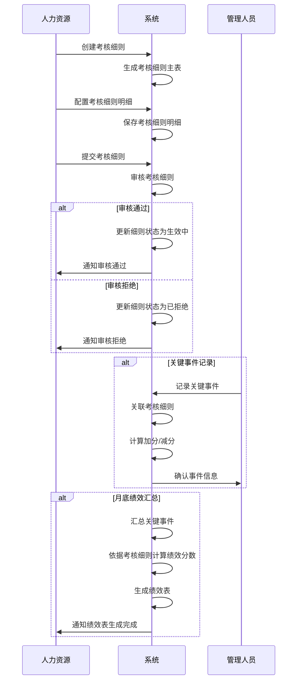

# 综合工时考核细则字段表

## 功能业务介绍
综合工时考核细则是关键事件扣分和加分的依据，用于定义综合工时绩效考核的标准和规则。该模块为关键事件记录提供考核依据，包括加分项和减分项的具体标准、分值和处理方案，确保绩效考核的一致性和公正性。通过考核细则的配置，可以实现对不同岗位员工的差异化考核，提高绩效考核的针对性和有效性。

## 业务流程

## 字段清单

### 一、基础信息

| 字段名称 | 类型 | 长度 | 约束条件 | 说明 |
|---------|------|------|----------|------|
| id | bigint | 20 | 是 | 主键 ID，自增 |
| rule_title | varchar | 100 | 是 | 考核细则标题，示例值：2026年人事行政部厨师考核细则 |
| rule_no | varchar | 50 | 是 | 细则编号，示例值：XZ260121001 |
| apply_post | varchar | 100 | 是 | 适用岗位，示例值：厨师 |
| rule_remark | text | - | 否 | 考核细则备注信息 |
| rule_status | varchar | 20 | 是 | 细则状态，示例值：生效中 |
| rule_attach | varchar | 500 | 否 | 考核细则附件路径；支持最多 10 个文件，单文件≤100M，格式：jpg、png、gif、jpeg、pdf、zip、rar、docx、doc、xlsx、ppt、pptx、pptm、xls |

### 二、考核细则明细（子表，外键关联主表 id）

| 字段名称 | 类型 | 长度 | 约束条件 | 说明 |
|---------|------|------|----------|------|
| detail_id | bigint | 20 | 是 | 明细 ID，自增 |
| rule_id | bigint | 20 | 是 | 关联考核细则主表 ID（外键） |
| clause_no | varchar | 50 | 是 | 条款编号，示例值：否决项1/2.1 |
| detail_type | varchar | 50 | 是 | 细则类型，示例值：其他类/卫生类 |
| score_type | varchar | 20 | 是 | 加 / 扣分项，示例值：其他/加分项 |
| detail_content | text | - | 是 | 考核细则内容，示例值：无食品安全事故。发生一般事故本项不得分，重大事故一票否决，当月考核为C |
| score_standard | varchar | 20 | 是 | 分值标准，示例值：C/7 |
| handle_scheme | varchar | 50 | 否 | 处理方案 |
| detail_remark | varchar | 100 | 否 | 备注信息 |

### 三、系统通用字段

| 字段名称 | 类型 | 长度 | 约束条件 | 说明 |
|---------|------|------|----------|------|
| create_time | datetime | - | 是 | 创建时间 |
| update_time | datetime | - | 是 | 更新时间 |
| creator | varchar | 50 | 是 | 创建人 |
| updater | varchar | 50 | 否 | 更新人 |

## 业务规则
1. **R01**: 基础信息中，考核细则标题、细则编号、适用岗位、细则状态为必填字段
2. **R02**: 考核细则明细中，关联考核细则主表 ID、条款编号、细则类型、加/扣分项、考核细则内容、分值标准为必填字段
3. **R03**: 系统通用字段中，创建时间、更新时间、创建人为必填字段
4. **R04**: 细则状态包括：生效中、已过期、已废弃等
5. **R05**: 附件限制：支持最多 10 个文件，单文件≤100M，支持格式：jpg、png、gif、jpeg、pdf、zip、rar、docx、doc、xlsx、ppt、pptx、pptm、xls
6. **R06**: 综合工时考核细则是关键事件扣分和加分的依据，为关键事件记录提供考核标准
7. **R07**: 关键事件记录中的"依据考核细则"字段应关联到考核细则明细中的条款编号
8. **R08**: 关键事件记录中的"分数标准"字段应参考考核细则明细中的"分值标准"

## 业务状态
- **生效中**: 考核细则处于激活状态，可用于关键事件记录和绩效计算
- **已过期**: 考核细则已超过有效期，不再用于新的关键事件记录
- **已废弃**: 考核细则已被废弃，不再使用