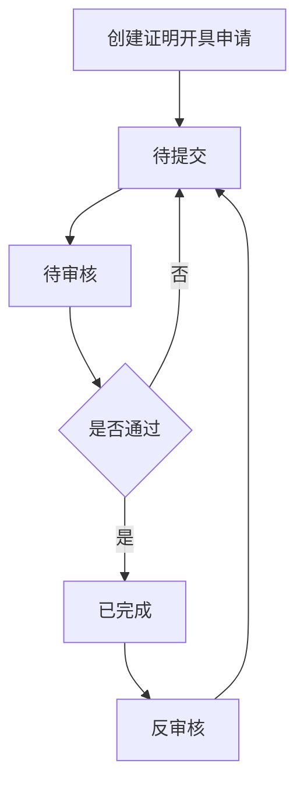
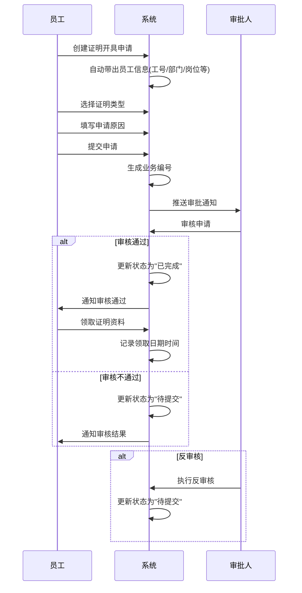

# 证明开具字段表

---

## 功能业务介绍

证明开具模块用于管理员工申请开具各类证明的业务流程。员工可以通过系统提交证明开具申请，选择证明类型并填写申请原因，经审核通过后完成证明开具。支持工作证明等多种证明类型，记录完整的申请、审核和领取流程。

---

## 业务流程

---

## 字段清单

### 一、员工信息模块

| 序号 | 字段名称 | 类型 | 长度/精度 | 必填 | 说明/备注 |
|:---:|---------|------|:--------:|:---:|----------|
| 1 | 员工名称 | 字符串 | 50 | 是 | 员工姓名，如 "陈凯" |
| 2 | 工号 | 字符串 | 20 | 否（系统带出） | 员工编号，如 "10002335" |
| 3 | 业务编号 | 字符串 | 20 | 否（系统生成） | 单据流水号，如 "ZM260331001" |
| 4 | 部门 | 字符串 | 100 | 否（系统带出） | 所属部门，如 "生产部 / 生产部一车间 / 生产部一" |
| 5 | 入职日期 | 日期 | - | 否（系统带出） | 员工入职日期，如 "2010-05-04" |
| 6 | 岗位 | 字符串 | 50 | 否（系统带出） | 员工岗位，如 "操作工 - XJ" |

### 二、申请信息模块

| 序号 | 字段名称 | 类型 | 长度/精度 | 必填 | 说明/备注 |
|:---:|---------|------|:--------:|:---:|----------|
| 7 | 申请日期 | 日期 | - | 是 | 申请提交日期，如 "2026-03-31" |
| 8 | 证明类型 | 枚举（下拉） | 50 | 否 | 下拉选择，如 "工作证明" |
| 9 | 证明资料领取日期 | 日期时间 | - | 否 | 资料领取的日期时间，如 "2026-04-01 11:46" |
| 10 | 申请原因 | 文本 | 1000 | 是 | 申请开具证明的原因说明，如 "报考电工证所需材料" |
| 11 | 业务状态 | 枚举 | - | 否（系统带出） | 状态：已完成/处理中/待审核等，示例值 "已完成" |
| 12 | 申请备注 | 文本 | 1000 | 否 | 补充说明信息，如 "申请低压电工特种作业操作证，需公司开具工作证明" |

### 三、附件信息模块

| 序号 | 字段名称 | 类型 | 长度/精度 | 必填 | 说明/备注 |
|:---:|---------|------|:--------:|:---:|----------|
| 13 | 附件信息 | 附件上传 | - | 否 | 最多支持10个文件；单文件≤100M；支持格式：jpg、png、gif、jpeg、pdf、zip、rar、docx、doc、xlsx、ppt、pptx、pptm、xls；示例附件 "职业技能等级认定工作年限证明.docx" |

---

## 业务规则

### R01 - 员工信息规则
- 员工名称为必填字段，最大长度50字符
- 工号、部门、入职日期、岗位由系统从员工档案自动带出，不可手动修改

### R02 - 业务编号规则
- 业务编号由系统自动生成，格式为"ZM + 年份后两位 + 月份 + 日期 + 流水号"
- 例如：ZM260331001（2026年3月31日第1号证明开具单）

### R03 - 申请信息规则
- 申请日期为必填字段，默认为系统当前日期
- 申请原因为必填字段，最大长度1000字符
- 证明类型为下拉选择，支持扩展多种类型

### R04 - 状态流转规则
- 状态流转顺序：待提交 → 待审核 → 已完成
- 待提交状态可进行编辑和提交操作
- 待审核状态仅审批人可操作（通过/拒绝）
- 已完成状态支持反审核操作退回待提交

### R05 - 附件规则
- 支持的文件格式：jpg、png、gif、jpeg、pdf、zip、rar、docx、doc、xlsx、ppt、pptx、pptm、xls
- 单个文件大小不超过100MB
- 最多支持上传10个附件

---

## 业务状态

| 状态名称 | 说明 | 触发条件 | 可执行操作 |
|---------|------|---------|-----------|
| 待提交 | 申请信息已填写但未提交 | 创建申请后 | 编辑、提交、删除 |
| 待审核 | 申请已提交，等待审批 | 员工提交申请 | 审核通过、审核拒绝 |
| 已完成 | 审核通过，证明已开具 | 审批人审核通过 | 查看详情、反审核、记录领取日期 |

---

## 更新记录

| 更新时间 | 更新内容 | 更新人 |
|---------|---------|--------|
| 2026-05-06 | 首次创建证明开具字段表 | 系统生成 |
