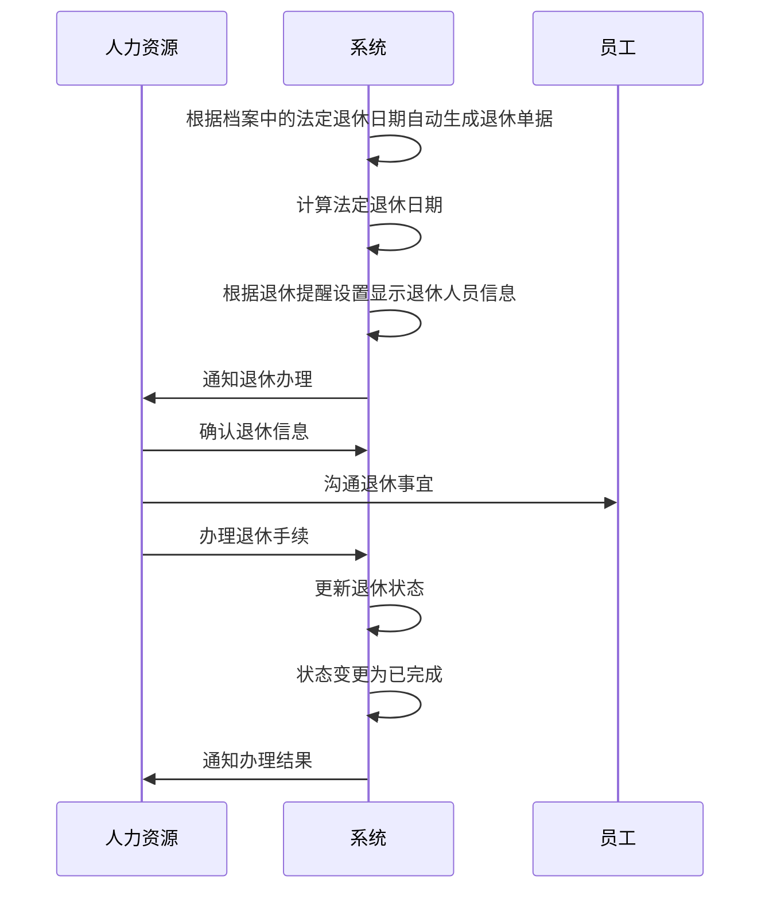

# 退休管理字段表

## 功能业务介绍
退休管理模块用于记录和管理员工的退休信息，包括员工基础信息、退休核心信息和系统通用字段，支持退休流程的全生命周期管理，包括退休提醒、退休手续办理和退休状态管理。退休单据是系统自动根据档案中的法定退休日期字段生成的，无需手动创建。同时提供基于退休提醒设置和法定退休日期的显示规则，确保符合条件的退休人员信息能够及时展示。

## 业务流程

## 字段清单

| 字段名称 | 类型 | 长度 | 约束条件 | 说明 |
|---------|------|------|----------|------|
| emp_id | varchar | 30 | 是 | 工号，示例值：10006392 |
| emp_name | varchar | 50 | 否 | 姓名，示例值：张珺 |
| hire_date | date | - | 否 | 入职日期，示例值：2003-03-25 |
| gender | tinyint | 1 | 是 | 性别：1 = 男，2 = 女，示例值：女 |
| dept_name | varchar | 100 | 否 | 部门，示例值：储运采购部 |
| position_name | varchar | 200 | 否 | 职位全称，示例值：湖北生产基地储运采购部车间仓储保洁 |
| birth_date | date | - | 否 | 出生日期，示例值：1975-08-10 |
| age | int | 3 | 否 | 年龄，示例值：51，可由出生日期自动计算 |
| employ_type | varchar | 50 | 否 | 用工信息，示例值：合同用工 |
| factory_dept | varchar | 100 | 是 | 数智工厂部门，示例值：储运采购部二车间仓储部 |
| factory_post | varchar | 100 | 是 | 数智工厂岗位，示例值：仓库保洁员 |
| statutory_retire_date | date | - | 否 | 法定退休日期，示例值：2025-12-31 |
| handle_result | varchar | 50 | 是 | 处置结果，示例值：办理退休手续 |
| actual_retire_date | date | - | 是 | 实际退休日期，示例值：2025-12-31 |
| retire_status | varchar | 20 | 否 | 退休状态，示例值：已完成 |
| id | bigint | 20 | 是 | 主键 ID，自增 |
| create_time | datetime | - | 是 | 创建时间 |
| update_time | datetime | - | 是 | 更新时间 |
| creator | varchar | 50 | 是 | 创建人 |
| updater | varchar | 50 | 否 | 更新人 |

## 业务规则
1. **R01**: 工号、性别、数智工厂部门、数智工厂岗位、处置结果、实际退休日期、主键ID、创建时间、更新时间、创建人为必填字段
2. **R02**: 年龄字段可由出生日期自动计算
3. **R03**: 退休单据是系统自动根据档案中的法定退休日期字段生成的，无需手动创建
4. **R04**: 显示规则：
   - 根据退休提醒设置的时间，结合法定退休日期字段在列表中显示退休人员信息，不符合条件的不显示
   - 员工状态=正式
   - 法定退休日期：如果当前时间小于法定退休日期，则显示【临近】；如果当前时间大于法定退休日期，则显示【已过】
5. **R05**: 性别枚举值为：1 = 男，2 = 女

## 业务状态
- **待处理**: 初始状态，退休信息已创建但未处理
- **处理中**: 正在办理退休手续
- **已完成**: 退休手续办理完成