# 招聘管理

> **字段字典**：完整字段清单、约束与业务规则见 [[招聘管理字段表]]。  
> **操作手册**：见第二章 **2.3 操作手册**（附于业务流程图下方）。  
> **系统路径**：人事行政 → 人事管理 → 招聘管理  
> **页面路由**：`#/administration-manage/index10/index107/invite-administration`  
> **流程标识（workKey）**：`hr_recruit`

---

## 一、功能业务介绍

招聘管理用于登记、筛选、面试、背调及归档应聘人员信息，是「招聘 → 入职」的数据源头。人力资源部门可在此完成应聘报名录入、简历初筛、面试评估、背调确认，并在录用后通过「办理入职」流转至 [[入职管理]]。

本表单与 [[招聘设置]]（招聘信息来源）、[[员工岗位管理]]（应聘职务字典）衔接；列表支持按应聘日期、招聘状态、应聘者姓名筛选，并提供「新增应聘报名」「设置招聘初筛负责人」「应聘报名二维码」「导出数据」等操作。

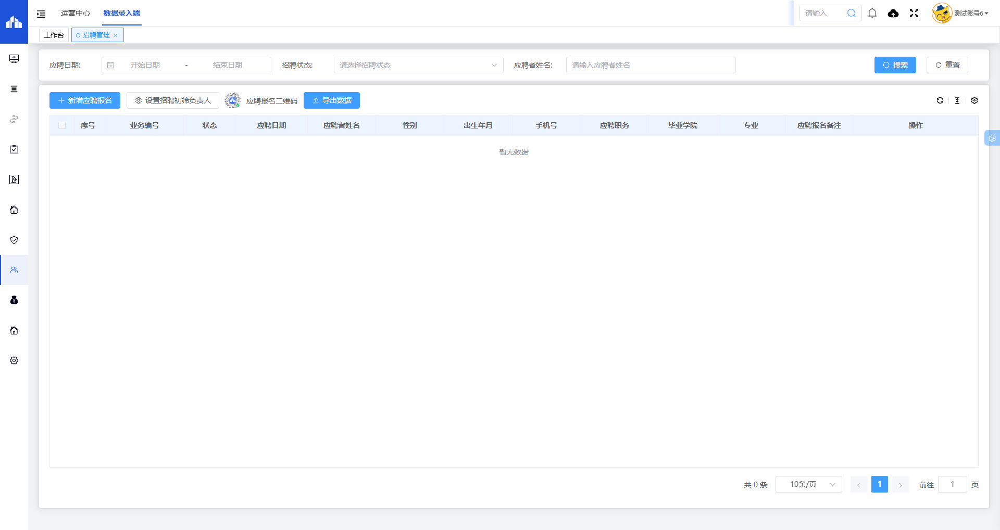

---

## 二、业务流程与审批链条

招聘管理采用**「单据审批 + 招聘环节」双层机制**：第一层为通用工作流（待提交/待审核等），第二层为招聘业务状态（待筛选/待面试/背调等）。列表「状态」列展示当前所处节点。

### 2.1 实机招聘状态枚举（贵州基地）

以下状态取自系统「招聘状态」筛选项实机数据：

| 分类   | 状态值  | 含义            |
| ---- | ---- | ------------- |
| 单据审批 | 待提交  | 已保存未提交        |
| 单据审批 | 待审核  | 已提交，等待审批人处理   |
| 单据审批 | 已完成  | 审批通过（可进入招聘环节） |
| 单据审批 | 已驳回  | 审批未通过，需修改后重提  |
| 单据审批 | 已撤回  | 发起人主动撤回       |
| 招聘环节 | 待筛选  | 进入简历初筛队列      |
| 招聘环节 | 初筛淘汰 | 初筛未通过，流程终止    |
| 招聘环节 | 待面试  | 初筛通过，等待/进行面试  |
| 招聘环节 | 待评估  | 面试完成，等待评选结果   |
| 招聘环节 | 面试淘汰 | 面试评估未通过       |
| 招聘环节 | 待背调  | 面试通过，进行背景调查   |
| 招聘环节 | 背调淘汰 | 背调未通过         |
| 招聘环节 | 已归档  | 招聘流程结束，可办理入职  |

### 2.2 端到端业务流程图

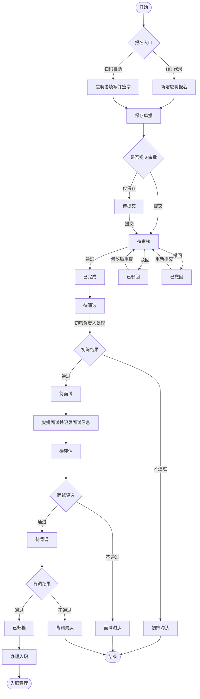

### 2.3 操作手册

本节按 **2.2 端到端业务流程图** 的主路径，逐步说明从打开招聘管理到单据办结（已归档并办理入职）的系统操作。字段填写细则见 [[招聘管理字段表]]；角色权限见第三章。

**适用说明**：贵州基地审批流程当前为「未配置」，提交后通常直接进入 **待筛选**；已配置 `hr_recruit` 审批节点的基地，在阶段四增加 **待审核** 环节。

---

#### 阶段 0：操作前准备

正式受理应聘报名前，建议完成以下配置，避免填表时无选项或无人处理初筛。

| 序号 | 准备项 | 菜单路径 | 操作要点 | 责任人 |
|------|--------|---------|---------|--------|
| 0.1 | 招聘信息来源 | 人事行政 → 人事管理 → [[招聘设置]] | 确认来源字典已启用 | HR 专员 |
| 0.2 | 应聘职务 | 人事行政 → 人事管理 → [[员工岗位管理]] | 确认目标岗位已维护且为「启用」 | HR 专员 |
| 0.3 | 招聘初筛负责人 | 招聘管理列表 → **设置招聘初筛负责人** | 在弹窗中选择负责人 → **确定** | HR 经理 / 管理员 |
| 0.4 | 审批流程（可选） | 设置 → 流程设置 → 行政人事管理 → 招聘管理 | 查看 `workKey=hr_recruit` 是否「已配置」 | 系统管理员 |

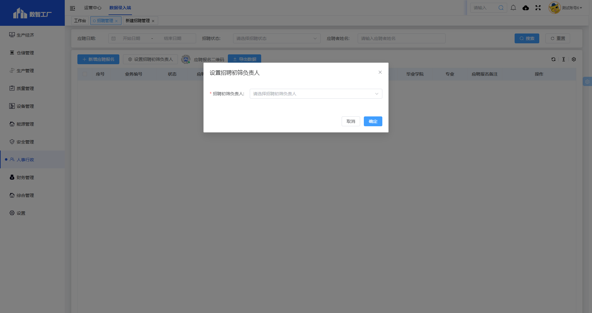

---

#### 阶段 1：进入招聘管理列表

| 步骤 | 所在界面 | 具体操作 | 预期结果 |
|------|---------|---------|---------|
| 1.1 | 系统顶栏 | 鼠标移至 **人事行政**，点击展开 | 左侧出现人事行政子菜单 |
| 1.2 | 左侧菜单 | 依次点击 **人事管理** → **招聘管理** | 打开招聘管理列表页 |
| 1.3 | 列表页 | 确认可见：**新增应聘报名**、**设置招聘初筛负责人**、**应聘报名二维码**、**导出数据** | 页面加载完成 |
| 1.4 | 浏览器地址 | 核对路由为 `#/administration-manage/index10/index107/invite-administration` | 进入正确模块 |

**列表搜索区用法**：可按应聘日期范围、招聘状态、应聘者姓名组合查询历史单据。

---

#### 阶段 2：新建应聘报名单

| 步骤 | 所在界面 | 具体操作 | 预期结果 |
|------|---------|---------|---------|
| 2.1 | 列表工具栏 | 点击 **新增应聘报名** | 跳转新建页，页签显示「新建招聘管理」 |
| 2.2 | 新建页地址栏 | 确认含 `detail?pageType=1` | 处于新增模式（非查看/编辑历史单） |
| 2.3 | 表单「单据编号」 | 观察字段为灰色禁用 | 保存后系统自动生成，如 ZP260626001 |

> **另一入口**：列表 **应聘报名二维码** 供应聘者扫码自助填报，提交后一般直接进入 **待筛选**，无需 HR 代录（见阶段 1 说明）。

---

#### 阶段 3：填写并保存报名表

新建页自上而下为 **员工信息 → 工作经历 → 家庭情况 → 郑重承诺/备注/附件** 四个区域。所有标 ★ 字段为必填；子表各至少一行。

**3.1 员工信息（主表）**

| 步骤 | 字段分组 | 操作说明 | 注意事项 |
|------|---------|---------|---------|
| 3.1.1 | 基本信息 | 填写 ★ 姓名、性别、籍贯、婚否、出生日期 | 与身份证一致 |
| 3.1.2 | 应聘信息 | 选择 ★ 应聘职务、填写 ★ 希望待遇（元） | 职务必须从 [[员工岗位管理]] 下拉选择 |
| 3.1.3 | 联系信息 | 填写 ★ 联系电话、★ 通信地址、★ 电子邮箱 | 手机号用于面试通知 |
| 3.1.4 | 证件信息 | 填写 ★ 身份证号 | 18 位，系统校验唯一性，不可重复登记 |
| 3.1.5 | 教育信息 | 填写 ★ 毕业院校、专业、最高学历、毕业日期、学校地点 | 与证书一致 |
| 3.1.6 | 其他 | ★ 政治面貌、★ 个人爱好、★ 招聘信息来源、★ 是否住宿 | 来源选自 [[招聘设置]] |
| 3.1.7 | 选填 | 户籍地址、最高职称、评定年份、工作专长、外语/等级 | 按实填写 |

**3.2 工作经历（子表）**

1. 展开「工作经历」折叠面板  
2. 点击 **新增**，填写一行：★ 单位名称、★ 职位、★ 开始/结束日期、★ 薪资待遇、★ 离职原因  
3. 有多段经历可重复 **新增**，建议按时间由近及远排列  

**3.3 家庭情况（子表）**

1. 展开「家庭情况」折叠面板  
2. 点击 **新增**，填写：★ 与本人关系、★ 姓名、★ 联系方式（紧急联系人）  
3. 年龄、政治面貌、工作单位、职位为选填  

**3.4 郑重承诺、备注与附件**

| 步骤 | 操作 | 说明 |
|------|------|------|
| 3.4.1 | 阅读「郑重承诺」只读文本 | 三条承诺条款不可编辑 |
| 3.4.2 | 点击 **点击签字** 完成 ★ 本人签字 | 电子签名必填；代录须应聘者授权 |
| 3.4.3 | 填写应聘备注（选填） | 最多 500 字 |
| 3.4.4 | 上传应聘附件（选填） | 最多 10 个；单文件 ≤100M；支持常见图片/文档格式 |

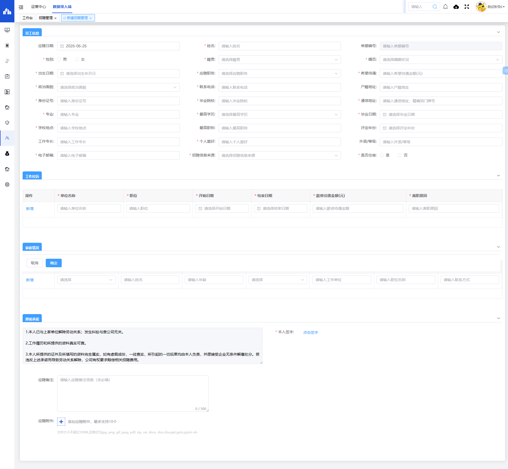

**3.5 保存单据**

| 步骤 | 操作 | 状态变化 | 说明 |
|------|------|---------|------|
| 3.5.1 | 点击底部 **确定** | — | 系统校验全部必填项与子表 |
| 3.5.2 | 校验通过 | **待提交** | 返回列表，「业务编号」「状态」列有值 |
| 3.5.3 | 点击 **取消** | — | 不保存，直接返回列表 |

**常见保存失败原因**：必填项漏填、子表无行、未完成本人签字、身份证号重复。

---

#### 阶段 4：提交单据（待提交 → 待审核 / 待筛选）

| 步骤 | 所在界面 | 具体操作 | 状态变化 |
|------|---------|---------|---------|
| 4.1 | 招聘管理列表 | 找到目标行，点击 **详情** 或 **编辑** | 打开该应聘单 |
| 4.2 | 详情/编辑页 | 核对信息无误后，点击 **提交** | 进入下一环节 |
| 4.3 | — | **贵州基地（审批未配置）** | 通常直接变为 **待筛选** |
| 4.4 | — | **已配置审批的基地** | 变为 **待审核**，等待审批人处理 |

**审批处理（仅已配置 `hr_recruit` 审批链时）**

| 步骤 | 操作人 | 路径与操作 | 状态变化 |
|------|--------|-----------|---------|
| 4.5 | 审批人 | 工作台 → **我的待办** → 打开「招聘管理」 | — |
| 4.6 | 审批人 | 查看表单与附件 → 点击 **同意** | **已完成** → **待筛选** |
| 4.7 | 审批人 | 点击 **驳回** 并填写驳回意见 | **已驳回** |
| 4.8 | HR 专员 | 编辑单据修正问题 → 重新 **提交** | 回到 **待审核** |
| 4.9 | 发起人 | 如需撤回，在待审核状态执行 **撤回** | **已撤回** |

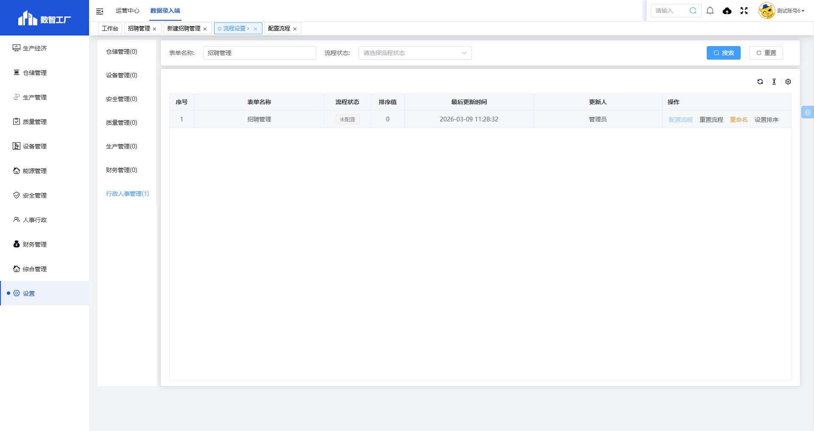

---

#### 阶段 5：简历初筛（待筛选 → 待面试 / 初筛淘汰）

| 步骤 | 操作人 | 具体操作 | 状态变化 |
|------|--------|---------|---------|
| 5.1 | 招聘初筛负责人 | 列表「招聘状态」选 **待筛选** → **搜索** | 列出待办简历 |
| 5.2 | 招聘初筛负责人 | 点击 **详情**，查阅学历、附件、工作经历、承诺签字 | — |
| 5.3 | 招聘初筛负责人 | 符合岗位要求，执行初筛通过操作 | **待面试** |
| 5.4 | 招聘初筛负责人 | 不符合要求，执行淘汰操作 | **初筛淘汰**（流程终止） |
| 5.5 | HR 专员 | 电话通知应聘者结果（建议） | — |

> 初筛负责人由阶段 0.3 全局配置；未配置时须先完成「设置招聘初筛负责人」。

---

#### 阶段 6：面试安排（待面试）

| 步骤 | 操作人 | 具体操作 | 说明 |
|------|--------|---------|------|
| 6.1 | HR 专员 | 电话或线下联系应聘者 | 确认面试时间、地点、携带材料（系统外） |
| 6.2 | HR 专员 | 列表筛选 **待面试**，打开对应 **详情** | 面试前可补充应聘备注 |
| 6.3 | 面试官 | 按约定组织现场或线上面试 | 系统外执行 |

---

#### 阶段 7：面试评估（待面试 → 待评估 → 待背调 / 面试淘汰）

面试结束后，由面试官在详情/编辑页 **面试信息** 区域录入评估结果。

| 步骤 | 字段/操作 | 填写要求 | 状态影响 |
|------|----------|---------|---------|
| 7.1 | 面试时间 | 选择实际面试日期 | — |
| 7.2 | 面试评选结果 | 单选 **通过** 或 **不通过** | 决定后续分支 |
| 7.3 | 本轮面试官 | 选择参与面试的负责人 | — |
| 7.4 | 本轮面试官签字 | 点击完成电子签名 | 必填 |
| 7.5 | 保存/确认 | 提交面试评估 | 通过 → **待背调**；不通过 → **面试淘汰** |

---

#### 阶段 8：背景调查（待背调 → 已归档 / 背调淘汰）

| 步骤 | 操作人 | 具体操作 | 状态变化 |
|------|--------|---------|---------|
| 8.1 | 人事行政部经理 | 列表筛选 **待背调** → **详情** | — |
| 8.2 | 人事行政部经理 | 线下核实学历、工作履历、证件真伪等 | — |
| 8.3 | 人事行政部经理 | 背调合格，确认通过 | **已归档** |
| 8.4 | 人事行政部经理 | 背调不合格 | **背调淘汰**（流程终止） |
| 8.5 | HR 专员 | 在「应聘备注」记录背调结论（建议） | 便于审计 |

---

#### 阶段 9：办理入职（已归档 → 业务办结）

| 步骤 | 操作人 | 具体操作 | 结果 |
|------|--------|---------|------|
| 9.1 | HR 专员 | 列表「招聘状态」选 **已归档** → **搜索** | 定位录用单据 |
| 9.2 | HR 专员 | 行操作列点击 **办理入职** | 跳转 [[入职管理]] 新建/关联页 |
| 9.3 | 系统 | 自动带入姓名、性别、证件、学历、联系方式等 | 减少重复录入 |
| 9.4 | HR 专员 | 在入职管理补全部门、岗位、入职日期、附件等 | **招聘侧业务办结** |

**办结判定**：列表状态为 **已归档**，且入职管理已生成关联入职单。此后人员核心信息在 [[入职管理]] 维护，勿在招聘单上反复修改证件等关键字段。

---

#### 阶段 10：辅助操作速查

| 功能 | 操作路径 | 适用场景 |
|------|---------|---------|
| 条件查询 | 搜索区填条件 → **搜索** | 按日期/状态/姓名找单 |
| 重置 | 搜索区 → **重置** | 清空筛选恢复全列表 |
| 导出数据 | 列表 → **导出数据** | 按当前筛选结果导出 Excel |
| 扫码报名 | **应聘报名二维码** | 应聘者自助填报 |
| 反审 | 行操作 → **反审** | 已审批单退回修改（须权限） |
| 详情 | 行操作 → **详情** | 只读查看，不改动数据 |
| 编辑 | 行操作 → **编辑** | 修改可编辑状态下字段 |

---

#### 主路径操作一览（对照 2.2 流程图）

| 流程图节点 | 阶段 | 关键操作 | 操作角色 | 目标状态 |
|-----------|------|---------|---------|---------|
| 新增应聘报名 | 2～3 | 新增应聘报名 → 填表 → **确定** | HR 专员 | 待提交 |
| 提交 | 4 | 详情 → **提交** | HR 专员 | 待筛选 / 待审核 |
| 审批通过 | 4 | 我的待办 → **同意** | 审批人 | 待筛选 |
| 初筛 | 5 | 详情 → 初筛处理 | 初筛负责人 | 待面试 / 初筛淘汰 |
| 面试评估 | 6～7 | 填面试信息 + 面试官签字 | 面试官 | 待背调 / 面试淘汰 |
| 背调 | 8 | 背调确认 | 人事经理 | 已归档 / 背调淘汰 |
| 办理入职 | 9 | **办理入职** | HR 专员 | 转入入职管理 |

---

### 2.4 审批链条（工作流层）

工作流在 **设置 → 流程设置 → 行政人事管理 → 招聘管理** 中配置，流程标识为 `hr_recruit`。

**贵州基地当前配置**：流程状态为「未配置」，流程设计器默认为「发起人（所有人）→ 流程结束」，即提交后无额外审批节点，单据可直接进入后续招聘环节。

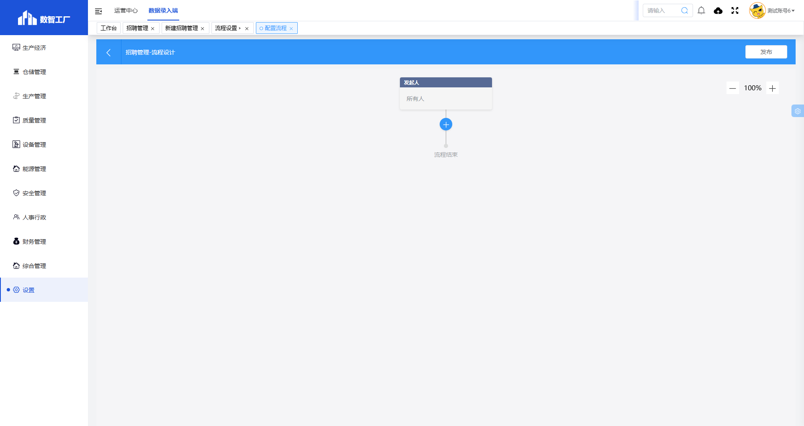

#### 推荐审批链条（配置后）

| 节点序号 | 节点名称      | 处理角色    | 处理动作           | 通过后状态   |
| ---- | --------- | ------- | -------------- | ------- |
| 0    | 发起人       | HR 专员   | 填写应聘信息、本人签字、提交 | 待审核     |
| 1    | 部门审核（可选）  | 用人部门经理  | 确认岗位需求与基本条件    | 流转下一节点  |
| 2    | HR 审核（可选） | 人事行政部经理 | 审核信息完整性、合规性    | 已完成     |
| —    | 流程结束      | —       | —              | 进入「待筛选」 |

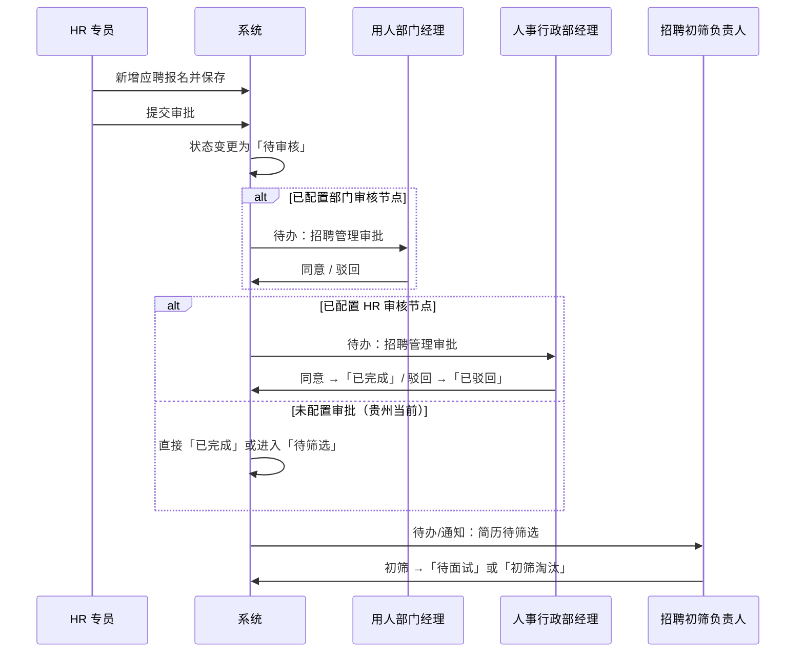

> **说明**：审批人在 **工作台 → 我的待办** 中处理；驳回后发起人修改单据可重新提交；已审批单据支持「反审」退回（见核心场景五）。

### 2.5 招聘环节链条（业务层）

审批通过或免审后，由 **招聘初筛负责人** 及后续角色按状态推进：

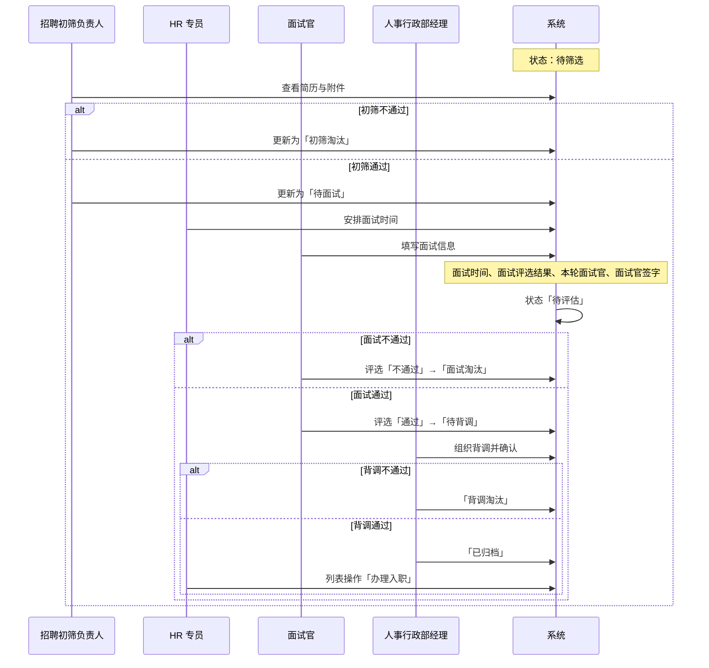

#### 面试信息字段（详情/编辑页，招聘环节中录入）

| 字段名称    | 类型   | 说明        |
| ------- | ---- | --------- |
| 面试时间    | 日期   | 实际面试日期    |
| 面试评选结果  | 单选   | 通过 / 不通过  |
| 本轮面试官   | 人员选择 | 参与面试的负责人  |
| 本轮面试官签字 | 电子签名 | 面试官确认评估结果 |

应聘信息录入界面如下（含员工信息、工作经历、家庭情况、签字与附件）：

---

## 三、系统权限与角色分工

### 3.1 角色职责总览

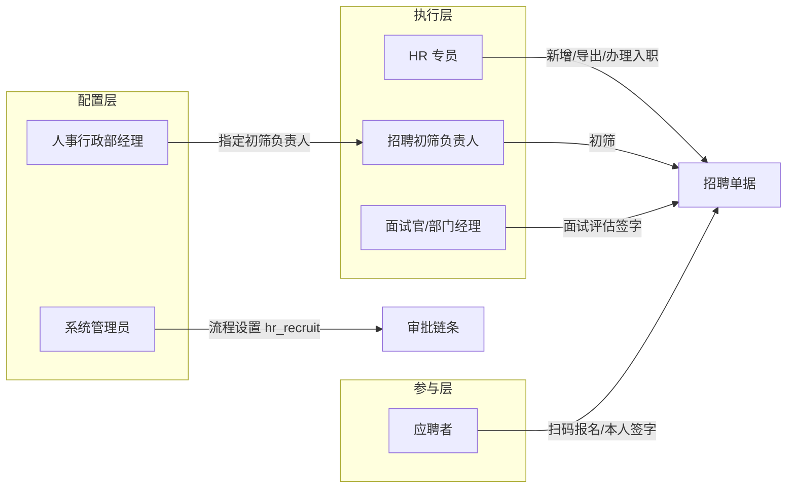

### 3.2 角色权限矩阵

| 角色               | 菜单权限        | 列表操作                 | 审批/处理节点              | 数据范围       |
| ---------------- | ----------- | -------------------- | -------------------- | ---------- |
| **系统管理员**        | 招聘管理 + 流程设置 | 全部                   | 可配置 `hr_recruit` 审批链 | 全公司        |
| **人事行政部经理**      | 招聘管理        | 查看、导出、审批（若配置节点）      | 待审核、背调确认             | 全公司        |
| **HR 专员**        | 招聘管理        | 新增应聘报名、编辑、导出、详情、办理入职 | 发起人；可代录应聘信息          | 全公司（按授权）   |
| **招聘初筛负责人**      | 招聘管理        | 详情、编辑（初筛相关）          | **待筛选** → 待面试 / 初筛淘汰 | 分配给自己的待筛简历 |
| **面试官 / 用人部门经理** | 招聘管理（按授权）   | 详情、面试信息录入            | **待面试 / 待评估**        | 本部门或受邀面试单据 |
| **普通员工**         | 无（或仅扫码入口）   | 应聘报名二维码自助填报          | 本人签字                 | 仅自己的报名数据   |
| **应聘者（外部）**      | 扫码 H5 页     | 填写报名表                | 郑重承诺 + 本人签字          | 单次报名       |

### 3.3 关键配置项与角色关系

**设置招聘初筛负责人**：由 HR 经理或管理员在列表页统一指定，系统将把「待筛选」单据分配给该负责人处理。

| 配置项     | 配置路径                      | 配置人         | 影响范围      |
| ------- | ------------------------- | ----------- | --------- |
| 招聘初筛负责人 | 招聘管理 → 设置招聘初筛负责人          | HR 经理 / 管理员 | 待筛选单据的责任人 |
| 审批流程    | 设置 → 流程设置 → 行政人事管理 → 招聘管理 | 系统管理员       | 待审核节点及审批人 |
| 招聘信息来源  | [[招聘设置]]                  | HR 专员       | 报名表下拉选项   |
| 应聘职务    | [[员工岗位管理]]                | HR 专员       | 报名表岗位下拉   |

### 3.4 审批节点与角色对照图

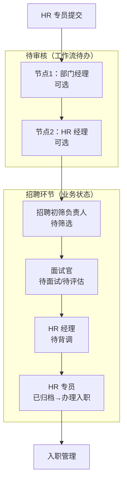

---

## 四、核心场景（实操案例）

### 场景一：HR 现场登记 → 初筛通过 → 面试录用 → 办理入职

**背景**：生产部需招聘扫码员，应聘者李某到厂填写纸质表，HR 当场录入系统。

| 步骤  | 操作人      | 系统操作                                                                        | 状态变化      |
| --- | -------- | --------------------------------------------------------------------------- | --------- |
| 1   | HR 专员张克琴 | 人事行政 → 招聘管理 → **新增应聘报名**，填写李某信息，工作经历、家庭情况各一行，**本人签字**，上传身份证与简历附件，点击**确定**保存 | 待提交       |
| 2   | HR 专员    | 打开详情 → **提交**（贵州未配审批则跳过待审核）                                                 | 待筛选       |
| 3   | 初筛负责人韩潇  | 在列表筛选「待筛选」，查看附件与学历，确认符合岗位要求，更新状态                                            | 待面试       |
| 4   | HR 专员    | 联系李某安排面试；面试后由生产部王朝阳在详情中填写**面试时间、评选结果=通过、面试官签字**                             | 待评估 → 待背调 |
| 5   | 人事经理周璇   | 完成电话背调，确认无劳动纠纷                                                              | 已归档       |
| 6   | HR 专员    | 列表操作 → **办理入职**，跳转入职管理并关联本应聘单                                               | 入职管理待办理   |

**要点**：身份证号、应聘职务务必与 [[员工岗位管理]] 一致；办理入职前状态须为「已归档」。

---

### 场景二：扫码自助报名 → 初筛淘汰

**背景**：厂区门口张贴「应聘报名二维码」，应聘者王某扫码自助填报。

| 步骤 | 操作人 | 系统操作 | 状态变化 |
|------|--------|---------|---------|
| 1 | 应聘者王某 | 微信扫码 → 填写报名表 → **本人签字** → 提交 | 待筛选 |
| 2 | 初筛负责人 | 工作台或招聘列表查看新单，发现学历不满足岗位要求 | 初筛淘汰 |
| 3 | HR 专员 | 电话通知王某结果，单据保留备查 | 终态 |

**要点**：内推候选人须在「招聘信息来源」选择对应渠道；淘汰单据不可删除，仅状态终止。

---

### 场景三：审批驳回后修改重提

**背景**：基地已配置 HR 经理审批节点，专员提交的单据因附件缺失被驳回。

| 步骤  | 操作人    | 系统操作                                  | 状态变化      |
| --- | ------ | ------------------------------------- | --------- |
| 1   | HR 专员  | 新增并提交应聘报名                             | 待审核       |
| 2   | 人事经理周璇 | 工作台 → 我的待办 → 招聘管理 → **驳回**，意见「缺学历证附件」 | 已驳回       |
| 3   | HR 专员  | 编辑单据 → 上传学历证书 → 重新提交                  | 待审核       |
| 4   | 人事经理   | **同意**                                | 已完成 → 待筛选 |

**要点**：驳回原因在审批意见中查看；已驳回单据可编辑后重提，无需新建。

---

### 场景四：面试通过但背调淘汰

**背景**：应聘电工岗位，面试表现良好，背调发现证件造假。

| 步骤  | 操作人          | 系统操作             | 状态变化 |
| --- | ------------ | ---------------- | ---- |
| 1～4 | （同场景一 1～4 步） | 面试评选通过           | 待背调  |
| 5   | 人事经理         | 核验电工证真伪，发现虚假     | 背调淘汰 |
| 6   | HR 专员        | 在应聘备注记录原因，不得办理入职 | 终态   |

---

### 场景五：已审批单据反审修改

**背景**：已完成审批的应聘单发现联系电话填错，需更正后重新走筛选。

| 步骤  | 操作人   | 系统操作                           | 状态变化      |
| --- | ----- | ------------------------------ | --------- |
| 1   | HR 专员 | 列表找到「待筛选」单据 → **反审**（或编辑权限下修改） | 退回可编辑状态   |
| 2   | HR 专员 | 修正联系电话 → 保存 → 重新提交             | 待审核 / 待筛选 |
| 3   | 初筛负责人 | 重新确认信息后推进                      | 待面试       |

**要点**：列表行操作含 **详情、编辑、反审、办理入职**（以角色授权为准）；核心身份信息变更应留痕。

---

## 五、字段与规则摘要

完整字段表、截图及 R01–R14 业务规则见 [[招聘管理字段表]]。本节仅列与流程强相关的要点：

| 项目      | 说明                                 |
| ------- | ---------------------------------- |
| 业务编号    | 系统自动生成，格式 ZP + 年月日 + 三位序号          |
| 本人签字    | 应聘人（或代录时授权）必须完成电子签名方可提交            |
| 招聘初筛负责人 | 全局配置，决定「待筛选」单据由谁处理                 |
| 面试四字段   | 面试时间、面试评选结果、本轮面试官、面试官签字            |
| 办理入职    | 状态为「已归档」后，HR 专员在列表发起，数据带入 [[入职管理]] |
| 导出数据    | 按当前筛选条件导出，用于招聘统计分析                 |

### 状态转换条件（汇总）

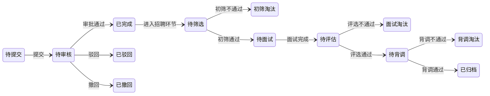

---

## 六、关联表单

| 方向 | 表单 | 关系说明 |
|------|------|---------|
| 上游 | [[招聘设置]] | 提供「招聘信息来源」字典 |
| 上游 | [[员工岗位管理]] | 提供「应聘职务」选项 |
| 下游 | [[入职管理]] | 「办理入职」关联应聘信息，减少重复录入 |
| 配置 | 流程设置（`hr_recruit`） | 配置应聘报名审批链条 |

---

**文档版本**：V1.0  
**实机核对环境**：贵州基地 `gzmms.y1b.cn:8424`  
**最后更新**：2026-06-26（增补 2.3 操作手册）