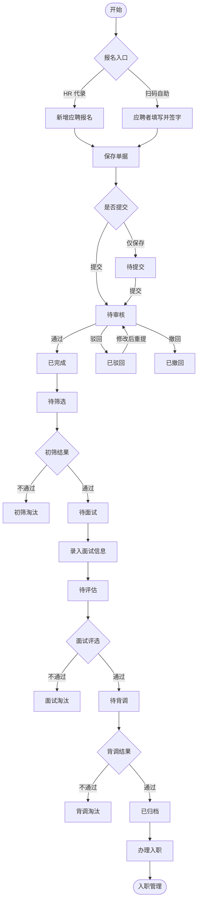
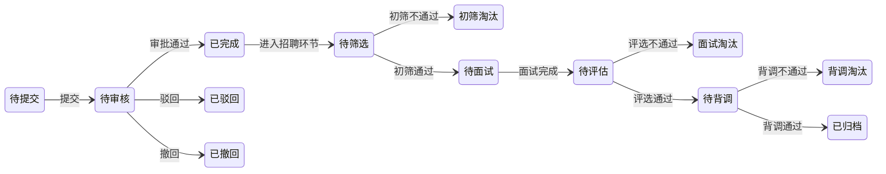

# 招聘管理字段表

> 业务流程与操作手册见下文「业务流程」章节；审批链条、角色分工与案例见 [[招聘管理]]。

## 功能业务介绍

招聘管理用于登记、查询与跟踪应聘人员从报名到录用（或拒绝）的全流程信息。人力资源部门可在此录入或维护应聘者个人资料、教育背景、工作经历与家庭成员信息，并通过招聘状态字段掌握每条应聘单据的处理进度。

本表单隶属于人事行政模块「人事管理」子模块，与 [[招聘设置]]（招聘信息来源）、[[员工岗位管理]]（应聘职务）衔接；录用后可流转至 [[入职管理]] 办理入职手续。列表页支持按应聘日期、招聘状态、应聘者姓名筛选，并提供「新增应聘报名」「导出数据」「设置招聘初筛负责人」「应聘报名二维码」等操作入口。

## 业务流程

招聘管理采用**「单据审批 + 招聘环节」双层机制**，列表「状态」列展示当前节点。完整审批链条、角色分工与案例见 [[招聘管理]]。

### 操作手册

以下按系统实际操作顺序编写，从进入招聘管理到单据办结（已归档并办理入职）。默认操作角色为 **HR 专员**，其他角色在步骤中单独标明。

#### 一、操作前准备

| 序号 | 检查项 | 操作路径 | 说明 |
|------|--------|---------|------|
| 1 | 招聘信息来源 | 人事行政 → 人事管理 → [[招聘设置]] | 报名表「招聘信息来源」须有可选字典 |
| 2 | 应聘职务 | 人事行政 → 人事管理 → [[员工岗位管理]] | 「应聘职务」须从岗位字典选择 |
| 3 | 初筛负责人 | 招聘管理列表 → **设置招聘初筛负责人** | 指定「待筛选」单据处理人 |
| 4 | 审批流程（可选） | 设置 → 流程设置 → 行政人事管理 → 招聘管理 | `workKey=hr_recruit`；贵州基地当前为「未配置」 |

#### 二、进入列表并新建应聘单

| 步骤 | 界面位置 | 操作说明 | 结果 |
|------|---------|---------|------|
| 1 | 顶部模块栏 | 点击 **人事行政** | 展开人事行政菜单 |
| 2 | 左侧菜单 | 点击 **人事管理** → **招聘管理** | 打开列表页 |
| 3 | 列表工具栏 | 点击 **新增应聘报名** | 进入新建页，页签为「新建招聘管理」 |
| 4 | 地址栏 | 确认路由含 `invite-administration/detail?pageType=1` | 处于新增模式 |

列表页路由：`#/administration-manage/index10/index107/invite-administration`

#### 三、填写应聘报名表

新建页自上而下分四个区域，须完整填写所有必填项（标 ★）。

**3.1 员工信息**

| 步骤 | 字段 | 操作要点 |
|------|------|---------|
| 1 | 应聘日期 | 默认当天，可按实际登记日修改 |
| 2 | ★ 姓名、性别、籍贯、婚否、出生日期 | 与身份证一致 |
| 3 | ★ 应聘职务 | 从 [[员工岗位管理]] 下拉选择，禁止手输 |
| 4 | ★ 希望待遇 | 填写期望月薪（元） |
| 5 | ★ 政治面貌、联系电话、身份证号 | 手机号用于通知；身份证不可重复登记 |
| 6 | ★ 毕业院校、专业、最高学历、毕业日期、学校地点 | 完整填写教育背景 |
| 7 | ★ 通信地址 | 精确到门牌号 |
| 8 | ★ 个人爱好、电子邮箱、招聘信息来源、是否住宿 | 来源选自 [[招聘设置]] |
| 9 | 单据编号 | 灰色不可编辑，保存后系统自动生成（如 ZP260626001） |

**3.2 工作经历（至少一行）**

| 步骤 | 操作 | 说明 |
|------|------|------|
| 1 | 展开「工作经历」面板，点击 **新增** | 增加一行 |
| 2 | 填写 ★ 单位名称、职位、开始日期、结束日期、薪资待遇、离职原因 | 全部必填 |
| 3 | 有多段经历可继续 **新增** | 建议按时间由近及远 |

**3.3 家庭情况（至少一行）**

| 步骤 | 操作 | 说明 |
|------|------|------|
| 1 | 展开「家庭情况」面板，点击 **新增** | 增加一行 |
| 2 | 填写 ★ 与本人关系、★ 姓名、★ 联系方式 | 作紧急联系人 |
| 3 | 年龄、政治面貌、工作单位、职位 | 选填 |

**3.4 郑重承诺、备注与附件**

| 步骤 | 操作 | 说明 |
|------|------|------|
| 1 | 阅读「郑重承诺」只读条款 | 三条承诺不可修改 |
| 2 | 点击 **点击签字**，完成 ★ 本人签字 | 提交前必须完成电子签名 |
| 3 | 应聘备注 | 选填，最多 500 字 |
| 4 | 应聘附件 | 选填；最多 10 个，单文件 ≤100M |

**3.5 保存**

| 步骤 | 操作 | 状态变化 |
|------|------|---------|
| 1 | 点击底部 **确定** | 系统校验必填项 |
| 2 | 校验通过 | 返回列表，状态为 **待提交**，业务编号已生成 |
| 3 | 点击 **取消** | 不保存，直接返回列表 |

#### 四、提交单据

| 步骤 | 界面位置 | 操作 | 状态变化 |
|------|---------|------|---------|
| 1 | 列表行「操作」 | 点击 **详情** 或 **编辑** | 打开该应聘单 |
| 2 | 详情页 | 点击 **提交** | 进入下一环节 |
| 3 | — | **贵州基地（审批未配置）** | 通常直接进入 **待筛选** |
| 4 | — | **已配置审批的基地** | 变为 **待审核**，审批人在工作台处理 |

**审批处理（已配置时）**

| 步骤 | 操作人 | 路径 | 操作 | 状态变化 |
|------|--------|------|------|---------|
| 1 | 审批人 | 工作台 → **我的待办** | 打开「招聘管理」待办 | — |
| 2 | 审批人 | 审批页 | **同意** | **已完成** → **待筛选** |
| 3 | 审批人 | 审批页 | **驳回** 并填写意见 | **已驳回** |
| 4 | HR 专员 | 招聘管理 → 编辑 | 修改后重新 **提交** | 回到 **待审核** |

#### 五、简历初筛（待筛选）

| 步骤 | 操作人 | 操作 | 状态变化 |
|------|--------|------|---------|
| 1 | 招聘初筛负责人 | 列表筛选「招聘状态」= **待筛选** → **搜索** | 定位待办单据 |
| 2 | 招聘初筛负责人 | 点击 **详情**，查看学历、附件、工作经历 | — |
| 3a | 招聘初筛负责人 | 符合岗位要求，推进初筛 | **待面试** |
| 3b | 招聘初筛负责人 | 不符合要求，标记淘汰 | **初筛淘汰**（终止） |

#### 六、面试安排与评估（待面试 → 待评估）

| 步骤 | 操作人 | 操作 | 说明 |
|------|--------|------|------|
| 1 | HR 专员 | 电话/线下联系应聘者 | 确认面试时间、地点（系统外） |
| 2 | 面试官 | 详情/编辑页 · 面试信息区 | 填写 **面试时间** |
| 3 | 面试官 | 同上 | 选择 **面试评选结果**：通过 / 不通过 |
| 4 | 面试官 | 同上 | 选择 **本轮面试官** |
| 5 | 面试官 | 同上 | 完成 **本轮面试官签字** |
| 6 | 面试官 | 保存 | 评选通过 → **待背调**；不通过 → **面试淘汰** |

#### 七、背景调查（待背调）

| 步骤 | 操作人 | 操作 | 状态变化 |
|------|--------|------|---------|
| 1 | 人事行政部经理 | 列表筛选 **待背调**，打开详情 | — |
| 2 | 人事行政部经理 | 线下完成学历、履历、证件等背调 | — |
| 3a | 人事行政部经理 | 背调无问题，确认通过 | **已归档** |
| 3b | 人事行政部经理 | 背调发现问题 | **背调淘汰**（终止） |
| 4 | HR 专员 | 在应聘备注记录背调结论（建议） | 便于审计追溯 |

#### 八、办理入职（已归档 → 办结）

| 步骤 | 操作人 | 操作 | 结果 |
|------|--------|------|------|
| 1 | HR 专员 | 列表筛选「招聘状态」= **已归档** | 定位录用单据 |
| 2 | HR 专员 | 行操作 → **办理入职** | 跳转 [[入职管理]] |
| 3 | 系统 | 自动带入姓名、性别、证件、学历、联系方式等 | 减少重复录入 |
| 4 | HR 专员 | 在入职管理补全部门、岗位、入职日期等 | **招聘业务办结** |

> **办结标准**：状态为 **已归档** 且已在入职管理生成关联入职单。此后核心身份信息在入职管理中维护。

#### 九、其他常用操作

| 功能 | 操作路径 | 说明 |
|------|---------|------|
| 条件查询 | 列表搜索区 → 填条件 → **搜索** | 支持应聘日期、招聘状态、姓名 |
| 重置筛选 | 搜索区 → **重置** | 清空条件 |
| 导出数据 | 列表 → **导出数据** | 导出当前筛选结果 |
| 扫码报名 | 列表 → **应聘报名二维码** | 应聘者自助填报，提交后一般为 **待筛选** |
| 反审修改 | 列表行 → **反审** | 退回可编辑状态后修改重提（须具权限） |
| 查看详情 | 列表行 → **详情** | 只读查看全部字段与附件 |

#### 十、主路径操作一览

| 序号 | 阶段 | 关键按钮 | 操作角色 | 目标状态 |
|------|------|---------|---------|---------|
| 1 | 新建 | 新增应聘报名 → 确定 | HR 专员 | 待提交 |
| 2 | 提交 | 详情 → 提交 | HR 专员 | 待筛选 / 待审核 |
| 3 | 审批 | 我的待办 → 同意 | 审批人 | 待筛选 |
| 4 | 初筛 | 详情 → 初筛处理 | 初筛负责人 | 待面试 / 初筛淘汰 |
| 5 | 面试 | 详情 → 填面试信息并签字 | 面试官 | 待背调 / 面试淘汰 |
| 6 | 背调 | 详情 → 背调确认 | 人事经理 | 已归档 / 背调淘汰 |
| 7 | 办结 | 办理入职 | HR 专员 | 转入入职管理 |

## 字段清单

### 一、列表搜索区

列表页顶部筛选区，支持按应聘日期范围、招聘状态、应聘者姓名组合查询。

| 字段名称 | 类型 | 长度 | 约束条件 | 说明 |
|---------|------|------|----------|------|
| 应聘日期（起） | date | - | 否 | 日期范围筛选，占位符「开始日期」 |
| 应聘日期（止） | date | - | 否 | 日期范围筛选，占位符「结束日期」 |
| 招聘状态 | varchar | 20 | 否 | 下拉选择，见「业务状态」章节 |
| 应聘者姓名 | varchar | 20 | 否 | 模糊查询，占位符「请输入应聘者姓名」 |

### 二、列表展示列

列表主表格展示字段如下，对应列表页表格列区域。

| 字段名称 | 类型 | 长度 | 约束条件 | 说明 |
|---------|------|------|----------|------|
| 序号 | int | - | - | 列表行号，系统自动生成 |
| 业务编号 | varchar | 30 | - | 应聘单据唯一编号，如 ZP260626001 |
| 状态 | varchar | 20 | - | 当前招聘状态 |
| 应聘日期 | date | - | - | 登记应聘的日期 |
| 应聘者姓名 | varchar | 20 | - | 应聘者真实姓名 |
| 性别 | varchar | 4 | - | 男 / 女 |
| 出生年月 | date | - | - | 出生日期 |
| 手机号 | varchar | 20 | - | 联系电话 |
| 应聘职务 | varchar | 50 | - | 目标应聘岗位 |
| 毕业学院 | varchar | 100 | - | 最高学历毕业院校 |
| 专业 | varchar | 60 | - | 所学专业 |
| 应聘报名备注 | varchar | 500 | - | 备注摘要展示 |

### 三、员工信息（主表）

点击「新增应聘报名」进入表单，员工信息区域字段如下。

| 字段名称 | 类型 | 长度 | 约束条件 | 说明 |
|---------|------|------|----------|------|
| 应聘日期 | date | - | 否 | 默认当天，可修改 |
| 姓名 | varchar | 20 | 是 | 应聘者真实姓名 |
| 单据编号 | varchar | 30 | 否 | 系统自动生成，新建时禁用不可编辑 |
| 性别 | tinyint | 1 | 是 | 单选：男 / 女 |
| 籍贯 | varchar | 50 | 是 | 下拉选择省市区 |
| 婚否 | varchar | 10 | 是 | 下拉选择，如未婚、已婚等 |
| 出生日期 | date | - | 是 | 用于计算年龄 |
| 应聘职务 | varchar | 50 | 是 | 下拉选择，选项来源于 [[员工岗位管理]] |
| 希望待遇 | int | 10 | 是 | 期望月薪，单位：元 |
| 政治面貌 | varchar | 20 | 是 | 下拉选择，如群众、团员、党员等 |
| 联系电话 | varchar | 20 | 是 | 常用手机号 |
| 户籍地址 | varchar | 200 | 否 | 身份证登记地址 |
| 身份证号 | varchar | 18 | 是 | 18 位标准身份证号，唯一约束 |
| 毕业院校 | varchar | 100 | 是 | 最高学历毕业院校 |
| 通信地址 | varchar | 200 | 是 | 现居住地址，精确到门牌号 |
| 专业 | varchar | 60 | 是 | 毕业专业 |
| 最高学历 | varchar | 20 | 是 | 下拉选择，如大专、本科、硕士等 |
| 毕业日期 | date | - | 是 | 完成学业日期 |
| 学校地点 | varchar | 100 | 是 | 院校所在城市/地区 |
| 最高职称 | varchar | 50 | 否 | 如工程师、会计师，无则留空 |
| 评定年份 | date | - | 否 | 职称评定年份 |
| 工作专长 | varchar | 200 | 否 | 核心技能与专业特长 |
| 个人爱好 | varchar | 100 | 是 | 个人兴趣爱好 |
| 外语/等级 | varchar | 50 | 否 | 如大学英语四级、日语 N2 |
| 电子邮箱 | varchar | 100 | 是 | 用于通知沟通 |
| 招聘信息来源 | varchar | 50 | 是 | 下拉选择，如招聘会、内部推荐、网络招聘等 |
| 是否住宿 | tinyint | 1 | 是 | 单选：是 / 否 |

### 四、工作经历（子表）

位于新增页「工作经历」折叠面板，支持多行录入，见上图新增页中部区域。

| 字段名称 | 类型 | 长度 | 约束条件 | 说明 |
|---------|------|------|----------|------|
| 单位名称 | varchar | 100 | 是 | 原工作单位名称，可新增多行 |
| 职位 | varchar | 50 | 是 | 原担任职位 |
| 开始日期 | date | - | 是 | 该段工作入职日期 |
| 结束日期 | date | - | 是 | 该段工作离职日期 |
| 薪资待遇金额(元) | int | 10 | 是 | 该段工作月薪，单位：元 |
| 离职原因 | varchar | 200 | 是 | 离职原因说明 |

### 五、家庭情况（子表）

位于新增页「家庭情况」折叠面板，支持多行录入，见上图新增页中下部区域。

| 字段名称 | 类型 | 长度 | 约束条件 | 说明 |
|---------|------|------|----------|------|
| 与本人关系 | varchar | 20 | 是 | 下拉选择，如父亲、母亲、配偶、子女 |
| 姓名 | varchar | 20 | 是 | 家庭成员姓名 |
| 年龄 | int | 3 | 否 | 家庭成员年龄 |
| 政治面貌 | varchar | 20 | 否 | 家属政治身份 |
| 工作单位 | varchar | 100 | 否 | 家属就职单位 |
| 职位 | varchar | 50 | 否 | 家属工作职务 |
| 联系方式 | varchar | 20 | 是 | 家属联系电话，作紧急联系人 |

### 六、郑重承诺、备注与附件

位于新增页底部，含固定承诺条款、电子签名、备注与附件上传，见上图新增页最下方区域。

| 字段名称 | 类型 | 长度 | 约束条件 | 说明 |
|---------|------|------|----------|------|
| 郑重承诺 | text | - | - | 系统固定承诺条款，只读展示 |
| 本人签字 | varchar | 100 | 是 | 电子签名，点击「点击签字」完成 |
| 应聘备注 | varchar | 500 | 否 | 多行文本，最多 500 字 |
| 应聘附件 | file | - | 否 | 最多 10 个；单文件 ≤100M；支持 jpg、png、gif、jpeg、pdf、zip、rar、docx、doc、xlsx、ppt、pptx、pptm、xls |

### 七、系统通用字段

| 字段名称 | 类型 | 长度 | 约束条件 | 说明 |
|---------|------|------|----------|------|
| id | bigint | 20 | - | 主键自增 ID |
| create_time | datetime | - | - | 创建时间，系统自动生成 |
| update_time | datetime | - | - | 最后修改时间，系统自动生成 |
| del_flag | tinyint | 1 | - | 逻辑删除：0 = 正常，1 = 已删除 |

## 业务规则

1. **R01**：业务编号（单据编号）为系统自动生成的唯一编码，新建时字段禁用，格式为 ZP + 年月日 + 三位序号，如 ZP260626001。
2. **R02**：身份证号必须为 18 位标准格式，系统做唯一性校验，不可重复登记。
3. **R03**：性别枚举：男、女（存储值 1 = 男，2 = 女）。
4. **R04**：是否住宿枚举：是 / 否（存储值 1 = 是，0 = 否）。
5. **R05**：应聘职务选项来源于 [[员工岗位管理]] 中已配置的岗位，未配置时无法选择。
6. **R06**：工作经历子表至少填写一行；每行单位名称、职位、开始日期、结束日期、薪资待遇、离职原因均为必填。
7. **R07**：家庭情况子表至少填写一行；与本人关系、姓名、联系方式为必填。
8. **R08**：本人签字为必填项，须通过电子签名控件完成签署后方可提交。
9. **R09**：应聘备注最多 500 字，超出不可保存。
10. **R10**：应聘附件最多上传 10 个文件；单文件大小不超过 100M；允许格式：jpg、png、gif、jpeg、pdf、zip、rar、docx、doc、xlsx、ppt、pptx、pptm、xls。
11. **R11**：员工信息主表必填字段：姓名、性别、籍贯、婚否、出生日期、应聘职务、希望待遇、政治面貌、联系电话、身份证号、毕业院校、通信地址、专业、最高学历、毕业日期、学校地点、个人爱好、电子邮箱、招聘信息来源、是否住宿。
12. **R12**：列表支持「导出数据」，导出范围与当前筛选条件一致。
13. **R13**：「设置招聘初筛负责人」用于指定简历初筛责任人；「应聘报名二维码」供应聘者扫码自助填报。
14. **R14**：创建时间、修改时间由系统自动维护，不可手动编辑。

## 业务状态

状态枚举取自系统「招聘状态」筛选项实机数据，与 [[招聘管理]] 第二章一致。

### 单据审批状态

| 状态 | 含义 |
|------|------|
| **待提交** | 已保存未提交 |
| **待审核** | 已提交，等待审批人处理 |
| **已完成** | 审批通过，可进入招聘环节 |
| **已驳回** | 审批未通过，需修改后重提 |
| **已撤回** | 发起人主动撤回 |

### 招聘环节状态

| 状态 | 含义 |
|------|------|
| **待筛选** | 进入简历初筛队列 |
| **初筛淘汰** | 初筛未通过，流程终止 |
| **待面试** | 初筛通过，等待/进行面试 |
| **待评估** | 面试完成，等待评选结果 |
| **面试淘汰** | 面试评估未通过 |
| **待背调** | 面试通过，进行背景调查 |
| **背调淘汰** | 背调未通过 |
| **已归档** | 招聘流程结束，可办理入职 |

### 状态转换条件

1. **待提交 → 待审核**：HR 专员在详情页点击「提交」
2. **待审核 → 已完成**：审批人在工作台「我的待办」同意
3. **待审核 → 已驳回**：审批人驳回，发起人修改后重提
4. **已完成 → 待筛选**：进入招聘初筛环节
5. **待筛选 → 待面试 / 初筛淘汰**：招聘初筛负责人处理
6. **待面试 → 待评估**：面试官录入面试信息
7. **待评估 → 待背调 / 面试淘汰**：依据面试评选结果
8. **待背调 → 已归档 / 背调淘汰**：人事经理背调确认
9. **已归档 → 入职管理**：HR 专员列表点击「办理入职」
