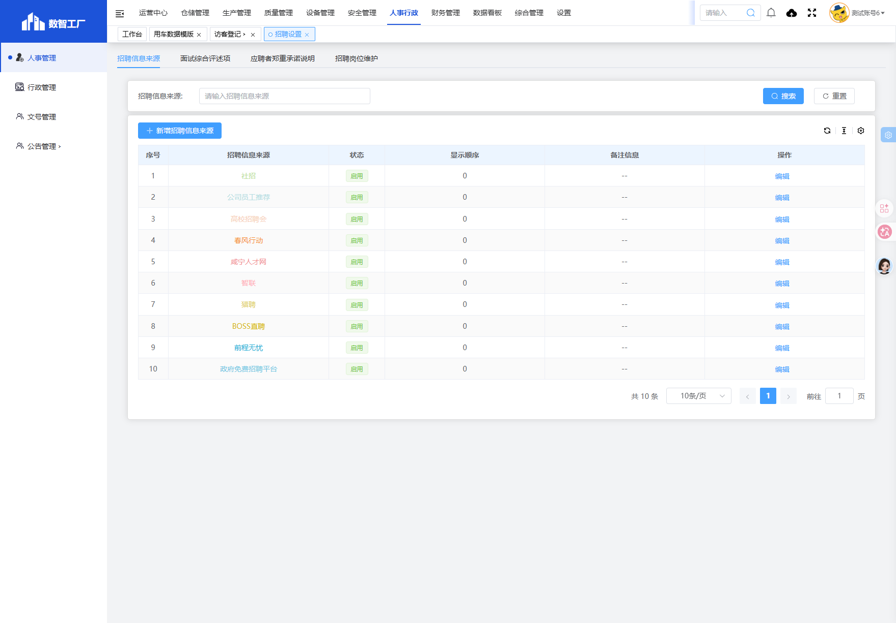
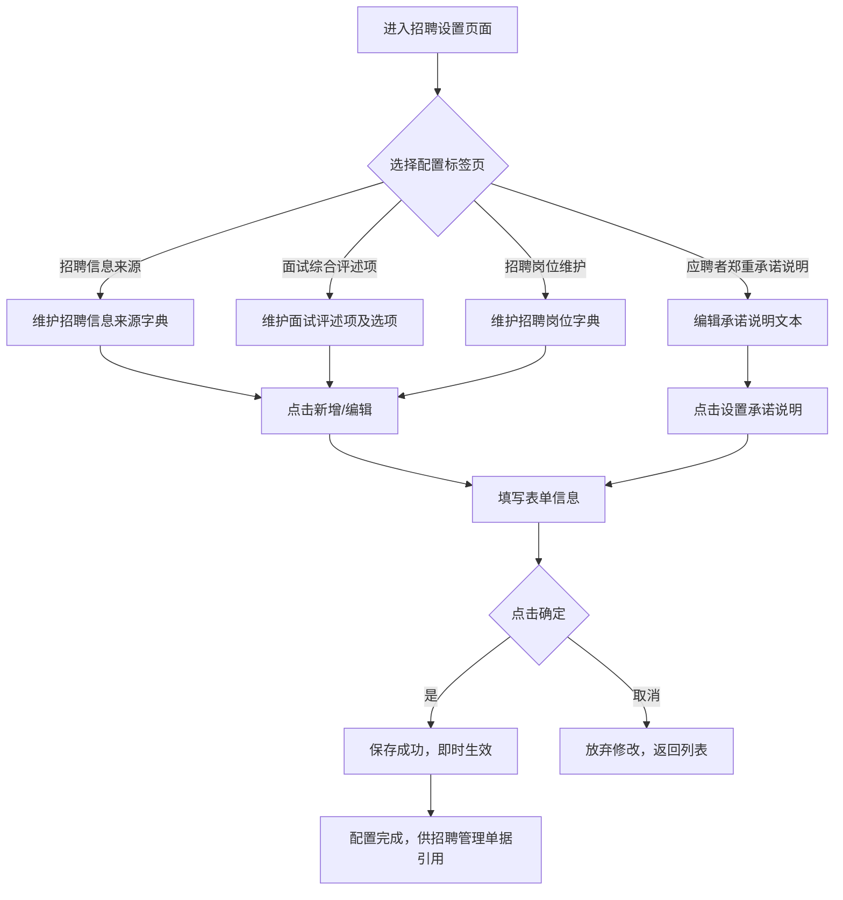
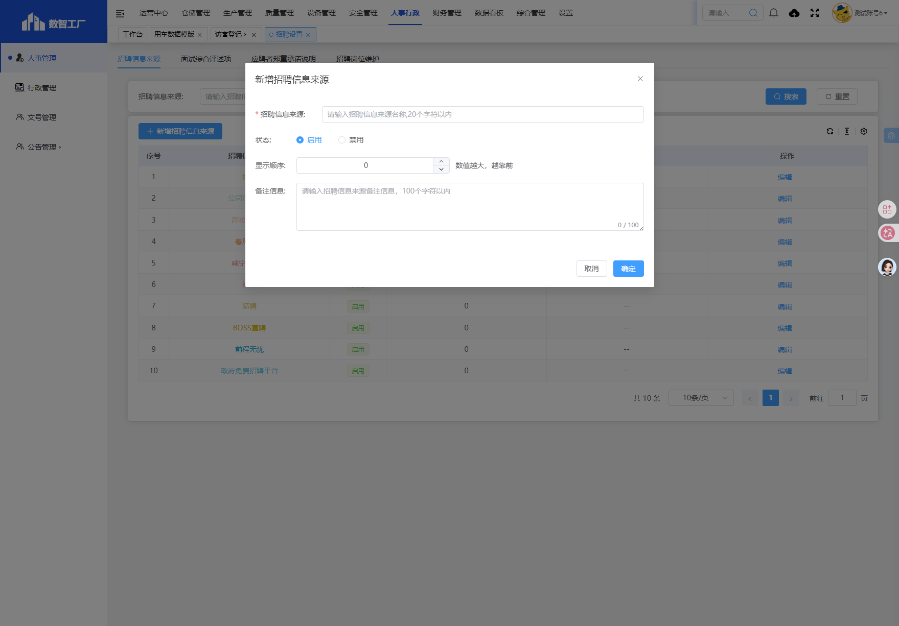
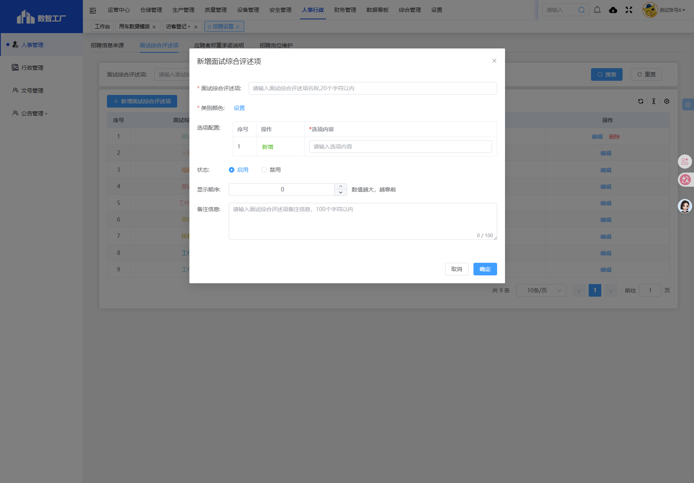
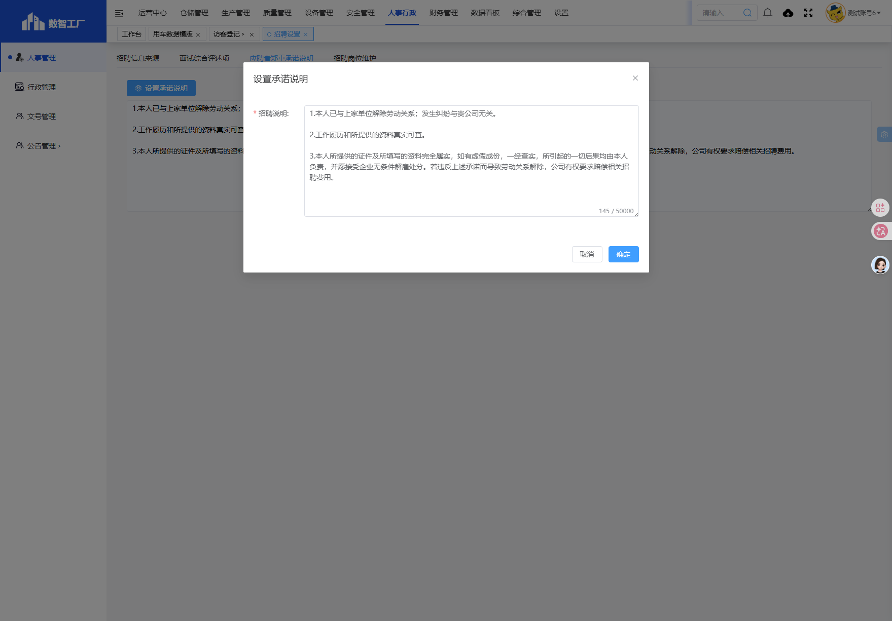
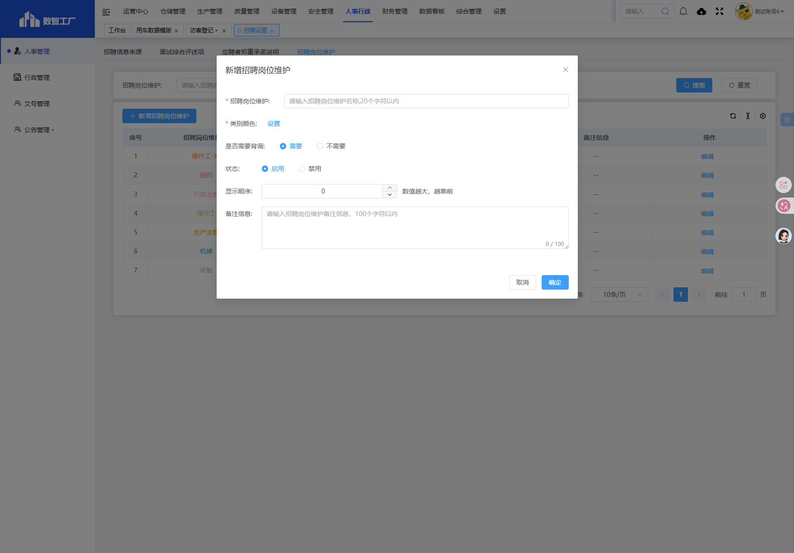
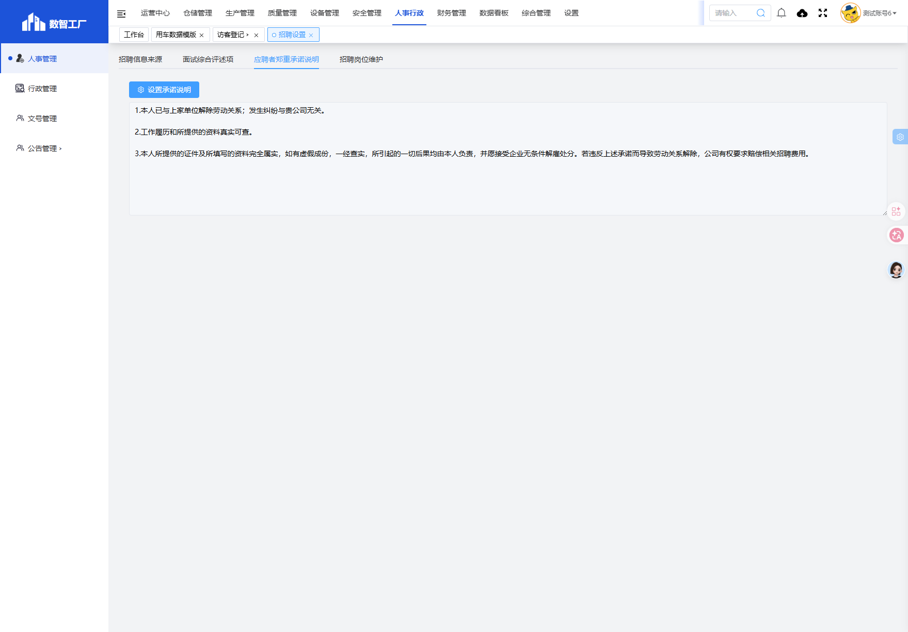
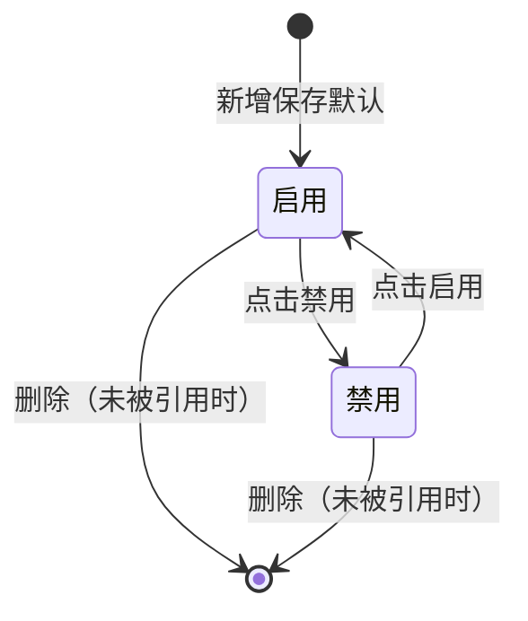
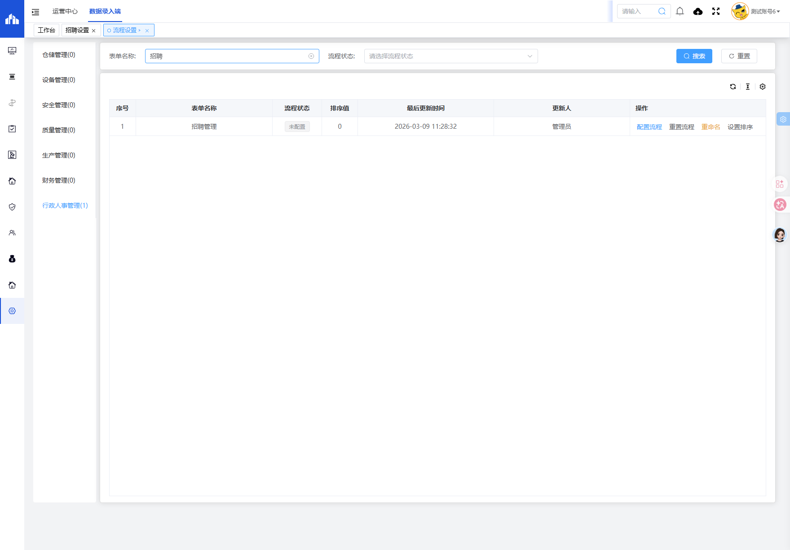

# 招聘设置

> **系统路径**：人事行政 → 人事管理 → 招聘设置
> **页面路由**：`#/administration-manage/index10/index107/invite-set`
> **流程标识（workKey）**：无（基础字典配置，无需审批）

---

## 功能业务介绍

招聘设置是人事招聘模块的**基础数据配置中心**，统一维护招聘全流程所需的各类字典和说明文本，包含四大配置模块：

1. **招聘信息来源**：维护招聘渠道字典（如智联招聘、前程无忧、内部推荐、校园招聘等），供应聘报名时选择应聘者来源渠道
2. **面试综合评述项**：配置面试评估维度及每个维度的评分选项（如专业能力、沟通能力、仪容仪表等），供面试记录时进行评述打分
3. **应聘者郑重承诺说明**：维护应聘者报名时需阅读并同意的承诺声明文本，在应聘报名页面展示
4. **招聘岗位维护**：维护在招岗位列表，并标记岗位是否需要背景调查，供应聘报名选择岗位，决定背调流程走向

该页面配置为前端业务页面（应聘报名）提供基础下拉选项和模板支撑，**无审批流程**，保存后即时生效。列表支持新增、编辑、启用/禁用、删除操作。

### 页面入口/按钮入口

| 入口类型 | 入口位置 | 说明 |
|---------|---------|------|
| 菜单入口 | 人事行政 → 人事管理 → 招聘设置 | 进入招聘设置主页面 |
| 标签切换 | 页面顶部四个标签页 | 切换不同配置模块：招聘信息来源/面试综合评述项/应聘者郑重承诺说明/招聘岗位维护 |
| 新增按钮 | 列表上方**新增{模块名}**按钮 | 弹出新增字典项弹窗（仅三个字典类标签页可见） |
| 编辑按钮 | 列表操作列「编辑」 | 弹出编辑弹窗，回填原有数据 |
| 启用/禁用按钮 | 列表操作列「启用/禁用」 | 切换字典项状态 |
| 删除按钮 | 列表操作列「删除」 | 删除未被引用的字典项（二次确认） |
| 设置承诺说明按钮 | 应聘者郑重承诺说明页**设置承诺说明**按钮 | 弹出文本编辑弹窗修改承诺内容 |
| 搜索按钮 | 搜索区「搜索」 | 按名称模糊查询列表 |
| 重置按钮 | 搜索区「重置」 | 清空搜索条件，恢复全部列表 |
| 确定按钮 | 新增/编辑弹窗底部「确定」 | 校验表单后保存，关闭弹窗 |
| 取消按钮 | 新增/编辑弹窗底部「取消」 | 放弃修改，关闭弹窗 |

---

## 业务流程与操作手册

招聘设置为基础字典配置类页面，**无工作流审批**，新增/编辑保存后即时生效，无需提交审批。

### 操作手册

#### 一、操作前准备
- 拥有「人事行政-人事管理-招聘设置」菜单权限
- 了解公司招聘渠道、面试评估维度、岗位信息、承诺条款内容

#### 二、进入列表并选择配置项
| 步骤 | 操作人 | 具体操作 | 状态变化 |
|------|--------|---------|---------|
| 1 | 人事管理员 | 系统路径：人事行政 → 人事管理 → 招聘设置 | 进入招聘设置页面，默认选中「招聘信息来源」标签 |
| 2 | 人事管理员 | 点击需要配置的标签页：招聘信息来源/面试综合评述项/应聘者郑重承诺说明/招聘岗位维护 | 切换到对应配置分区 |

#### 三、新增字典项（适用于信息来源/评述项/岗位维护）
| 步骤 | 操作人 | 具体操作 | 状态变化 |
|------|--------|---------|---------|
| 1 | 人事管理员 | 点击列表上方**新增{配置项名称}**按钮 | 弹出新增弹窗 |
| 2 | 人事管理员 | 填写必填项（带*号字段），选择状态，填写显示顺序和备注 | 表单校验通过 |
| 3 | 人事管理员 | 点击**确定**按钮 | 保存成功，弹窗关闭，列表刷新显示新增数据 |
| 4 | 人事管理员 | 点击**取消**按钮 | 放弃新增，弹窗关闭，返回列表 |

#### 四、编辑/禁用/删除字典项
| 步骤 | 操作人 | 具体操作 | 状态变化 |
|------|--------|---------|---------|
| 1 | 人事管理员 | 在列表操作列点击**编辑**按钮 | 弹出编辑弹窗，字段回填原有数据 |
| 2 | 人事管理员 | 修改信息后点击**确定** | 保存成功，数据更新 |
| 3 | 人事管理员 | 在列表操作列点击**启用/禁用**按钮 | 记录状态在启用/禁用间切换，禁用项不在前端单据下拉中显示 |
| 4 | 人事管理员 | 点击**删除**按钮（如有），二次确认后 | 记录删除（如已被引用则无法删除） |

#### 五、维护应聘者郑重承诺说明
| 步骤 | 操作人 | 具体操作 | 状态变化 |
|------|--------|---------|---------|
| 1 | 人事管理员 | 切换到「应聘者郑重承诺说明」标签 | 显示当前承诺说明内容，文本框默认禁用 |
| 2 | 人事管理员 | 点击**设置承诺说明**按钮 | 弹出编辑弹窗，文本框可编辑 |
| 3 | 人事管理员 | 编辑承诺说明文本（不超过50000字符） | - |
| 4 | 人事管理员 | 点击**确定**按钮 | 保存成功，文本更新，应聘报名页面承诺内容同步更新 |

#### 六、搜索查询
| 步骤 | 操作人 | 具体操作 | 状态变化 |
|------|--------|---------|---------|
| 1 | 人事管理员 | 在搜索框输入关键字（信息来源/评述项/岗位名称） | - |
| 2 | 人事管理员 | 点击**搜索**按钮 | 列表按关键字模糊查询结果 |
| 3 | 人事管理员 | 点击**重置**按钮 | 清空搜索条件，列表显示全部数据 |

#### 七、其他常用操作
- 分页：列表底部切换每页条数、页码进行翻页
- 显示顺序：数值越大，前端下拉选项中越靠前
- 类别颜色设置：面试综合评述项和招聘岗位维护支持设置颜色标记，用于前端展示区分

#### 八、主路径操作一览
| 流程图节点 | 对应操作 | 关键按钮 | 操作角色 | 目标状态 |
|-----------|---------|---------|---------|---------|
| 选择配置标签页 | 切换四个功能分区 | 标签页点击 | 人事管理员 | 当前标签页 |
| 填写表单信息 | 新增/编辑字典项或承诺说明 | **新增**/**设置承诺说明** | 人事管理员 | 表单填写中 |
| 保存成功 | 点击确定保存 | **确定** | 人事管理员 | 即时生效 |
| 配置完成 | 数据可供招聘单据引用 | - | - | 配置项已启用 |

---

## 字段清单

### 一、列表搜索区（招聘信息来源/面试综合评述项/招聘岗位维护通用）
搜索区域仅含一个名称模糊搜索框，三个字典类标签页结构一致。

| 字段名称 | 类型 | 长度 | 约束条件 | 说明 |
|---------|------|------|----------|------|
| 招聘信息来源/面试综合评述项/招聘岗位维护 | 文本输入框 | 50 | 非必填 | 按名称模糊搜索对应字典项 |

### 二、列表展示列

**招聘信息来源列表列：**

| 字段名称 | 类型 | 长度 | 约束条件 | 说明 |
|---------|------|------|----------|------|
| 序号 | 数字 | - | 系统自动生成 | 行号，从1开始 |
| 招聘信息来源 | 文本 | 50 | 必填 | 信息来源名称（如：智联招聘、前程无忧、内部推荐等） |
| 状态 | 枚举 | - | 必填 | 启用/禁用 |
| 显示顺序 | 数字 | - | 必填 | 数值越大越靠前，默认0 |
| 备注信息 | 多行文本 | 100 | 非必填 | 备注说明 |
| 操作 | 操作列 | - | - | 编辑、启用/禁用、删除 |

**面试综合评述项列表列：**

| 字段名称 | 类型 | 长度 | 约束条件 | 说明 |
|---------|------|------|----------|------|
| 序号 | 数字 | - | 系统自动生成 | 行号 |
| 面试综合评述项 | 文本 | 50 | 必填 | 评述维度名称（如：专业能力、沟通能力、仪容仪表等） |
| 状态 | 枚举 | - | 必填 | 启用/禁用 |
| 显示顺序 | 数字 | - | 必填 | 数值越大越靠前 |
| 备注信息 | 多行文本 | 100 | 非必填 | 备注说明 |
| 操作 | 操作列 | - | - | 编辑、启用/禁用、删除 |

**招聘岗位维护列表列：**

| 字段名称 | 类型 | 长度 | 约束条件 | 说明 |
|---------|------|------|----------|------|
| 序号 | 数字 | - | 系统自动生成 | 行号 |
| 招聘岗位维护 | 文本 | 50 | 必填 | 岗位名称（如：生产技术员、质检员等） |
| 状态 | 枚举 | - | 必填 | 启用/禁用 |
| 是否需要背调 | 枚举 | - | 必填 | 需要/不需要，标记该岗位录用前是否需要背景调查 |
| 显示顺序 | 数字 | - | 必填 | 数值越大越靠前 |
| 备注信息 | 多行文本 | 100 | 非必填 | 备注说明 |
| 操作 | 操作列 | - | - | 编辑、启用/禁用、删除 |

**应聘者郑重承诺说明区：**

| 字段名称 | 类型 | 长度 | 约束条件 | 说明 |
|---------|------|------|----------|------|
| 招聘说明 | 富文本/多行文本 | 50000 | 必填 | 应聘者应聘报名时需阅读并承诺的声明内容 |

### 三、新增/编辑表单字段

**招聘信息来源新增/编辑弹窗：**

| 字段名称 | 类型 | 长度 | 约束条件 | 说明 |
|---------|------|------|----------|------|
| *招聘信息来源 | 文本输入框 | 50 | 必填 | 信息来源名称，不可重复 |
| 状态 | 单选按钮 | - | 必填，默认启用 | 启用/禁用 |
| 显示顺序 | 数字输入框 | - | 必填，默认0 | 整数，数值越大前端显示越靠前 |
| 数值越大，越靠前 | 提示文本 | - | - | 显示顺序字段说明 |
| 备注信息 | 多行文本框 | 100 | 非必填 | 备注，字数统计显示0/100 |

**面试综合评述项新增/编辑弹窗：**

| 字段名称 | 类型 | 长度 | 约束条件 | 说明 |
|---------|------|------|----------|------|
| *面试综合评述项 | 文本输入框 | 50 | 必填 | 评述维度名称，不可重复 |
| *类别颜色 | 颜色选择器 | - | 必填 | 点击「设置」选择颜色，用于前端标记区分 |
| 选项配置（子表） | 子表 | - | 至少1条 | 面试评估可选项列表 |
| 选项配置-序号 | 数字 | - | 系统生成 | 子表行号 |
| 选项配置-操作 | 操作列 | - | - | 新增/删除选项行 |
| *选项配置-选项内容 | 文本输入框 | 50 | 必填 | 选项值（如：优秀、良好、一般、差） |
| 状态 | 单选按钮 | - | 必填，默认启用 | 启用/禁用 |
| 显示顺序 | 数字输入框 | - | 必填，默认0 | 数值越大越靠前 |
| 备注信息 | 多行文本框 | 100 | 非必填 | 备注，0/100字数统计 |

**招聘岗位维护新增/编辑弹窗：**

| 字段名称 | 类型 | 长度 | 约束条件 | 说明 |
|---------|------|------|----------|------|
| *招聘岗位维护 | 文本输入框 | 50 | 必填 | 岗位名称，不可重复 |
| *类别颜色 | 颜色选择器 | - | 必填 | 点击「设置」选择颜色标记 |
| 是否需要背调 | 单选按钮 | - | 必填，默认需要 | 需要/不需要，背调标记 |
| 状态 | 单选按钮 | - | 必填，默认启用 | 启用/禁用 |
| 显示顺序 | 数字输入框 | - | 必填，默认0 | 数值越大越靠前 |
| 备注信息 | 多行文本框 | 100 | 非必填 | 备注，0/100字数统计 |

**设置承诺说明弹窗：**

| 字段名称 | 类型 | 长度 | 约束条件 | 说明 |
|---------|------|------|----------|------|
| *招聘说明 | 多行文本框 | 50000 | 必填 | 应聘者郑重承诺声明内容，支持换行，字数统计显示145/50000 |

### 四、系统通用字段
| 字段名称 | 类型 | 说明 |
|---------|------|------|
| 创建时间 | 日期时间 | 系统自动记录创建时间 |
| 更新时间 | 日期时间 | 系统自动记录最后更新时间 |
| 创建人 | 文本 | 系统自动记录创建人 |
| 更新人 | 文本 | 系统自动记录最后更新人 |

---

## 业务规则

1. **R01**：所有字典项新增时「状态」默认选中「启用」，显示顺序默认0。
2. **R02**：「状态」为「禁用」的字典项，不在应聘报名等前端业务单据的下拉选项中显示。
3. **R03**：显示顺序为整数，数值越大，在前端下拉选项列表中排列越靠前；数值相同则按创建时间排序。
4. **R04**：带*号字段为必填项，未填写时点击「确定」按钮会提示必填校验。
5. **R05**：同一类别下字典项名称不可重复（如招聘信息来源下不可重名）。
6. **R06**：备注信息字段最多输入100个字符，超出无法继续输入。
7. **R07**：招聘说明（承诺文本）最多输入50000个字符。
8. **R08**：面试综合评述项必须至少配置一个选项内容，否则无法保存。
9. **R09**：已被应聘报名单据引用的字典项不可删除，仅可禁用。
10. **R10**：应聘者郑重承诺说明为全局唯一配置，修改后所有应聘报名页面（包括历史单据查看）同步显示最新内容。
11. **R11**：招聘设置为基础配置，**无审批流程**，保存后即时生效，无需提交审核。
12. **R12**：「是否需要背调」字段默认为「需要」，标记为「需要」的岗位应聘者进入背调环节。

---

## 业务状态

### 状态枚举
| 分类 | 状态值 | 说明 |
|------|--------|------|
| 字典项状态 | 启用 | 字典项正常使用，前端下拉可选 |
| 字典项状态 | 禁用 | 字典项停用，前端下拉不显示，历史单据已选值仍可见 |

> 流程配置：招聘设置为基础字典配置，**无工作流审批**，流程标识（workKey）：无

---

## 系统权限与角色分工

### 角色权限划分

| 角色 | 权限范围 | 可操作模块 |
|------|---------|-----------|
| 人事管理员 | 拥有招聘设置全部权限 | 查看所有标签页、新增/编辑/删除/启用/禁用所有字典项、修改承诺说明 |
| HR招聘专员 | 拥有查看权限，可维护招聘信息来源和岗位 | 查看配置、新增/编辑招聘信息来源、招聘岗位维护，可查看评述项和承诺说明 |
| 部门负责人 | 仅有查看权限 | 仅可查看配置内容，无法修改 |
| 普通员工 | 无权限 | 菜单不可见 |

---

## 核心场景（实操案例）

| 场景 | 操作人 | 操作步骤 |
|------|--------|---------|
| 新开通招聘渠道 | 人事管理员 | 进入招聘设置→招聘信息来源→新增→填写渠道名称→设为启用→确定保存 |
| 新增面试评估维度 | 人事管理员 | 进入面试综合评述项→新增→填写维度名称→设置颜色→添加多个评分选项→保存 |
| 公司更新入职承诺条款 | 人事管理员 | 进入应聘者郑重承诺说明→点击设置承诺说明→粘贴/编辑新条款→确定保存 |
| 公司新增招聘岗位 | 人事管理员/HR专员 | 进入招聘岗位维护→新增→填写岗位名称→选择是否背调→设置颜色→保存 |
| 某招聘渠道不再使用 | 人事管理员 | 在招聘信息来源列表找到对应渠道→点击「禁用」（如已有人报名不可删除，仅禁用） |
| 调整选项排列顺序 | 人事管理员 | 编辑对应字典项→修改显示顺序数值→保存（数值越大越靠前） |
| 停用临时招聘岗位 | HR专员 | 在招聘岗位维护列表找到岗位→点击「禁用」，应聘报名下拉中不再显示该岗位 |

---

## 审批意见与常见问题

### 审批意见填写说明

招聘设置无审批流程，无需填写审批意见。所有操作保存即生效，如需变更可直接编辑修改。

### 常见业务问题解答

**Q：为什么我在应聘报名页面找不到某个招聘渠道/岗位？**
A：检查招聘设置中对应字典项的「状态」是否为「启用」，禁用状态不会出现在下拉选项中；若确认已启用，请联系管理员检查是否设置了显示顺序为0导致排序靠后。

**Q：修改承诺说明后，已经提交的应聘报名会变吗？**
A：应聘者郑重承诺说明为全局展示，修改后所有页面（包括历史单据查看）都会显示最新内容，历史报名记录的承诺勾选状态不会改变。

**Q：删除按钮是灰色的点不了是什么原因？**
A：该字典项已经被应聘报名单据引用过（已有应聘者选择了这个来源/岗位），为了保证历史数据完整性，不允许删除，仅可「禁用」。禁用后新报名无法选择，但历史记录正常显示。

**Q：面试综合评述项可以只配一个选项吗？**
A：可以，系统不限制选项数量，但建议每个维度配置3-5个梯度选项（如优秀/良好/合格/不合格），方便面试时区分评估结果。

**Q：显示顺序填多少合适？**
A：常用的渠道/岗位/评述项填较大的数值（如100、90），不常用的填小数值或默认0，数值越大在下拉列表中越靠前，方便快速选择。

---

## 关联表单

| 方向 | 表单 | 关系说明 |
|------|------|---------|
| 上游 | - | 招聘设置为基础配置，无上游表单依赖 |
| 下游 | 招聘管理（应聘报名） | 应聘报名表单引用招聘设置中的招聘信息来源、招聘岗位维护、面试综合评述项、承诺说明 |

---

**文档版本**：V1.0
**实机核对环境**：数智工厂（https://gzmms.y1b.cn:8424）
**最后更新**：2026-06-29
