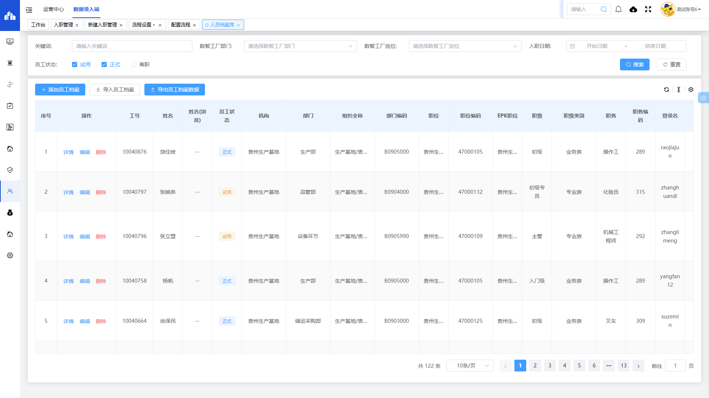
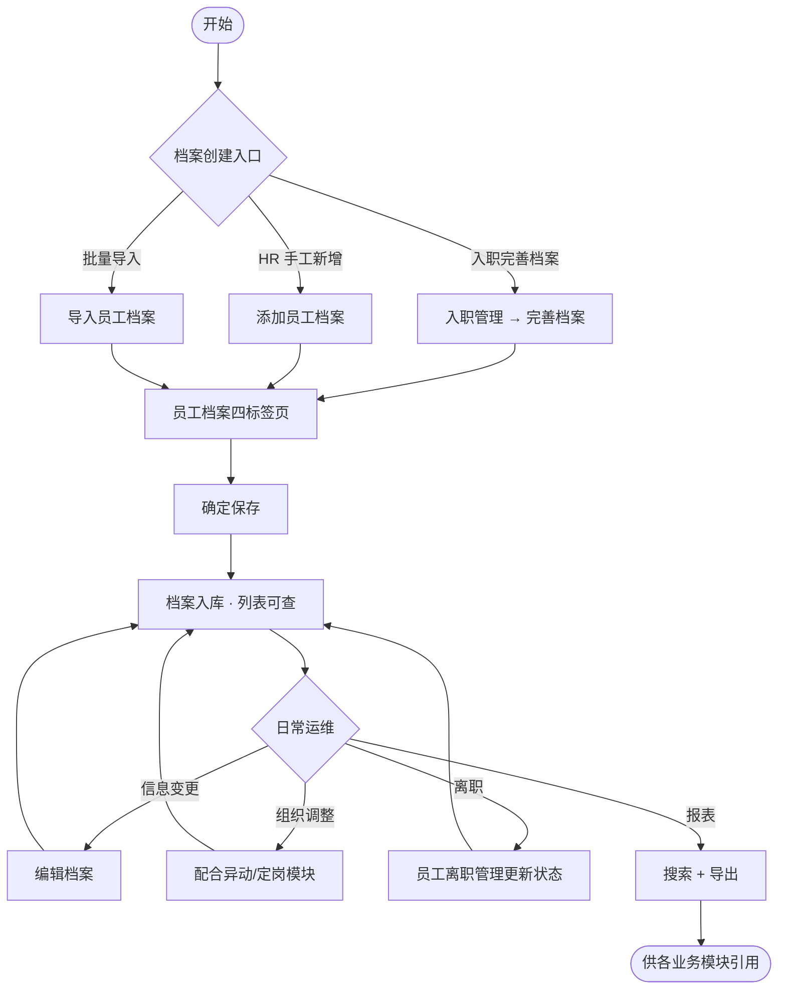
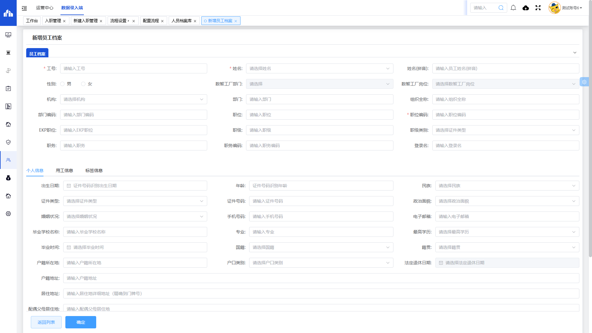
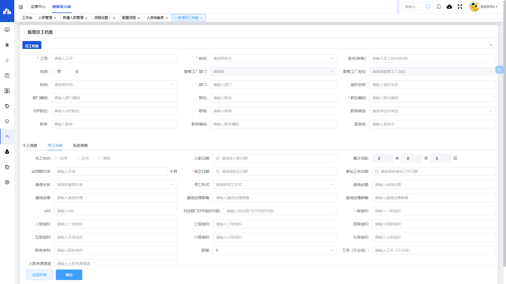
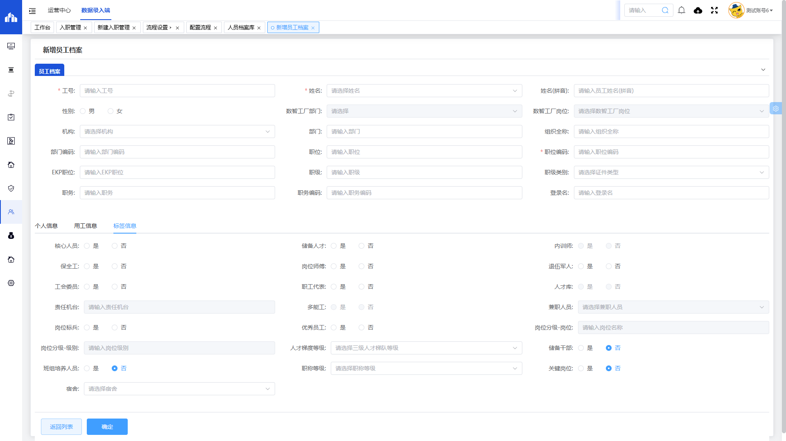
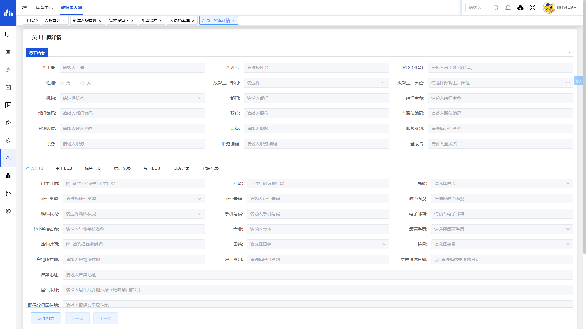
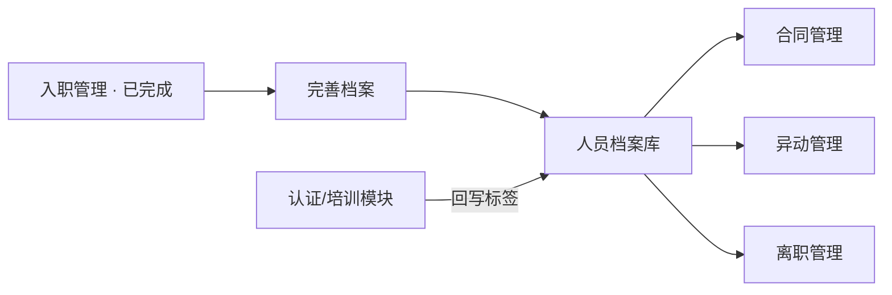

# 人员档案库

> **系统路径**：人事行政 → 人事管理 → 人员档案库  
> **页面路由**：`#/administration-manage/index10/index107/library`  
> **流程标识（workKey）**：无（主数据维护，不走审批流程

---

## 一、功能业务介绍

人员档案库是数智工厂的**员工主数据中心**，承载在职人员的组织任职、个人信息、用工信息与人才标签。人力资源部门可在此查询全员档案、手工新增或批量导入员工、编辑维护信息，并为合同签订、异动调动、离职退休等业务提供人员基础数据。

本表单与 [[入职管理]]（完善档案入口）、[[员工岗位管理]]（岗位字典）衔接；列表支持按关键词、部门、岗位、入职日期、员工状态筛选，并提供「添加员工档案」「导入员工档案」「导出员工档案数据」等操作。

### 页面入口/按钮入口

| 入口类型 | 入口位置 | 说明 |
|---------|---------|------|
| 菜单入口 | 人事行政 → 人事管理 → 人员档案库 | 进入档案列表页 |
| 添加员工档案 | 列表上方 **添加员工档案** | 跳转新增页（四标签页） |
| 导入员工档案 | 列表上方 **导入员工档案** | 按模板批量导入 |
| 导出员工档案数据 | 列表上方 **导出员工档案数据** | 导出当前筛选结果 |
| 搜索/重置 | 搜索区 **搜索** / **重置** | 组合查询或清空条件 |
| 详情 | 列表操作列 **详情** | 只读查看（`pageType=3`） |
| 编辑 | 列表操作列 **编辑** | 修改档案信息 |
| 删除 | 列表操作列 **删除** | 删除档案（须具权限） |
| 上游入口 | [[入职管理]] **完善档案** | 入职办结后创建/补全档案 |

---

## 二、业务流程与操作手册

人员档案库以**主数据维护**为核心，无单据审批环节；数据生命周期覆盖「创建 → 维护 → 状态变更（试用/正式/离职）→ 查询导出」。

### 2.1 实机员工状态枚举（贵州基地）

以下状态取自系统「员工状态」筛选项实机数据（复选框组）：

| 状态值 | 含义 |
|--------|------|
| 试用 | 试用期员工（默认勾选） |
| 正式 | 已转正在职员工（默认勾选） |
| 离职 | 已离职员工档案 |

### 2.2 端到端业务流程图

### 2.3 操作手册

本节说明从进入人员档案库到完成一条档案创建与日常维护的操作步骤。

---

#### 阶段 0：操作前准备

| 序号 | 准备项 | 菜单路径 | 操作要点 | 责任人 |
|------|--------|---------|---------|--------|
| 0.1 | 机构/部门 | 基础设置 | 确认组织字典完整 | HR 专员 |
| 0.2 | 岗位体系 | [[员工岗位管理]] | 职位、岗位编码可对应 | HR 专员 |
| 0.3 | 入职数据 | [[入职管理]] | 优先走「完善档案」减少重复录入 | HR 专员 |

---

#### 阶段 1：进入人员档案库列表

| 步骤 | 所在界面 | 具体操作 | 预期结果 |
|------|---------|---------|---------|
| 1.1 | 系统顶栏 | 鼠标移至 **人事行政** | 左侧出现子菜单 |
| 1.2 | 左侧菜单 | **人事管理** → **人员档案库** | 打开列表页 |
| 1.3 | 列表页 | 确认可见：**添加员工档案**、**导入员工档案**、**导出员工档案数据** | 页面加载完成 |
| 1.4 | 浏览器地址 | 核对路由为 `#/administration-manage/index10/index107/library` | 进入正确模块 |

**搜索区用法**：关键词 + 部门/岗位 + 入职日期 + 员工状态（试用/正式/离职）组合筛选。

---

#### 阶段 2：从入职管理完善档案（推荐路径）

| 步骤 | 所在界面 | 具体操作 | 预期结果 |
|------|---------|---------|---------|
| 2.1 | [[入职管理]] 列表 | 筛选「档案信息」= **未创建** | 定位待建档案入职单 |
| 2.2 | 入职管理列表 | 点击 **完善档案** | 跳转人员档案库新增/编辑页 |
| 2.3 | 档案新增页 | 系统带入工号、姓名、部门、证件等 | 减少手工录入 |
| 2.4 | 四标签页 | 补全组织、用工、标签等缺失字段 | — |
| 2.5 | 底部 | 点击 **确定** | 档案保存；入职单「档案信息」→ **已创建** |

---

#### 阶段 3：手工新增员工档案

| 步骤 | 所在界面 | 具体操作 | 预期结果 |
|------|---------|---------|---------|
| 3.1 | 列表工具栏 | 点击 **添加员工档案** | 页签「新增员工档案」 |
| 3.2 | 地址栏 | 确认 `libraryDetail?pageType=1` | 新增模式 |

**3.1 员工档案（第一标签页）**

| 步骤 | 字段 | 操作说明 |
|------|------|---------|
| 3.1.1 | ★ 工号、★ 姓名 | 填写唯一工号与真实姓名 |
| 3.1.2 | 组织任职 | 填写机构、部门、组织全称、职位、★ 职位编码等 |
| 3.1.3 | 数智工厂组织 | 选择数智工厂部门、岗位（可与 EPK 组织并行维护） |

**3.2 个人信息（第二标签页）**

填写证件、联系、教育、户籍、紧急联系人等；证件号码可用于计算年龄。

**3.3 用工信息（第三标签页）**

| 步骤 | 字段 | 操作说明 |
|------|------|---------|
| 3.3.1 | 入职日期、员工状态 | 按实际填写；状态可能随转正/离职流程变更 |
| 3.3.2 | ★ 转正日期 | 必填 |
| 3.3.3 | 经理与组织层级 | 填写直线/虚线经理及一级～七级组织 |

**3.4 标签信息（第四标签页）**

维护核心人员、储备人才、多能工、宿舍等标签；部分字段由其他业务模块认证后只读回写。

**3.5 保存**

| 步骤 | 操作 | 结果 |
|------|------|------|
| 3.5.1 | 点击 **确定** | 校验通过后返回列表，新档案可见 |
| 3.5.2 | 点击 **返回列表** | 不保存离开 |

---

#### 阶段 4：查看与编辑档案

| 步骤 | 操作 | 说明 |
|------|------|------|
| 4.1 | 列表 → **详情** | 只读查看四标签页全部信息 |
| 4.2 | 列表 → **编辑** | 修改可编辑字段后 **确定** |
| 4.3 | 详情页 | 路由含 `pageType=3` 为查看模式 |

---

#### 阶段 5：批量导入与导出

| 步骤 | 操作 | 说明 |
|------|------|------|
| 5.1 | **导入员工档案** | 下载模板 → 填写 → 上传；失败行按提示修正 |
| 5.2 | **导出员工档案数据** | 先设置搜索条件，再导出 Excel |

---

#### 阶段 6：删除档案（慎用）

| 步骤 | 操作 | 说明 |
|------|------|------|
| 6.1 | 列表 → **删除** | 须确认无合同、异动等下游引用 |
| 6.2 | 确认弹窗 | 删除后不可恢复 |

---

#### 阶段 7～10：日常维护与跨模块协作

| 阶段 | 场景 | 操作要点 |
|------|------|---------|
| 7 | 试用期转正 | 员工状态由试用变正式，更新转正日期（可能配合转正流程） |
| 8 | 组织异动 | 配合 [[异动申请管理]] / [[异动定岗管理]] 更新部门岗位 |
| 9 | 员工离职 | 配合 [[员工离职管理]]，状态变为 **离职** |
| 10 | 数据查询 | 按部门/状态/入职日期筛选 → 导出分析 |

#### 主路径操作一览

| 序号 | 阶段 | 关键按钮 | 操作角色 | 目标 |
|------|------|---------|---------|------|
| 1 | 入职带入 | 入职管理 → 完善档案 | HR 专员 | 档案草稿 |
| 2 | 补全 | 四标签页 → 确定 | HR 专员 | 档案已创建 |
| 3 | 维护 | 编辑 | HR 专员 | 信息更新 |
| 4 | 查询 | 搜索 / 导出 | HR 专员 | 数据分析 |

---

### 2.4 审批链条

人员档案库为**主数据维护表单**，**无 workKey**，不在「设置 → 流程设置」中配置审批流程。档案保存后立即生效。

> 涉及组织变更、离职等须审批的业务，在对应专项表单（异动申请、离职管理等）中走审批，审批通过后回写或关联更新档案库字段。

### 2.5 数据维护链条

---

## 三、权限与角色

| 角色 | 主要权限 | 典型操作 |
|------|---------|---------|
| **HR 专员** | 人员档案库读写 | 新增、编辑、导入、导出、完善档案 |
| **HR 经理** | 人员档案库读写 + 删除（视基地配置） | 审核类标签维护、敏感信息修改 |
| **部门负责人** | 通常只读或部分字段 | 查看本部门员工档案 |
| **系统管理员** | 全权限 | 导入大批量数据、删除异常档案 |

> 具体按钮权限以各基地角色配置为准。

---

## 四、核心实操场景

### 场景 1：新员工入职后建立档案（标准路径）

| 步骤 | 角色 | 操作 | 结果 |
|------|------|------|------|
| 1 | HR 专员 | [[入职管理]] 审批通过（已完成） | 入职单生效 |
| 2 | 账号负责人 | 开通系统账号 | 账号列 = 已开通 |
| 3 | HR 专员 | 点击 **完善档案** | 跳转档案库 |
| 4 | HR 专员 | 补全四标签页 → **确定** | 档案创建；入职档案信息 = 已创建 |

### 场景 2：批量导入历史员工

| 步骤 | 角色 | 操作 | 结果 |
|------|------|------|------|
| 1 | HR 专员 | 下载导入模板，按列规范整理 Excel | — |
| 2 | HR 专员 | **导入员工档案** → 上传文件 | 批量创建/更新 |
| 3 | HR 专员 | 列表抽查几条记录 **详情** 核对 | 导入质量确认 |

### 场景 3：在职员工信息变更

| 步骤 | 角色 | 操作 | 结果 |
|------|------|------|------|
| 1 | HR 专员 | 列表搜索目标员工 → **编辑** | 打开编辑页 |
| 2 | HR 专员 | 修改手机号码、居住地址等 | — |
| 3 | HR 专员 | **确定** 保存 | 列表即时更新 |

---

## 五、字段清单

### 5.1 列表搜索区

| 字段名称 | 类型 | 长度 | 约束条件 | 说明 |
|---------|------|------|----------|------|
| 关键词 | varchar | 50 | 否 | 模糊查询工号、姓名等 |
| 数智工厂部门 | varchar | 100 | 否 | 部门筛选 |
| 数智工厂岗位 | varchar | 100 | 否 | 岗位下拉筛选 |
| 入职日期（起） | date | - | 否 | 日期范围 |
| 入职日期（止） | date | - | 否 | 日期范围 |
| 员工状态 | varchar | 20 | 否 | 复选：试用、正式、离职（默认试用+正式） |

### 5.2 列表展示列（摘要）

列表字段较多，支持列设置显示/隐藏。以下为实机主要列：

| 字段名称 | 类型 | 说明 |
|---------|------|------|
| 序号 | int | 行号 |
| 操作 | - | 详情、编辑、删除 |
| 工号 | varchar | 员工工号 |
| 姓名 | varchar | 员工姓名 |
| 姓名(拼音) | varchar | 拼音姓名 |
| 员工状态 | varchar | 试用 / 正式 / 离职 |
| 机构、部门、组织全称、部门编码 | varchar | 组织信息 |
| 职位、职位编码、EPK职位 | varchar | 职位体系 |
| 职级、职级类别、职务、职务编码 | varchar | 职级职务 |
| 登录名 | varchar | 系统登录名 |
| 数智工厂部门、数智工厂岗位 | varchar | 数智工厂组织 |
| 雇佣关系、用工形式 | varchar | 用工类型 |
| 入职日期、转正日期 | date | 关键日期 |
| 性别、婚姻状况 | varchar | 基本信息 |
| 人才库、核心人员、储备人员等标签列 | varchar | 人才标签展示 |
| 出生日期、年龄、民族、证件类型、证件号码 | - | 身份信息 |
| 政治面貌、手机号码、电子邮箱 | - | 联系信息 |
| 毕业学校名称、专业、最高学历、毕业时间 | - | 教育信息 |
| 国籍、籍贯、户籍所在地、户口类别等 | - | 户籍信息 |
| 累计司龄、试用期月效、参加工作日期 | - | 用工信息 |
| 虚线经理、直线经理、直线经理邮箱 | - | 汇报关系 |
| 一级组织～七级组织、职务序列、职等 | - | 组织层级 |
| 多能工、关键岗位、宿舍等认证/标签列 | - | 扩展标签 |

> 完整列表列以实机「列设置」为准，上表覆盖贵州基地实机可见主要字段。

### 5.3 员工档案（新增/编辑 · 第一标签页）

| 字段名称 | 类型 | 约束条件 | 说明 |
|---------|------|----------|------|
| 工号 | varchar | 是 | 员工工号 |
| 姓名 | varchar | 是 | 员工姓名 |
| 姓名(拼音) | varchar | 否 | 拼音 |
| 性别 | varchar | 否 | 男 / 女 |
| 数智工厂部门 | varchar | 否 | 入职带入，部分场景禁用 |
| 数智工厂岗位 | varchar | 否 | 入职带入，部分场景禁用 |
| 机构 | varchar | 否 | 所属机构 |
| 部门 | varchar | 否 | 所属部门 |
| 组织全称 | varchar | 否 | 组织全路径 |
| 部门编码 | varchar | 否 | 部门编码 |
| 职位 | varchar | 否 | 职位名称 |
| 职位编码 | varchar | 是 | 职位编码 |
| EKP职位 | varchar | 否 | EKP 职位 |
| 职级 | varchar | 否 | 职级 |
| 职级类别 | varchar | 否 | 职级类别 |
| 职务 | varchar | 否 | 职务 |
| 职务编码 | varchar | 否 | 职务编码 |
| 登录名 | varchar | 否 | 系统登录名 |

### 5.4 个人信息（第二标签页）

| 字段名称 | 类型 | 约束条件 | 说明 |
|---------|------|----------|------|
| 出生日期 | date | 否 | 出生日期 |
| 年龄 | int | 否 | 可自动计算 |
| 民族 | varchar | 否 | 民族 |
| 证件类型 | varchar | 否 | 证件类型 |
| 证件号码 | varchar | 否 | 证件号码 |
| 政治面貌 | varchar | 否 | 政治面貌 |
| 婚姻状况 | varchar | 否 | 婚姻状况 |
| 手机号码 | varchar | 否 | 手机号 |
| 电子邮箱 | varchar | 否 | 邮箱 |
| 毕业学校名称 | varchar | 否 | 毕业学校 |
| 专业 | varchar | 否 | 专业 |
| 最高学历 | varchar | 否 | 最高学历 |
| 毕业时间 | date | 否 | 毕业时间 |
| 国籍 | varchar | 否 | 国籍 |
| 籍贯 | varchar | 否 | 籍贯 |
| 户籍所在地 | varchar | 否 | 户籍所在地 |
| 户口类别 | varchar | 否 | 户口类别 |
| 法定退休日期 | date | 否 | 根据规则自动计算，常禁用 |
| 户籍地址 | varchar | 否 | 户籍地址 |
| 居住地址 | varchar | 否 | 居住地址 |
| 配偶父母居住地 | varchar | 否 | 配偶父母居住地 |
| 配偶居住地 | varchar | 否 | 配偶居住地 |
| 党组织关系所在地 | varchar | 否 | 党组织关系所在地 |
| 家庭电话 | varchar | 否 | 家庭电话 |
| 办公地址 | varchar | 否 | 办公地址 |
| 紧急联系人 | varchar | 否 | 紧急联系人 |
| 与本人的关系 | varchar | 否 | 与本人关系 |
| 紧急联系人电话 | varchar | 否 | 紧急联系人电话 |
| 工作地点 | varchar | 否 | 工作地点 |

### 5.5 用工信息（第三标签页）

| 字段名称 | 类型 | 约束条件 | 说明 |
|---------|------|----------|------|
| 员工状态 | varchar | 否 | 试用/正式/离职，部分场景只读 |
| 入职日期 | date | 否 | 入职日期 |
| 累计司龄 | varchar | 否 | 自动计算，只读 |
| 试用期月效 | varchar | 否 | 试用期（个月） |
| 转正日期 | date | 是 | 转正日期 |
| 参加工作日期 | date | 否 | 参加工作日期 |
| 雇佣关系 | varchar | 否 | 如内部员工 |
| 用工形式 | varchar | 否 | 如合同用工 |
| 虚线经理 | varchar | 否 | 虚线经理 |
| 直线经理 | varchar | 否 | 直线经理 |
| 直线经理邮箱 | varchar | 否 | 直线经理邮箱 |
| 虚线经理邮箱 | varchar | 否 | 虚线经理邮箱 |
| 对应部门EPK组织代码 | varchar | 否 | EPK 组织代码 |
| 一级组织～七级组织 | varchar | 否 | 组织层级 |
| 职务序列 | varchar | 否 | 职务序列 |
| 职等 | varchar | 否 | 职等 |
| 入职来源渠道 | varchar | 否 | 入职来源 |

### 5.6 标签信息（第四标签页）

| 字段名称 | 类型 | 约束条件 | 说明 |
|---------|------|----------|------|
| 核心人员 | tinyint | 否 | 是 / 否 |
| 储备人才 | tinyint | 否 | 是 / 否 |
| 内训师 | tinyint | 否 | 部分只读，由认证模块回写 |
| 保全工 | tinyint | 否 | 是 / 否 |
| 岗位师傅 | tinyint | 否 | 是 / 否 |
| 退伍军人 | tinyint | 否 | 是 / 否 |
| 工会委员 | tinyint | 否 | 是 / 否 |
| 职工代表 | tinyint | 否 | 是 / 否 |
| 人才库 | tinyint | 否 | 部分只读 |
| 责任机台 | varchar | 否 | 部分只读 |
| 多能工 | tinyint | 否 | 部分只读 |
| 兼职人员 | varchar | 否 | 部分只读 |
| 岗位标兵 | tinyint | 否 | 是 / 否 |
| 优秀员工 | tinyint | 否 | 是 / 否 |
| 岗位分级-岗位/级别 | varchar | 否 | 部分只读 |
| 人才梯度等级 | varchar | 否 | 人才梯度 |
| 储备干部 | tinyint | 否 | 是 / 否 |
| 班组培养人员 | tinyint | 否 | 是 / 否 |
| 职称等级 | varchar | 否 | 职称等级 |
| 关键岗位 | tinyint | 否 | 是 / 否 |
| 宿舍 | varchar | 否 | 宿舍编号 |

---

## 六、业务规则

1. **R01**：工号、姓名、职位编码、转正日期为新增/编辑关键必填项（以实机校验为准）。
2. **R02**：员工状态枚举：**试用**、**正式**、**离职**；列表默认筛选试用+正式。
3. **R03**：累计司龄、法定退休日期等由系统根据入职日期/证件信息自动计算，一般为只读。
4. **R04**：数智工厂部门/岗位在从 [[入职管理]] 完善档案时通常由上游带入，部分场景字段禁用。
5. **R05**：内训师、多能工、人才库等标签字段可能由认证/培训模块回写，档案库侧只读展示。
6. **R06**：删除档案须具权限，且须确认无下游业务依赖（合同、异动等）。
7. **R07**：导入须使用系统提供的导入模板，字段格式须与模板一致。
8. **R08**：导出按当前搜索条件导出，大量数据建议缩小筛选范围后导出。
9. **R09**：人员档案库**无审批工作流**，保存后立即生效。
10. **R10**：与 [[入职管理]] 联动：入职单「完善档案」成功后，入职列表「档案信息」更新为 **已创建**。

---

## 七、业务状态

| 状态值 | 含义 |
|--------|------|
| 试用 | 试用期员工 |
| 正式 | 已转正在职员工 |
| 离职 | 已离职员工（历史档案保留） |

> 员工状态变更可能通过转正、[[员工离职管理]] 等专项流程触发，档案库展示最终状态。

---

## 八、关联表单

| 方向 | 关联表单 | 说明 |
|------|---------|------|
| 上游 | [[入职管理]] | 「完善档案」主要创建入口 |
| 字典 | [[员工岗位管理]] | 岗位、职位编码来源 |
| 下游 | [[合同管理]] | 引用员工任职信息签订合同 |
| 下游 | [[异动申请管理]] / [[异动定岗管理]] | 组织岗位变更 |
| 下游 | [[员工离职管理]] | 离职后员工状态变为离职 |
