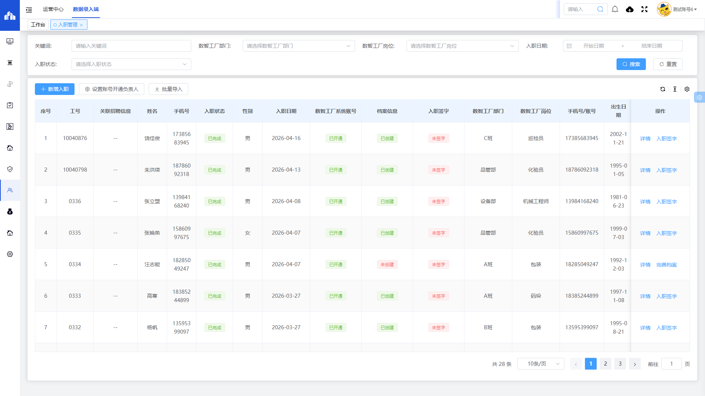
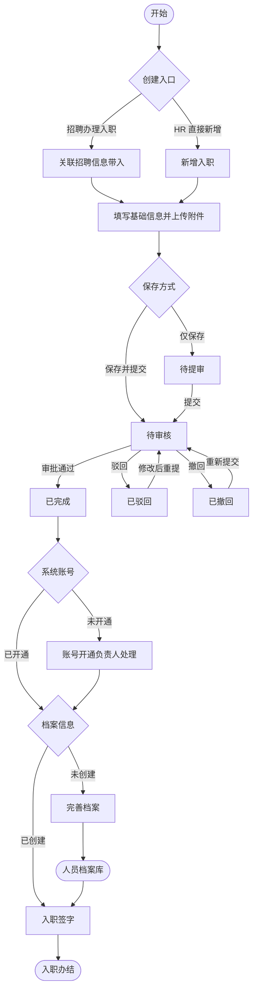
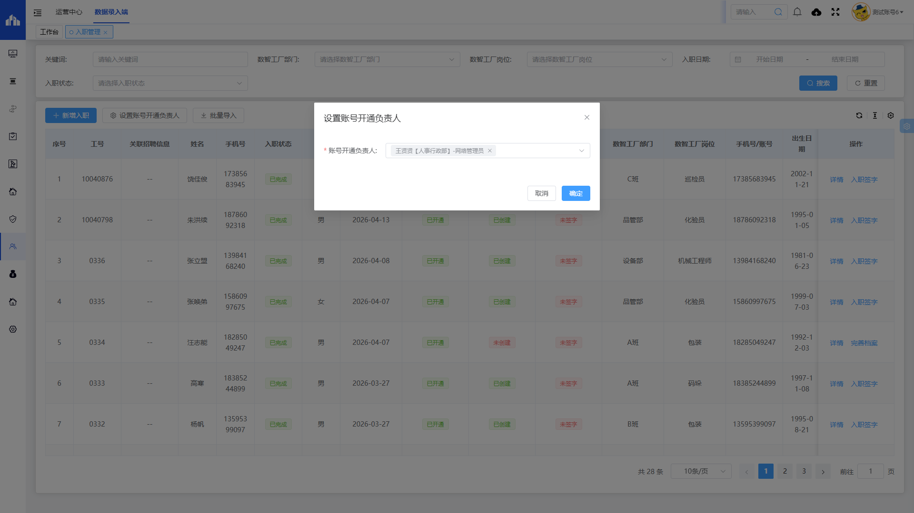
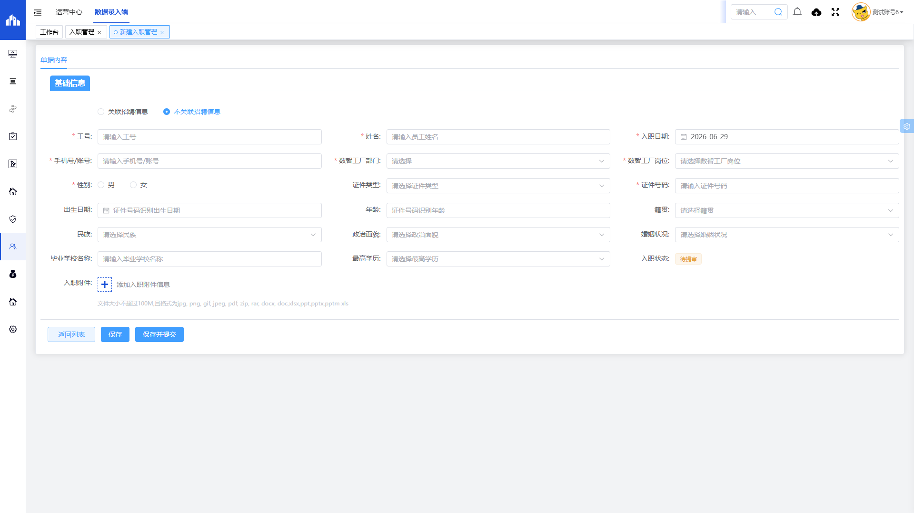
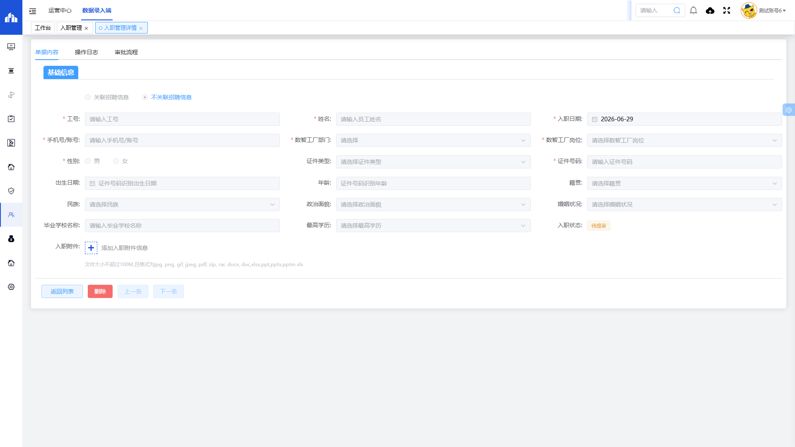
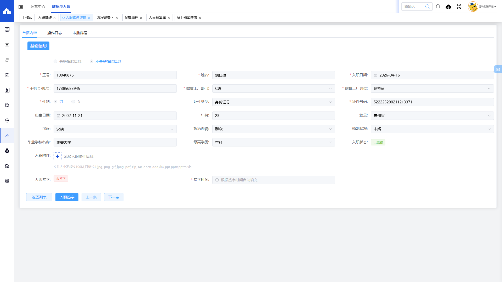
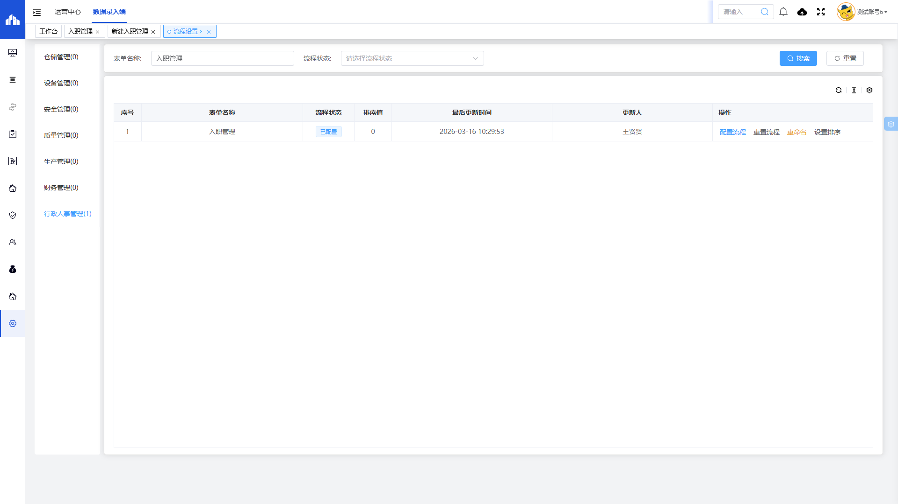
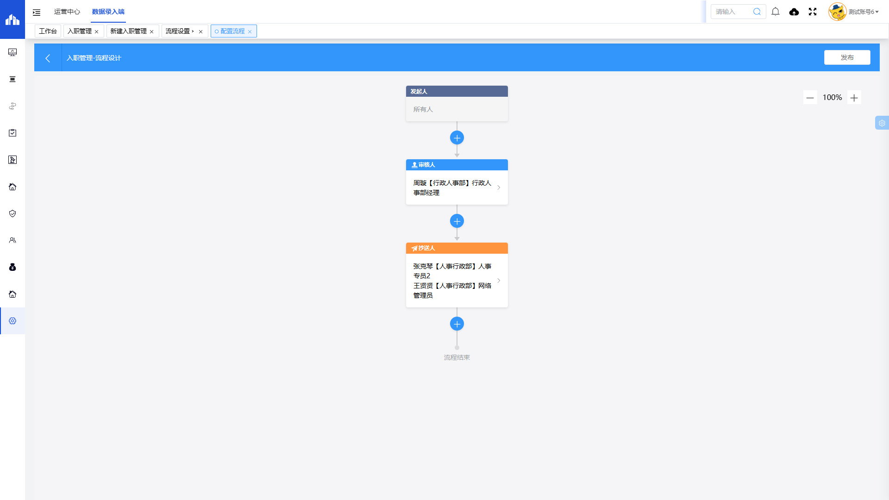
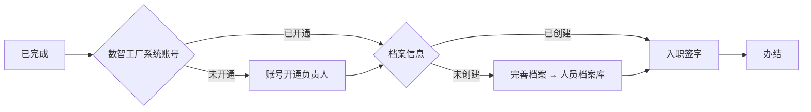

# 入职管理

> **系统路径**：人事行政 → 人事管理 → 入职管理  
> **页面路由**：`#/administration-manage/index10/index107/onboardin`  
> **流程标识（workKey）**：`hr_onboard_order`

---

## 一、功能业务介绍

入职管理用于办理新员工入职手续，是「招聘 → 入职 → 档案」链路中的核心环节。人力资源部门可在此创建入职单、提交审批，并在审批通过后协调账号开通、员工档案完善与入职电子签字。

本表单与 [[招聘管理]]（办理入职数据来源）、[[人员档案库]]（完善档案目标）衔接；列表支持按关键词、部门、岗位、入职日期、入职状态筛选，并提供「新增入职」「设置账号开通负责人」「批量导入」等操作。

### 页面入口/按钮入口

| 入口类型 | 入口位置 | 说明 |
|---------|---------|------|
| 菜单入口 | 人事行政 → 人事管理 → 入职管理 | 进入入职管理列表页 |
| 新增按钮 | 列表上方 **新增入职** | 跳转新增页面 |
| 设置账号开通负责人 | 列表上方 **设置账号开通负责人** | 弹窗设置全局账号开通处理人 |
| 批量导入 | 列表上方 **批量导入** | 按模板批量导入入职数据 |
| 搜索/重置 | 搜索区 **搜索** / **重置** | 组合查询或清空条件 |
| 详情 | 列表操作列 **详情** | 打开详情页，查看单据/日志/审批流程 |
| 入职签字 | 列表操作列 **入职签字** | 进入签字流程（已完成且未签字时） |
| 完善档案 | 列表操作列 **完善档案** | 跳转 [[人员档案库]]（档案未创建时） |
| 保存/保存并提交 | 新增/编辑页底部 | 保存为待提审或直接提交审批 |
| 删除 | 详情页底部 **删除** | 删除未办结单据（须具权限） |
| 上游入口 | [[招聘管理]] 列表 **办理入职** | 关联招聘信息并带入应聘者数据 |

---

## 二、业务流程与审批链条

入职管理采用**「单据审批 + 入职后处理」**机制：审批通过后，还须依次完成系统账号开通、员工档案创建、入职电子签字，方视为入职全流程办结。

### 2.1 实机入职状态枚举（贵州基地）

以下状态取自系统「入职状态」筛选项实机数据：

| 分类 | 状态值 | 含义 |
|------|--------|------|
| 单据审批 | 待提审 | 已保存未提交审批 |
| 单据审批 | 待审核 | 已提交，等待审批人处理 |
| 单据审批 | 已完成 | 审批通过，可办理账号/档案/签字 |
| 单据审批 | 已驳回 | 审批未通过，需修改后重提 |
| 单据审批 | 已撤回 | 发起人主动撤回 |

**列表辅助状态列**（非筛选项，实机列表展示）：

| 列名 | 实机枚举值 | 含义 |
|------|-----------|------|
| 数智工厂系统账号 | 已开通 / 未开通 | 系统登录账号开通情况 |
| 档案信息 | 已创建 / 未创建 | 人员档案是否已在档案库生成 |
| 入职签字 | 已签字 / 未签字 | 新员工电子签字完成情况 |

### 2.2 端到端业务流程图

### 2.3 操作手册

本节按 **2.2 端到端业务流程图** 主路径，逐步说明从打开入职管理到全流程办结的系统操作。角色权限见第三章。

---

#### 阶段 0：操作前准备

| 序号 | 准备项 | 菜单路径 | 操作要点 | 责任人 |
|------|--------|---------|---------|--------|
| 0.1 | 部门/岗位字典 | 基础设置相关菜单 | 确认「数智工厂部门」「数智工厂岗位」可选 | HR 专员 |
| 0.2 | 账号开通负责人 | 入职管理列表 → **设置账号开通负责人** | 弹窗选择负责人 → **确定** | HR 经理 |
| 0.3 | 审批流程 | 设置 → 流程设置 → 行政人事管理 → 入职管理 | 确认 `hr_onboard_order` 为「已配置」 | 系统管理员 |

---

#### 阶段 1：进入入职管理列表

| 步骤 | 所在界面 | 具体操作 | 预期结果 |
|------|---------|---------|---------|
| 1.1 | 系统顶栏 | 鼠标移至 **人事行政** | 左侧出现子菜单 |
| 1.2 | 左侧菜单 | 依次点击 **人事管理** → **入职管理** | 打开列表页 |
| 1.3 | 列表页 | 确认可见：**新增入职**、**设置账号开通负责人**、**批量导入** | 页面加载完成 |
| 1.4 | 浏览器地址 | 核对路由为 `#/administration-manage/index10/index107/onboardin` | 进入正确模块 |

**列表搜索区**：可按关键词、数智工厂部门/岗位、入职日期范围、入职状态组合查询。

---

#### 阶段 2：创建入职单

| 步骤 | 所在界面 | 具体操作 | 预期结果 |
|------|---------|---------|---------|
| 2.1 | 列表工具栏 | 点击 **新增入职** | 跳转新建页，页签「新建入职管理」 |
| 2.2 | 新建页地址栏 | 确认含 `detail?pageType=1` | 新增模式 |
| 2.3 | — | **或** 在 [[招聘管理]] 对已归档单据点击 **办理入职** | 自动关联招聘并带入字段 |

---

#### 阶段 3：填写并保存入职信息

| 步骤 | 字段分组 | 操作说明 | 注意事项 |
|------|---------|---------|---------|
| 3.1 | 关联信息 | 选择是否「关联招聘信息」 | 招聘入口通常已关联 |
| 3.2 | 基本信息 | 填写 ★ 工号、姓名、入职日期、手机号/账号 | 工号须符合基地编码规则 |
| 3.3 | 组织信息 | 选择 ★ 数智工厂部门、数智工厂岗位 | 岗位与部门联动 |
| 3.4 | 个人信息 | 选择 ★ 性别；填写证件类型、★ 证件号码 | 证件号可带出出生日期、年龄 |
| 3.5 | 教育信息 | 填写籍贯、民族、政治面貌、婚姻状况、毕业学校、最高学历 | 选填，建议与证件一致 |
| 3.6 | 附件 | 上传入职附件（选填） | 单文件 ≤100M |

| 步骤 | 操作 | 状态变化 |
|------|------|---------|
| 3.7 | 点击 **保存** | **待提审** |
| 3.8 | 点击 **保存并提交** | **待审核** |

---

#### 阶段 4：审批处理（待审核 → 已完成）

| 步骤 | 操作人 | 路径与操作 | 状态变化 |
|------|--------|-----------|---------|
| 4.1 | 审批人 | 工作台 → **我的待办** → 打开入职管理待办 | — |
| 4.2 | 审批人 | 审批页点击 **同意** | **已完成** |
| 4.3 | 审批人 | 审批页点击 **驳回** 并填写意见 | **已驳回** |
| 4.4 | HR 专员 | 修改单据后重新 **提交** | 回到 **待审核** |

---

#### 阶段 5：账号开通

| 步骤 | 操作人 | 具体操作 | 预期结果 |
|------|--------|---------|---------|
| 5.1 | 账号开通负责人 | 列表筛选「入职状态」= **已完成** | 定位待处理单据 |
| 5.2 | 账号开通负责人 | 查看「数智工厂系统账号」列 | **未开通** 时须处理 |
| 5.3 | 账号开通负责人 | 按基地规范开通系统账号 | 列值变为 **已开通** |

---

#### 阶段 6：完善员工档案

| 步骤 | 操作人 | 具体操作 | 预期结果 |
|------|--------|---------|---------|
| 6.1 | HR 专员 | 找到「档案信息」= **未创建** 的行 | 操作列显示 **完善档案** |
| 6.2 | HR 专员 | 点击 **完善档案** | 跳转 [[人员档案库]] 新增/编辑页 |
| 6.3 | HR 专员 | 补全员工档案、个人信息、用工信息、标签信息 | 返回列表后「档案信息」= **已创建** |

---

#### 阶段 7：入职签字与办结

| 步骤 | 操作人 | 具体操作 | 预期结果 |
|------|--------|---------|---------|
| 7.1 | 新员工 / HR | 列表 **入职签字** 或详情页 **入职签字** | 打开签字界面 |
| 7.2 | 新员工 | 完成电子签名 | 「入职签字」= **已签字** |
| 7.3 | HR 专员 | 核对：状态=已完成、账号=已开通、档案=已创建、签字=已签字 | **入职全流程办结** |

**办结判定**：四项后续指标全部达标后，该员工正式纳入在职人员管理，核心信息在 [[人员档案库]] 长期维护。

---

#### 阶段 8～10：辅助操作（查询、导入、删除）

| 阶段 | 功能 | 操作路径 |
|------|------|---------|
| 8 | 条件查询 | 搜索区填条件 → **搜索** / **重置** |
| 9 | 批量导入 | 列表 **批量导入** → 下载模板 → 上传 |
| 10 | 删除/切换 | 详情页 **删除**；**上一条/下一条** 浏览相邻单据 |

#### 主路径操作一览

| 序号 | 阶段 | 关键按钮 | 操作角色 | 目标状态 |
|------|------|---------|---------|---------|
| 1 | 新建 | 新增入职 → 保存 | HR 专员 | 待提审 |
| 2 | 提交 | 保存并提交 / 详情 → 提交 | HR 专员 | 待审核 |
| 3 | 审批 | 我的待办 → 同意 | 审批人 | 已完成 |
| 4 | 账号 | 账号开通负责人处理 | 网络管理员等 | 已开通 |
| 5 | 档案 | 完善档案 | HR 专员 | 档案已创建 |
| 6 | 签字 | 入职签字 | 新员工 | 已签字 |
| 7 | 办结 | — | — | 入职全流程完成 |

---

### 2.4 审批链条

工作流在 **设置 → 流程设置 → 行政人事管理 → 入职管理** 中配置，流程标识为 `hr_onboard_order`。

**贵州基地实机配置状态**：**已配置**（最后更新：2026-03-16）

**流程设计（实机）**：

| 节点序号 | 节点类型 | 配置内容 |
|---------|---------|---------|
| 1 | 发起人 | 所有人 |
| 2 | 审核人 | 行政人事部经理（实机：周璇） |
| 3 | 抄送人 | 人事专员、网络管理员等（实机：张克琴、王贤贤） |
| 4 | 流程结束 | — |

> 各基地审批人姓名可能不同，以本基地流程设计器实机配置为准。

### 2.5 入职后处理链条

审批通过（**已完成**）后，系统不在单据状态上再细分节点，而通过列表三列辅助字段驱动后续动作：

---

## 三、权限与角色

| 角色 | 主要菜单 | 典型操作 | 说明 |
|------|---------|---------|------|
| **HR 专员** | 入职管理 | 新增、编辑、提交、完善档案、协助签字 | 日常入职办理 |
| **行政人事部经理** | 入职管理 + 工作台待办 | 审批同意/驳回 | `hr_onboard_order` 审核节点 |
| **账号开通负责人** | 入职管理 + 账号管理 | 开通系统账号 | 列表预先配置，如实机：网络管理员 |
| **新员工** | 入职签字（授权） | 完成电子签字 | 可通过 HR 协助操作 |
| **系统管理员** | 流程设置 | 配置/调整 `hr_onboard_order` | 各基地审批链可能不同 |

---

## 四、核心实操场景

### 场景 1：招聘录用后办理入职

| 步骤 | 角色 | 操作 | 结果 |
|------|------|------|------|
| 1 | HR 专员 | [[招聘管理]] 筛选「已归档」→ **办理入职** | 跳转入职管理新建页，关联招聘信息 |
| 2 | HR 专员 | 补全工号、部门、岗位、入职日期 → **保存并提交** | 进入待审核 |
| 3 | 审批人 | 工作台待办 → **同意** | 已完成 |
| 4 | 各责任人 | 依次完成账号开通、完善档案、入职签字 | 全流程办结 |

### 场景 2：社招直接新增入职（不关联招聘）

| 步骤 | 角色 | 操作 | 结果 |
|------|------|------|------|
| 1 | HR 专员 | 入职管理 → **新增入职** | 新建页 |
| 2 | HR 专员 | 选择「不关联招聘信息」，填写全部必填项 | — |
| 3 | HR 专员 | **保存并提交** | 待审核 → 已完成（审批后） |
| 4 | HR 专员 | 后续账号、档案、签字同上 | 办结 |

### 场景 3：审批驳回后修改重提

| 步骤 | 角色 | 操作 | 结果 |
|------|------|------|------|
| 1 | HR 专员 | 列表筛选「入职状态」= **已驳回** | 定位单据 |
| 2 | HR 专员 | **详情** → 按驳回意见修改字段 | — |
| 3 | HR 专员 | 重新 **提交** | 回到 **待审核** |
| 4 | 审批人 | 待办 → **同意** | **已完成** |

---

## 五、字段清单

### 5.1 列表搜索区

| 字段名称 | 类型 | 长度 | 约束条件 | 说明 |
|---------|------|------|----------|------|
| 关键词 | varchar | 50 | 否 | 模糊查询工号、姓名等，占位符「请输入关键词」 |
| 数智工厂部门 | varchar | 100 | 否 | 部门筛选，占位符「请选择数智工厂部门」 |
| 数智工厂岗位 | varchar | 100 | 否 | 岗位下拉筛选 |
| 入职日期（起） | date | - | 否 | 日期范围，占位符「开始日期」 |
| 入职日期（止） | date | - | 否 | 日期范围，占位符「结束日期」 |
| 入职状态 | varchar | 20 | 否 | 下拉选择，见「业务状态」 |

### 5.2 列表展示列

| 字段名称 | 类型 | 长度 | 约束条件 | 说明 |
|---------|------|------|----------|------|
| 序号 | int | - | - | 列表行号 |
| 工号 | varchar | 50 | - | 员工工号 |
| 关联招聘信息 | varchar | 100 | - | 关联的招聘单据编号，无关联时为空 |
| 姓名 | varchar | 50 | - | 员工姓名 |
| 手机号 | varchar | 20 | - | 联系电话 |
| 入职状态 | varchar | 20 | - | 审批状态，见「业务状态」 |
| 性别 | varchar | 4 | - | 男 / 女 |
| 入职日期 | date | - | - | 入职日期 |
| 数智工厂系统账号 | varchar | 20 | - | 已开通 / 未开通 |
| 档案信息 | varchar | 20 | - | 已创建 / 未创建 |
| 入职签字 | varchar | 20 | - | 已签字 / 未签字 |
| 数智工厂部门 | varchar | 100 | - | 部门名称 |
| 数智工厂岗位 | varchar | 100 | - | 岗位名称 |
| 手机号/账号 | varchar | 20 | - | 登录账号 |
| 出生日期 | date | - | - | 出生日期 |
| 籍贯 | varchar | 50 | - | 籍贯 |
| 民族 | varchar | 20 | - | 民族 |
| 政治面貌 | varchar | 50 | - | 政治面貌 |
| 最高学历 | varchar | 20 | - | 最高学历 |
| 毕业学校 | varchar | 100 | - | 毕业学校 |
| 证件类型 | varchar | 50 | - | 证件类型 |
| 证件号码 | varchar | 18 | - | 证件号码 |
| 操作 | - | - | - | 详情、入职签字、完善档案（按状态显示） |

### 5.3 基础信息（主表）

| 字段名称 | 类型 | 长度 | 约束条件 | 说明 |
|---------|------|------|----------|------|
| 关联招聘信息 | tinyint | 1 | 是 | 1=关联招聘信息，0=不关联招聘信息 |
| 工号 | varchar | 50 | 是 | 员工工号 |
| 姓名 | varchar | 50 | 是 | 员工姓名 |
| 入职日期 | date | - | 是 | 入职日期 |
| 手机号/账号 | varchar | 20 | 是 | 手机号兼系统账号 |
| 数智工厂部门 | varchar | 100 | 是 | 数智工厂部门 |
| 数智工厂岗位 | varchar | 100 | 是 | 数智工厂岗位 |
| 性别 | tinyint | 1 | 是 | 1=男，2=女 |
| 证件类型 | varchar | 50 | 否 | 如身份证号 |
| 证件号码 | varchar | 18 | 是 | 支持识别出生日期、年龄 |
| 出生日期 | date | - | 否 | 可随证件号自动填充 |
| 年龄 | int | 3 | 否 | 可随证件号自动填充 |
| 籍贯 | varchar | 50 | 否 | 籍贯 |
| 民族 | varchar | 20 | 否 | 民族 |
| 政治面貌 | varchar | 50 | 否 | 政治面貌 |
| 婚姻状况 | varchar | 20 | 否 | 婚姻状况 |
| 毕业学校名称 | varchar | 100 | 否 | 毕业学校 |
| 最高学历 | varchar | 20 | 否 | 最高学历 |
| 入职状态 | varchar | 20 | 否 | 系统维护，新建默认「待提审」 |
| 入职附件 | varchar | 255 | 否 | 附件路径；≤100M；支持 jpg/png/gif/jpeg/pdf/zip/rar/docx/doc/xlsx/ppt/pptx/pptm/xls |
| 入职签字 | tinyint | 1 | 否 | 0=未签字，1=已签字 |
| 签字时间 | datetime | - | 否 | 签字后自动填充 |

---

## 六、业务规则

1. **R01**：工号、姓名、入职日期、手机号/账号、数智工厂部门、数智工厂岗位、性别、证件号码为必填字段。
2. **R02**：关联招聘信息枚举：关联招聘信息 / 不关联招聘信息；从 [[招聘管理]]「办理入职」进入时自动关联。
3. **R03**：性别枚举：男 / 女。
4. **R04**：入职状态流转：待提审 → 待审核 → 已完成；驳回返回待提审/可编辑后重提；支持已撤回。
5. **R05**：证件号码可自动识别并填充出生日期、年龄。
6. **R06**：入职附件限制：单文件 ≤100M，格式见字段说明。
7. **R07**：入职状态 = **已完成** 且「数智工厂系统账号」= **未开通** 时，由账号开通负责人处理开通。
8. **R08**：「档案信息」= **未创建** 时，列表显示 **完善档案**，跳转 [[人员档案库]] 创建档案。
9. **R09**：「入职签字」= **未签字** 时，须新员工或授权人完成电子签字，签字时间自动记录。
10. **R10**：办结判定：入职状态 = **已完成**，且账号 = **已开通**，档案 = **已创建**，签字 = **已签字**。

---

## 七、业务状态

### 入职状态（审批）

| 状态值 | 含义 |
|--------|------|
| 待提审 | 入职单已创建或保存，尚未提交审批 |
| 待审核 | 已提交，等待审批人处理 |
| 已完成 | 审批通过，进入账号/档案/签字后续环节 |
| 已驳回 | 审批未通过，需修改后重新提交 |
| 已撤回 | 发起人主动撤回 |

### 辅助状态列（列表展示）

| 列名 | 枚举值 | 含义 |
|------|--------|------|
| 数智工厂系统账号 | 已开通 / 未开通 | 系统登录账号是否已创建 |
| 档案信息 | 已创建 / 未创建 | 是否已在 [[人员档案库]] 生成档案 |
| 入职签字 | 已签字 / 未签字 | 新员工是否完成入职电子签字 |

---

## 八、关联表单

| 方向 | 关联表单 | 说明 |
|------|---------|------|
| 上游 | [[招聘管理]] | 「办理入职」带入应聘者信息，减少重复录入 |
| 下游 | [[人员档案库]] | 「完善档案」生成正式员工档案，长期人事主数据 |
| 配置 | 流程设置（`hr_onboard_order`） | 配置入职审批链条 |
| 配置 | 账号开通负责人 | 列表上方弹窗配置 |
