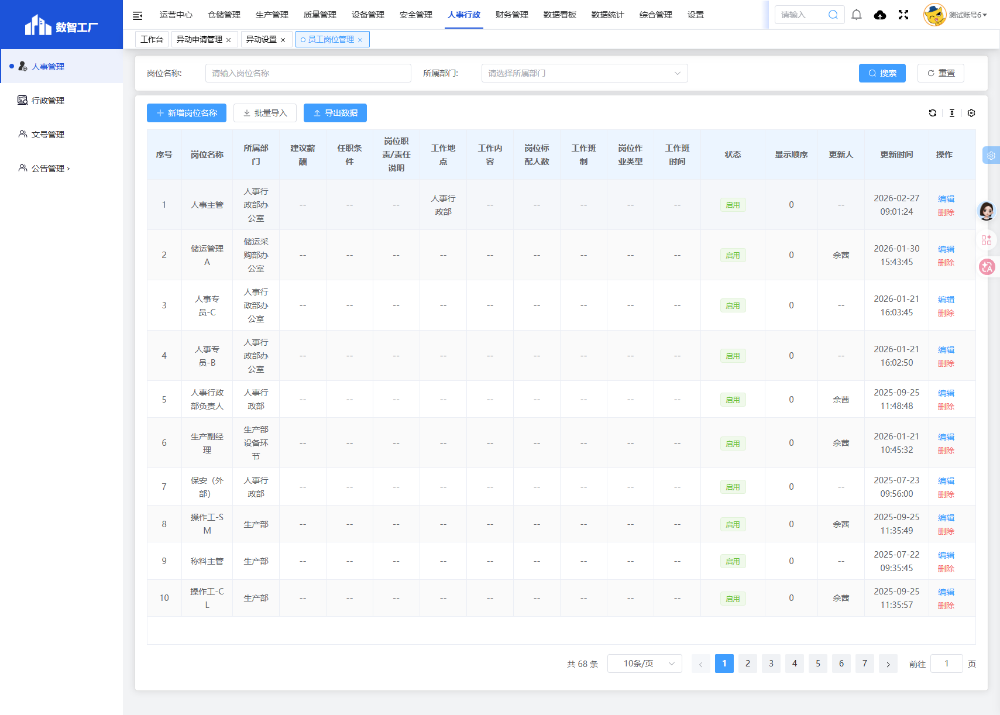
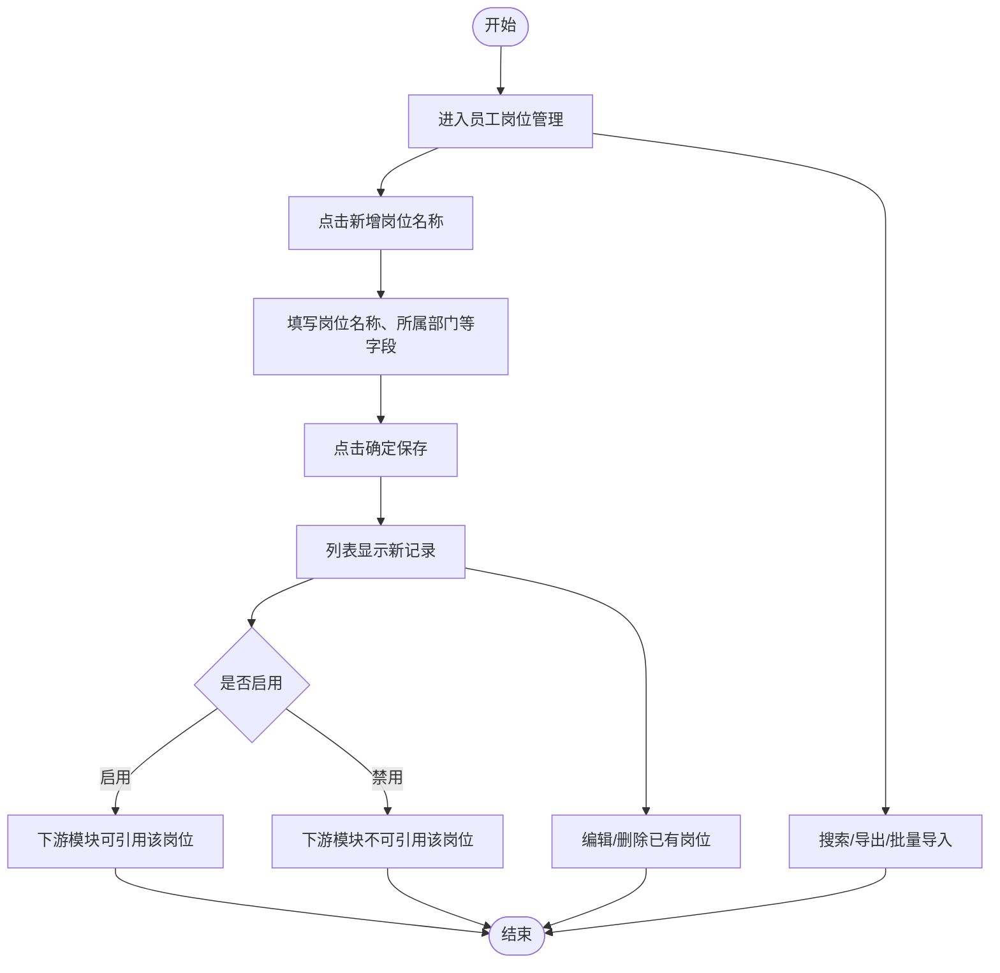
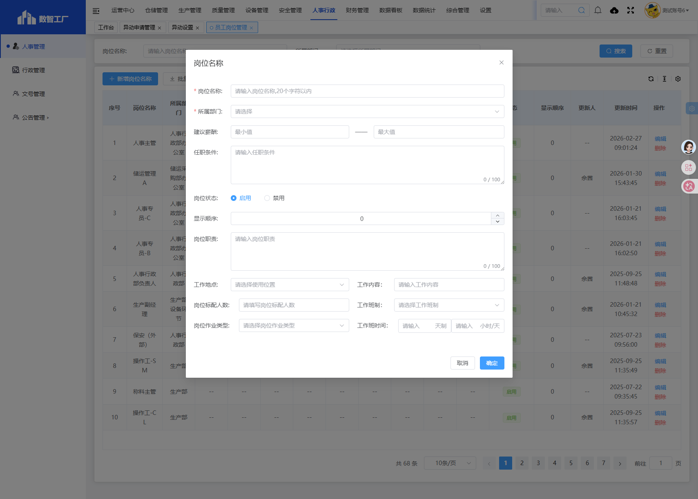
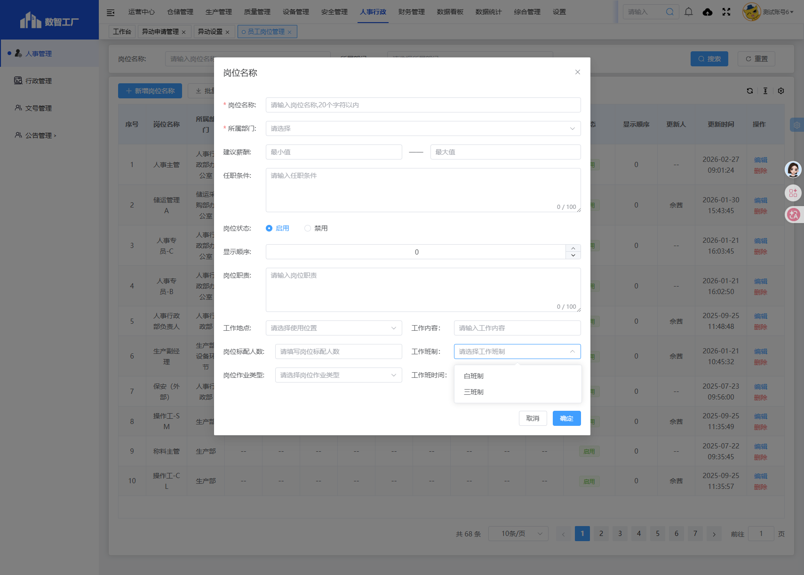
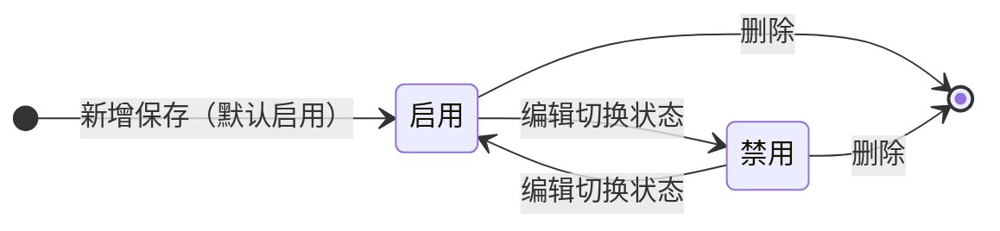
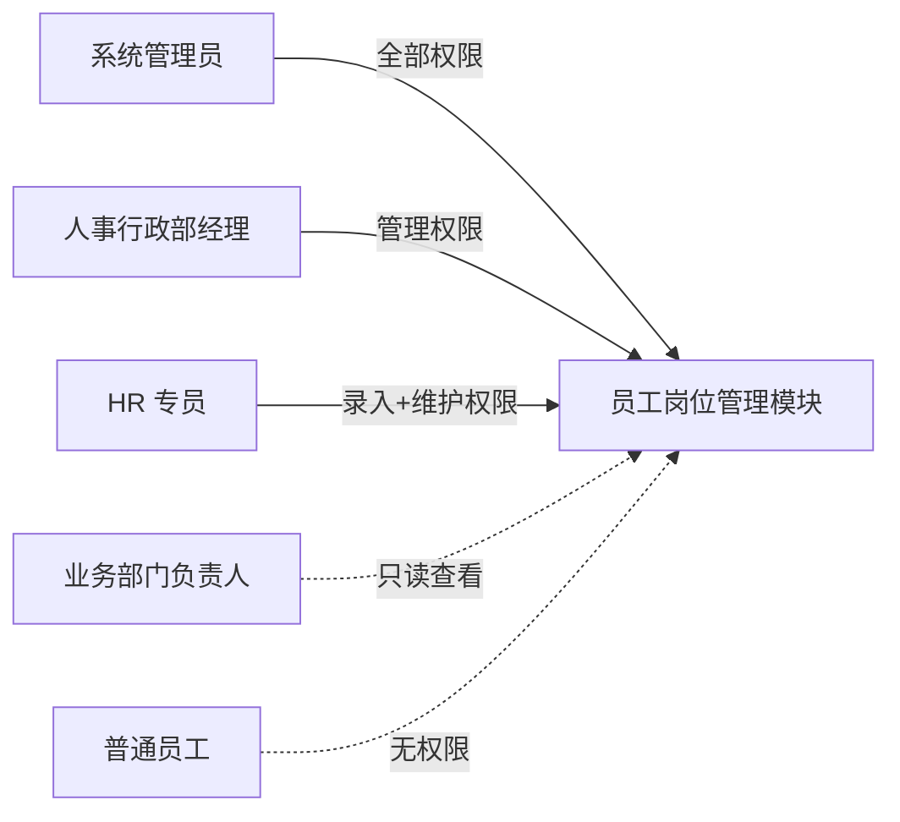

# 员工岗位管理

> **系统路径**：人事行政 → 人事管理 → 员工岗位管理
> **页面路由**：`#/administration-manage/index10/index107/post`
> **流程标识（workKey）**：无（字典配置模块，无审批流程）

---

## 功能业务介绍

员工岗位管理是「人事行政 → 人事管理」下的岗位字典维护模块，用于登记和维护企业各岗位的基础信息，包括岗位名称、所属部门、建议薪酬、任职条件、岗位职责、工作地点、工作内容、岗位标配人数、工作班制、岗位作业类型、工作班时间等。

本模块为下游模块提供岗位字典支撑：异动申请管理引用岗位作为异动前/后职务，异动定岗提醒引用岗位作为提醒关联岗位，员工档案管理引用岗位作为员工职务。列表页支持按「岗位名称」搜索，提供**新增岗位名称**、**批量导入**、**导出数据**操作。本模块无审批流程，保存即生效。

### 页面入口/按钮入口

| 入口类型 | 入口位置 | 说明 |
|---------|---------|------|
| 菜单入口 | 人事行政 → 人事管理 → 员工岗位管理 | 进入员工岗位管理列表页 |
| 新增按钮 | 列表上方**新增岗位名称** | 弹出新增对话框，填写岗位信息 |
| 批量导入 | 列表上方**批量导入** | 按模板批量导入岗位数据 |
| 导出数据 | 列表上方**导出数据** | 按当前筛选条件导出 Excel |
| 搜索按钮 | 搜索区**搜索** | 按岗位名称模糊查询 |
| 重置按钮 | 搜索区**重置** | 清空搜索条件，恢复全部列表 |
| 编辑按钮 | 列表操作列**编辑** | 弹出编辑对话框，修改岗位字段 |
| 删除按钮 | 列表操作列**删除** | 二次确认后删除该岗位 |

---

## 业务流程与操作手册

员工岗位管理为**单层字典配置机制**：HR 专员新增岗位 → 填写岗位信息 → 保存即生效 → 下游模块引用岗位字典。无审批流程，无状态流转，仅「启用/禁用」控制是否在下游模块中可用。

### 员工岗位管理状态枚举

以下状态取自系统实机数据：

| 分类 | 状态值 | 含义 |
|------|--------|------|
| 岗位状态 | 启用 | 岗位生效，下游模块可引用 |
| 岗位状态 | 禁用 | 岗位失效，下游模块不可引用，但历史数据保留 |

### 端到端业务流程图

### 操作手册

> **适用说明**：员工岗位管理为字典配置模块，无审批流程，所有操作保存即生效。需先完成部门组织架构维护，再新增岗位。

#### 阶段 0：操作前准备

| 序号 | 准备项 | 菜单路径 | 操作要点 | 责任人 |
|------|--------|---------|---------|--------|
| 0.1 | 部门已维护 | 系统管理 → 组织架构 | 确认所需部门已新增，岗位「所属部门」需引用 | 系统管理员 / HR 专员 |
| 0.2 | 岗位需求确认 | — | 与各业务部门确认岗位名称、任职条件、岗位职责、工作班制等 | HR 专员 / 业务部门 |
| 0.3 | 工作地点字典 | 人事行政 → 人事管理 → 异动设置 → 工作地点 | 确认工作地点字典已维护（如「湖北咸宁」） | HR 专员 |

#### 阶段 1：进入员工岗位管理列表

| 步骤 | 所在界面 | 具体操作 | 预期结果 |
|------|---------|---------|---------|
| 1.1 | 系统顶栏 | 鼠标移至 **人事行政**，点击展开 | 左侧出现人事行政子菜单 |
| 1.2 | 左侧菜单 | 依次点击 **人事管理** → **员工岗位管理** | 打开员工岗位管理列表页 |
| 1.3 | 列表页 | 确认可见：**新增岗位名称**、**批量导入**、**导出数据**、搜索区、列表数据 | 页面加载完成 |
| 1.4 | 浏览器地址 | 核对路由为 `#/administration-manage/index10/index107/post` | 进入正确模块 |
| 1.5 | 列表底部 | 确认数据总量与页数（当前共 68 条，7 页） | 数据加载正常 |

#### 阶段 2：新建岗位

| 步骤 | 所在界面 | 具体操作 | 预期结果 |
|------|---------|---------|---------|
| 2.1 | 列表工具栏 | 点击 **新增岗位名称** | 弹出「岗位名称」对话框 |
| 2.2 | 对话框 | 观察对话框标题为「岗位名称」，含 **取消**、**确定** 按钮 | 进入新增模式 |

#### 阶段 3：填写并保存岗位信息

新建对话框自上而下包含：基本信息、薪酬与条件、工作安排三大区域。

**3.1 基本信息**

| 步骤 | 字段 | 操作说明 | 注意事项 |
|------|------|---------|---------|
| 3.1.1 | 岗位名称* | 输入岗位名称（如「人事主管」） | 必填 |
| 3.1.2 | 所属部门* | 输入/选择所属部门（如「人事行政部办公室」） | 必填 |
| 3.1.3 | 岗位状态 | 选择「启用」或「禁用」（默认启用） | 控制下游模块是否可引用 |
| 3.1.4 | 显示顺序 | 输入数字（默认 0） | 控制列表排序，数字越小越靠前 |

**3.2 薪酬与条件**

| 步骤 | 字段 | 操作说明 | 注意事项 |
|------|------|---------|---------|
| 3.2.1 | 建议薪酬 | 左侧输入框填最低薪酬，右侧输入框填最高薪酬，以「——」分隔 | 非必填 |
| 3.2.2 | 任职条件 | 输入任职条件（限 100 字） | 非必填，显示「0/100」字数计数 |
| 3.2.3 | 岗位职责 | 输入岗位职责（限 100 字） | 非必填，显示「0/100」字数计数 |

**3.3 工作安排**

| 步骤 | 字段 | 操作说明 | 注意事项 |
|------|------|---------|---------|
| 3.3.1 | 工作地点 | 输入工作地点（如「人事行政部」） | 非必填 |
| 3.3.2 | 工作内容 | 输入工作内容描述 | 非必填 |
| 3.3.3 | 岗位标配人数 | 输入岗位标配人数 | 非必填 |
| 3.3.4 | 工作班制 | 下拉选择：白班制 / 三班制 | 非必填 |
| 3.3.5 | 岗位作业类型 | 下拉选择：固定 / 流动 | 非必填 |
| 3.3.6 | 工作班时间 | 左侧输入框填「天制」（天数），右侧输入框填「小时/天」（每天小时数） | 非必填 |

**3.4 保存单据**

| 步骤 | 操作 | 预期结果 |
|------|------|---------|
| 3.4.1 | 点击 **确定** | 系统校验必填项（岗位名称、所属部门），通过后关闭弹窗，列表新增一行 |
| 3.4.2 | 点击 **取消** | 不保存，关闭弹窗 |

**常见保存失败原因**：岗位名称漏填、所属部门漏填。

#### 阶段 4：编辑岗位

| 步骤 | 所在界面 | 具体操作 | 预期结果 |
|------|---------|---------|---------|
| 4.1 | 列表页 | 找到目标岗位，点击操作列 **编辑** | 弹出编辑对话框，字段预填当前值 |
| 4.2 | 对话框 | 修改需要变更的字段 | — |
| 4.3 | 对话框 | 点击 **确定** | 保存修改，列表刷新，更新人和更新时间变更 |

#### 阶段 5：删除岗位

| 步骤 | 所在界面 | 具体操作 | 预期结果 |
|------|---------|---------|---------|
| 5.1 | 列表页 | 找到目标岗位，点击操作列 **删除** | 弹出二次确认提示 |
| 5.2 | 确认弹窗 | 点击 **确定** | 删除该岗位，列表刷新 |
| 5.3 | 确认弹窗 | 点击 **取消** | 不删除，关闭弹窗 |

> **注意**：已被下游模块（异动申请、员工档案等）引用的岗位删除后，可能影响历史数据展示，建议优先使用「禁用」而非「删除」。

#### 阶段 6：批量导入

| 步骤 | 所在界面 | 具体操作 | 预期结果 |
|------|---------|---------|---------|
| 6.1 | 列表工具栏 | 点击 **批量导入** | 弹出导入对话框 |
| 6.2 | 导入对话框 | 下载导入模板，按模板填写岗位数据 | — |
| 6.3 | 导入对话框 | 上传填写好的模板文件 | 系统校验并导入数据 |

#### 阶段 7：导出数据

| 步骤 | 所在界面 | 具体操作 | 预期结果 |
|------|---------|---------|---------|
| 7.1 | 列表工具栏 | 点击 **导出数据** | 按当前筛选条件导出 Excel 文件 |
| 7.2 | 浏览器 | 确认下载文件 | 导出当前列表数据 |

#### 阶段 8：搜索与筛选

| 步骤 | 所在界面 | 具体操作 | 预期结果 |
|------|---------|---------|---------|
| 8.1 | 搜索区 | 在「岗位名称」输入框输入关键字 | 模糊搜索岗位名称 |
| 8.2 | 搜索区 | 点击 **搜索** | 列表显示匹配结果 |
| 8.3 | 搜索区 | 点击 **重置** | 清空搜索条件，恢复全部列表 |

#### 阶段 9：辅助操作速查

| 功能 | 操作路径 | 适用场景 |
|------|---------|---------|
| 翻页 | 列表底部页码/上一页/下一页 | 查看更多岗位（当前共 68 条，7 页） |
| 调整每页条数 | 列表底部 **10条/页** 下拉 | 切换每页显示条数（10/20/40/50/100/300） |
| 跳转指定页 | 列表底部页码输入框 | 输入页码直达 |

#### 主路径操作一览

| 流程图节点 | 阶段 | 关键操作 | 操作角色 | 目标状态 |
|-----------|------|---------|---------|---------|
| 进入员工岗位管理 | 1 | 菜单进入 → 核对路由 | HR 专员 | — |
| 新建岗位 | 2～3 | **新增岗位名称** → 填表 → **确定** | HR 专员 | 启用/禁用 |
| 编辑岗位 | 4 | **编辑** → 修改 → **确定** | HR 专员 | 启用/禁用 |
| 删除岗位 | 5 | **删除** → 确认 | HR 专员 | 已删除 |
| 批量导入 | 6 | **批量导入** → 上传模板 | HR 专员 | — |
| 导出数据 | 7 | **导出数据** | HR 专员 | — |
| 搜索筛选 | 8 | 输入关键字 → **搜索** | HR 专员 | — |

### 审批链条（工作流层）

本模块为字典配置模块，**无审批流程**，无 workKey，新增/编辑/删除保存后立即生效。

---

## 字段清单

### 一、列表搜索区

| 字段名称 | 类型 | 约束条件 | 说明 |
|---------|------|----------|------|
| 岗位名称 | 文本输入框 | 非必填 | 模糊搜索岗位名称 |
| 所属部门 | 文本输入框（只读） | 非必填 | 只读展示，待确认是否支持选择筛选 |

### 二、列表展示列

| 字段名称 | 类型 | 约束条件 | 说明 |
|---------|------|----------|------|
| 序号 | 数字 | 系统自动生成 | 行号 |
| 岗位名称 | 文本 | 必填 | 岗位名称 |
| 所属部门 | 文本 | 必填 | 所属部门 |
| 建议薪酬 | 文本 | 非必填 | 薪酬范围，无内容显示「--」 |
| 任职条件 | 文本 | 非必填 | 任职条件，无内容显示「--」 |
| 岗位职责/责任说明 | 文本 | 非必填 | 岗位职责，无内容显示「--」 |
| 工作地点 | 文本 | 非必填 | 工作地点，无内容显示「--」 |
| 工作内容 | 文本 | 非必填 | 工作内容，无内容显示「--」 |
| 岗位标配人数 | 数字 | 非必填 | 岗位标配人数，无内容显示「--」 |
| 工作班制 | 枚举 | 非必填 | 白班制/三班制，无内容显示「--」 |
| 岗位作业类型 | 枚举 | 非必填 | 固定/流动，无内容显示「--」 |
| 工作班时间 | 文本 | 非必填 | 由「天制」和「小时/天」组成，无内容显示「--」 |
| 状态 | 枚举 | 必填 | 启用/禁用 |
| 显示顺序 | 数字 | 必填 | 排序序号 |
| 更新人 | 文本 | 系统自动 | 最后更新人，无内容显示「--」 |
| 更新时间 | 日期时间 | 系统自动 | 最后更新时间 |
| 操作 | 操作列 | — | 编辑、删除 |

### 三、新增/编辑弹窗字段

| 字段名称 | 类型 | 长度 | 约束条件 | 说明 |
|---------|------|------|----------|------|
| 岗位名称 | 文本输入框 | - | 必填 | 岗位名称，如「人事主管」「操作工-SM」 |
| 所属部门 | 文本输入框 | - | 必填 | 所属部门，如「人事行政部办公室」 |
| 建议薪酬 | 文本输入框（两个，以「——」分隔） | - | 非必填 | 薪酬范围，左侧填最低、右侧填最高 |
| 任职条件 | 多行文本框 | 100 | 非必填 | 任职条件，显示「0/100」字数计数 |
| 岗位状态 | 单选按钮 | - | 必填 | 启用（默认）/禁用 |
| 显示顺序 | 数字输入框 | - | 必填 | 控制列表排序，数字越小越靠前，默认 0 |
| 岗位职责 | 多行文本框 | 100 | 非必填 | 岗位职责，显示「0/100」字数计数 |
| 工作地点 | 文本输入框 | - | 非必填 | 工作地点，如「人事行政部」 |
| 工作内容 | 文本输入框 | - | 非必填 | 工作内容描述 |
| 岗位标配人数 | 文本输入框 | - | 非必填 | 岗位标配人数 |
| 工作班制 | 下拉选择框 | - | 非必填 | 选项：白班制、三班制 |
| 岗位作业类型 | 下拉选择框 | - | 非必填 | 选项：固定、流动 |
| 工作班时间 | 文本输入框（两个，分别标注「天制」「小时/天」） | - | 非必填 | 左侧填天数（天制），右侧填每天小时数（小时/天） |

### 四、系统通用字段

| 字段名称 | 类型 | 说明 |
|---------|------|------|
| 序号 | 数字 | 系统自动生成行号 |
| 更新人 | 文本 | 系统自动记录最后更新人 |
| 更新时间 | 日期时间 | 系统自动记录最后更新时间 |
| 操作 | 操作列 | 编辑、删除（按权限显示） |

---

## 业务规则

1. **R01**：员工岗位管理为字典配置模块，无审批流程，新增/编辑保存后立即生效。
2. **R02**：「岗位名称」和「所属部门」为必填项，其他字段均为非必填。
3. **R03**：「岗位状态」控制岗位在下游模块中的可用性：启用=可引用，禁用=不可引用但历史数据保留。
4. **R04**：「建议薪酬」由两个文本输入框组成，以「——」分隔，分别填写最低和最高薪酬，非必填。
5. **R05**：「任职条件」和「岗位职责」为多行文本框，限 100 字，弹窗内显示「0/100」字数计数。
6. **R06**：「工作班制」下拉选项为：白班制、三班制（实机枚举值）。
7. **R07**：「岗位作业类型」下拉选项为：固定、流动（实机枚举值）。
8. **R08**：「工作班时间」由两个输入框组成，左侧标注「天制」（填写天数），右侧标注「小时/天」（填写每天工作小时数）。
9. **R09**：「显示顺序」为数字，控制列表排序，数字越小越靠前，默认值为 0。
10. **R10**：列表支持按「岗位名称」模糊搜索；「所属部门」搜索框为只读，待确认筛选机制。
11. **R11**：列表支持**批量导入**和**导出数据**操作。
12. **R12**：删除岗位需二次确认；已被下游模块引用的岗位删除后可能影响历史数据展示，建议优先使用「禁用」。
13. **R13**：当前实机数据共 68 条岗位记录，涵盖人事行政部、储运采购部、生产部等部门岗位（如人事主管、储运管理A、操作工-SM、称料主管等）。

---

## 业务状态

### 状态枚举

| 分类 | 状态值 | 说明 |
|------|--------|------|
| 岗位状态 | 启用 | 岗位生效，下游模块可引用 |
| 岗位状态 | 禁用 | 岗位失效，下游模块不可引用，但历史数据保留 |

### 状态转换条件

---

## 系统权限与角色分工

### 角色职责总览

### 角色权限矩阵

| 角色 | 菜单权限 | 列表操作 | 数据范围 |
|------|---------|---------|---------|
| 系统管理员 | 可见 | 新增、编辑、删除、批量导入、导出、全部操作 | 全部岗位 |
| 人事行政部经理 | 可见 | 新增、编辑、删除、批量导入、导出 | 全部岗位 |
| HR 专员 | 可见 | 新增、编辑、删除、批量导入、导出 | 全部岗位 |
| 业务部门负责人 | 可见（待确认） | 查看、导出（待确认） | 本部门岗位（待确认） |
| 普通员工 | 不可见 | 无 | 无 |

### 关键配置项与角色关系

| 配置项 | 配置路径 | 配置人 | 影响范围 |
|--------|---------|--------|---------|
| 岗位名称 | 员工岗位管理 → 新增/编辑 | HR 专员 | 下游模块岗位下拉选项 |
| 所属部门 | 员工岗位管理 → 新增/编辑 | HR 专员 | 按部门归类岗位 |
| 岗位状态 | 员工岗位管理 → 新增/编辑 | HR 专员 | 控制下游模块是否可引用 |
| 工作班制 | 员工岗位管理 → 新增/编辑 | HR 专员 | 岗位排班依据 |
| 岗位作业类型 | 员工岗位管理 → 新增/编辑 | HR 专员 | 岗位作业属性（固定/流动） |

---

## 核心场景（实操案例）

### 场景一：新增「人事主管」岗位

**背景**：人事行政部需新增「人事主管」岗位，供员工档案和异动申请引用。

| 步骤 | 操作人 | 系统操作 | 状态变化 |
|------|--------|---------|---------|
| 1 | HR 专员 | 进入员工岗位管理 → 点击 **新增岗位名称** | — |
| 2 | HR 专员 | 填写岗位名称=「人事主管」，所属部门=「人事行政部办公室」，岗位状态=启用，工作地点=「人事行政部」 | — |
| 3 | HR 专员 | 点击 **确定** | 列表新增一行，状态=启用 |
| 4 | HR 专员 | 进入员工档案管理/异动申请管理 → 岗位下拉可见「人事主管」 | 下游生效 |

### 场景二：新增三班制操作工岗位

**背景**：生产部需新增三班制操作工岗位，配置完整工作安排信息。

| 步骤 | 操作人 | 系统操作 | 状态变化 |
|------|--------|---------|---------|
| 1 | HR 专员 | 进入员工岗位管理 → 点击 **新增岗位名称** | — |
| 2 | HR 专员 | 填写岗位名称=「操作工-SM」，所属部门=「生产部」，岗位状态=启用 | — |
| 3 | HR 专员 | 工作班制=「三班制」，岗位作业类型=「固定」，工作班时间=7天制、8小时/天 | — |
| 4 | HR 专员 | 点击 **确定** | 列表新增一行，状态=启用 |

### 场景三：编辑已有岗位补充薪酬信息

**背景**：「人事主管」岗位需补充建议薪酬和任职条件。

| 步骤 | 操作人 | 系统操作 | 状态变化 |
|------|--------|---------|---------|
| 1 | HR 专员 | 列表找到「人事主管」 → 点击 **编辑** | — |
| 2 | HR 专员 | 建议薪酬填写 5000——8000，任职条件填写「大专及以上学历，3年以上人事管理经验」 | — |
| 3 | HR 专员 | 点击 **确定** | 列表刷新，更新人、更新时间变更 |

### 场景四：禁用已废弃岗位

**背景**：某岗位暂不使用，需从下游下拉中移除但保留历史数据。

| 步骤 | 操作人 | 系统操作 | 状态变化 |
|------|--------|---------|---------|
| 1 | HR 专员 | 列表找到目标岗位 → 点击 **编辑** | — |
| 2 | HR 专员 | 将 **岗位状态** 切换为「禁用」 → 点击 **确定** | 状态=禁用 |
| 3 | HR 专员 | 进入下游模块 → 岗位下拉不再显示该岗位 | 下游生效 |
| 4 | HR 专员 | 查看历史单据 → 岗位字段仍显示原值 | 历史数据保留 |

### 场景五：批量导入岗位数据

**背景**：企业初始部署，需批量导入 68 个岗位数据。

| 步骤 | 操作人 | 系统操作 | 状态变化 |
|------|--------|---------|---------|
| 1 | HR 专员 | 点击 **批量导入** → 下载导入模板 | — |
| 2 | HR 专员 | 按模板填写岗位名称、所属部门、建议薪酬等字段 | — |
| 3 | HR 专员 | 上传填写好的模板文件 → 确认导入 | 系统校验并批量新增 |
| 4 | HR 专员 | 列表查看导入结果 → 点击 **导出数据** 核对 | 全部岗位导入成功 |

---

## 关联表单

| 方向 | 表单 | 关系说明 |
|------|------|---------|
| 上游 | 组织架构（部门管理） | 提供「所属部门」字典，供岗位归属选择 |
| 上游 | 异动设置 → 工作地点 | 工作地点字典可参考（岗位工作地点建议与之一致） |
| 下游 | 异动申请管理 | 引用岗位作为「异动前职务」「异动后职务」 |
| 下游 | 异动定岗管理 | 引用岗位作为定岗记录关联 |
| 下游 | 异动设置 → 异动定岗提醒 | 引用岗位作为提醒关联岗位（多选） |
| 下游 | 员工档案管理 | 引用岗位作为员工职务 |

---

**文档版本**：V1.0
**实机核对环境**：数智工厂（https://hbmms.y1b.cn:8424）
**最后更新**：2026-07-09
