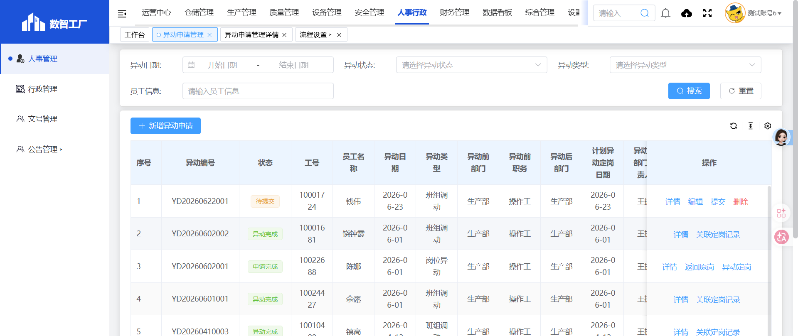
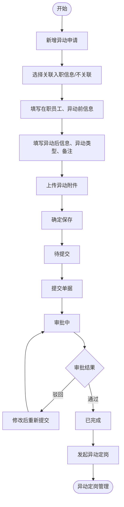
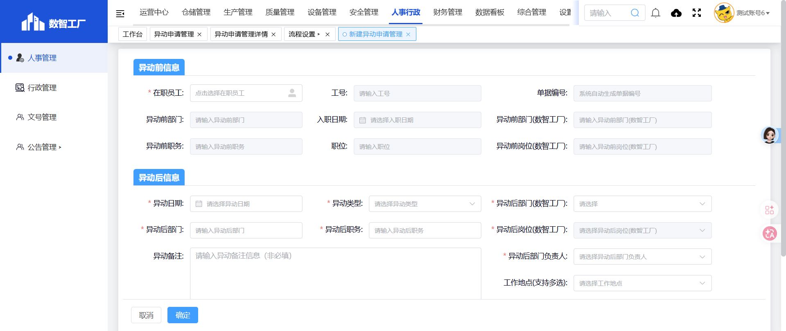
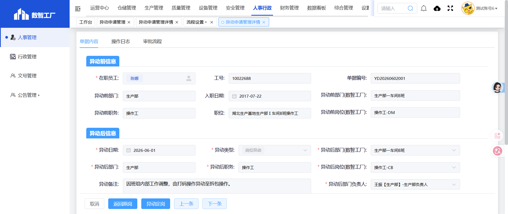
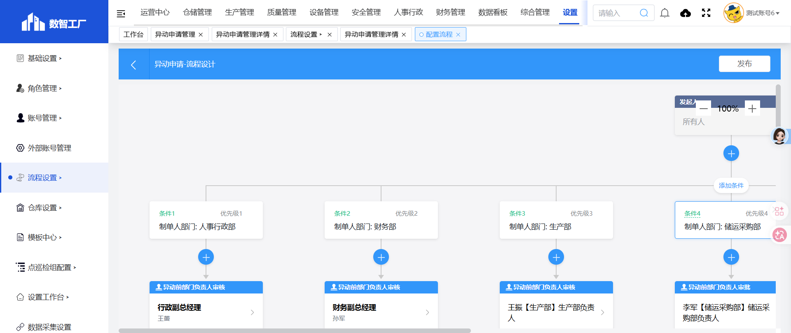
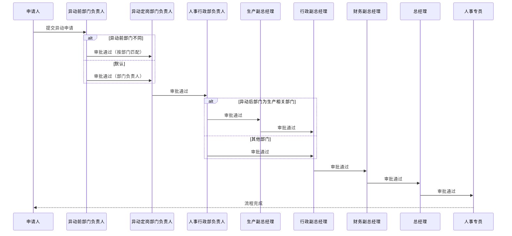
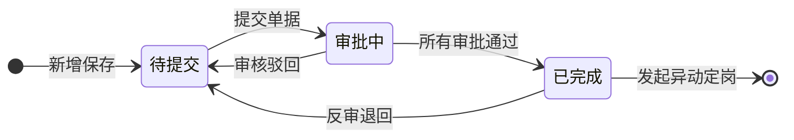

# 异动申请管理

> **系统路径**：人事行政 → 人事管理 → 异动申请管理
> **页面路由**：`#/administration-manage/index10/index107/remove-management-apply`
> **流程标识（workKey）**：`hr_transfer_apply`

---

## 功能业务介绍

异动申请管理用于管理员工岗位变动申请，包括部门调动、岗位异动、晋升、降职等人事变动场景。HR 部门或员工可发起异动申请，经过审批流程后确认异动生效，为后续异动定岗提供依据。

本表单与异动定岗管理衔接；列表支持按异动日期范围、异动状态、异动类型、员工信息筛选，并提供「新增异动申请」「详情」「编辑」「提交」「删除」「反审」等操作。

### 页面入口/按钮入口

| 入口类型 | 入口位置 | 说明 |
|---------|---------|------|
| 菜单入口 | 人事行政 → 人事管理 → 异动申请管理 | 进入异动申请管理列表页 |
| 新增按钮 | 列表上方**新增异动申请** | 跳转新增页面，填写异动信息 |
| 搜索按钮 | 搜索区**搜索** | 按日期范围、状态、类型、员工组合查询 |
| 重置按钮 | 搜索区**重置** | 清空搜索条件，恢复全部列表 |
| 详情按钮 | 列表操作列**详情** | 打开详情页，只读查看（部分状态可编辑） |
| 编辑按钮 | 列表操作列**编辑** | 打开编辑页，修改可编辑字段（仅待提交状态可见） |
| 提交按钮 | 列表操作列/详情页底部**提交** | 提交单据进入审批流程 |
| 删除按钮 | 列表操作列/详情页底部**删除** | 删除未提交的单据 |
| 反审按钮 | 列表操作列**反审** | 退回已完成的单据，用于修改后重新走流程（仅已完成状态可见） |
| 上一条/下一条 | 详情页底部**上一条/下一条** | 在列表中切换查看上/下一条单据 |

---

## 业务流程与操作手册

异动申请管理采用**「单据提交 + 审批流程」机制**：填写异动信息后提交，经过多级审批节点，审批通过后进入异动定岗环节。列表「状态」列展示当前所处节点。

### 异动状态枚举

以下状态取自系统实机数据：

| 分类 | 状态值 | 含义 |
|------|--------|------|
| 审批环节 | 待提交 | 异动申请已保存，等待提交审批 |
| 审批环节 | 审批中 | 异动申请已提交，正在审批流程中 |
| 审批环节 | 已完成 | 所有审批节点通过，异动申请生效，可发起异动定岗 |

### 端到端业务流程图

### 操作手册

#### 阶段 0：操作前准备

正式发起异动申请前，建议完成以下配置：

| 序号 | 准备项 | 菜单路径 | 操作要点 | 责任人 |
|------|--------|---------|---------|--------|
| 0.1 | 组织架构维护 | 设置 → 组织架构 | 确认异动前后部门已维护 | HR 专员 |
| 0.2 | 岗位信息维护 | 设置 → 组织架构 | 确认异动前后岗位已维护 | HR 专员 |
| 0.3 | 流程配置 | 设置 → 流程设置 | 确认异动申请管理流程已配置 | HR 经理 / 管理员 |
| 0.4 | 人员档案 | 人事管理 → 人员档案库 | 确认员工在职信息已录入 | HR 专员 |

#### 阶段 1：进入异动申请管理列表

| 步骤 | 所在界面 | 具体操作 | 预期结果 |
|------|---------|---------|---------|
| 1.1 | 系统顶栏 | 鼠标移至 **人事行政**，点击展开 | 左侧出现人事行政子菜单 |
| 1.2 | 左侧菜单 | 依次点击 **人事管理** → **异动申请管理** | 打开异动申请管理列表页 |
| 1.3 | 列表页 | 确认可见：**新增异动申请**、**搜索**、**重置** | 页面加载完成 |
| 1.4 | 浏览器地址 | 核对路由为 `#/administration-manage/index10/index107/remove-management-apply` | 进入正确模块 |

**列表搜索区用法**：可按异动日期范围、异动状态、异动类型、员工信息组合查询历史单据。

#### 阶段 2：新建异动申请单

| 步骤 | 所在界面 | 具体操作 | 预期结果 |
|------|---------|---------|---------|
| 2.1 | 列表工具栏 | 点击 **新增异动申请** | 跳转新建页，页签显示「新建异动申请管理」 |
| 2.2 | 新建页地址栏 | 确认含 `detail?pageType=1` | 处于新增模式（非查看/编辑历史单） |
| 2.3 | 表单「单据编号」 | 观察字段为灰色禁用 | 保存后系统自动生成，如 YD260115001 |

#### 阶段 3：填写并保存异动申请表

新建页自上而下为 **异动前信息 → 异动后信息** 两个区域，详情页还包含 **操作日志**、**审批流程** 区域。

**3.1 异动前信息**

| 步骤 | 字段分组 | 操作说明 | 注意事项 |
|------|---------|---------|---------|
| 3.1.1 | 关联入职信息 | 选择「关联异动申请」或「不关联异动申请」 | 关联时自动带入入职信息 |
| 3.1.2 | 在职员工 | 点击选择在职员工 | 选择后自动带出工号、异动前部门等信息 |
| 3.1.3 | 异动前部门 | 系统自动填充（选择员工后） | 可手动修改 |
| 3.1.4 | 入职日期 | 系统自动填充 | 只读 |
| 3.1.5 | 异动前职务 | 系统自动填充 | 可手动修改 |
| 3.1.6 | 职位 | 系统自动填充 | 可手动修改 |
| 3.1.7 | 单据编号 | 系统自动生成或手动填写 | 格式：YD+年月日+三位序号 |
| 3.1.8 | 异动前部门(数智工厂) | 系统自动填充 | 可手动修改 |
| 3.1.9 | 异动前岗位(数智工厂) | 系统自动填充 | 可手动修改 |

**3.2 异动后信息**

| 步骤 | 字段分组 | 操作说明 | 注意事项 |
|------|---------|---------|---------|
| 3.2.1 | 异动日期 | 选择异动生效日期 | 必填 |
| 3.2.2 | 异动类型 | 选择异动类型（平级调动、晋升、降职等） | 必填 |
| 3.2.3 | 异动后部门 | 选择异动后的部门 | 必填 |
| 3.2.4 | 异动后职务 | 选择异动后的职务 | 必填 |
| 3.2.5 | 异动备注 | 填写异动原因及说明 | 非必填 |
| 3.2.6 | 关联多能工 | 选择关联的多能工信息（可选） | 仅关联多能工时显示 |
| 3.2.7 | 异动附件 | 上传异动相关附件 | 最多10个；单文件≤100M；支持jpg, png, gif, jpeg, pdf, zip, rar, docx, doc, xlsx, ppt, pptx, pptm, xls |
| 3.2.8 | 异动后部门(数智工厂) | 选择异动后的部门（数智工厂） | 必填 |
| 3.2.9 | 异动后岗位(数智工厂) | 选择异动后的岗位（数智工厂） | 必填 |
| 3.2.10 | 异动后部门负责人 | 选择异动后部门负责人 | 必填 |
| 3.2.11 | 工作地点 | 选择工作地点（支持多选） | 非必填 |
| 3.2.12 | 计划异动日期 | 选择计划异动日期 | 必填 |
| 3.2.13 | 实际异动日期 | 选择实际异动日期 | 必填 |

**3.3 保存单据**

| 步骤 | 操作 | 状态变化 | 说明 |
|------|------|---------|------|
| 3.3.1 | 点击底部 **确定** | — | 系统校验全部必填项 |
| 3.3.2 | 校验通过 | **待提交** | 返回列表，「业务编号」「状态」列有值 |
| 3.3.3 | 点击 **取消** | — | 不保存，直接返回列表 |

**常见保存失败原因**：必填项漏填、日期格式错误、员工信息未选择。

#### 阶段 4：提交与审批

| 步骤 | 操作人 | 具体操作 | 状态变化 |
|------|--------|---------|---------|
| 4.1 | 申请人 | 列表找到「待提交」单据 → **提交** | **审批中** |
| 4.2 | 审批人 | 工作台 → 我的待办 → 处理审批 | — |
| 4.3 | 审批人 | 审批通过 | 进入下一审批节点 |
| 4.4 | 审批人 | 审批驳回，填写驳回原因 | **审核驳回**，需修改后重新提交 |
| 4.5 | 系统 | 所有审批节点通过后 | **已完成** |

#### 阶段 5：审批完成与异动定岗

| 步骤 | 操作人 | 具体操作 | 状态变化 |
|------|--------|---------|---------|
| 5.1 | 系统 | 所有审批节点通过后 | **已完成** |
| 5.2 | HR 专员 | 列表「异动状态」选 **已完成** → **搜索** | 定位生效单据 |
| 5.3 | HR 专员 | 行操作列点击 **详情** | 查看异动详情 |
| 5.4 | HR 专员 | 发起异动定岗（跳转异动定岗管理） | 关联本异动申请单 |

#### 阶段 6：辅助操作速查

| 功能 | 操作路径 | 适用场景 |
|------|---------|---------|
| 条件查询 | 搜索区填条件 → **搜索** | 按日期/状态/类型/员工找单 |
| 重置 | 搜索区 → **重置** | 清空筛选恢复全列表 |
| 反审 | 行操作 → **反审** | 已完成单退回修改（须权限） |
| 详情 | 行操作 → **详情** | 只读查看，不改动数据 |
| 编辑 | 行操作 → **编辑** | 修改可编辑状态下字段 |
| 删除 | 行操作 → **删除** | 删除未提交的单据 |
| 上一条/下一条 | 详情页 → **上一条/下一条** | 在列表中切换查看 |

#### 主路径操作一览

| 流程图节点 | 阶段 | 关键操作 | 操作角色 | 目标状态 |
|-----------|------|---------|---------|---------|
| 新增异动申请 | 2～3 | 新增异动申请 → 填表 → **确定** | HR 专员/申请人 | 待提交 |
| 提交单据 | 4 | **提交** | 申请人 | 审批中 |
| 审批流程 | 4 | 审批通过 / 审核驳回 | 审批人 | 已完成 / 驳回修改 |
| 发起异动定岗 | 5 | 跳转异动定岗管理 | HR 专员 | 转入异动定岗 |

---

## 审批链条（工作流层）

### 流程配置信息

- **配置路径**：设置 → 流程设置 → 搜索「异动申请」
- **流程标识（workKey）**：`hr_transfer_apply`
- **配置状态**：已配置

### 审批节点

根据实机流程设计，异动申请管理审批流程如下：

| 序号 | 审批节点 | 审批人 | 条件分支 |
|------|---------|--------|---------|
| 1 | 发起人 | 所有人 | — |
| 2 | 异动前部门负责人审核 | 按部门条件分支（人事行政部→行政副总经理王蕾、财务部→财务副总经理孙军、生产部→生产部负责人王振、储运采购部→储运采购部负责人李军、品管部→品管部负责人刘娜、安全管理部→安全管理部负责人何勇） | 根据制单人部门匹配 |
| 3 | 异动定岗部门负责人审核 | 发起人自选 | — |
| 4 | 人事行政部负责人审核 | 行政副总经理（王蕾） | — |
| 5 | 生产副总审核 | 生产副总经理（吉荣霞） | 异动后部门为生产部/储运采购部/品管部/安全管理部时 |
| 6 | 行政副总审核 | 行政副总经理（王蕾） | — |
| 7 | 财务副总审核 | 财务副总经理（孙军） | — |
| 8 | 总经理审核 | 总经理（葛海一） | — |
| 9 | 人事审核 | 人事专员（佘茜） | — |
| 10 | 异动定岗部门主管审核 | 发起人自选 | — |
| 11 | 抄送人 | 网络管理员（孙天豪）、SAP专员（徐龙） | — |
| 12 | 流程结束 | — | — |

### 审批流程图

---

## 字段清单

### 一、列表搜索区

| 字段名称 | 类型 | 约束条件 | 说明 |
|---------|------|----------|------|
| 异动日期 | 日期范围选择器 | 非必填 | 选择开始日期和结束日期范围 |
| 异动状态 | 下拉选择框 | 非必填 | 选择异动状态（待提交/审批中/已完成） |
| 异动类型 | 下拉选择框 | 非必填 | 选择异动类型 |
| 员工信息 | 文本输入框 | 非必填 | 按员工姓名或工号查询 |

### 二、列表展示列

| 字段名称 | 类型 | 约束条件 | 说明 |
|---------|------|----------|------|
| 序号 | 数字 | 系统自动生成 | 行号 |
| 业务编号 | 文本 | 系统自动生成 | 格式：YD+年月日+三位序号，如YD260115001 |
| 状态 | 枚举 | 系统自动 | 待提交/审批中/已完成 |
| 异动日期 | 日期 | 必填 | 异动生效日期 |
| 员工名称 | 文本 | 必填 | 员工姓名 |
| 工号 | 文本 | 必填 | 员工工号 |
| 异动前部门 | 文本 | 必填 | 异动前所属部门 |
| 异动前职务 | 文本 | 必填 | 异动前职务 |
| 异动后部门 | 文本 | 必填 | 异动后所属部门 |
| 异动后职务 | 文本 | 必填 | 异动后职务 |
| 异动类型 | 文本 | 必填 | 异动类型（平级调动、晋升、降职等） |
| 工作地点 | 文本 | 非必填 | 异动后工作地点 |
| 异动备注 | 文本 | 非必填 | 异动原因说明 |
| 操作 | 操作列 | — | 详情、编辑/提交/删除/反审（按状态显示） |

### 三、新增/编辑表单字段

**异动前信息区：**

| 字段名称 | 类型 | 长度 | 约束条件 | 说明 |
|---------|------|------|----------|------|
| 关联入职信息 | 单选按钮 | - | 非必填 | 关联异动申请/不关联异动申请 |
| 在职员工 | 选择器 | - | 必填 | 点击选择在职员工 |
| 工号 | 文本输入框 | - | 必填 | 选择员工后自动填充，只读 |
| 异动前部门 | 文本输入框 | - | 必填 | 选择员工后自动填充 |
| 入职日期 | 日期选择器 | - | 必填 | 选择员工后自动填充，只读 |
| 异动前职务 | 文本输入框 | - | 必填 | 选择员工后自动填充 |
| 职位 | 文本输入框 | - | 必填 | 选择员工后自动填充 |
| 单据编号 | 文本输入框 | - | 非必填 | 系统自动生成，格式YD+年月日+三位序号 |
| 异动前部门(数智工厂) | 文本输入框 | - | 必填 | 选择员工后自动填充 |
| 异动前岗位(数智工厂) | 文本输入框 | - | 必填 | 选择员工后自动填充 |

**异动后信息区：**

| 字段名称 | 类型 | 长度 | 约束条件 | 说明 |
|---------|------|------|----------|------|
| 异动日期 | 日期选择器 | - | 必填 | 异动生效日期 |
| 异动类型 | 下拉选择框 | - | 必填 | 平级调动、晋升、降职、岗位异动、班组调动、部门调动等 |
| 异动后部门 | 文本输入框 | - | 必填 | 异动后所属部门 |
| 异动后职务 | 文本输入框 | - | 必填 | 异动后职务 |
| 异动备注 | 多行文本框 | 500 | 非必填 | 异动原因及说明 |
| 关联多能工 | 选择器 | - | 非必填 | 选择关联的多能工信息 |
| 异动附件 | 文件上传 | - | 非必填 | 最多10个；单文件≤100M；支持jpg, png, gif, jpeg, pdf, zip, rar, docx, doc, xlsx, ppt, pptx, pptm, xls |
| 异动后部门(数智工厂) | 文本输入框 | - | 必填 | 异动后所属部门（数智工厂） |
| 异动后岗位(数智工厂) | 下拉选择框 | - | 必填 | 异动后岗位（数智工厂） |
| 异动后部门负责人 | 下拉选择框 | - | 必填 | 异动后部门负责人 |
| 工作地点 | 下拉选择框 | - | 非必填 | 支持多选 |
| 计划异动日期 | 日期选择器 | - | 必填 | 计划异动日期 |
| 实际异动日期 | 日期选择器 | - | 必填 | 实际异动日期 |

### 四、系统通用字段

| 字段名称 | 类型 | 说明 |
|---------|------|------|
| 创建时间 | 日期时间 | 系统自动记录创建时间 |
| 更新时间 | 日期时间 | 系统自动记录最后更新时间 |
| 创建人 | 文本 | 系统自动记录创建人 |
| 更新人 | 文本 | 系统自动记录最后更新人 |

---

## 业务规则

1. **R01**：业务编号系统自动生成，格式为 YD + 年月日 + 三位序号（如 YD260115001），也可手动填写。
2. **R02**：在职员工为必填项，选择员工后自动带出工号、异动前部门、入职日期、异动前职务、职位、异动前部门(数智工厂)、异动前岗位(数智工厂)等信息。
3. **R03**：异动类型包括平级调动、晋升、降职、岗位异动、班组调动、部门调动等，可多选。
4. **R04**：异动附件最多上传10个文件，单文件不超过100M，支持jpg, png, gif, jpeg, pdf, zip, rar, docx, doc, xlsx, ppt, pptx, pptm, xls格式。
5. **R05**：工作地点支持多选。
6. **R06**：审批流程按部门条件分支，异动前部门负责人审核根据制单人部门匹配对应审批人。
7. **R07**：异动定岗部门负责人审核由发起人自选。
8. **R08**：生产副总审核仅在异动后部门为生产部、储运采购部、品管部、安全管理部时触发。
9. **R09**：审核驳回后，需修改单据并重新提交进入审批流程。
10. **R10**：所有审批节点通过后，系统自动标记为「已完成」。
11. **R11**：「已完成」状态的单据支持「反审」操作，退回修改后重新走流程。
12. **R12**：「待提交」状态的单据支持「编辑」和「删除」操作。

---

## 业务状态

### 状态枚举

| 分类 | 状态值 | 说明 |
|------|--------|------|
| 审批环节 | 待提交 | 异动申请已保存，等待提交审批 |
| 审批环节 | 审批中 | 异动申请已提交，正在审批流程中 |
| 审批环节 | 已完成 | 所有审批节点通过，异动申请生效 |

### 状态转换条件

---

## 系统权限与角色分工

### 角色权限划分

| 角色 | 权限范围 | 可操作模块 |
|------|---------|-----------|
| 系统管理员 | 拥有全部权限 | 配置流程、查看所有单据、全部操作 |
| 人事行政部经理 | 拥有审批和管理权限 | 审批单据、反审、查看所有单据 |
| HR专员 | 拥有录入和管理权限 | 新增/编辑/删除异动申请、查看所有单据 |
| 部门负责人 | 拥有审批权限 | 审核本部门异动申请 |
| 副总经理 | 拥有审批权限 | 审核分管部门异动申请 |
| 总经理 | 拥有审批权限 | 最终审批 |
| 普通员工 | 无权限 | 菜单不可见 |

### 关键配置项与角色关系

| 配置项 | 配置路径 | 配置人 | 影响范围 |
|--------|---------|--------|---------|
| 流程配置 | 设置 → 流程设置 | HR经理/管理员 | 审批节点和审批人 |
| 组织架构 | 设置 → 组织架构 | HR专员 | 部门和岗位选项 |
| 人员档案 | 人事管理 → 人员档案库 | HR专员 | 员工信息来源 |

---

## 核心场景（实操案例）

### 场景一：HR发起 → 部门审批 → 完成异动申请

**背景**：员工蒋丽佳从生产部三车间I班操作工-CB异动到操作工-SM，HR发起异动申请。

| 步骤 | 操作人 | 系统操作 | 状态变化 |
|------|--------|---------|---------|
| 1 | HR专员 | 新增异动申请，选择员工蒋丽佳，填写异动后岗位操作工-SM，确定保存 | 待提交 |
| 2 | HR专员 | 列表找到单据 → **提交** | 审批中 |
| 3 | 异动前部门负责人王振 | 工作台待办 → 审批通过 | 审批中 |
| 4 | 异动定岗部门负责人（发起人自选） | 审批通过 | 审批中 |
| 5 | 人事负责人王蕾 | 审批通过 | 审批中 |
| 6 | 生产副总吉荣霞 | 审批通过 | 审批中 |
| 7 | 行政副总王蕾 | 审批通过 | 审批中 |
| 8 | 财务副总孙军 | 审批通过 | 审批中 |
| 9 | 总经理葛海一 | 审批通过 | 审批中 |
| 10 | 人事专员佘茜 | 审批通过 | 已完成 |

### 场景二：审核驳回后修改重提

**背景**：异动申请因异动原因说明缺失被审核驳回。

| 步骤 | 操作人 | 系统操作 | 状态变化 |
|------|--------|---------|---------|
| 1 | HR专员 | 提交异动申请 | 审批中 |
| 2 | 审批人 | 审核驳回，意见「请补充异动原因」 | 审核驳回 |
| 3 | HR专员 | 编辑单据，补充异动备注 | — |
| 4 | HR专员 | 重新提交 | 审批中 |
| 5 | 审批人 | 审批通过 | 已完成 |

### 场景三：已完成单据反审修改

**背景**：已完成的异动单发现异动后岗位填错，需更正后重新走流程。

| 步骤 | 操作人 | 系统操作 | 状态变化 |
|------|--------|---------|---------|
| 1 | HR专员 | 列表找到「已完成」单据 → **反审** | 退回可编辑状态 |
| 2 | HR专员 | 修正异动后岗位 → 保存 → 重新提交 | 审批中 |
| 3 | 审批人 | 审批通过 | 已完成 |

---

## 审批意见与常见问题

### 审批意见填写说明

审批人在审批环节可填写审批意见：
- **审批通过**：可填写备注信息
- **审核驳回**：必须填写驳回原因

### 常见业务问题解答

**Q：为什么我看不到「编辑」按钮？**
A：「编辑」按钮仅在单据状态为「待提交」时显示。若状态为「审批中」或「已完成」，则不显示该按钮。已完成单据需通过「反审」操作后才能修改。

**Q：审核驳回后怎么处理？**
A：审核驳回后，需在详情页修改相关问题字段，然后重新提交进入审批流程。

**Q：异动类型可以多选吗？**
A：可以。异动类型支持多选，如「单位内调动-晋升,部门调动」。

**Q：工作地点支持多选吗？**
A：支持。工作地点字段支持多选。

**Q：反审后单据会回到什么状态？**
A：反审后退回可编辑状态（待提交），需重新提交进入审批流程。

**Q：如何关联异动申请和异动定岗？**
A：在异动定岗管理中可选择「关联异动申请」，自动带入异动申请的相关信息。

---

## 关联表单

| 方向 | 表单 | 关系说明 |
|------|------|---------|
| 上游 | 人员档案库 | 提供在职员工信息 |
| 下游 | 异动定岗管理 | 异动申请审批通过后可发起异动定岗，关联本异动申请单 |

---

**文档版本**：V1.0
**实机核对环境**：数智工厂（https://hbmms.y1b.cn:8424）
**最后更新**：2026-07-02