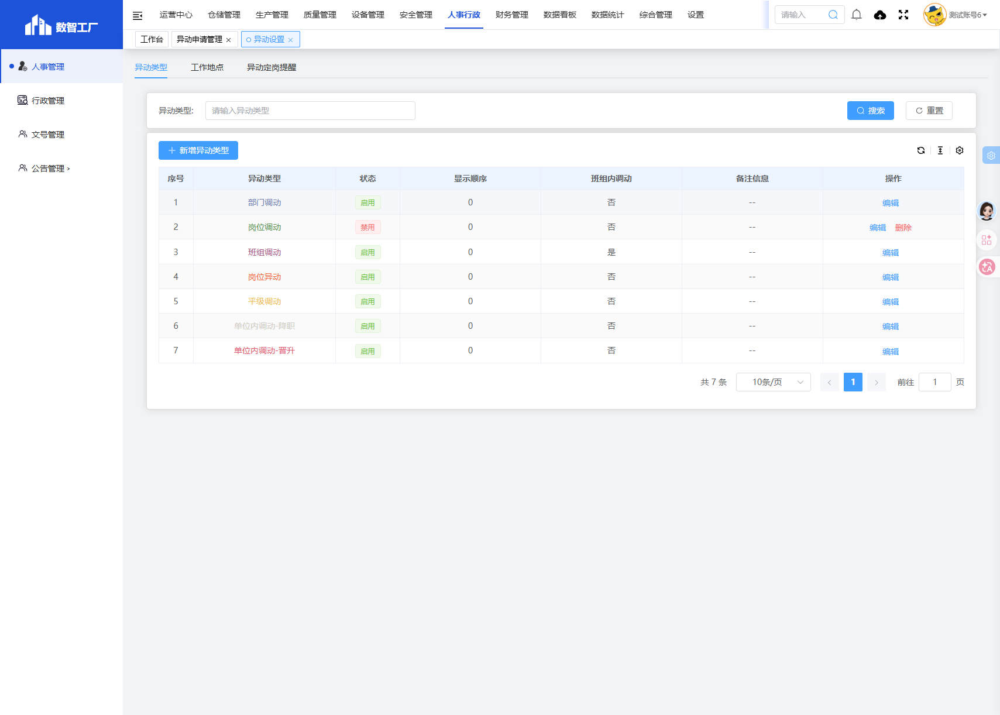
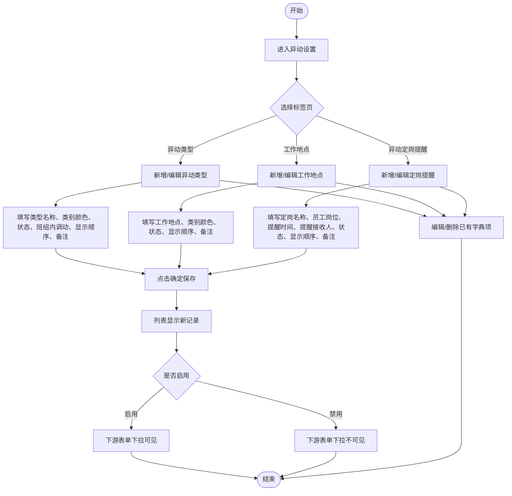
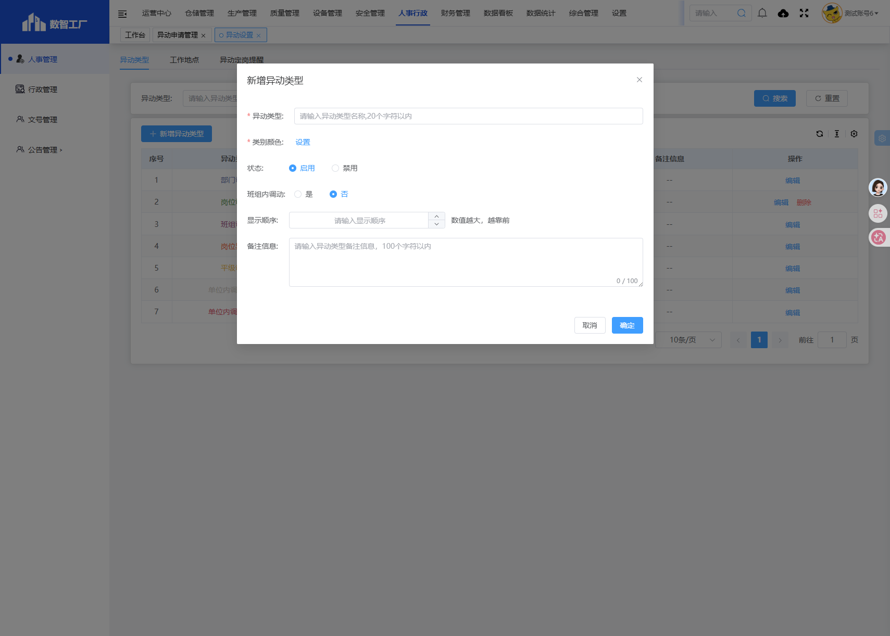
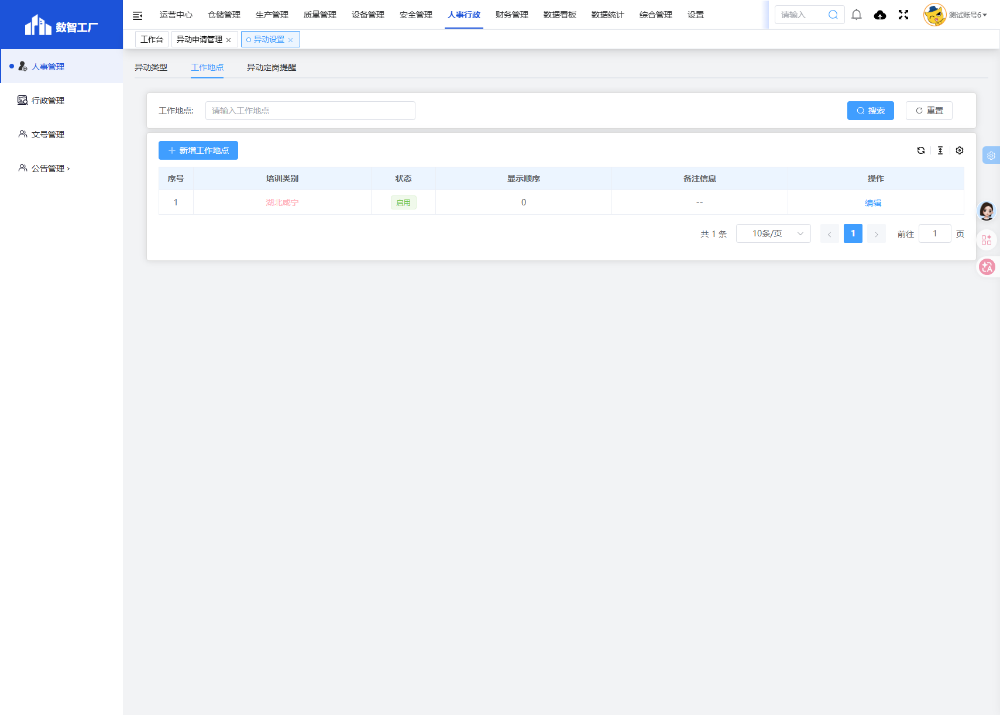
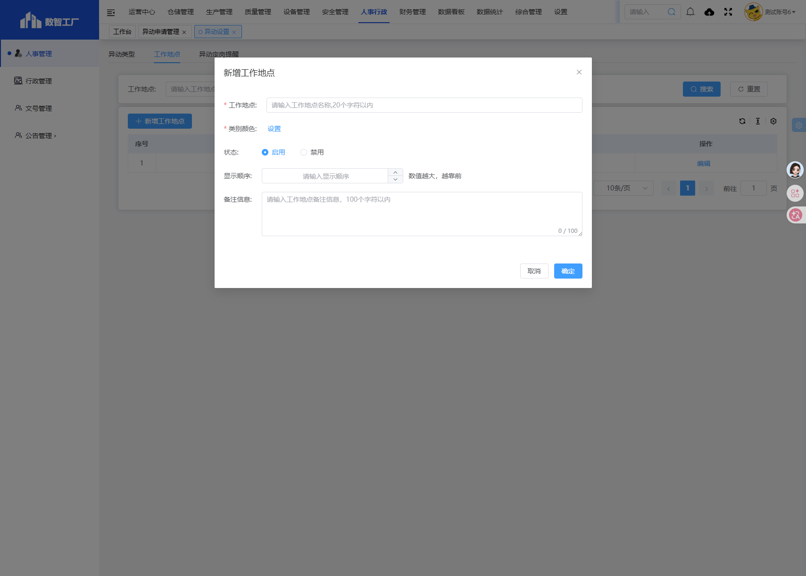
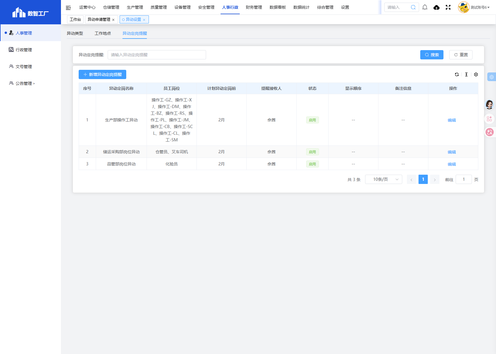
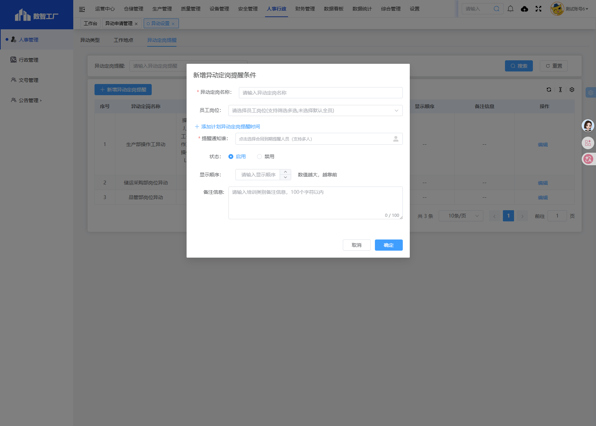
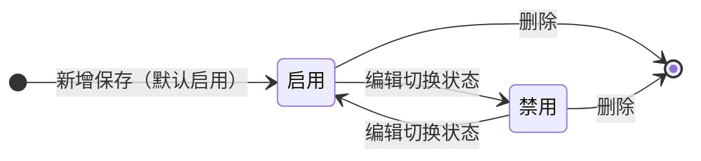
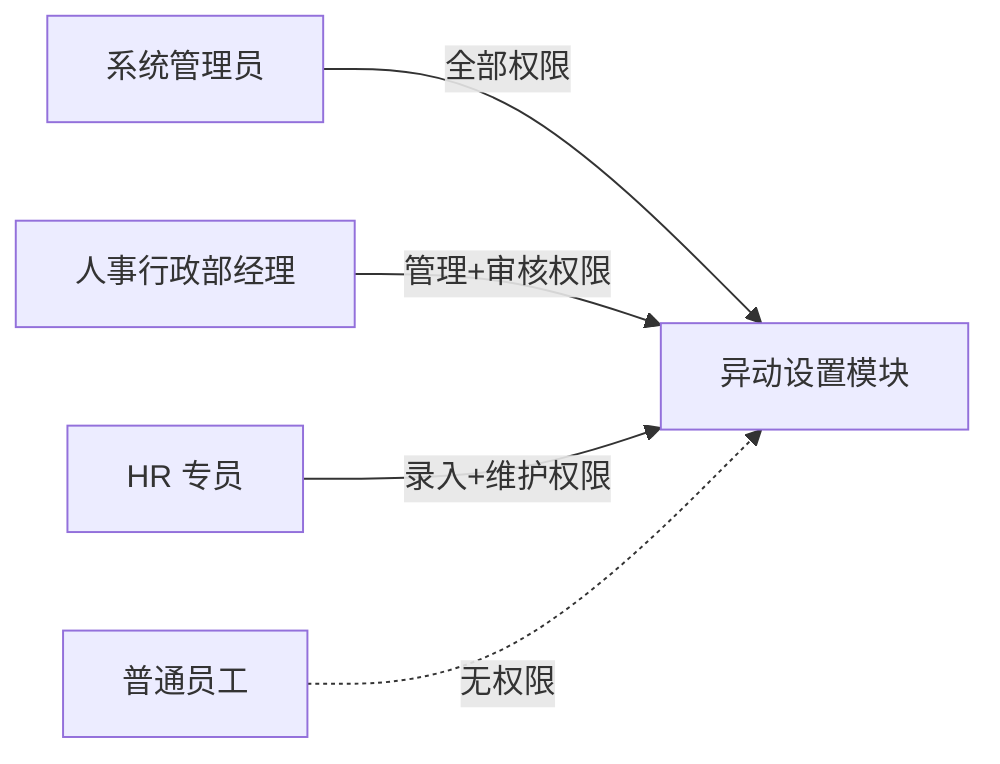

# 异动设置

> **系统路径**：人事行政 → 人事管理 → 异动设置
> **页面路由**：`#/administration-manage/index10/index107/remove-management-set`
> **流程标识（workKey）**：无（字典配置模块，无审批流程）

---

## 功能业务介绍

异动设置是「人事行政 → 人事管理」下的字典配置模块，为「异动申请管理」「异动定岗管理」提供基础字典支撑。本模块无审批流程，保存即生效。

模块采用**三标签页**结构统一管理三类字典数据：

1. **异动类型**：维护调动类别字典（如部门调动、班组调动、岗位异动等），并标记是否属于「班组内调动」，供异动申请单下拉选择及班组内调动判定使用。
2. **工作地点**：维护工作地点字典（如湖北咸宁），供异动申请单「工作地点」字段下拉选择。
3. **异动定岗提醒**：维护定岗提醒规则，按「员工岗位 + 计划异动定岗前时间 + 提醒接收人」配置，到期自动通知接收人跟进定岗流程。

### 页面入口/按钮入口

| 入口类型 | 入口位置 | 说明 |
|---------|---------|------|
| 菜单入口 | 人事行政 → 人事管理 → 异动设置 | 进入异动设置列表页，默认显示「异动类型」标签页 |
| 标签页切换 | 列表页顶部标签 | 切换 异动类型 / 工作地点 / 异动定岗提醒 |
| 新增按钮 | 列表上方**新增** | 弹出新增对话框（各标签页字段不同） |
| 编辑按钮 | 列表操作列**编辑** | 弹出编辑对话框，字段预填当前值 |
| 删除按钮 | 列表操作列**删除** | 二次确认后删除该字典项 |

---

## 业务流程与操作手册

异动设置为**单层字典配置机制**：HR 专员新增字典项 → 保存即生效 → 下游表单下拉引用。无审批流程，无状态流转，仅「启用/禁用」控制是否在下游表单下拉中可见。

### 异动设置状态枚举

以下状态取自系统实机数据：

| 分类 | 状态值 | 含义 |
|------|--------|------|
| 字典状态 | 启用 | 字典项生效，下游表单下拉可见 |
| 字典状态 | 禁用 | 字典项失效，下游表单下拉不可见，但历史数据保留 |

### 端到端业务流程图

### 操作手册

> **适用说明**：异动设置为字典配置模块，无审批流程，所有操作保存即生效。需先完成员工岗位管理、员工档案维护，再配置异动定岗提醒。

#### 阶段 0：操作前准备

| 序号 | 准备项 | 菜单路径 | 操作要点 | 责任人 |
|------|--------|---------|---------|--------|
| 0.1 | 员工岗位已维护 | 人事行政 → 人事管理 → 员工岗位管理 | 确认所需岗位已新增且为「启用」状态 | HR 专员 |
| 0.2 | 员工档案已建档 | 人事行政 → 人事管理 → 员工档案管理 | 确认提醒接收人已在员工档案中 | HR 专员 |
| 0.3 | 下游需求确认 | — | 与异动申请管理、异动定岗管理业务负责人确认所需字典项 | HR 经理 |

#### 阶段 1：进入异动设置列表

| 步骤 | 所在界面 | 具体操作 | 预期结果 |
|------|---------|---------|---------|
| 1.1 | 系统顶栏 | 鼠标移至 **人事行政**，点击展开 | 左侧出现人事行政子菜单 |
| 1.2 | 左侧菜单 | 依次点击 **人事管理** → **异动设置** | 打开异动设置列表页，默认显示「异动类型」标签页 |
| 1.3 | 列表页 | 确认可见：顶部三个标签页（异动类型/工作地点/异动定岗提醒）、**新增**按钮、列表数据 | 页面加载完成 |
| 1.4 | 浏览器地址 | 核对路由为 `#/administration-manage/index10/index107/remove-management-set` | 进入正确模块 |

#### 阶段 2：新增异动类型字典项

| 步骤 | 所在界面 | 具体操作 | 预期结果 |
|------|---------|---------|---------|
| 2.1 | 列表页顶部标签 | 确认当前为「异动类型」标签页 | 列表显示已有异动类型数据 |
| 2.2 | 列表工具栏 | 点击 **新增** | 弹出新增异动类型对话框 |
| 2.3 | 对话框 | 填写 **异动类型***（如「部门调动」） | 必填，文本输入 |
| 2.4 | 对话框 | 点击 **类别颜色** 的「设置」按钮，选择颜色 | 必填，用于列表颜色标识 |
| 2.5 | 对话框 | 选择 **状态**（启用/禁用，默认启用） | 控制下游表单是否可见 |
| 2.6 | 对话框 | 选择 **班组内调动**（是/否） | 「是」表示该类型属于班组内调动 |
| 2.7 | 对话框 | 输入 **显示顺序**（数字） | 控制列表排序，数字越小越靠前 |
| 2.8 | 对话框 | 输入 **备注信息**（选填，限 100 字） | 非必填 |
| 2.9 | 对话框 | 点击 **确定** | 校验通过后关闭弹窗，列表新增一行 |
| 2.10 | 对话框 | 或点击 **取消** | 不保存，关闭弹窗 |

#### 阶段 3：新增工作地点字典项

| 步骤 | 所在界面 | 具体操作 | 预期结果 |
|------|---------|---------|---------|
| 3.1 | 列表页顶部标签 | 点击 **工作地点** 标签 | 列表切换为工作地点数据 |
| 3.2 | 列表工具栏 | 点击 **新增** | 弹出新增工作地点对话框 |
| 3.3 | 对话框 | 填写 **工作地点***（如「湖北咸宁」） | 必填 |
| 3.4 | 对话框 | 点击 **类别颜色** 的「设置」按钮，选择颜色 | 必填 |
| 3.5 | 对话框 | 选择 **状态**（启用/禁用，默认启用） | — |
| 3.6 | 对话框 | 输入 **显示顺序** | — |
| 3.7 | 对话框 | 输入 **备注信息**（选填，限 100 字） | 非必填 |
| 3.8 | 对话框 | 点击 **确定** | 列表新增一行 |

#### 阶段 4：新增异动定岗提醒规则

| 步骤 | 所在界面 | 具体操作 | 预期结果 |
|------|---------|---------|---------|
| 4.1 | 列表页顶部标签 | 点击 **异动定岗提醒** 标签 | 列表切换为定岗提醒数据 |
| 4.2 | 列表工具栏 | 点击 **新增** | 弹出新增异动定岗提醒对话框 |
| 4.3 | 对话框 | 填写 **异动定岗名称***（如「生产部操作工异动」） | 必填 |
| 4.4 | 对话框 | **员工岗位** 下拉多选关联岗位 | 来自员工岗位管理，可多选 |
| 4.5 | 对话框 | 点击 **添加计划异动定岗提醒时间** 按钮 | 新增提醒时间行，填写时间（如月份） |
| 4.6 | 对话框 | **提醒通知谁*** 选择接收人 | 必填，支持多选，来自员工档案 |
| 4.7 | 对话框 | 选择 **状态**（启用/禁用，默认启用） | — |
| 4.8 | 对话框 | 输入 **显示顺序** | — |
| 4.9 | 对话框 | 输入 **备注信息**（选填，限 100 字） | 非必填 |
| 4.10 | 对话框 | 点击 **确定** | 列表新增一行 |

#### 阶段 5：编辑字典项

| 步骤 | 所在界面 | 具体操作 | 预期结果 |
|------|---------|---------|---------|
| 5.1 | 列表页 | 找到目标字典项，点击操作列 **编辑** | 弹出编辑对话框，字段预填当前值 |
| 5.2 | 对话框 | 修改需要变更的字段 | — |
| 5.3 | 对话框 | 点击 **确定** | 保存修改，列表刷新显示新值 |

#### 阶段 6：删除字典项

| 步骤 | 所在界面 | 具体操作 | 预期结果 |
|------|---------|---------|---------|
| 6.1 | 列表页 | 找到目标字典项，点击操作列 **删除** | 弹出二次确认提示 |
| 6.2 | 确认弹窗 | 点击 **确定** | 删除该字典项，列表刷新 |
| 6.3 | 确认弹窗 | 点击 **取消** | 不删除，关闭弹窗 |

> **注意**：已被下游单据引用的字典项删除后，可能影响历史数据展示，建议优先使用「禁用」而非「删除」。

#### 阶段 7：状态控制（启用/禁用）

| 步骤 | 所在界面 | 具体操作 | 预期结果 |
|------|---------|---------|---------|
| 7.1 | 列表页 | 找到目标字典项，点击 **编辑** | 弹出编辑对话框 |
| 7.2 | 对话框 | 将 **状态** 切换为「禁用」 | — |
| 7.3 | 对话框 | 点击 **确定** | 该字典项在下游表单下拉中不再可见，列表状态列显示「禁用」 |

#### 阶段 8：辅助操作速查

| 功能 | 操作路径 | 适用场景 |
|------|---------|---------|
| 切换标签页 | 顶部标签 **异动类型/工作地点/异动定岗提醒** | 查看不同字典分类 |
| 编辑 | 行操作 → **编辑** | 修改字典项字段 |
| 删除 | 行操作 → **删除** | 删除字典项（需二次确认） |
| 状态控制 | 编辑 → 状态选「启用/禁用」 | 控制下游表单下拉可见性 |

#### 主路径操作一览

| 流程图节点 | 阶段 | 关键操作 | 操作角色 | 目标状态 |
|-----------|------|---------|---------|---------|
| 进入异动设置 | 1 | 菜单进入 → 核对路由 | HR 专员 | — |
| 新增异动类型 | 2 | **新增** → 填表 → **确定** | HR 专员 | 启用/禁用 |
| 新增工作地点 | 3 | 切换标签 → **新增** → 填表 → **确定** | HR 专员 | 启用/禁用 |
| 新增定岗提醒 | 4 | 切换标签 → **新增** → 填表 → **确定** | HR 专员 | 启用/禁用 |
| 编辑字典项 | 5 | **编辑** → 修改 → **确定** | HR 专员 | 启用/禁用 |
| 删除字典项 | 6 | **删除** → 确认 | HR 专员 | 已删除 |
| 状态控制 | 7 | **编辑** → 切换状态 → **确定** | HR 专员 | 启用↔禁用 |

### 审批链条（工作流层）

本模块为字典配置模块，**无审批流程**，无 workKey，新增/编辑/删除保存后立即生效。

---

## 字段清单

### 一、异动类型标签页 · 列表展示列

| 字段名称 | 类型 | 约束条件 | 说明 |
|---------|------|----------|------|
| 序号 | 数字 | 系统自动生成 | 行号 |
| 异动类型 | 文本 | 必填 | 调动类别名称 |
| 状态 | 枚举 | 必填 | 启用/禁用 |
| 显示顺序 | 数字 | 必填 | 排序序号 |
| 班组内调动 | 枚举 | 必填 | 是/否 |
| 备注信息 | 文本 | 非必填 | 备注说明，无内容显示「--」 |
| 操作 | 操作列 | — | 编辑、删除 |

### 二、异动类型标签页 · 新增/编辑弹窗

| 字段名称 | 类型 | 长度 | 约束条件 | 说明 |
|---------|------|------|----------|------|
| 异动类型 | 文本输入框 | - | 必填 | 调动类别名称，如「部门调动」「班组调动」 |
| 类别颜色 | 颜色选择器 | - | 必填 | 点击「设置」按钮选择颜色，用于列表颜色标识 |
| 状态 | 单选按钮 | - | 必填 | 启用（默认）/禁用 |
| 班组内调动 | 单选按钮 | - | 必填 | 是/否；「是」表示该类型属于班组内调动 |
| 显示顺序 | 数字输入框 | - | 必填 | 控制列表排序，数字越小越靠前 |
| 备注信息 | 多行文本框 | 100 | 非必填 | 备注说明，显示「0/100」字数计数 |

### 三、工作地点标签页 · 列表展示列

| 字段名称 | 类型 | 约束条件 | 说明 |
|---------|------|----------|------|
| 序号 | 数字 | 系统自动生成 | 行号 |
| 工作地点 | 文本 | 必填 | 工作地点名称 |
| 状态 | 枚举 | 必填 | 启用/禁用 |
| 显示顺序 | 数字 | 必填 | 排序序号 |
| 备注信息 | 文本 | 非必填 | 备注说明，无内容显示「--」 |
| 操作 | 操作列 | — | 编辑、删除 |

> **待确认**：工作地点标签页列表表头实机显示为「培训类别」，与字段实际含义「工作地点」不符，疑似系统 UI 显示问题，已如实记录。

### 四、工作地点标签页 · 新增/编辑弹窗

| 字段名称 | 类型 | 长度 | 约束条件 | 说明 |
|---------|------|------|----------|------|
| 工作地点 | 文本输入框 | - | 必填 | 工作地点名称，如「湖北咸宁」 |
| 类别颜色 | 颜色选择器 | - | 必填 | 点击「设置」按钮选择颜色 |
| 状态 | 单选按钮 | - | 必填 | 启用（默认）/禁用 |
| 显示顺序 | 数字输入框 | - | 必填 | 控制列表排序 |
| 备注信息 | 多行文本框 | 100 | 非必填 | 备注说明，显示「0/100」字数计数 |

### 五、异动定岗提醒标签页 · 列表展示列

| 字段名称 | 类型 | 约束条件 | 说明 |
|---------|------|----------|------|
| 序号 | 数字 | 系统自动生成 | 行号 |
| 异动定岗名称 | 文本 | 必填 | 提醒规则名称 |
| 员工岗位 | 文本 | 非必填 | 关联的岗位（多选），来自员工岗位管理 |
| 计划异动定岗前 | 文本 | 非必填 | 提醒时间设置（如「2月」） |
| 提醒接收人 | 文本 | 必填 | 接收提醒的人员 |
| 状态 | 枚举 | 必填 | 启用/禁用 |
| 显示顺序 | 数字 | 必填 | 排序序号 |
| 备注信息 | 文本 | 非必填 | 备注说明 |
| 操作 | 操作列 | — | 编辑、删除 |

### 六、异动定岗提醒标签页 · 新增/编辑弹窗

| 字段名称 | 类型 | 长度 | 约束条件 | 说明 |
|---------|------|------|----------|------|
| 异动定岗名称 | 文本输入框 | - | 必填 | 提醒规则名称，如「生产部操作工异动」 |
| 员工岗位 | 下拉多选框 | - | 非必填 | 关联岗位（来自员工岗位管理），可多选 |
| 计划异动定岗提醒时间 | 动态行（按钮新增） | - | 非必填 | 点击「添加计划异动定岗提醒时间」按钮新增行，填写提醒时间（如月份） |
| 提醒通知谁 | 人员选择器 | - | 必填 | 选择提醒接收人（来自员工档案），支持多选 |
| 状态 | 单选按钮 | - | 必填 | 启用（默认）/禁用 |
| 显示顺序 | 数字输入框 | - | 必填 | 控制列表排序 |
| 备注信息 | 多行文本框 | 100 | 非必填 | 备注说明，显示「0/100」字数计数 |

### 七、系统通用字段

| 字段名称 | 类型 | 说明 |
|---------|------|------|
| 序号 | 数字 | 系统自动生成行号 |
| 操作 | 操作列 | 编辑、删除（按权限显示） |

---

## 业务规则

1. **R01**：异动设置为纯字典配置模块，无审批流程，新增/编辑保存后立即生效。
2. **R02**：三个标签页（异动类型、工作地点、异动定岗提醒）相互独立，各自维护字典数据。
3. **R03**：「类别颜色」为异动类型、工作地点两个标签页的必填项，通过点击「设置」按钮选择颜色，用于列表颜色标识。
4. **R04**：「状态」字段控制字典项是否在下游表单下拉中可见：启用=可见，禁用=不可见。
5. **R05**：异动类型标签页的「班组内调动」字段标记该类型是否属于班组内调动，影响异动申请管理中班组内调动判定逻辑。
6. **R06**：异动定岗提醒的「员工岗位」下拉选项来自员工岗位管理中状态为「启用」的岗位。
7. **R07**：异动定岗提醒的「提醒通知谁」为必填，支持多选，接收人来自员工档案。
8. **R08**：异动定岗提醒的「计划异动定岗提醒时间」通过点击「添加计划异动定岗提醒时间」按钮动态新增行，可配置多个提醒时间。
9. **R09**：备注信息限 100 字，弹窗内显示「0/100」字数计数。
10. **R10**：显示顺序为数字，控制列表排序，数字越小越靠前。
11. **R11**：删除字典项需二次确认；已被下游单据引用的字典项删除后可能影响历史数据展示。
12. **R12**：异动类型字典当前实机数据包含：部门调动（启用）、岗位调动（禁用）、班组调动（启用，班组内调动=是）、岗位异动（启用）、平级调动（启用）、单位内调动-降职（启用）、单位内调动-晋升（启用）。
13. **R13**：工作地点字典当前实机数据包含：湖北咸宁（启用）。
14. **R14**：异动定岗提醒当前实机数据包含：生产部操作工异动（2月，佘茜）、储运采购部岗位异动（2月，佘茜）、品管部岗位异动（2月，佘茜）。

---

## 业务状态

### 状态枚举

| 分类 | 状态值 | 说明 |
|------|--------|------|
| 字典状态 | 启用 | 字典项生效，下游表单下拉可见 |
| 字典状态 | 禁用 | 字典项失效，下游表单下拉不可见，但历史数据保留 |

### 状态转换条件

---

## 系统权限与角色分工

### 角色职责总览

### 角色权限矩阵

| 角色 | 菜单权限 | 列表操作 | 数据范围 |
|------|---------|---------|---------|
| 系统管理员 | 可见 | 新增、编辑、删除、全部操作 | 全部字典项 |
| 人事行政部经理 | 可见 | 新增、编辑、删除 | 全部字典项 |
| HR 专员 | 可见 | 新增、编辑、删除 | 全部字典项 |
| 普通员工 | 不可见 | 无 | 无 |

### 关键配置项与角色关系

| 配置项 | 配置路径 | 配置人 | 影响范围 |
|--------|---------|--------|---------|
| 异动类型 | 异动设置 → 异动类型标签页 | HR 专员 | 异动申请管理「异动类型」下拉、班组内调动判定 |
| 工作地点 | 异动设置 → 工作地点标签页 | HR 专员 | 异动申请管理「工作地点」下拉 |
| 异动定岗提醒 | 异动设置 → 异动定岗提醒标签页 | HR 专员 | 异动定岗管理到期提醒通知 |

---

## 核心场景（实操案例）

### 场景一：新增「部门调动」异动类型

**背景**：企业调动类型新增「部门调动」字典项，供异动申请管理使用。

| 步骤 | 操作人 | 系统操作 | 状态变化 |
|------|--------|---------|---------|
| 1 | HR 专员 | 进入异动设置 → 确认「异动类型」标签页 → 点击 **新增** | — |
| 2 | HR 专员 | 填写异动类型=「部门调动」，类别颜色=蓝色，状态=启用，班组内调动=否，显示顺序=1 | — |
| 3 | HR 专员 | 点击 **确定** | 列表新增一行，状态=启用 |
| 4 | HR 专员 | 进入异动申请管理 → 新增异动申请 → 「异动类型」下拉可见「部门调动」 | 下游生效 |

### 场景二：新增「湖北咸宁」工作地点

**背景**：企业工作地点新增「湖北咸宁」字典项。

| 步骤 | 操作人 | 系统操作 | 状态变化 |
|------|--------|---------|---------|
| 1 | HR 专员 | 进入异动设置 → 点击 **工作地点** 标签页 → 点击 **新增** | — |
| 2 | HR 专员 | 填写工作地点=「湖北咸宁」，类别颜色=绿色，状态=启用，显示顺序=1 | — |
| 3 | HR 专员 | 点击 **确定** | 列表新增一行，状态=启用 |
| 4 | HR 专员 | 进入异动申请管理 → 新增异动申请 → 「工作地点」下拉可见「湖北咸宁」 | 下游生效 |

### 场景三：配置「生产部操作工异动」定岗提醒

**背景**：生产部操作工异动后需在 2 月前提醒佘茜跟进定岗流程。

| 步骤 | 操作人 | 系统操作 | 状态变化 |
|------|--------|---------|---------|
| 1 | HR 专员 | 进入异动设置 → 点击 **异动定岗提醒** 标签页 → 点击 **新增** | — |
| 2 | HR 专员 | 填写异动定岗名称=「生产部操作工异动」，员工岗位=多选生产部操作工岗位 | — |
| 3 | HR 专员 | 点击 **添加计划异动定岗提醒时间**，填写提醒时间=2月 | — |
| 4 | HR 专员 | 提醒通知谁=选择「佘茜」，状态=启用，显示顺序=1 | — |
| 5 | HR 专员 | 点击 **确定** | 列表新增一行，状态=启用 |
| 6 | 系统 | 到期自动通知佘茜跟进定岗流程 | 提醒生效 |

### 场景四：禁用已废弃的异动类型

**背景**：「岗位调动」类型暂不使用，需从下游下拉中移除但保留历史数据。

| 步骤 | 操作人 | 系统操作 | 状态变化 |
|------|--------|---------|---------|
| 1 | HR 专员 | 进入异动设置 → 「异动类型」标签页 → 找到「岗位调动」 → 点击 **编辑** | — |
| 2 | HR 专员 | 将 **状态** 切换为「禁用」 → 点击 **确定** | 状态=禁用 |
| 3 | HR 专员 | 进入异动申请管理 → 新增异动申请 → 「异动类型」下拉不再显示「岗位调动」 | 下游生效 |
| 4 | HR 专员 | 查看历史异动申请单 → 「异动类型」列仍显示「岗位调动」 | 历史数据保留 |

### 场景五：编辑已有定岗提醒接收人

**背景**：「生产部操作工异动」提醒接收人由佘茜变更为王蕾。

| 步骤 | 操作人 | 系统操作 | 状态变化 |
|------|--------|---------|---------|
| 1 | HR 专员 | 进入异动设置 → **异动定岗提醒** 标签页 → 找到「生产部操作工异动」 → 点击 **编辑** | — |
| 2 | HR 专员 | 将 **提醒通知谁** 由「佘茜」改为「王蕾」 → 点击 **确定** | 接收人变更 |
| 3 | 系统 | 下次到期提醒通知王蕾 | 提醒生效 |

---

## 关联表单

| 方向 | 表单 | 关系说明 |
|------|------|---------|
| 上游 | 员工岗位管理 | 提供「员工岗位」字典，供异动定岗提醒标签页下拉选择 |
| 上游 | 员工档案管理 | 提供「员工」数据，供异动定岗提醒「提醒通知谁」选择 |
| 下游 | 异动申请管理 | 引用「异动类型」「工作地点」字典作为单据下拉选项 |
| 下游 | 异动定岗管理 | 引用「异动定岗提醒」配置，到期触发提醒通知 |

---

**文档版本**：V1.0
**实机核对环境**：数智工厂（https://hbmms.y1b.cn:8424）
**最后更新**：2026-07-09
