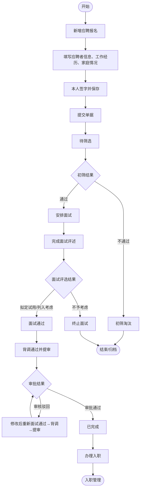
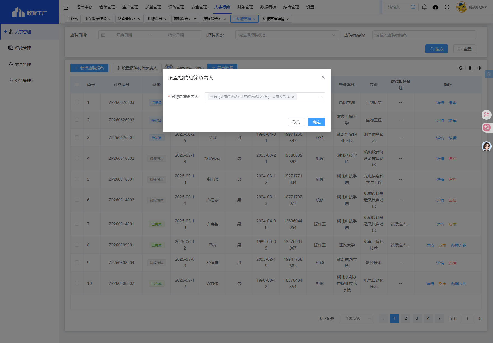
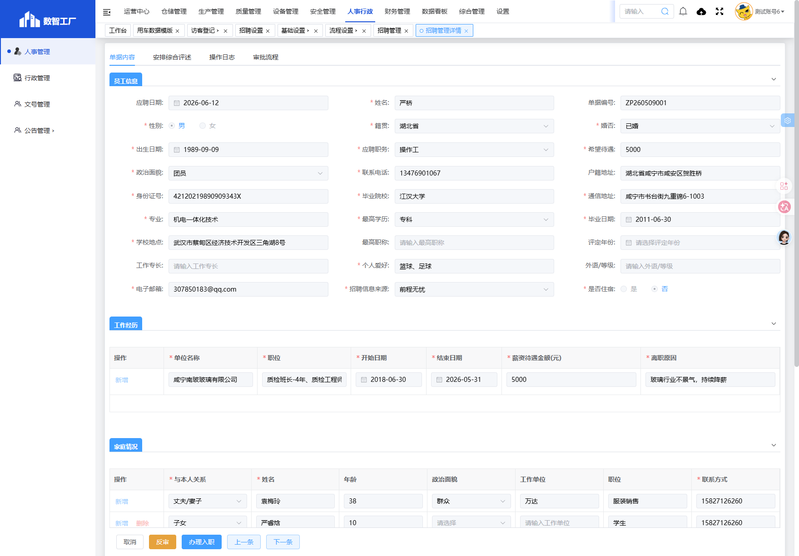
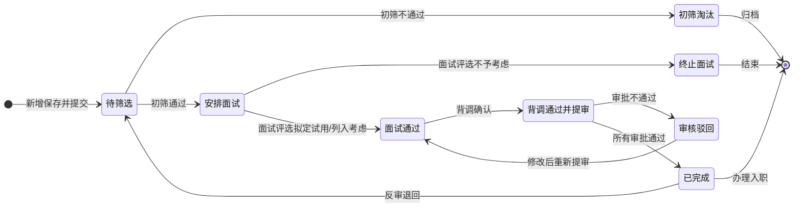

# 招聘管理

> **系统路径**：人事行政 → 人事管理 → 招聘管理
> **页面路由**：`#/administration-manage/index10/index107/invite-administration`
> **流程标识（workKey）**：内置招聘业务流程（初筛→面试→背调→审批→完成）

---

## 功能业务介绍

招聘管理用于登记、筛选、面试、背调及归档应聘人员信息，是「招聘 → 入职」的数据源头。人力资源部门可在此完成应聘报名录入、简历初筛、面试评估、背调确认，并在录用后通过「办理入职」流转至入职管理。

本表单与招聘设置（招聘信息来源、面试综合评述项、应聘者郑重承诺说明、招聘岗位维护）衔接；列表支持按应聘日期、招聘状态、应聘者姓名筛选，并提供「新增应聘报名」「设置招聘初筛负责人」「导出数据」等操作。

### 页面入口/按钮入口

| 入口类型 | 入口位置 | 说明 |
|---------|---------|------|
| 菜单入口 | 人事行政 → 人事管理 → 招聘管理 | 进入招聘管理列表页 |
| 新增按钮 | 列表上方**新增应聘报名** | 跳转新增页面，填写应聘者信息 |
| 设置初筛负责人 | 列表上方**设置招聘初筛负责人** | 弹窗设置全局初筛负责人 |
| 导出数据 | 列表上方**导出数据** | 按当前筛选条件导出Excel |
| 搜索按钮 | 搜索区**搜索** | 按关键字、日期范围、状态、姓名组合查询 |
| 重置按钮 | 搜索区**重置** | 清空搜索条件，恢复全部列表 |
| 详情按钮 | 列表操作列**详情** | 打开详情页，只读查看（部分状态可编辑） |
| 编辑按钮 | 列表操作列**编辑** | 打开编辑页，修改可编辑字段（仅待筛选状态可见） |
| 归档按钮 | 列表操作列**归档** | 对初筛淘汰的简历进行归档（仅初筛淘汰状态可见） |
| 反审按钮 | 列表操作列**反审** | 退回已完成的单据，用于修改后重新走流程（仅已完成状态可见） |
| 办理入职按钮 | 列表操作列**办理入职** | 跳转入职管理，关联本应聘单（仅已完成且满足条件可见） |
| 提交按钮 | 详情/编辑页底部**提交** | 提交单据进入下一环节 |
| 删除按钮 | 详情/编辑页底部**删除** | 删除未提交的单据 |
| 上一条/下一条 | 详情页底部**上一条/下一条** | 在列表中切换查看上/下一条单据 |

---

## 业务流程与操作手册

招聘管理采用**「单据提交 + 招聘环节」双层机制**：第一层为单据提交审批，第二层为招聘业务状态（待筛选/初筛淘汰/已完成）。列表「状态」列展示当前所处节点。

### 招聘状态枚举

以下状态取自系统实机数据：

| 分类 | 状态值 | 含义 |
|------|--------|------|
| 招聘环节 | 待筛选 | 应聘报名已提交，进入简历初筛队列 |
| 招聘环节 | 初筛淘汰 | 初筛未通过，流程终止，可归档 |
| 招聘环节 | 已完成 | 招聘流程全部完成（含面试通过、背调通过、审批通过），可办理入职 |

### 端到端业务流程图

### 操作手册

#### 阶段 0：操作前准备

正式受理应聘报名前，建议完成以下配置，避免填表时无选项或无人处理初筛。

| 序号 | 准备项 | 菜单路径 | 操作要点 | 责任人 |
|------|--------|---------|---------|--------|
| 0.1 | 招聘信息来源 | 人事行政 → 人事管理 → 招聘设置 | 确认来源字典已启用 | HR 专员 |
| 0.2 | 招聘岗位维护 | 人事行政 → 人事管理 → 招聘设置 | 确认目标岗位已维护且为「启用」 | HR 专员 |
| 0.3 | 面试综合评述项 | 人事行政 → 人事管理 → 招聘设置 | 确认评述项及选项已配置 | HR 专员 |
| 0.4 | 应聘者郑重承诺说明 | 人事行政 → 人事管理 → 招聘设置 | 确认承诺条款已维护 | HR 专员 |
| 0.5 | 招聘初筛负责人 | 招聘管理列表 → **设置招聘初筛负责人** | 在弹窗中选择负责人 → **确定** | HR 经理 / 管理员 |

#### 阶段 1：进入招聘管理列表

| 步骤 | 所在界面 | 具体操作 | 预期结果 |
|------|---------|---------|---------|
| 1.1 | 系统顶栏 | 鼠标移至 **人事行政**，点击展开 | 左侧出现人事行政子菜单 |
| 1.2 | 左侧菜单 | 依次点击 **人事管理** → **招聘管理** | 打开招聘管理列表页 |
| 1.3 | 列表页 | 确认可见：**新增应聘报名**、**设置招聘初筛负责人**、**导出数据** | 页面加载完成 |
| 1.4 | 浏览器地址 | 核对路由为 `#/administration-manage/index10/index107/invite-administration` | 进入正确模块 |

**列表搜索区用法**：可按关键字、应聘日期范围、招聘状态、应聘者姓名组合查询历史单据。

#### 阶段 2：新建应聘报名单

| 步骤 | 所在界面 | 具体操作 | 预期结果 |
|------|---------|---------|---------|
| 2.1 | 列表工具栏 | 点击 **新增应聘报名** | 跳转新建页，页签显示「新建招聘管理」 |
| 2.2 | 新建页地址栏 | 确认含 `detail?pageType=1` | 处于新增模式（非查看/编辑历史单） |
| 2.3 | 表单「单据编号」 | 观察字段为灰色禁用 | 保存后系统自动生成，如 ZP260626001 |

#### 阶段 3：填写并保存报名表

新建页自上而下为 **员工信息 → 工作经历 → 家庭情况 → 郑重承诺** 四个区域，详情页还包含 **安排综合评述**、**操作日志**、**审批流程** 区域。

**3.1 员工信息（主表）**

| 步骤 | 字段分组 | 操作说明 | 注意事项 |
|------|---------|---------|---------|
| 3.1.1 | 基本信息 | 填写姓名、性别、籍贯、婚否、出生日期 | 与身份证一致 |
| 3.1.2 | 应聘信息 | 选择应聘职务、填写希望待遇（元）、选择招聘信息来源 | 职务从招聘岗位维护下拉选择，来源从招聘信息来源选择 |
| 3.1.3 | 联系信息 | 填写联系电话、通信地址、电子邮箱 | 手机号用于面试通知 |
| 3.1.4 | 证件信息 | 填写身份证号、户籍地址 | 18位，系统校验唯一性，不可重复登记 |
| 3.1.5 | 教育信息 | 填写毕业院校、专业、最高学历、毕业日期、学校地点 | 与证书一致 |
| 3.1.6 | 其他 | 填写政治面貌、个人爱好、是否住宿、工作专长、外语/等级、最高职称、评定年份 | 按实填写 |
| 3.1.7 | 单据编号 | 填写单据编号（可选，不填则系统自动生成） | 格式：ZP+年月日+三位序号 |

**3.2 工作经历（子表）**

1. 展开「工作经历」折叠面板
2. 点击 **新增**，填写一行：单位名称、职位、开始/结束日期、薪资待遇、离职原因
3. 有多段经历可重复 **新增**，建议按时间由近及远排列

**3.3 家庭情况（子表）**

1. 展开「家庭情况」折叠面板
2. 点击 **新增**，填写：与本人关系、姓名、联系方式（紧急联系人）
3. 年龄、政治面貌、工作单位、职位为选填

**3.4 郑重承诺、备注与附件**

| 步骤 | 操作 | 说明 |
|------|------|------|
| 3.4.1 | 阅读「郑重承诺」只读文本 | 承诺条款不可编辑，内容来自招聘设置 |
| 3.4.2 | 点击 **点击签字** 完成 **本人签字** | 电子签名必填 |
| 3.4.3 | 填写应聘备注（选填） | 非必填 |
| 3.4.4 | 上传应聘附件（选填） | 最多10个；单文件≤100M；支持jpg, png, gif, jpeg, pdf, zip, rar, docx |

**3.5 保存单据**

| 步骤 | 操作 | 状态变化 | 说明 |
|------|------|---------|------|
| 3.5.1 | 点击底部 **确定** | — | 系统校验全部必填项与子表 |
| 3.5.2 | 校验通过 | **待筛选** | 返回列表，「业务编号」「状态」列有值 |
| 3.5.3 | 点击 **取消** | — | 不保存，直接返回列表 |

**常见保存失败原因**：必填项漏填、子表无行、未完成本人签字、身份证号重复。

#### 阶段 4：简历初筛（待筛选 → 初筛淘汰 / 安排面试）

| 步骤 | 操作人 | 具体操作 | 状态变化 |
|------|--------|---------|---------|
| 4.1 | 招聘初筛负责人 | 列表「招聘状态」选 **待筛选** → **搜索** | 列出待办简历 |
| 4.2 | 招聘初筛负责人 | 点击 **详情**，查阅学历、附件、工作经历、承诺签字 | — |
| 4.3 | 招聘初筛负责人 | 不符合要求，执行淘汰操作 | **初筛淘汰**（流程终止，可归档） |
| 4.4 | 招聘初筛负责人 | 符合岗位要求，执行初筛通过操作 | 安排面试 |

> 初筛负责人由阶段0.5全局配置；未配置时须先完成「设置招聘初筛负责人」。

#### 阶段 5：面试安排与评估

面试环节包括安排面试、完成面试评述、终止面试/面试通过等操作。

| 步骤 | 操作人 | 具体操作 | 状态变化 |
|------|--------|---------|---------|
| 5.1 | 初筛负责人 | 安排面试 | 进入面试环节 |
| 5.2 | 面试官 | 完成面试评述，填写综合评述各项 | — |
| 5.3 | 面试官 | 填写面试时间、本轮面试官、本轮面试官签字 | — |
| 5.4 | 面试官 | 选择面试评选结果 | 决定后续分支 |
| 5.5 | 面试官 | 评选为「不予考虑」→ 终止面试 | 面试终止 |
| 5.6 | 面试官 | 评选为「拟定试用」或「列入考虑」→ 面试通过 | 进入背调环节 |

**面试综合评述项**（来自招聘设置，单选项）：

| 评述维度 | 选项1 | 选项2 | 选项3 |
|---------|-------|-------|-------|
| 工作知识 | 须训练 | 基本具备 | 充分认识 |
| 工作经验 | 无经验 | 经验一般 | 经验充足 |
| 仪容态度 | 印象坏 | 平实 | 印象深刻 |
| 领悟反应 | 缓慢 | 普通 | 极好 |
| 工作了解度 | 极少了解 | 尚了解 | 了解深刻 |
| 受训状况 | 无此经历 | 经历尚可 | 良好经历 |
| 沟通表达 | 表达不佳 | 表达一般 | 表达顺畅 |
| 入职意愿 | 极低 | 犹豫 | 坚定 |
| 面试评选结果 | 拟定试用 | 列入考虑 | 不予考虑 |

#### 阶段 6：背景调查（背调通过并提审）

| 步骤 | 操作人 | 具体操作 | 状态变化 |
|------|--------|---------|---------|
| 6.1 | 初筛负责人/HR | 面试通过后执行「背调通过并提审」 | 进入审批环节 |
| 6.2 | 审批人 | 审核应聘信息、面试结果、背调结论 | — |
| 6.3 | 审批人 | 审核通过 | **审批通过** |
| 6.4 | 审批人 | 审核驳回，填写驳回原因 | **审核驳回**，需修改后重新走面试→背调→提审 |

> 若岗位在招聘设置中标记为「不需要」背调，则跳过背调环节直接提审。

#### 阶段 7：审批完成与办理入职

| 步骤 | 操作人 | 具体操作 | 状态变化 |
|------|--------|---------|---------|
| 7.1 | 系统 | 所有审批节点通过后 | **已完成** |
| 7.2 | HR 专员 | 列表「招聘状态」选 **已完成** → **搜索** | 定位录用单据 |
| 7.3 | HR 专员 | 行操作列点击 **办理入职** | 跳转入职管理新建/关联页 |
| 7.4 | 系统 | 自动带入姓名、性别、证件、学历、联系方式等 | 减少重复录入 |
| 7.5 | HR 专员 | 在入职管理补全部门、岗位、入职日期、附件等 | **招聘侧业务办结** |

#### 阶段 8：辅助操作速查

| 功能 | 操作路径 | 适用场景 |
|------|---------|---------|
| 条件查询 | 搜索区填条件 → **搜索** | 按日期/状态/姓名找单 |
| 重置 | 搜索区 → **重置** | 清空筛选恢复全列表 |
| 导出数据 | 列表 → **导出数据** | 按当前筛选结果导出Excel |
| 反审 | 行操作 → **反审** | 已完成单退回修改（须权限） |
| 归档 | 行操作 → **归档** | 初筛淘汰单据归档保存 |
| 详情 | 行操作 → **详情** | 只读查看，不改动数据 |
| 编辑 | 行操作 → **编辑** | 修改可编辑状态下字段 |
| 删除 | 详情页 → **删除** | 删除未提交的单据 |
| 上一条/下一条 | 详情页 → **上一条/下一条** | 在列表中切换查看 |

#### 主路径操作一览

| 流程图节点 | 阶段 | 关键操作 | 操作角色 | 目标状态 |
|-----------|------|---------|---------|---------|
| 新增应聘报名 | 2～3 | 新增应聘报名 → 填表 → **确定** | HR 专员 | 待筛选 |
| 初筛 | 4 | 详情 → 初筛处理 | 初筛负责人 | 安排面试 / 初筛淘汰 |
| 面试评估 | 5 | 填面试信息 + 面试官签字 | 面试官 | 面试通过 / 终止面试 |
| 背调提审 | 6 | 背调通过并提审 | 初筛负责人/HR | 审批中 |
| 审批 | 6 | 审批通过 / 审核驳回 | 审批人 | 已完成 / 驳回修改 |
| 办理入职 | 7 | **办理入职** | HR 专员 | 转入入职管理 |

### 操作日志示例（已完成单据）

以下为实机已完成单据的操作日志，展示了完整的招聘流程：

| 操作人 | 操作类型 | 时间 | 备注信息 |
|--------|---------|------|---------|
| 应聘者 | 提交 | 2026-05-09 10:58:34 | — |
| 佘茜 | 编辑 | 2026-06-05 15:28:10 | 修改应聘日期、应聘职务、户籍地址、专业、应聘附件 |
| 佘茜 | 初筛通过 | 2026-06-05 15:28:25 | — |
| 佘茜 | 安排面试 | 2026-06-05 15:29:01 | — |
| 佘茜 | 完成面试评述 | 2026-06-05 15:38:02 | — |
| 佘茜 | 终止面试 | 2026-06-05 15:38:13 | — |
| 佘茜 | 面试通过 | 2026-06-05 15:38:25 | 最终拟定试用部门：生产部二车间D班，最终拟定试用岗位：操作工-XJ |
| 佘茜 | 背调通过并提审 | 2026-06-05 15:38:27 | — |
| 佘茜 | 审核驳回 | 2026-06-05 15:39:49 | 审核驳回：应聘岗位备注说明 |
| 佘茜 | 编辑 | 2026-06-05 15:40:21 | 修改应聘备注为：该候选人应聘生产部D班操作工-巡检员 |
| 佘茜 | 面试通过 | 2026-06-05 15:41:22 | 最终拟定试用部门：生产部二车间D班 |
| 佘茜 | 背调通过并提审 | 2026-06-05 15:41:24 | — |
| 王蕾 | 自动审批通过 | 2026-06-05 15:42:13 | — |
| 佘茜 | 审批通过 | 2026-06-05 15:42:13 | 最终拟定试用岗位：生产部二车间D班 操作工-XJ |
| 王振 | 审核驳回 | 2026-06-05 16:36:33 | 审核驳回：请修改 |
| 佘茜 | 面试通过 | 2026-06-05 17:00:27 | 最终拟定试用部门：生产部二车间D班 |
| 佘茜 | 背调通过并提审 | 2026-06-05 17:00:34 | — |
| 王蕾 | 审批通过 | 2026-06-05 17:24:18 | — |
| 佘茜 | 自动审批通过 | 2026-06-05 17:24:18 | — |
| 王振 | 审批通过 | 2026-06-06 10:14:31 | — |
| 吉荣霞 | 审批通过 | 2026-06-10 11:55:49 | — |
| 王蕾 | 审批通过 | 2026-06-10 17:37:07 | — |
| 系统 | 招聘完成 | 2026-06-18 17:14:50 | — |
| — | 抄送 | 2026-06-18 17:14:50 | 已抄送给1个人：佘茜 |

---

## 字段清单

### 一、列表搜索区

| 字段名称 | 类型 | 约束条件 | 说明 |
|---------|------|----------|------|
| 关键字 | 文本输入框 | 非必填 | 模糊搜索关键字 |
| 应聘日期 | 日期范围选择器 | 非必填 | 选择开始日期和结束日期范围 |
| 招聘状态 | 下拉选择框 | 非必填 | 选择招聘状态（待筛选/初筛淘汰/已完成等） |
| 应聘者姓名 | 文本输入框 | 非必填 | 按应聘者姓名查询 |

### 二、列表展示列

| 字段名称 | 类型 | 约束条件 | 说明 |
|---------|------|----------|------|
| 序号 | 数字 | 系统自动生成 | 行号 |
| 业务编号 | 文本 | 系统自动生成 | 格式：ZP+年月日+三位序号，如ZP260626001 |
| 状态 | 枚举 | 系统自动 | 待筛选/初筛淘汰/已完成 |
| 应聘日期 | 日期 | 必填 | 应聘者报名日期 |
| 应聘者姓名 | 文本 | 必填 | 应聘者姓名 |
| 性别 | 枚举 | 必填 | 男/女 |
| 出生年月 | 日期 | 必填 | 应聘者出生日期 |
| 手机号 | 文本 | 必填 | 联系电话 |
| 应聘职务 | 下拉 | 必填 | 来自招聘设置-招聘岗位维护 |
| 毕业学院 | 文本 | 必填 | 毕业院校名称 |
| 专业 | 文本 | 必填 | 所学专业 |
| 应聘报名备注 | 文本 | 非必填 | 应聘备注信息，无内容显示"--" |
| 操作 | 操作列 | — | 详情、编辑/归档/反审/办理入职（按状态显示） |

### 三、新增/编辑表单字段

**员工信息区：**

| 字段名称 | 类型 | 长度 | 约束条件 | 说明 |
|---------|------|------|----------|------|
| 应聘日期 | 日期选择器 | - | 必填 | 应聘者报名日期 |
| 姓名 | 文本输入框 | 50 | 必填 | 应聘者姓名 |
| 单据编号 | 文本输入框 | 50 | 非必填 | 不填则系统自动生成，格式ZP+年月日+三位序号 |
| 性别 | 单选按钮 | - | 必填 | 男/女 |
| 籍贯 | 下拉选择框 | - | 必填 | 选择籍贯 |
| 婚否 | 下拉选择框 | - | 必填 | 选择婚姻状况 |
| 出生日期 | 日期选择器 | - | 必填 | 应聘者出生日期 |
| 应聘职务 | 下拉选择框 | - | 必填 | 来自招聘设置-招聘岗位维护 |
| 希望待遇 | 文本输入框 | - | 必填 | 希望待遇金额（元） |
| 政治面貌 | 下拉选择框 | - | 必填 | 选择政治面貌 |
| 联系电话 | 文本输入框 | 20 | 必填 | 手机号，用于面试通知 |
| 户籍地址 | 文本输入框 | 100 | 必填 | 户籍地址 |
| 身份证号 | 文本输入框 | 18 | 必填 | 18位，系统校验唯一性 |
| 毕业院校 | 文本输入框 | 50 | 必填 | 毕业院校名称 |
| 通信地址 | 文本输入框 | 100 | 必填 | 通信地址，精确到门牌号 |
| 专业 | 文本输入框 | 50 | 必填 | 所学专业 |
| 最高学历 | 下拉选择框 | - | 必填 | 选择最高学历 |
| 毕业日期 | 日期选择器 | - | 必填 | 毕业日期 |
| 学校地点 | 文本输入框 | 50 | 必填 | 学校所在地点 |
| 最高职称 | 文本输入框 | 50 | 非必填 | 最高职称 |
| 评定年份 | 日期选择器 | - | 非必填 | 职称评定年份 |
| 工作专长 | 文本输入框 | 100 | 非必填 | 工作专长 |
| 个人爱好 | 文本输入框 | 100 | 非必填 | 个人爱好 |
| 外语/等级 | 文本输入框 | 50 | 非必填 | 外语种类及等级 |
| 电子邮箱 | 文本输入框 | 50 | 非必填 | 电子邮箱 |
| 招聘信息来源 | 下拉选择框 | - | 必填 | 来自招聘设置-招聘信息来源 |
| 是否住宿 | 单选按钮 | - | 必填 | 是/否 |
| 本人签字 | 电子签名 | - | 必填 | 点击签字完成电子签名 |
| 应聘备注 | 多行文本框 | 500 | 非必填 | 应聘备注信息 |
| 应聘附件 | 文件上传 | - | 非必填 | 最多10个；单文件≤100M；支持jpg, png, gif, jpeg, pdf, zip, rar, docx |

**面试信息区（面试阶段填写）：**

| 字段名称 | 类型 | 约束条件 | 说明 |
|---------|------|----------|------|
| 面试时间 | 日期选择器 | 面试阶段必填 | 实际面试日期 |
| 面试评选结果 | 单选按钮 | 面试阶段必填 | 拟定试用/列入考虑/不予考虑 |
| 本轮面试官 | 文本输入框 | 面试阶段必填 | 参与面试的负责人 |
| 本轮面试官签字 | 电子签名 | 面试阶段必填 | 面试官确认评估结果 |

**面试综合评述项（面试阶段填写，单选）：**

| 评述维度 | 选项1 | 选项2 | 选项3 |
|---------|-------|-------|-------|
| 工作知识 | 须训练 | 基本具备 | 充分认识 |
| 工作经验 | 无经验 | 经验一般 | 经验充足 |
| 仪容态度 | 印象坏 | 平实 | 印象深刻 |
| 领悟反应 | 缓慢 | 普通 | 极好 |
| 工作了解度 | 极少了解 | 尚了解 | 了解深刻 |
| 受训状况 | 无此经历 | 经历尚可 | 良好经历 |
| 沟通表达 | 表达不佳 | 表达一般 | 表达顺畅 |
| 入职意愿 | 极低 | 犹豫 | 坚定 |

**工作经历子表：**

| 字段名称 | 类型 | 约束条件 | 说明 |
|---------|------|----------|------|
| 单位名称 | 文本输入框 | 必填 | 工作单位名称 |
| 职位 | 文本输入框 | 必填 | 担任职位 |
| 开始日期 | 日期选择器 | 必填 | 入职日期 |
| 结束日期 | 日期选择器 | 必填 | 离职日期 |
| 薪资待遇 | 文本输入框 | 必填 | 薪资水平 |
| 离职原因 | 文本输入框 | 必填 | 离职原因 |

**家庭情况子表：**

| 字段名称 | 类型 | 约束条件 | 说明 |
|---------|------|----------|------|
| 与本人关系 | 文本输入框 | 必填 | 家庭关系（如：父亲、母亲、配偶等） |
| 姓名 | 文本输入框 | 必填 | 家属姓名 |
| 联系方式 | 文本输入框 | 必填 | 紧急联系人电话 |
| 年龄 | 文本输入框 | 非必填 | 家属年龄 |
| 政治面貌 | 文本输入框 | 非必填 | 家属政治面貌 |
| 工作单位 | 文本输入框 | 非必填 | 家属工作单位 |
| 职位 | 文本输入框 | 非必填 | 家属职位 |

### 四、系统通用字段
| 字段名称 | 类型 | 说明 |
|---------|------|------|
| 创建时间 | 日期时间 | 系统自动记录创建时间 |
| 更新时间 | 日期时间 | 系统自动记录最后更新时间 |
| 创建人 | 文本 | 系统自动记录创建人 |
| 更新人 | 文本 | 系统自动记录最后更新人 |

---

## 业务规则

1. **R01**：业务编号系统自动生成，格式为 ZP + 年月日 + 三位序号（如 ZP260626001），也可手动填写。
2. **R02**：身份证号必须为18位，系统校验唯一性，同一身份证号不可重复登记。
3. **R03**：本人签字为必填项，必须完成电子签名后方可保存提交。
4. **R04**：应聘职务下拉选项来自招聘设置-招聘岗位维护中状态为「启用」的岗位。
5. **R05**：招聘信息来源下拉选项来自招聘设置-招聘信息来源中状态为「启用」的来源。
6. **R06**：面试综合评述项及选项来自招聘设置-面试综合评述项配置。
7. **R07**：应聘者郑重承诺说明内容来自招聘设置，为只读展示，不可在应聘报名页面修改。
8. **R08**：招聘初筛负责人为全局配置，所有「待筛选」单据均分配给该负责人处理。
9. **R09**：面试评选结果为「不予考虑」时，流程终止（终止面试）；为「拟定试用」或「列入考虑」时，进入背调环节。
10. **R10**：招聘岗位维护中标记为「需要」背调的岗位，应聘者需经过背景调查环节；标记为「不需要」的岗位可跳过背调。
11. **R11**：审核驳回后，需修改单据并重新执行面试通过→背调通过并提审流程。
12. **R12**：所有审批节点通过后，系统自动标记为「已完成」（招聘完成），并可办理入职。
13. **R13**：「已完成」状态的单据支持「反审」操作，退回修改后重新走流程。
14. **R14**：「初筛淘汰」状态的单据支持「归档」操作，归档后保留备查。
15. **R15**：应聘附件最多上传10个文件，单文件不超过100M，支持jpg, png, gif, jpeg, pdf, zip, rar, docx格式。
16. **R16**：招聘完成后系统自动抄送给指定人员（如初筛负责人）。

---

## 业务状态

### 状态枚举
| 分类 | 状态值 | 说明 |
|------|--------|------|
| 招聘环节 | 待筛选 | 应聘报名已提交，进入简历初筛队列 |
| 招聘环节 | 初筛淘汰 | 初筛未通过，流程终止，可归档 |
| 招聘环节 | 已完成 | 招聘流程全部完成（面试通过+背调通过+审批通过），可办理入职 |

### 状态转换条件

---

## 系统权限与角色分工

### 角色权限划分

| 角色 | 权限范围 | 可操作模块 |
|------|---------|-----------|
| 系统管理员 | 拥有全部权限 | 配置流程、查看所有单据、全部操作 |
| 人事行政部经理 | 拥有审批和管理权限 | 审批单据、设置初筛负责人、背调确认、反审 |
| HR招聘专员 | 拥有录入和管理权限 | 新增/编辑/导出应聘报名、办理入职、查看所有单据 |
| 招聘初筛负责人 | 拥有初筛权限 | 查看待筛选单据、初筛通过/淘汰、安排面试、面试评述、背调提审 |
| 面试官 | 拥有面试评估权限 | 填写面试信息、面试评述、面试官签字 |
| 审批人 | 拥有审批权限 | 审批通过/审核驳回 |
| 普通员工 | 无权限 | 菜单不可见 |

### 关键配置项与角色关系

| 配置项 | 配置路径 | 配置人 | 影响范围 |
|--------|---------|--------|---------|
| 招聘初筛负责人 | 招聘管理 → 设置招聘初筛负责人 | HR经理/管理员 | 待筛选单据的责任人 |
| 招聘信息来源 | 招聘设置 | HR专员 | 报名表下拉选项 |
| 招聘岗位维护 | 招聘设置 | HR专员 | 报名表岗位下拉、背调标记 |
| 面试综合评述项 | 招聘设置 | HR专员 | 面试评述维度及选项 |
| 应聘者郑重承诺说明 | 招聘设置 | HR专员 | 报名表承诺条款展示 |

---

## 核心场景（实操案例）

### 场景一：HR登记 → 初筛通过 → 面试录用 → 办理入职

**背景**：生产部需招聘操作工，应聘者严桥到厂应聘，HR当场录入系统。

| 步骤 | 操作人 | 系统操作 | 状态变化 |
|------|--------|---------|---------|
| 1 | HR专员 | 新增应聘报名，填写严桥信息，工作经历、家庭情况各一行，本人签字，上传附件，确定保存 | 待筛选 |
| 2 | 初筛负责人佘茜 | 查看简历与附件，确认符合岗位要求，初筛通过，安排面试 | 安排面试 |
| 3 | 面试官 | 完成面试评述，填写面试时间、评选结果=拟定试用、面试官签字 | 面试通过 |
| 4 | 初筛负责人 | 背调通过并提审 | 审批中 |
| 5 | 审批人王蕾、王振、吉荣霞 | 依次审批通过 | 已完成 |
| 6 | HR专员 | 列表操作 → 办理入职，跳转入职管理并关联本应聘单 | 入职管理待办理 |

### 场景二：初筛淘汰 → 归档

**背景**：应聘者学历不满足岗位要求。

| 步骤 | 操作人 | 系统操作 | 状态变化 |
|------|--------|---------|---------|
| 1 | HR专员 | 新增应聘报名并保存 | 待筛选 |
| 2 | 初筛负责人 | 查看简历，发现学历不满足岗位要求 | 初筛淘汰 |
| 3 | HR专员 | 列表操作 → 归档 | 已归档，保留备查 |

### 场景三：审核驳回后修改重提

**背景**：应聘单因应聘岗位备注说明缺失被审核驳回。

| 步骤 | 操作人 | 系统操作 | 状态变化 |
|------|--------|---------|---------|
| 1 | 初筛负责人 | 面试通过，背调通过并提审 | 审批中 |
| 2 | 审批人 | 审核驳回，意见「审核驳回：应聘岗位备注说明」 | 审核驳回 |
| 3 | 初筛负责人 | 编辑单据，修改应聘备注为「该候选人应聘生产部D班操作工-巡检员」 | — |
| 4 | 初筛负责人 | 重新面试通过 → 背调通过并提审 | 审批中 |
| 5 | 审批人 | 审批通过 | 已完成 |

### 场景四：已完成单据反审修改

**背景**：已完成的应聘单发现联系电话填错，需更正后重新走流程。

| 步骤 | 操作人 | 系统操作 | 状态变化 |
|------|--------|---------|---------|
| 1 | HR专员 | 列表找到「已完成」单据 → 反审 | 退回可编辑状态 |
| 2 | HR专员 | 修正联系电话 → 保存 → 重新走面试→背调→提审 | 审批中 |
| 3 | 审批人 | 审批通过 | 已完成 |

---

## 审批意见与常见问题

### 审批意见填写说明

审批人在审批环节可填写审批意见：
- **审批通过**：可填写备注信息（如最终拟定试用岗位）
- **审核驳回**：必须填写驳回原因（如「审核驳回：应聘岗位备注说明」「审核驳回：请修改」）

### 常见业务问题解答

**Q：为什么我看不到「办理入职」按钮？**
A：「办理入职」按钮仅在单据状态为「已完成」时显示。请确认单据已完成所有审批节点（初筛→面试→背调→审批全部通过）。若状态仍为「待筛选」或「审批中」，则不显示该按钮。

**Q：审核驳回后怎么处理？**
A：审核驳回后，需在详情页修改相关问题字段，然后重新执行「面试通过 → 背调通过并提审」流程，提交后重新进入审批环节。

**Q：身份证号提示已存在怎么办？**
A：系统校验身份证号唯一性，同一身份证号不可重复登记。请先在列表中搜索该身份证号，若已有记录，根据情况编辑原单据或确认是否重复登记。

**Q：如何设置初筛负责人？**
A：在招聘管理列表页点击「设置招聘初筛负责人」按钮，在弹窗中选择负责人后点击确定。当前设置为：佘茜【人事行政部＞人事行政部办公室】-人事专员-A。

**Q：面试评选结果选哪个？**
A：面试评选结果有三个选项：拟定试用（最优先）、列入考虑（次优先）、不予考虑（淘汰）。选择「不予考虑」将终止面试流程；选择「拟定试用」或「列入考虑」将进入背调环节。

**Q：反审后单据会回到什么状态？**
A：反审后退回可编辑状态，需重新走面试通过→背调通过并提审→审批流程。

**Q：初筛淘汰的单据可以删除吗？**
A：不可以删除，但可以「归档」。归档后单据保留备查，不可再操作。

---

## 关联表单

| 方向 | 表单 | 关系说明 |
|------|------|---------|
| 上游 | 招聘设置 | 提供「招聘信息来源」「招聘岗位维护」「面试综合评述项」「应聘者郑重承诺说明」字典 |
| 下游 | 入职管理 | 「办理入职」关联应聘信息，自动带入姓名、证件、学历等，减少重复录入 |

---

**文档版本**：V1.0
**实机核对环境**：数智工厂（https://hbmms.y1b.cn:8424）
**最后更新**：2026-06-29
