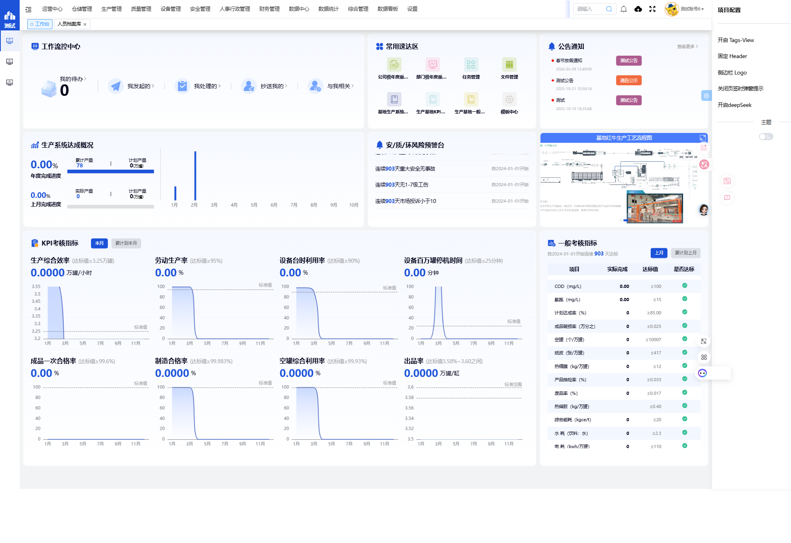
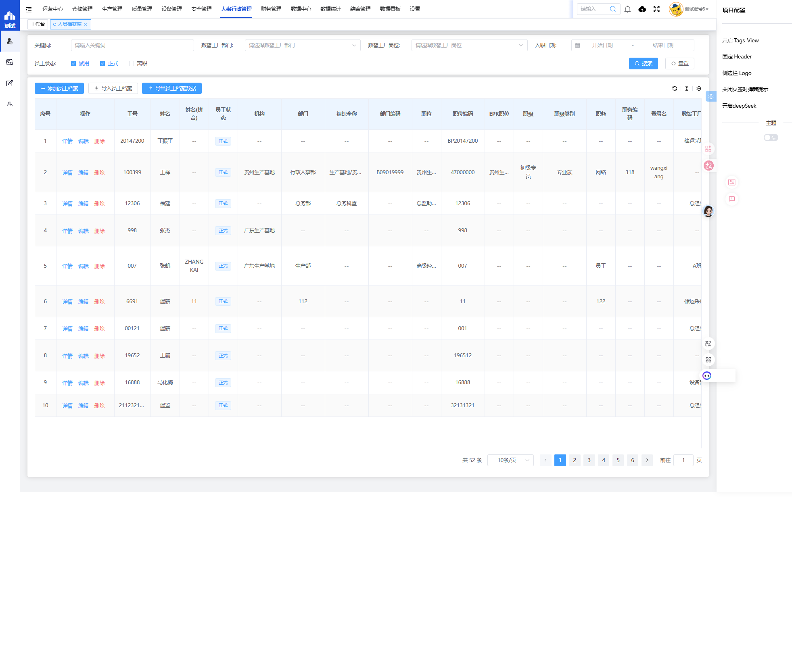
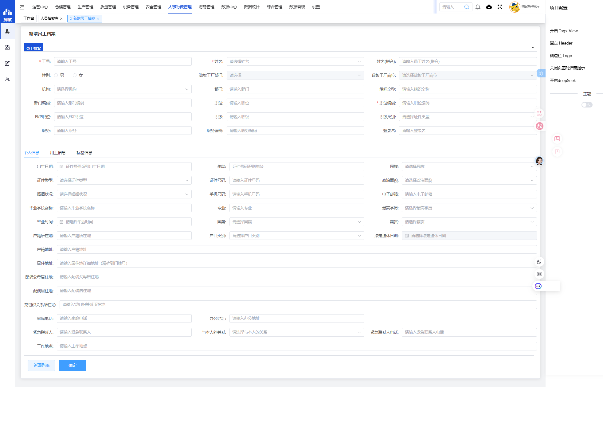
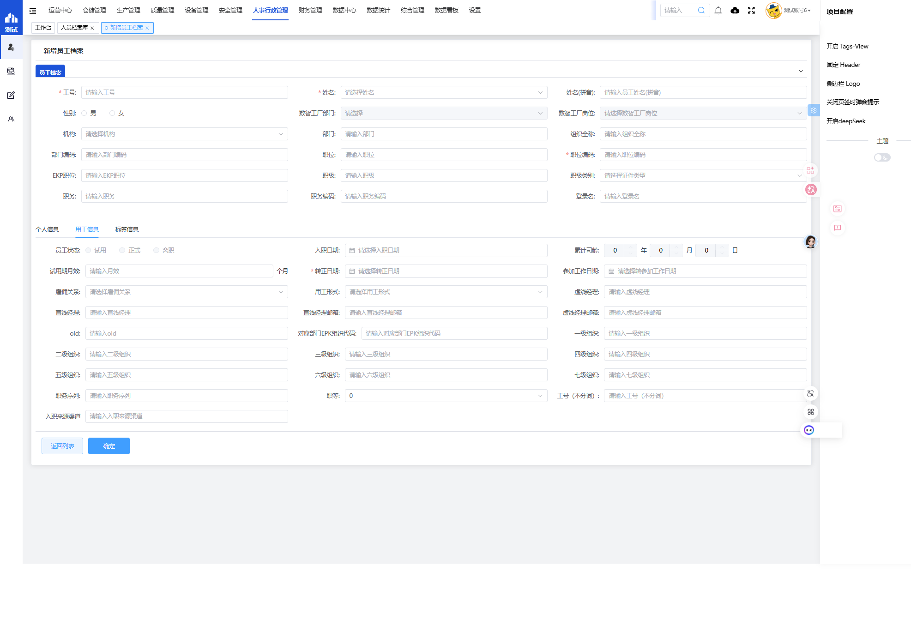
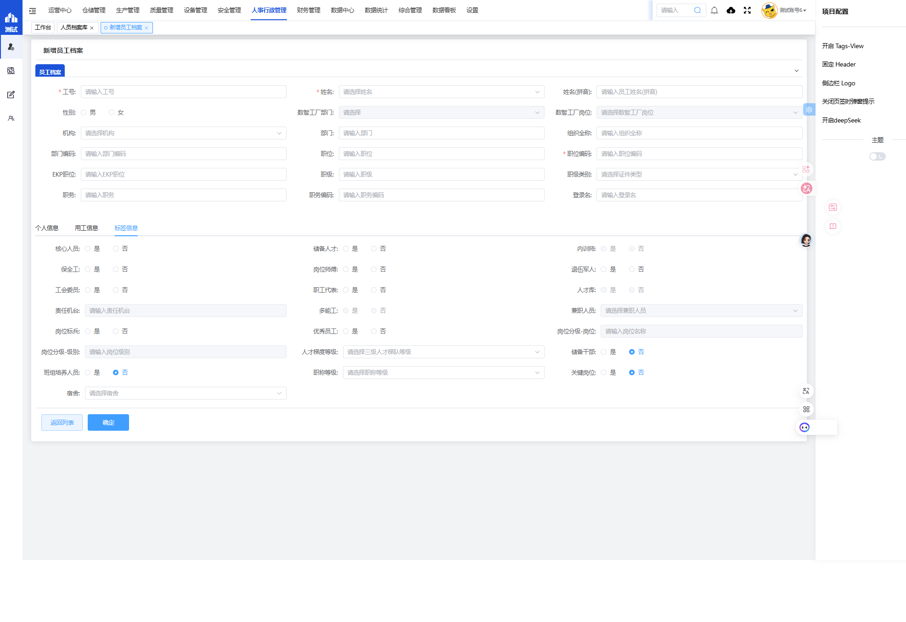
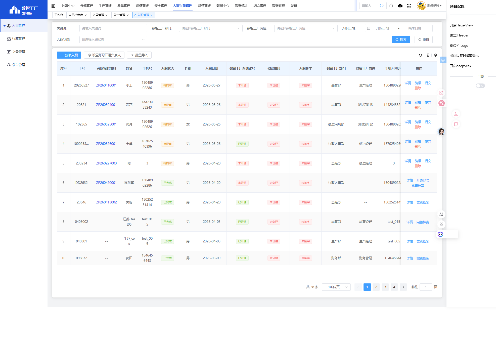
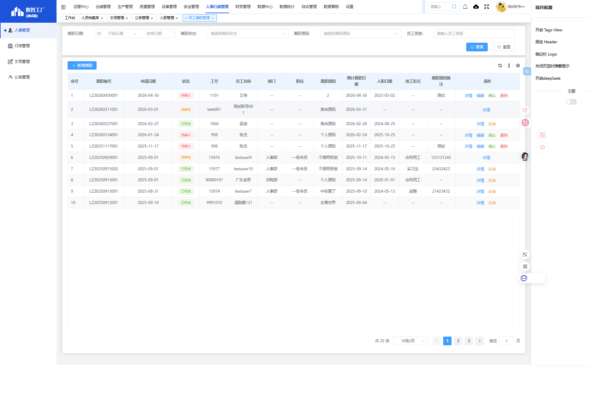
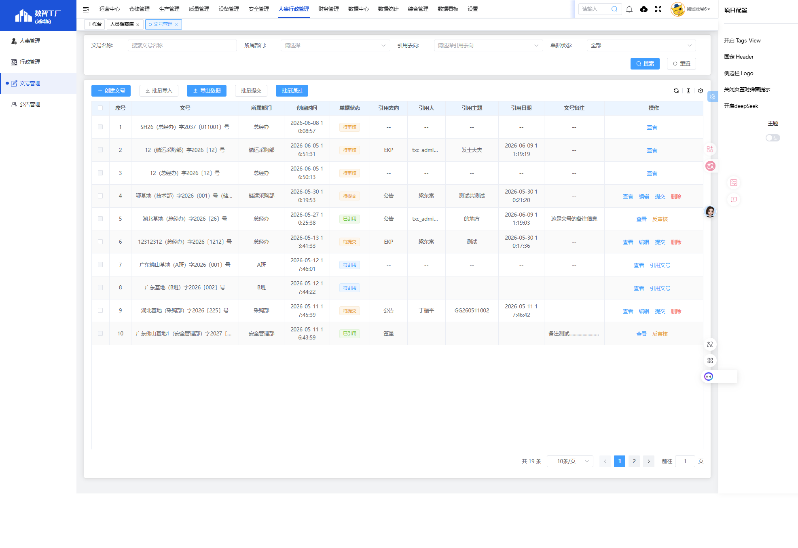
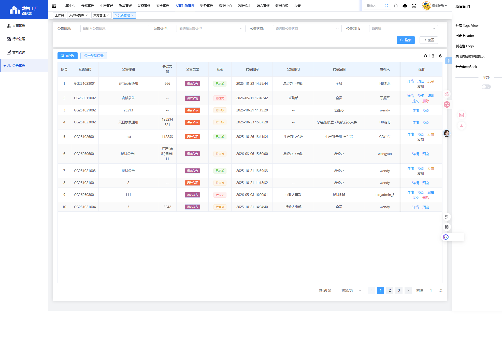

# 数智工厂系统 · 人事行政管理模块详细操作手册

**版本号**：V1.1  
**发布日期**：2026年6月22日  
**适用基地**：福建基地  
**系统访问**：https://203.195.203.96:803/#/dashboard  
**模块路径**：人事行政管理 → 人事管理

---

## 目录

### 第一部分：系统导航与核心页面

1. [页面1：工作台/首页（Dashboard）](#页面1工作台首页dashboard)
2. [页面2：人员档案库列表页](#页面2人员档案库列表页)
3. [页面3：新增员工档案表单页](#页面3新增员工档案表单页)

---

---

## 页面1：工作台/首页（Dashboard）

**📄 页面名称**：工作台/首页  
**🗂️ 菜单路径**：登录系统后 → 点击左侧菜单「工作台」

**🔗 系统路由**：`/dashboard`

---

### 1.1 页面整体布局说明

当您成功登录系统后，系统会自动跳转到工作台首页。

**页面主要区域：**

1. **顶部导航栏**
   - 左侧：系统名称「数智工厂（测试版）」
   - 中间：一级导航菜单（人事管理、行政管理、文号管理、公告管理、运营中心、仓储管理、生产管理、质量管理、设备管理、安全管理、人事行政管理、财务管理、数据中心、数据统计、综合管理、数据看板、设置）
   - 右侧：搜索框、通知图标、当前登录用户信息

2. **左侧菜单栏**
   - 工作台
   - 各一级菜单项（点击后可展开/收起）

3. **主内容区域**
   - 显示当前选中的菜单页面内容
   - 可能包含数据统计、快捷入口、待办事项等信息

**截图位置：**

---

### 1.2 具体操作步骤

**操作步骤1：登录系统**

1. 在浏览器中打开系统地址：`https://203.195.203.96:803/#/dashboard`
2. 在登录页面输入您的账号和密码
3. 点击「登录」按钮
4. 系统验证通过后，自动跳转到工作台首页

**操作步骤2：进入人事行政管理模块**

1. 在顶部导航栏中，找到并点击「人事行政管理」菜单
2. 系统会展开「人事行政管理」的二级子菜单，包括：
   - 人事管理
   - 行政管理
   - 文号管理
   - 公告管理
3. 点击「人事管理」进入人事管理模块

**操作步骤3：查看当前登录用户信息**

1. 在页面右上角找到显示用户名称的位置
2. 点击用户名称可查看用户信息、修改密码、退出登录等选项

---

### 1.3 关键提示

1. **菜单项说明**：顶部导航栏中的菜单项可能根据您的账号权限有所不同，如果看不到某些菜单，说明您的账号没有该模块的访问权限，请联系系统管理员申请权限。
2. **刷新页面**：如果页面加载不完整或数据显示异常，点击浏览器的刷新按钮，或按键盘 F5 键刷新页面。
3. **资源刷新提示**：如果系统弹出「检测到有新的资源，需要刷新页面加载最新资源！」的提示框，请点击「我知道了，刷新页面」按钮，系统会自动刷新并加载最新的功能模块。

---

---

## 页面2：人员档案库列表页

**📄 页面名称**：人员档案库 - 员工信息列表页  
**🗂️ 菜单路径**：人事行政管理 → 人事管理 → 人员档案库

**🔗 系统路由**：`/administration-manage/index10/index107/library`

---

### 2.1 页面整体布局说明

当您进入「人员档案库」页面后，您将看到以下内容：

**页面主要区域：**

1. **顶部搜索区域**（查询条件区）
   - 包含多个查询条件输入框和选择框
   - 右侧有「重置」和「搜索」按钮

2. **操作按钮区域**（位于搜索区域下方）
   - 添加员工档案
   - 导入员工档案
   - 导出员工档案数据

3. **员工信息表格区域**
   - 显示所有员工的档案信息
   - 表格包含多列字段
   - 每行数据左侧有「详情」「编辑」「删除」操作按钮
   - 表格支持左右滚动查看所有字段

**截图位置：**

---

### 2.2 查询条件详细说明

以下是页面中所有查询条件的详细说明：

| 序号 | 字段名称 | 字段类型 | 必填性 | 说明及操作方法 |
|-----|---------|---------|-------|----------------|
| 1 | 关键词 | 文本输入框 | 可选 | 在输入框中输入员工姓名、工号、手机号等关键词，系统会模糊匹配搜索 |
| 2 | 数智工厂部门 | 文本输入框 | 可选 | 输入部门名称，筛选指定部门的员工 |
| 3 | 数智工厂岗位 | 下拉选择框 | 可选 | 点击下拉箭头，从弹出的岗位列表中选择岗位类型 |
| 4 | 入职日期 | 日期范围选择器（开始日期 + 结束日期） | 可选 | 分别点击两个日期选择框，选择入职日期的开始日期和结束日期，筛选此时间段内入职的员工 |
| 5 | 员工状态 | 复选框（多选） | 可选 | 勾选对应状态前的复选框，支持多选： ☑ 试用（筛选试用期内的员工） ☑ 正式（筛选已转正的正式员工） ☑ 离职（筛选已离职的员工） |

**查询操作按钮：**

| 按钮名称 | 按钮位置 | 操作说明 |
|---------|---------|---------|
| 重置 | 搜索区域右侧（灰色按钮） | 点击后，清除所有已填写的查询条件，恢复到默认状态（显示所有员工） |
| 搜索 | 搜索区域右侧（蓝色/绿色按钮） | 点击后，系统根据已填写的查询条件，筛选显示符合条件的员工记录 |

**操作步骤4：使用查询条件搜索员工**

1. 在「关键词」输入框中输入员工姓名（例如：王小明）
2. 点击「数智工厂岗位」下拉框，从列表中选择一个岗位类型（例如：生产主管）
3. 在「入职日期」区域，点击第一个日期框选择开始日期（例如：2024-01-01），点击第二个日期框选择结束日期（例如：2024-12-31）
4. 在「员工状态」区域，勾选「正式」前面的复选框
5. 点击「搜索」按钮
6. 系统会在下方表格中显示符合以下所有条件的员工：
   - 姓名包含「王小明」，且
   - 岗位是「生产主管」，且
   - 入职日期在2024年内，且
   - 员工状态为「正式」

**操作步骤5：重置查询条件**

1. 如果需要重新设置查询条件，点击「重置」按钮
2. 所有查询条件会被清空，表格自动恢复显示所有员工记录

---

### 2.3 操作按钮详细说明

以下是页面中所有操作按钮的详细说明：

| 按钮名称 | 按钮位置 | 操作说明 |
|---------|---------|---------|
| 添加员工档案 | 搜索区域下方，第一个按钮 | 点击后跳转到「新增员工档案」页面，手动录入新员工的档案信息 |
| 导入员工档案 | 搜索区域下方，第二个按钮 | 点击后打开文件上传窗口，支持通过 Excel 模板批量导入员工信息 |
| 导出员工档案数据 | 搜索区域下方，第三个按钮 | 点击后将当前表格中显示的员工数据导出为 Excel 文件 |

**操作步骤6：添加员工档案（新建）**

1. 在人员档案库列表页，点击「添加员工档案」按钮
2. 系统跳转到「新增员工档案」页面（详见下一节 页面3 的详细说明）

**操作步骤7：导入员工档案（批量）**

1. 在人员档案库列表页，点击「导入员工档案」按钮
2. 系统弹出文件上传窗口
3. 按照提示下载 Excel 模板
4. 在 Excel 模板中按照格式填写员工信息
5. 点击上传按钮，选择已填写好的 Excel 文件
6. 系统读取 Excel 文件并批量导入员工档案

**操作步骤8：导出员工档案数据**

1. （可选）先使用查询条件筛选需要导出的员工
2. 在人员档案库列表页，点击「导出员工档案数据」按钮
3. 系统自动生成 Excel 文件并下载到您的电脑
4. 打开下载的 Excel 文件，即可查看所有导出的员工数据

---

### 2.4 数据表格详细说明

以下是数据表格中的主要字段（按从左到右的顺序排列）：

**操作列（固定在左侧）：**

| 字段名称 | 字段类型 | 说明 |
|---------|---------|------|
| 序号 | 数字 | 按顺序显示记录的序号（1、2、3……） |
| 操作 | 操作按钮组 | 包含三个操作按钮： • 详情 - 点击查看该员工的完整档案信息 • 编辑 - 点击进入该员工的档案编辑页面 • 删除 - 点击删除该员工的档案记录（请谨慎操作） |

**员工基础信息列：**

| 字段名称 | 字段类型 | 说明 |
|---------|---------|------|
| 工号 | 文本 | 员工在公司的唯一编号（例如：20147200、10038875） |
| 姓名 | 文本 | 员工的真实姓名 |
| 姓名(拼音) | 文本 | 员工姓名的拼音（可选字段，用于外籍员工或国际业务） |
| 员工状态 | 文本 | 显示员工当前的状态，包括：试用、正式、离职 |
| 机构 | 文本 | 员工所属的机构/公司名称 |
| 部门 | 文本 | 员工所在的部门名称 |
| 组织全称 | 文本 | 员工所属组织的完整层级路径名称 |
| 部门编码 | 文本 | 部门对应的系统编码 |
| 职位 | 文本 | 员工担任的职位名称 |
| 职位编码 | 文本 | 职位对应的系统编码 |
| EPK职位 | 文本 | 员工在 EPK 系统中的职位名称 |
| 职级 | 文本 | 员工的职级（例如：P5、M3 等） |
| 职级类别 | 文本 | 职级所属的类别（例如：专业族、管理族） |
| 职务 | 文本 | 员工担任的职务名称 |
| 职务编码 | 文本 | 职务对应的系统编码 |
| 登录名 | 文本 | 员工登录系统使用的账号名 |

**组织分配列：**

| 字段名称 | 字段类型 | 说明 |
|---------|---------|------|
| 数智工厂部门 | 文本 | 员工在数智工厂系统中的所属部门 |
| 数智工厂岗位 | 文本 | 员工在数智工厂系统中的所属岗位 |
| 雇佣关系 | 文本 | 员工的雇佣关系类型（例如：内部员工） |
| 用工形式 | 文本 | 员工的用工形式（例如：合同用工） |

**日期时间列：**

| 字段名称 | 字段类型 | 说明 |
|---------|---------|------|
| 入职日期 | 日期 | 员工正式入职公司的日期（格式：YYYY-MM-DD） |
| 转正日期 | 日期 | 员工试用期结束，转为正式员工的日期 |
| 参加工作日期 | 日期 | 员工开始参加社会工作的日期 |
| 员工状态 | 文本 | 再次显示员工状态（列表右侧重复显示，便于滚动查看） |
| 入职日期 | 日期 | 再次显示入职日期（列表右侧重复显示） |
| 累计司龄 | 文本 | 员工在本公司累计工作的时长（例如：2年4月21日） |
| 试用期月数 | 数字 | 员工的试用期时长（单位：月） |

**个人信息列：**

| 字段名称 | 字段类型 | 说明 |
|---------|---------|------|
| 性别 | 文本 | 员工的性别（男/女） |
| 婚姻状况 | 文本 | 员工的婚姻状况（未婚/已婚/离异/丧偶） |
| 出生日期 | 日期 | 员工的出生日期 |
| 年龄 | 数字 | 员工的当前年龄（系统自动计算） |
| 民族 | 文本 | 员工的民族 |
| 证件类型 | 文本 | 员工使用的证件类型（例如：身份证号、护照） |
| 证件号码 | 文本 | 员工的证件号码（例如：身份证号） |
| 政治面貌 | 文本 | 员工的政治面貌（例如：群众、中共党员） |
| 手机号码 | 文本 | 员工的手机号码 |
| 电子邮箱 | 文本 | 员工的电子邮箱地址 |
| 毕业学校名称 | 文本 | 员工最高学历的毕业学校名称 |
| 专业 | 文本 | 员工所学的专业名称 |
| 最高学历 | 文本 | 员工的最高学历（例如：本科、硕士） |
| 毕业时间 | 日期 | 员工从最高学历学校毕业的日期 |
| 国籍 | 文本 | 员工的国籍 |
| 籍贯 | 文本 | 员工的籍贯所在地 |
| 户籍所在地 | 文本 | 员工的户籍地址 |
| 户口类别 | 文本 | 员工的户口类别（例如：外埠农业） |
| 法定退休日期 | 日期 | 员工达到法定退休年龄的日期（系统自动计算） |
| 户籍地址 | 文本 | 员工的详细户籍地址 |
| 居住地址 | 文本 | 员工当前居住的详细地址 |
| 配偶父母居住地 | 文本 | 员工配偶父母的居住地址 |
| 配偶居住地 | 文本 | 员工配偶的居住地址 |
| 党组织关系所在地 | 文本 | 员工党组织关系所在的单位/地区 |
| 家庭电话 | 文本 | 员工的家庭固定电话号码 |
| 办公地址 | 文本 | 员工的办公地址 |
| 紧急联系人 | 文本 | 紧急情况下联系人的姓名 |
| 与本人的关系 | 文本 | 紧急联系人与员工的关系（例如：父亲、配偶、朋友） |
| 紧急联系人电话 | 文本 | 紧急联系人的电话号码 |
| 工作地点 | 文本 | 员工的实际工作地点 |

**组织架构列：**

| 字段名称 | 字段类型 | 说明 |
|---------|---------|------|
| 虚线经理 | 文本 | 员工的虚线汇报经理（矩阵式管理架构中的辅助汇报线） |
| 直线经理 | 文本 | 员工的直接上级/直属经理姓名 |
| 直线经理邮箱 | 文本 | 直线经理的电子邮箱地址 |
| 对应部门EPK组织代码 | 文本 | 部门在 EPK 系统中的组织代码 |
| 一级组织 | 文本 | 公司组织架构中的第一层级名称 |
| 二级组织 | 文本 | 公司组织架构中的第二层级名称 |
| 三级组织 | 文本 | 公司组织架构中的第三层级名称 |
| 四级组织 | 文本 | 公司组织架构中的第四层级名称 |
| 五级组织 | 文本 | 公司组织架构中的第五层级名称 |
| 六级组织 | 文本 | 公司组织架构中的第六层级名称 |
| 七级组织 | 文本 | 公司组织架构中的第七层级名称 |
| 职务序列 | 文本 | 职务所属的序列（例如：职能管理序列） |
| 职等 | 文本 | 员工的职等等级（例如：2） |

**人才标签列（核心字段）：**

| 字段名称 | 字段类型 | 说明 |
|---------|---------|------|
| 人才库 | 单选框 | 是否纳入公司人才库（是/否） |
| 核心人员 | 单选框 | 是否为公司核心人员（是/否） |
| 储备人才 | 单选框 | 是否为储备人才（是/否） |
| 认证时间 | 日期 | 人才库/储备人才的认证日期 |
| 内训师 | 单选框 | 是否为公司内部培训师（是/否） |
| 保全员 | 单选框 | 是否为保全人员（是/否） |
| 多能工 | 单选框 | 是否为多能工（是/否） |
| 多能工-认证岗位 | 文本 | 多能工认证通过的岗位名称 |
| 多能工-认证星级 | 数字/文本 | 多能工的认证星级等级 |
| 岗位师傅 | 单选框 | 是否担任岗位师傅（是/否） |
| 认证时间 | 日期 | 岗位师傅的认证日期 |
| 退伍军人 | 单选框 | 是否为退伍军人（是/否） |
| 工会委员 | 单选框 | 是否为工会委员（是/否） |
| 职工代表 | 单选框 | 是否为职工代表（是/否） |
| 岗位分级-岗位 | 文本 | 岗位分级体系中的岗位名称 |
| 岗位分级-级别 | 文本 | 岗位分级体系中的级别 |
| 人才梯度等级 | 文本 | 员工在人才梯度中的等级 |
| 认证时间 | 日期 | 相关标签的认证日期 |
| 储蓄岗位 | 文本 | （可能是「储备岗位」，指员工储备的岗位信息） |
| 班组培养人员 | 单选框 | 是否为班组培养对象（是/否） |
| 职称证书 | 文本 | 员工持有的职称证书名称 |
| 关键岗位 | 单选框 | 是否在关键岗位任职（是/否） |
| 认证时间 | 日期 | 关键岗位的认证日期 |
| 岗位类别 | 文本 | 岗位所属的类别 |
| 宿舍 | 文本 | 员工分配的宿舍信息（如有） |
| 责任机台 | 文本 | 员工负责的设备/机台编号（如有） |
| 内审认证 | 单选框 | 是否通过内部审核认证（是/否） |
| 岗位标兵 | 单选框 | 是否获得岗位标兵称号（是/否） |
| 优秀员工 | 单选框 | 是否获得优秀员工称号（是/否） |

**操作步骤9：查看员工档案详情**

1. 在人员档案库列表页的表格中，找到需要查看的员工所在行
2. 点击该行最左侧的「详情」按钮
3. 系统跳转到该员工的档案详情页，您可以查看该员工的所有档案信息

**操作步骤10：编辑员工档案信息**

1. 在人员档案库列表页的表格中，找到需要编辑的员工所在行
2. 点击该行最左侧的「编辑」按钮
3. 系统跳转到该员工的档案编辑页面，您可以修改该员工的档案信息
4. 修改完成后，点击页面底部的「确定」按钮保存修改

**操作步骤11：删除员工档案（请谨慎操作！）**

1. 在人员档案库列表页的表格中，找到需要删除的员工所在行
2. 点击该行最左侧的「删除」按钮
3. 系统会弹出确认窗口，询问是否确认删除
4. 确认无误后，点击「确定」按钮删除该员工档案
5. 建议：删除操作不可恢复，请谨慎使用！建议优先使用「离职」流程处理员工信息，而不是直接删除

**操作步骤12：在表格中横向滚动查看更多字段**

1. 由于表格字段较多，一屏无法完全显示
2. 使用鼠标滚轮，或拖动表格底部的横向滚动条
3. 向右滚动查看更多字段信息（如：组织架构、人才标签等）

---

### 2.5 关键提示

1. **查询条件可组合使用**：所有查询条件是「并且」的关系，即员工必须同时满足所有已填写的条件才会被搜索到。
2. **员工状态是重要信息**：员工状态（试用/正式/离职）直接影响该员工在考勤、培训、绩效等其他模块中的显示，请确保状态准确。
3. **人才标签是管理重点**：表格右侧的「人才库」「核心人员」「储备人才」「内训师」「多能工」等标签字段，是公司人才管理的重要标识，建议定期维护更新。
4. **数据导出前先筛选**：如果只需要导出特定部门或岗位的员工数据，请先使用查询条件进行筛选，再点击「导出员工档案数据」按钮。
5. **删除操作请谨慎**：删除员工档案后，该员工的所有历史数据将不可恢复，建议通过「离职管理」流程来处理员工离开，而不是直接删除档案。

---

---

## 页面3：新增员工档案表单页

**📄 页面名称**：新增员工档案 - 员工信息录入表单  
**🗂️ 菜单路径**：人事行政管理 → 人事管理 → 人员档案库 → 点击「添加员工档案」按钮

**🔗 系统路由**：`/administration-manage/index10/index107/library/libraryDetail?pageType=1`

---

### 3.1 页面整体布局说明

当您点击「添加员工档案」按钮后，系统会跳转到新增员工档案页面。

**页面主要区域：**

1. **顶部信息区域**
   - 页面标题：新增员工档案
   - 页面路径导航

2. **员工档案基础信息区域**（可折叠/展开的表单区域）
   - 点击「员工档案」按钮可折叠或展开此区域
   - 包含员工的核心基础信息（工号、姓名、部门、岗位、职位等）

3. **标签页切换区域**（页面中部的横向标签页）
   - 个人信息（默认选中，显示个人基本信息表单）
   - 用工信息（显示用工相关信息表单）
   - 标签信息（显示员工标签、人才标记表单）

4. **底部操作按钮区域**
   - 返回列表按钮
   - 确定按钮（保存并提交）

**截图位置：**

---

### 3.2 员工档案基础信息字段说明（第一部分）

以下是「员工档案」可折叠区域中所有字段的详细说明：

| 序号 | 字段名称 | 字段类型 | 必填性 | 说明及操作方法 |
|-----|---------|---------|-------|----------------|
| 1 | 工号 | 文本输入框 | ★ 强制必填 | 输入员工的唯一编号，建议按公司规则编号（例如：FJ-2024-001），编号一旦确定不可修改 |
| 2 | 姓名 | 下拉选择框 | ★ 强制必填 | 从系统已有列表中选择员工姓名（如该员工已在其他模块存在），或手动输入新员工姓名 |
| 3 | 姓名(拼音) | 文本输入框 | 建议填写 | 输入员工姓名的汉语拼音，用于外籍员工或国际业务场景 |
| 4 | 性别 | 单选按钮组 | 建议填写 | 点击选择「男」或「女」，选中的选项前面的圆圈会被填充 |
| 5 | 数智工厂部门 | 文本输入框（禁用） | 系统自动 | 此字段由系统自动填充，不可手动编辑，显示员工在数智工厂系统中的部门 |
| 6 | 数智工厂岗位 | 下拉选择框（禁用） | 系统自动 | 此字段由系统自动填充，不可手动编辑，显示员工在数智工厂系统中的岗位 |
| 7 | 机构 | 下拉选择框 | 建议填写 | 点击下拉箭头，从列表中选择员工所属的机构/公司名称 |
| 8 | 部门 | 文本输入框 | 建议填写 | 输入员工所在部门的名称 |
| 9 | 组织全称 | 文本输入框 | 建议填写 | 输入员工所属组织的完整层级路径名称（例如：XX集团/XX基地/XX部门/XX科室） |
| 10 | 部门编码 | 文本输入框 | 建议填写 | 输入部门对应的系统编码 |
| 11 | 职位 | 文本输入框 | 建议填写 | 输入员工担任的职位名称 |
| 12 | 职位编码 | 文本输入框 | ★ 强制必填 | 输入职位对应的系统编码，确保岗位信息标准化 |
| 13 | EPK职位 | 文本输入框 | 可选 | 输入员工在 EPK 系统中的职位名称（如公司使用 EPK 系统） |
| 14 | 职级 | 文本输入框 | 建议填写 | 输入员工的职级（例如：P5、M3、专员级、主管级等） |
| 15 | 职级类别 | 下拉选择框 | 建议填写 | 点击下拉箭头，从列表中选择职级所属的类别（例如：专业族、管理族、操作族等） |
| 16 | 职务 | 文本输入框 | 建议填写 | 输入员工担任的职务名称 |
| 17 | 职务编码 | 文本输入框 | 建议填写 | 输入职务对应的系统编码 |
| 18 | 登录名 | 文本输入框 | 建议填写 | 输入员工登录系统使用的账号名，建议使用姓名拼音（例如：wangxiaoming） |

**操作步骤13：填写员工档案基础信息**

1. 在「工号」输入框中，按照公司编号规则输入员工的工号（例如：FJ202401001）
2. 点击「姓名」下拉框，从列表中选择员工姓名，或直接输入员工的真实姓名
3. （可选）在「姓名(拼音)」输入框中输入姓名的拼音（例如：wangxiaoming）
4. 在「性别」选项中，点击「男」或「女」前面的单选圆圈
5. 点击「机构」下拉框，从列表中选择员工所属的机构
6. 在「部门」输入框中输入员工所在部门的名称
7. （可选）在「组织全称」输入框中输入完整的组织路径
8. 在「职位」输入框中输入员工的职位名称
9. 在「职位编码」输入框中输入对应的职位编码
10. （可选）填写其他职位、职级相关信息

---

### 3.3 标签页1：个人信息字段说明

点击「个人信息」标签页（默认已选中），显示以下个人信息字段：

| 序号 | 字段名称 | 字段类型 | 必填性 | 说明及操作方法 |
|-----|---------|---------|-------|----------------|
| 1 | 出生日期 | 日期选择器 | 建议填写 | 点击输入框旁的日历图标，从日历中选择员工的出生日期，或手动输入日期（格式：YYYY-MM-DD） |
| 2 | 年龄 | 文本输入框 | 自动计算 | 系统根据员工的出生日期自动计算年龄，无需手动填写 |
| 3 | 民族 | 下拉选择框 | 建议填写 | 点击下拉箭头，从56个民族列表中选择员工的民族 |
| 4 | 证件类型 | 下拉选择框 | 建议填写 | 点击下拉箭头，从列表中选择证件类型（例如：身份证、护照、港澳通行证、台胞证等） |
| 5 | 证件号码 | 文本输入框 | 建议填写 | 输入员工的证件号码，例如身份证号，系统会根据身份证号自动识别出生日期、年龄、性别、归属地等信息 |
| 6 | 政治面貌 | 下拉选择框 | 建议填写 | 点击下拉箭头，从列表中选择政治面貌（例如：群众、共青团员、中共党员、中共预备党员、民主党派等） |
| 7 | 婚姻状况 | 下拉选择框 | 建议填写 | 点击下拉箭头，从列表中选择婚姻状况（例如：未婚、已婚、离异、丧偶） |
| 8 | 手机号码 | 文本输入框 | 建议填写 | 输入员工的11位手机号码，用于系统通知、紧急联系等 |
| 9 | 电子邮箱 | 文本输入框 | 建议填写 | 输入员工的电子邮箱地址，用于接收系统通知、工作邮件等 |
| 10 | 毕业学校名称 | 文本输入框 | 建议填写 | 输入员工最高学历的毕业学校名称 |
| 11 | 专业 | 文本输入框 | 建议填写 | 输入员工所学的专业名称 |
| 12 | 最高学历 | 下拉选择框 | 建议填写 | 点击下拉箭头，从列表中选择最高学历（例如：高中、中专、大专、本科、硕士、博士） |
| 13 | 毕业时间 | 日期选择器 | 建议填写 | 点击输入框旁的日历图标，从日历中选择毕业日期 |
| 14 | 国籍 | 下拉选择框 | 建议填写 | 点击下拉箭头，从国家列表中选择员工的国籍 |
| 15 | 籍贯 | 下拉选择框 | 建议填写 | 点击下拉箭头，从省/市列表中选择员工的籍贯所在地 |
| 16 | 户籍所在地 | 文本输入框 | 建议填写 | 输入员工户籍所在的具体地址 |
| 17 | 户口类别 | 下拉选择框 | 建议填写 | 点击下拉箭头，从列表中选择户口类别（例如：本市城镇、本市农业、外埠城镇、外埠农业等） |
| 18 | 法定退休日期 | 日期选择器（禁用） | 自动计算 | 系统根据员工的出生日期和性别自动计算法定退休日期，无需手动填写 |
| 19 | 户籍地址 | 文本输入框 | 建议填写 | 输入员工户籍所在的详细地址（省/市/区/街道/门牌号） |
| 20 | 居住地址 | 文本输入框 | 建议填写 | 输入员工当前居住的详细地址 |
| 21 | 配偶父母居住地 | 文本输入框 | 可选 | （如适用）输入员工配偶父母的居住地址 |
| 22 | 配偶居住地 | 文本输入框 | 可选 | （如适用）输入员工配偶的居住地址 |
| 23 | 党组织关系所在地 | 文本输入框 | 可选 | （如适用）输入员工党组织关系所在的单位/地区地址 |
| 24 | 家庭电话 | 文本输入框 | 可选 | 输入员工的家庭固定电话号码 |
| 25 | 办公地址 | 文本输入框 | 建议填写 | 输入员工的办公地址 |
| 26 | 紧急联系人 | 文本输入框 | 建议填写 | 输入紧急情况下联系人的姓名 |
| 27 | 与本人的关系 | 下拉选择框 | 建议填写 | 点击下拉箭头，从列表中选择紧急联系人与员工的关系（例如：父亲、母亲、配偶、子女、朋友、同事等） |
| 28 | 紧急联系人电话 | 文本输入框 | 建议填写 | 输入紧急联系人的电话号码 |
| 29 | 工作地点 | 文本输入框 | 建议填写 | 输入员工的实际工作地点 |

**操作步骤14：填写个人信息**

1. 点击「出生日期」输入框旁的日历图标
2. 在弹出的日历中选择员工的出生日期（例如：1995年3月15日）
3. 确认「年龄」字段已自动计算显示
4. 点击「民族」下拉框，从列表中选择「汉族」
5. 点击「证件类型」下拉框，选择「身份证」
6. 在「证件号码」输入框中输入18位身份证号码
7. 点击「政治面貌」下拉框，选择员工的政治面貌
8. 点击「婚姻状况」下拉框，选择当前的婚姻状况
9. 在「手机号码」输入框中输入11位手机号码（例如：13800138000）
10. 在「电子邮箱」输入框中输入公司邮箱地址（例如：wangxiaoming@company.com）
11. 在「毕业学校名称」输入框中输入最高学历的毕业学校名称
12. 在「专业」输入框中输入所学的专业名称
13. 点击「最高学历」下拉框，选择对应的学历等级
14. 点击「毕业时间」输入框旁的日历图标，选择毕业日期
15. （可选）填写国籍、籍贯、户籍地址、居住地址等其他个人信息
16. 在「紧急联系人」输入框中输入紧急联系人的姓名
17. 点击「与本人的关系」下拉框，选择关系类型
18. 在「紧急联系人电话」输入框中输入联系人的电话号码

---

### 3.4 标签页2：用工信息字段说明

点击「用工信息」标签页（位于「个人信息」标签页右侧），显示以下用工相关字段：

**此标签页包含但不限于以下字段：**

| 序号 | 字段名称 | 字段类型 | 必填性 | 说明及操作方法 |
|-----|---------|---------|-------|----------------|
| 1 | 入职日期 | 日期选择器 | 建议填写 | 员工正式入职公司的日期，影响司龄计算和试用期 |
| 2 | 转正日期 | 日期选择器 | 建议填写 | 员工试用期结束，转为正式员工的日期 |
| 3 | 参加工作日期 | 日期选择器 | 建议填写 | 员工开始参加社会工作的日期 |
| 4 | 雇佣关系 | 下拉选择框 | 建议填写 | 员工的雇佣关系类型（例如：内部员工、劳务派遣、实习生等） |
| 5 | 用工形式 | 下拉选择框 | 建议填写 | 员工的用工形式（例如：合同用工、劳务用工、兼职等） |
| 6 | 直线经理 | 文本输入框/选择框 | 建议填写 | 员工的直接上级/直属经理姓名 |
| 7 | 直线经理邮箱 | 文本输入框 | 建议填写 | 直线经理的电子邮箱地址 |
| 8 | 虚线经理 | 文本输入框 | 可选 | 员工的虚线汇报经理（矩阵式管理架构中的辅助汇报线） |
| 9 | 对应部门EPK组织代码 | 文本输入框 | 可选 | 部门在 EPK 系统中的组织代码 |
| 10-16 | 一级组织~七级组织 | 文本输入框 | 建议填写 | 公司组织架构中从一级到七级的组织名称，用于数据汇总和权限控制 |
| 17 | 职务序列 | 下拉选择框 | 建议填写 | 职务所属的序列（例如：职能管理序列、技术序列、生产序列等） |
| 18 | 职等 | 文本输入框 | 建议填写 | 员工的职等等级 |

**操作步骤15：切换到用工信息标签页并填写**

1. 点击页面中部的「用工信息」标签页标签
2. 页面切换到用工信息表单
3. 点击「入职日期」输入框旁的日历图标，选择员工的入职日期
4. 点击「转正日期」输入框旁的日历图标，选择员工的转正日期
5. 点击「参加工作日期」输入框旁的日历图标，选择员工首次参加工作的日期
6. 点击「雇佣关系」下拉框，选择对应的雇佣关系类型
7. 点击「用工形式」下拉框，选择对应的用工形式
8. 在「直线经理」输入框中输入直接上级的姓名，或从选择框中选择
9. 在「直线经理邮箱」输入框中输入直接上级的邮箱地址
10. （可选）填写虚线经理信息
11. 在「一级组织」「二级组织」……「七级组织」输入框中依次填写组织架构层级信息
12. 点击「职务序列」下拉框，选择对应的职务序列
13. 在「职等」输入框中填写员工的职等等级

---

### 3.5 标签页3：标签信息字段说明

点击「标签信息」标签页（位于「用工信息」标签页右侧），显示员工标签和人才标记字段。

**此标签页是公司人才管理的关键区域，包含但不限于以下字段：**

| 序号 | 字段名称 | 字段类型 | 必填性 | 说明及操作方法 |
|-----|---------|---------|-------|----------------|
| 1 | 人才库 | 单选框 | 建议填写 | 选择是否将该员工纳入公司人才库（是/否） |
| 2 | 核心人员 | 单选框 | 建议填写 | 选择是否将该员工标记为公司核心人员（是/否） |
| 3 | 储备人才 | 单选框 | 建议填写 | 选择是否将该员工标记为储备人才（是/否） |
| 4 | 认证时间 | 日期选择器 | 可选 | 人才库/储备人才的认证日期 |
| 5 | 内训师 | 单选框 | 建议填写 | 选择是否将该员工认证为公司内部培训师（是/否） |
| 6 | 保全员 | 单选框 | 可选 | 选择是否为保全人员（是/否） |
| 7 | 多能工 | 单选框 | 建议填写 | 选择是否将该员工认证为多能工（是/否） |
| 8 | 多能工-认证岗位 | 文本输入框 | 如选择多能工则必填 | 如选择是多能工，填写认证通过的岗位名称 |
| 9 | 多能工-认证星级 | 文本输入框 | 如选择多能工则必填 | 如选择是多能工，填写认证星级等级 |
| 10 | 岗位师傅 | 单选框 | 建议填写 | 选择是否将该员工认证为岗位师傅（是/否） |
| 11 | 认证时间 | 日期选择器 | 可选 | 岗位师傅的认证日期 |
| 12 | 退伍军人 | 单选框 | 建议填写 | 选择该员工是否为退伍军人（是/否） |
| 13 | 工会委员 | 单选框 | 建议填写 | 选择该员工是否为工会委员（是/否） |
| 14 | 职工代表 | 单选框 | 建议填写 | 选择该员工是否为职工代表（是/否） |
| 15 | 岗位分级-岗位 | 文本输入框 | 建议填写 | 岗位分级体系中的岗位名称 |
| 16 | 岗位分级-级别 | 文本输入框 | 建议填写 | 岗位分级体系中的级别 |
| 17 | 人才梯度等级 | 文本输入框 | 建议填写 | 员工在人才梯度中的等级 |
| 18 | 认证时间 | 日期选择器 | 可选 | 相关标签的认证日期 |
| 19 | 储蓄岗位（储备岗位） | 文本输入框 | 可选 | 员工储备的岗位信息 |
| 20 | 班组培养人员 | 单选框 | 可选 | 选择是否将该员工列为班组培养对象（是/否） |
| 21 | 职称证书 | 文本输入框 | 可选 | 输入员工持有的职称证书名称 |
| 22 | 关键岗位 | 单选框 | 建议填写 | 选择该员工是否在关键岗位任职（是/否） |
| 23 | 认证时间 | 日期选择器 | 可选 | 关键岗位的认证日期 |
| 24 | 岗位类别 | 下拉选择框 | 建议填写 | 选择岗位所属的类别 |
| 25 | 宿舍 | 文本输入框 | 可选 | 如公司提供宿舍，填写员工分配的宿舍信息（例如：A栋302室） |
| 26 | 责任机台 | 文本输入框 | 可选 | 如员工负责特定设备，填写设备/机台编号 |
| 27 | 内审认证 | 单选框 | 可选 | 选择该员工是否通过内部审核认证（是/否） |
| 28 | 岗位标兵 | 单选框 | 可选 | 选择该员工是否获得岗位标兵称号（是/否） |
| 29 | 优秀员工 | 单选框 | 可选 | 选择该员工是否获得优秀员工称号（是/否） |

**操作步骤16：切换到标签信息标签页并填写**

1. 点击页面中部的「标签信息」标签页标签
2. 页面切换到标签信息表单
3. 根据员工的实际情况，在「人才库」「核心人员」「储备人才」等字段中选择「是」或「否」
4. （如选择是多能工）在「多能工-认证岗位」输入框中填写认证通过的岗位名称
5. （如选择是多能工）在「多能工-认证星级」输入框中填写认证星级等级
6. 根据员工的实际情况，在「退伍军人」「工会委员」「职工代表」等字段中选择「是」或「否」
7. 在「岗位分级-岗位」和「岗位分级-级别」输入框中填写对应的岗位分级信息
8. （可选）在「职称证书」输入框中填写员工持有的职称证书名称
9. 在「关键岗位」字段中选择该员工是否任职于关键岗位
10. （可选）填写宿舍、责任机台等其他信息

---

### 3.6 底部操作按钮说明

| 按钮名称 | 按钮位置 | 操作说明 |
|---------|---------|---------|
| 返回列表 | 页面底部左侧（灰色按钮） | 点击后返回人员档案库列表页，不保存当前填写的信息 |
| 确定 | 页面底部右侧（蓝色/绿色按钮） | 点击后，系统校验必填字段是否填写完整，校验通过后保存员工档案信息 |

**操作步骤17：保存员工档案（提交表单）**

1. 在完成所有必填字段的填写后，检查以下必填项是否已填写：
   - ★ 工号（必须填写）
   - ★ 姓名（必须填写）
   - ★ 职位编码（必须填写）
   - 其他根据公司政策要求的必填字段

2. 检查填写的信息是否准确无误

3. 点击页面底部右下角的「确定」按钮

4. 系统会进行以下处理：
   - 校验所有必填字段是否已填写
   - 校验填写格式是否正确（例如：日期格式、手机号格式等）
   - 校验通过后，将员工信息保存到系统数据库
   - 自动跳转到人员档案库列表页

5. 在人员档案库列表页的表格中，您应该能看到刚刚新增的员工记录

**操作步骤18：取消填写，返回列表页**

1. 如果填写过程中发现信息有误，或不需要继续添加该员工档案
2. 点击页面底部左下角的「返回列表」按钮
3. 系统会提示您是否确认放弃当前填写的内容（部分系统可能有此提示）
4. 确认后，系统返回到人员档案库列表页，当前填写的信息不会被保存

---

### 3.7 关键提示

1. **带星号★的字段是必填项**：在保存前，请确保所有必填字段都已填写完整，否则系统会提示您补充信息。
2. **禁用字段（灰色背景）**：部分字段显示为灰色背景，不可编辑，这些是系统自动维护的字段，由其他模块（如入职管理、异动管理）同步更新。
3. **日期格式**：所有日期字段的标准格式为「YYYY-MM-DD」（例如：2024-06-15），建议使用日期选择器进行选择，避免手动输入错误。
4. **人才标签的重要性**：「标签信息」标签页中的内容是公司人才管理的重要数据，建议与部门经理沟通确认后再填写，这些标签会影响培训安排、晋升评估、接班人计划等。
5. **组织架构信息**：一级组织到七级组织的信息应与公司的组织架构图保持一致，确保数据的规范性和一致性。
6. **紧急联系人信息**：务必确保紧急联系人的姓名和电话准确，这在紧急情况下是重要的联络渠道。
7. **身份证号的自动计算功能**：输入18位身份证号后，系统会自动计算并填充出生日期、年龄、性别、法定退休日期等字段，可减少手工录入的工作量。
8. **建议分步填写**：由于字段较多，建议按照页面布局，先填写「员工档案」基础信息，再填写「个人信息」，然后填写「用工信息」，最后填写「标签信息」，确保不遗漏重要内容。

**截图位置：**

---

---

## 附录：操作流程汇总

### 流程1：新员工档案完整录入流程

1. 登录系统 → 进入工作台首页
2. 点击顶部导航栏「人事行政管理」 → 点击「人事管理」
3. 在左侧菜单中点击「人员档案库」进入列表页
4. 点击「添加员工档案」按钮进入新增页面
5. 在「员工档案」区域填写：工号、姓名、性别、机构、部门、职位、职位编码等基础信息
6. 在「个人信息」标签页填写：出生日期、身份证号、手机号、邮箱、学历、紧急联系人等信息
7. 点击「用工信息」标签页，填写：入职日期、转正日期、直线经理、组织架构信息等
8. 点击「标签信息」标签页，根据员工实际情况填写：人才库、核心人员、储备人才、内训师、多能工等标签
9. 检查所有必填字段是否已填写，确认信息准确无误
10. 点击页面底部「确定」按钮保存员工档案
11. 系统返回到人员档案库列表页，在表格中确认已新增的员工记录

### 流程2：查询/搜索员工信息流程

1. 进入「人员档案库」列表页
2. 根据需要填写一个或多个查询条件：
   - 关键词（姓名/工号/手机号）
   - 数智工厂部门
   - 数智工厂岗位
   - 入职日期范围
   - 员工状态（勾选一个或多个复选框）
3. 点击「搜索」按钮
4. 表格中显示符合条件的员工记录
5. 如需恢复显示所有员工，点击「重置」按钮

### 流程3：查看/编辑员工档案流程

1. 进入「人员档案库」列表页
2. （可选）使用查询条件搜索找到目标员工
3. 在表格中找到目标员工所在行
4. 如需查看详情，点击该行的「详情」按钮
5. 如需修改信息，点击该行的「编辑」按钮

---

---

## 页面4：入职管理列表页

**📄 页面名称**：入职管理 - 新员工入职申请列表页  
**🗂️ 菜单路径**：人事行政管理 → 人事管理 → 入职管理

**🔗 系统路由**：`/administration-manage/index10/index107/onboardin`

---

### 4.1 页面整体布局说明

当您进入「入职管理」页面后，您将看到以下内容：

**页面主要区域：**

1. **顶部搜索区域**（查询条件区）
   - 包含多个查询条件输入框和选择框
   - 右侧有「重置」和「搜索」按钮

2. **操作按钮区域**（位于搜索区域下方）
   - 新增入职
   - 设置账号开通负责人
   - 批量导入

3. **入职申请表格区域**
   - 显示所有入职申请记录
   - 表格包含多列字段（工号、姓名、入职日期、入职状态等）
   - 每行数据右侧有操作按钮（详情、编辑、提交、删除等）

**截图位置：**

---

### 4.2 查询条件详细说明

| 序号 | 字段名称 | 字段类型 | 必填性 | 说明及操作方法 |
|-----|---------|---------|-------|----------------|
| 1 | 关键词 | 文本输入框 | 可选 | 输入员工姓名、工号、手机号等关键词进行模糊搜索 |
| 2 | 数智工厂部门 | 文本输入框 | 可选 | 输入部门名称筛选指定部门的入职申请 |
| 3 | 数智工厂岗位 | 下拉选择框 | 可选 | 选择岗位类型进行筛选 |
| 4 | 入职日期 | 日期范围选择器 | 可选 | 选择入职日期范围进行筛选 |
| 5 | 入职状态 | 下拉选择框 | 可选 | 选择入职状态（待提审、已提交、已审核、已完成等） |

---

### 4.3 操作按钮详细说明

| 按钮名称 | 操作说明 |
|---------|---------|
| 新增入职 | 点击后进入新增入职申请页面 |
| 设置账号开通负责人 | 配置负责开通系统账号的人员 |
| 批量导入 | 通过Excel模板批量导入入职申请 |

**操作步骤19：新增入职申请**

1. 点击「新增入职」按钮
2. 系统跳转到新增入职表单页面
3. 填写入职员工的基本信息（姓名、工号、部门、岗位、入职日期等）
4. 填写完成后点击「确定」按钮保存

---

### 4.4 核心功能点与必填字段解析

**核心功能：**
- 新员工入职流程管理
- 自动关联招聘信息
- 入职状态跟踪
- 系统账号开通管理

**必填字段：**
- ★ 工号
- ★ 姓名
- ★ 入职日期
- ★ 部门
- ★ 岗位

**上下游数据联动：**
- 入职申请通过后，自动在人员档案库创建员工档案
- 触发系统账号开通流程
- 更新考勤模块数据

---

---

## 页面5：员工离职管理列表页

**📄 页面名称**：员工离职管理 - 离职申请列表页  
**🗂️ 菜单路径**：人事行政管理 → 人事管理 → 员工离职管理

**🔗 系统路由**：`/administration-manage/index10/index107/dimission`

---

### 5.1 页面整体布局说明

**页面主要区域：**

1. **顶部搜索区域**
   - 关键词、部门、岗位、离职日期、离职状态等查询条件
   - 「重置」和「搜索」按钮

2. **操作按钮区域**
   - 新增离职申请
   - 批量导入

3. **离职申请表格区域**
   - 显示所有离职申请记录
   - 包含工号、姓名、部门、岗位、离职日期、离职状态等字段
   - 操作按钮：详情、编辑、提交、审核、删除

**截图位置：**

---

### 5.2 核心功能点与必填字段解析

**核心功能：**
- 员工离职流程管理
- 离职原因记录
- 工作交接管理
- 资产归还确认

**必填字段：**
- ★ 工号（自动关联员工档案）
- ★ 姓名（自动填充）
- ★ 离职日期
- ★ 离职原因

**上下游数据联动：**
- 离职申请通过后，自动更新员工档案状态为「离职」
- 触发资产归还流程
- 更新考勤和薪资模块数据

---

---

## 页面6：合同管理列表页

**📄 页面名称**：合同管理 - 劳动合同列表页  
**🗂️ 菜单路径**：人事行政管理 → 人事管理 → 合同管理

---

### 6.1 页面整体布局说明

**页面主要区域：**

1. **顶部搜索区域**
   - 合同编号、员工姓名、合同类型、合同状态等查询条件

2. **操作按钮区域**
   - 新增合同
   - 批量导入
   - 合同续签提醒

3. **合同列表表格区域**
   - 显示所有劳动合同记录
   - 包含合同编号、员工姓名、合同类型、签订日期、到期日期、合同状态等字段

**截图位置：**

---

### 6.2 核心功能点与必填字段解析

**核心功能：**
- 劳动合同全生命周期管理
- 合同到期提醒
- 合同续签流程
- 合同台账管理

**必填字段：**
- ★ 合同编号
- ★ 员工工号/姓名
- ★ 合同类型（固定期限/无固定期限/劳务派遣等）
- ★ 签订日期
- ★ 合同期限（起始日期、结束日期）

**上下游数据联动：**
- 合同签订后，自动关联员工档案
- 合同到期前自动触发续签提醒
- 合同解除后更新员工档案状态

---

---

## 页面7：奖惩管理列表页

**📄 页面名称**：奖惩管理 - 奖惩记录列表页  
**🗂️ 菜单路径**：人事行政管理 → 人事管理 → 奖惩管理

---

### 7.1 页面整体布局说明

**页面主要区域：**

1. **顶部搜索区域**
   - 员工姓名、奖惩类型、奖惩日期、审批状态等查询条件

2. **操作按钮区域**
   - 新增奖惩记录
   - 批量导入

3. **奖惩记录表格区域**
   - 显示所有奖惩记录
   - 包含员工姓名、奖惩类型、奖惩事由、奖惩金额、审批状态等字段

**截图位置：**

---

### 7.2 核心功能点与必填字段解析

**核心功能：**
- 员工奖惩记录管理
- 奖励和处罚流程审批
- 奖惩金额核算
- 绩效积分关联

**必填字段：**
- ★ 员工工号/姓名
- ★ 奖惩类型（奖励/处罚）
- ★ 奖惩事由
- ★ 奖惩金额（如适用）
- ★ 审批意见

**上下游数据联动：**
- 奖惩记录与绩效考核模块关联
- 奖励记录可用于绩效加分
- 处罚记录影响绩效评分

---

---

## 页面8：培训管理列表页

**📄 页面名称**：培训管理 - 培训计划与记录列表页  
**🗂️ 菜单路径**：人事行政管理 → 人事管理 → 培训与发展 → 培训记录

---

### 8.1 页面整体布局说明

**页面主要区域：**

1. **顶部搜索区域**
   - 培训名称、员工姓名、培训类型、培训状态等查询条件

2. **操作按钮区域**
   - 新增培训记录
   - 批量导入
   - 培训报表导出

3. **培训记录表格区域**
   - 显示所有培训记录
   - 包含培训名称、员工姓名、培训日期、培训时长、培训结果等字段

**截图位置：**

---

### 8.2 核心功能点与必填字段解析

**核心功能：**
- 培训计划管理
- 员工培训记录跟踪
- 培训学时统计
- 培训证书管理

**必填字段：**
- ★ 培训名称
- ★ 员工工号/姓名
- ★ 培训日期
- ★ 培训类型
- ★ 培训时长

**上下游数据联动：**
- 培训记录与员工档案关联
- 培训学时累计到员工培训档案
- 培训合格可触发资格认证

---

---

## 页面9：考勤管理页面

**📄 页面名称**：考勤管理 - 考勤排班与记录页面  
**🗂️ 菜单路径**：人事行政管理 → 人事管理 → 考勤排班 → 部门考勤记录表

---

### 9.1 页面整体布局说明

**页面主要区域：**

1. **顶部搜索区域**
   - 部门、员工姓名、考勤月份、考勤状态等查询条件

2. **操作按钮区域**
   - 导入考勤数据
   - 导出考勤报表
   - 考勤异常处理

3. **考勤记录表格区域**
   - 显示员工考勤记录
   - 包含日期、上班时间、下班时间、加班时长、请假类型等字段

**截图位置：**

---

### 9.2 核心功能点与必填字段解析

**核心功能：**
- 考勤排班管理
- 考勤数据采集与统计
- 请假流程管理
- 加班申请与审批

**必填字段（请假申请）：**
- ★ 员工工号/姓名
- ★ 请假类型（事假/病假/年假等）
- ★ 请假开始日期
- ★ 请假结束日期
- ★ 请假事由

**上下游数据联动：**
- 考勤数据与薪资计算关联
- 请假记录影响考勤统计
- 加班时长参与薪资核算

---

---

## 页面10：文号管理列表页

**📄 页面名称**：文号管理 - 公文文号列表页  
**🗂️ 菜单路径**：人事行政管理 → 文号管理

**🔗 系统路由**：`/administration-manage/number-management`

---

### 10.1 页面整体布局说明

**页面主要区域：**

1. **顶部搜索区域**
   - 文号名称、所属部门、引用去向、单据状态等查询条件

2. **操作按钮区域**
   - 创建文号
   - 批量导入
   - 导出数据

3. **文号列表表格区域**
   - 显示所有文号记录
   - 包含文号、所属部门、创建时间、单据状态、引用去向等字段

**截图位置：**

---

### 10.2 核心功能点与必填字段解析

**核心功能：**
- 公文文号生成与管理
- 文号引用跟踪
- 文号审批流程
- 文号归档管理

**必填字段：**
- ★ 文号名称
- ★ 所属部门
- ★ 引用去向（公告/签呈等）

**上下游数据联动：**
- 文号与公告管理模块关联
- 文号审批状态影响公文发布
- 文号引用记录追踪

---

---

## 页面11：公告管理列表页

**📄 页面名称**：公告管理 - 公司公告列表页  
**🗂️ 菜单路径**：人事行政管理 → 公告管理

**🔗 系统路由**：`/administration-manage/notice`

---

### 11.1 页面整体布局说明

**页面主要区域：**

1. **顶部搜索区域**
   - 公告信息、公告类型、公告状态、公告部门等查询条件

2. **操作按钮区域**
   - 添加公告
   - 公告类型设置

3. **公告列表表格区域**
   - 显示所有公告记录
   - 包含公告编码、公告标题、公告类型、状态、发布时间、发布范围等字段
   - 操作按钮：详情、预览、编辑、提交、删除、反审、复制

**截图位置：**

---

### 11.2 核心功能点与必填字段解析

**核心功能：**
- 公司公告发布与管理
- 公告审批流程
- 公告发布范围控制
- 公告预览功能

**必填字段（新增公告）：**
- ★ 公告名称
- ★ 公告类型
- ★ 公告正文
- ★ 发布范围

**上下游数据联动：**
- 公告可关联文号管理模块
- 公告发布后推送给指定范围员工
- 公告状态影响员工可见性

---

### 11.3 新增公告表单字段说明

点击「添加公告」按钮后，进入新增公告页面：

| 序号 | 字段名称 | 字段类型 | 必填性 | 说明 |
|-----|---------|---------|-------|------|
| 1 | 公告名称 | 文本输入框 | ★ 必填 | 公告的标题名称 |
| 2 | 公告编号 | 文本输入框 | 自动生成 | 系统自动生成，不可修改 |
| 3 | 公告类型 | 下拉选择框 | ★ 必填 | 选择公告类型（测试公告、通告公示等） |
| 4 | 公告部门 | 文本输入框 | 可选 | 发布公告的部门 |
| 5 | 文号编码 | 下拉选择框 | 可选 | 关联的文号编码 |
| 6 | 显示顺序 | 文本输入框 | 可选 | 公告在列表中的显示顺序 |
| 7 | 发布范围 | 选择框 | 可选 | 默认全员可见，可选择特定部门或人员 |
| 8 | 公告正文 | 富文本编辑器 | ★ 必填 | 公告的详细内容 |
| 9 | 附件信息 | 文件上传 | 可选 | 支持上传附件（图片、文档等） |

**截图位置：**

---

---

## 附录：常用快捷键

| 快捷键 | 功能说明 |
|-------|---------|
| F5 | 刷新页面 |
| Ctrl + F | 页面内搜索 |
| Ctrl + S | 保存当前表单（部分页面支持） |
| Esc | 关闭弹窗 |

---

## 附录：常见问题与解决方案

### Q1：登录系统后看不到某些菜单怎么办？

**A**：菜单显示与账号权限相关。如果看不到某些菜单，说明您的账号没有该模块的访问权限，请联系系统管理员申请权限。

### Q2：页面加载不完整或数据显示异常怎么办？

**A**：点击浏览器的刷新按钮（或按F5键）刷新页面。如果问题仍然存在，请联系系统管理员。

### Q3：如何导出数据？

**A**：在列表页面找到「导出」按钮，点击后系统会自动生成Excel文件并下载到您的电脑。

### Q4：如何联系系统管理员？

**A**：请联系您所在部门的IT支持人员，或拨打公司IT服务热线。

---

**文档版本**：V1.1  
**最后更新**：2026年6月23日  
**适用范围**：福建基地全体员工
6. 在打开的页面中修改相关字段信息
7. 修改完成后，点击「确定」按钮保存修改

---

**文档版本更新记录：**
- V1.0（初始版本）：核心表单培训手册，功能概述为主
- V1.1（本次更新）：新增详细操作手册，包含页面1-3的具体操作步骤和字段说明
