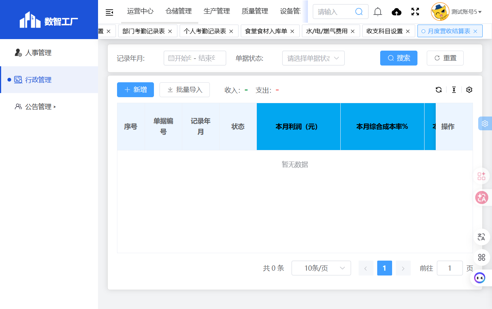

# 月度营收结算表

## 功能定位
月度营收结算表模块用于按月统计食堂的营收数据，包括收入、支出、库存和利润等信息。

## 页面结构

### 搜索条件
| 字段名 | 类型 | 说明 |
|--------|------|------|
| 记录年月 | 日期范围 | 选择记录年月区间 |
| 单据状态 | 下拉选择 | 按单据状态筛选 |

### 操作按钮
- 重置
- 搜索
- 新增
- 批量导入

### 统计汇总
- 收入合计
- 支出合计

### 列表字段
| 字段名 | 说明 |
|--------|------|
| 序号 | 自动编号 |
| 单据编号 | 系统编号 |
| 记录年月 | 记录月份 |
| 状态 | 单据状态 |
| 本月利润（元） | 本月利润 |
| 本月综合成本率% | 综合成本率 |
| 本月实际利润（元） | 实际利润 |
| 收入 | 收入金额 |
| 支出 | 支出金额 |
| 库房库存-上月库存 | 上月库存金额 |
| 库房库存-本月库存 | 本月库存金额 |
| 库房库存-差额 | 库存差额 |
| 创建人 | 创建人姓名 |
| 创建时间 | 创建时间 |
| 操作 | 详情/编辑等 |

## 截图
- 
