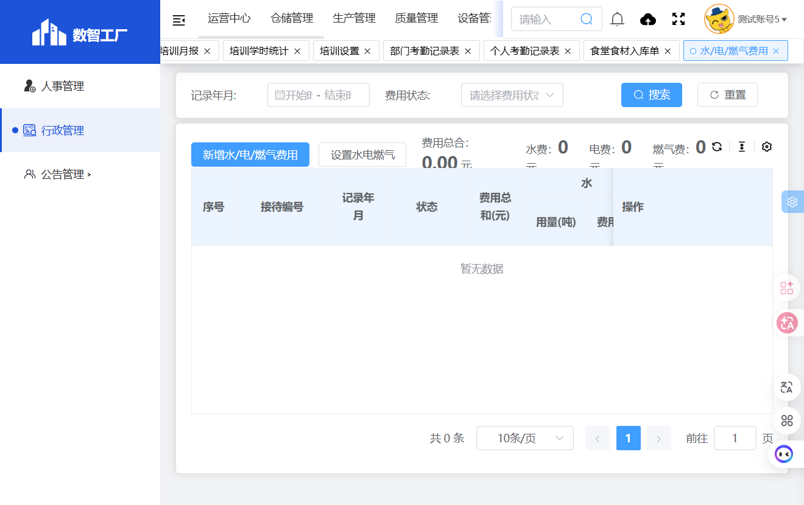

# 水/电/燃气费用

## 功能定位
水/电/燃气费用模块用于记录和管理每月的水费、电费和燃气费用数据。

## 页面结构

### 搜索条件
| 字段名 | 类型 | 说明 |
|--------|------|------|
| 记录年月 | 日期范围 | 选择记录年月区间 |
| 费用状态 | 下拉选择 | 按费用状态筛选 |

### 操作按钮
- 重置
- 搜索
- 新增水/电/燃气费用
- 设置水电燃气

### 统计汇总
- 费用总合（元）
- 水费（元）
- 电费（元）
- 燃气费（元）

### 列表字段
| 字段名 | 说明 |
|--------|------|
| 序号 | 自动编号 |
| 接待编号 | 系统编号 |
| 记录年月 | 记录月份 |
| 状态 | 费用状态 |
| 费用总和(元) | 总费用 |
| 水-用量(吨) | 水用量 |
| 水-费用(元) | 水费 |
| 电-用量(度) | 电用量 |
| 电-费用(元) | 电费 |
| 燃气-用量(m3) | 燃气用量 |
| 燃气-费用(元) | 燃气费 |
| 操作 | 详情/编辑等 |

## 截图
- 
