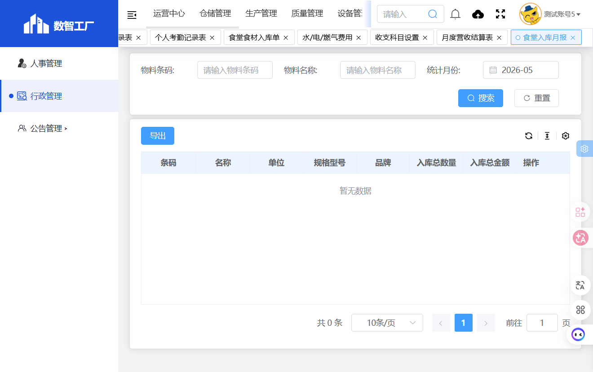

# 食堂入库月报

## 功能定位
食堂入库月报模块用于按月统计食堂食材入库的汇总数据，支持按物料条码和名称查询。

## 页面结构

### 搜索条件
| 字段名 | 类型 | 说明 |
|--------|------|------|
| 物料条码 | 文本输入 | 按物料条码搜索 |
| 物料名称 | 文本输入 | 按物料名称搜索 |
| 统计月份 | 月份选择 | 选择统计月份 |

### 操作按钮
- 重置
- 搜索
- 导出

### 列表字段
| 字段名 | 说明 |
|--------|------|
| 条码 | 物料条码 |
| 名称 | 物料名称 |
| 单位 | 计量单位 |
| 规格型号 | 规格型号 |
| 品牌 | 品牌名称 |
| 入库总数量 | 当月入库总数量 |
| 入库总金额 | 当月入库总金额 |
| 操作 | 详情 |

## 截图
- 
