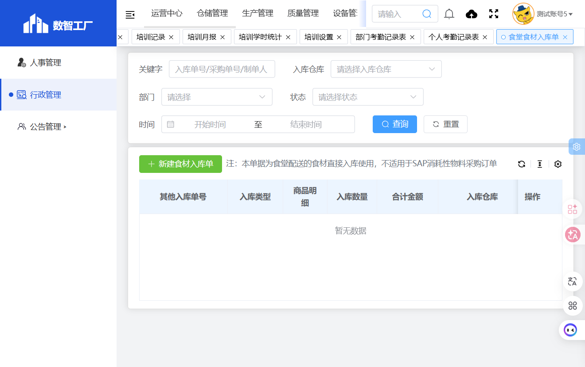

# 食堂食材入库单

## 功能定位
食堂食材入库单模块用于管理食堂配送食材的入库记录，适用于非SAP消耗性物料采购的食材入库。

## 页面结构

### 搜索条件
| 字段名 | 类型 | 说明 |
|--------|------|------|
| 关键字 | 文本输入 | 按关键字搜索 |
| 入库仓库 | 下拉选择 | 按入库仓库筛选 |
| 部门 | 文本输入（只读） | 按部门筛选 |
| 状态 | 下拉选择 | 按单据状态筛选 |
| 时间 | 日期范围 | 选择入库时间区间 |

### 操作按钮
- 查询
- 重置
- 新建食材入库单

### 列表字段
| 字段名 | 说明 |
|--------|------|
| 其他入库单号 | 入库单编号 |
| 入库类型 | 入库类型分类 |
| 商品明细 | 入库商品详情 |
| 入库数量 | 入库数量合计 |
| 合计金额 | 入库总金额 |
| 入库仓库 | 入库仓库名称 |
| 入库日期 | 入库日期 |
| 单据备注 | 备注说明 |
| 制单人 | 制单人姓名 |
| 创建时间 | 创建时间 |
| 状态 | 单据状态 |
| 操作 | 详情/编辑等 |

## 截图
- 
