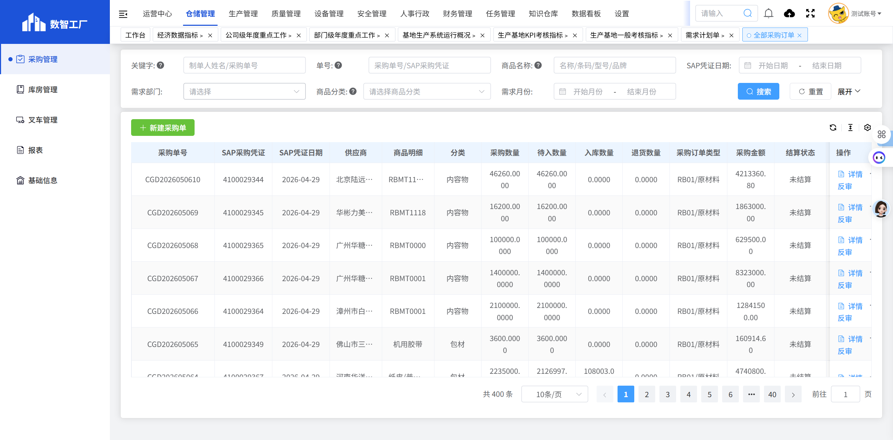

# 全部采购订单

## 页面概述

**功能说明**：管理所有采购订单，包括原材料、备件、消耗品、辅料等各类采购订单的查询、创建和跟踪。

**页面URL**：https://gdmms.y1b.cn:8424/#/warehouse-manage/buy/routine-purchase/order

## 页面截图

## 筛选条件

### 基础筛选条件

| 序号 | 字段名称 | 输入类型 | 默认值 | 约束条件 | 说明 |
| :--- | :--- | :--- | :--- | :--- | :--- |
| 1 | 关键字 | 文本框 | 空 | 可选 | 支持模糊搜索 |
| 2 | 单号 | 文本框 | 空 | 可选 | 采购单号搜索 |
| 3 | 商品名称 | 文本框 | 空 | 可选 | 支持模糊搜索 |
| 4 | SAP凭证日期-开始 | 日期选择器 | 空 | 可选 | 选择开始日期 |
| 5 | SAP凭证日期-结束 | 日期选择器 | 空 | 可选 | 选择结束日期 |
| 6 | 需求部门 | 文本框 | 空 | 可选 | 选择需求部门 |
| 7 | 商品分类-一级 | 下拉框 | 空 | 可选 | 选择商品一级分类 |
| 8 | 商品分类-二级 | 下拉框 | 空 | 可选 | 选择商品二级分类 |
| 9 | 需求月份-开始 | 月份选择器 | 空 | 可选 | 选择开始月份 |
| 10 | 需求月份-结束 | 月份选择器 | 空 | 可选 | 选择结束月份 |

### 展开后额外筛选条件

| 序号 | 字段名称 | 输入类型 | 默认值 | 约束条件 | 说明 |
| :--- | :--- | :--- | :--- | :--- | :--- |
| 11 | 结算状态 | 下拉框 | 空 | 可选 | 选择结算状态（未结算、已结算等） |
| 12 | 状态 | 下拉框 | 空 | 可选 | 选择单据状态（待入库、已完成等） |
| 13 | 创建部门 | 文本框 | 空 | 可选 | 选择创建部门 |
| 14 | 创建日期-开始 | 日期选择器 | 空 | 可选 | 选择创建开始日期 |
| 15 | 创建日期-结束 | 日期选择器 | 空 | 可选 | 选择创建结束日期 |
| 16 | 采购订单类型 | 下拉框 | 空 | 可选 | 选择采购订单类型 |

## 操作按钮

| 序号 | 按钮名称 | 功能描述 |
| :--- | :--- | :--- |
| 1 | 重置 | 清空所有筛选条件 |
| 2 | 搜索 | 根据筛选条件查询采购订单列表 |
| 3 | 展开 | 展开更多筛选条件 |
| 4 | 新建采购单 | 新建采购订单 |

## 数据列表字段

| 序号 | 字段名称 | 字段类型 | 说明 |
| :--- | :--- | :--- | :--- |
| 1 | 采购单号 | 文本 | 采购订单的唯一编号，如：CGD2026050610 |
| 2 | SAP采购凭证 | 文本 | SAP系统中的采购凭证号，如：4100029344 |
| 3 | SAP凭证日期 | 日期 | SAP凭证的创建日期 |
| 4 | 供应商 | 文本 | 供应商名称 |
| 5 | 商品明细 | 文本 | 采购商品的详细名称和规格 |
| 6 | 分类 | 文本 | 商品分类（内容物、包材等） |
| 7 | 采购数量 | 数字 | 采购商品的总数量 |
| 8 | 待入数量 | 数字 | 待入库的数量 |
| 9 | 入库数量 | 数字 | 已入库的数量 |
| 10 | 退货数量 | 数字 | 退货的数量 |
| 11 | 采购订单类型 | 文本 | 采购订单类型，如：RB01/原材料 |
| 12 | 采购金额 | 数字 | 采购订单的总金额 |
| 13 | 结算状态 | 文本 | 结算状态（未结算、已结算等） |
| 14 | 需求月份 | 文本 | 需求计划对应的月份 |
| 15 | 需求部门 | 文本 | 提出需求的部门名称 |
| 16 | 采购事由 | 文本 | 采购的原因或事由 |
| 17 | 单据备注 | 文本 | 单据的备注信息 |
| 18 | 制单人 | 文本 | 创建该采购订单的人员姓名 |
| 19 | 创建时间 | 日期时间 | 采购订单的创建时间 |
| 20 | 状态 | 文本 | 采购订单当前状态（待入库、已完成等） |
| 21 | 操作 | 按钮 | 详情、反审 |

## 操作列按钮

| 序号 | 按钮名称 | 功能描述 |
| :--- | :--- | :--- |
| 1 | 详情 | 查看采购订单的详细信息 |
| 2 | 反审 | 对采购订单进行反审操作 |

## 分页控件

- 显示总条数：如"共 400 条"
- 每页显示条数：10条/页（可选择）
- 上一页/下一页按钮
- 页码跳转功能
- 支持快速跳转（向后5页、最后一页）

## 数据示例

| 采购单号 | SAP采购凭证 | 供应商 | 商品明细 | 分类 | 采购数量 | 采购金额 | 状态 |
| :--- | :--- | :--- | :--- | :--- | :--- | :--- | :--- |
| CGD2026050610 | 4100029344 | 北京陆远国际供应链管理有限公司 | RBMT1113等 | 内容物 | 46260.0000 | 4213360.80 | 待入库 |
| CGD202605069 | 4100029345 | 华彬力美科技（湖北）有限公司 | RBMT1118 | 内容物 | 16200.0000 | 1863000.00 | 待入库 |
| CGD202605068 | 4100029365 | 广州华糖食品有限公司 | RBMT0000 | 内容物 | 100000.0000 | 629500.00 | 待入库 |

## 交互说明

1. 用户可通过筛选条件查询特定的采购订单
2. 点击"重置"按钮可清空所有筛选条件
3. 点击"展开"可查看更多筛选选项
4. 点击"新建采购单"按钮可创建新的采购订单
5. 点击"详情"按钮可查看采购订单的详细信息
6. 点击"反审"按钮可对采购订单进行反审操作

## 详情页面字段

### 基本信息

| 序号 | 字段名称 | 字段类型 | 说明 |
| :--- | :--- | :--- | :--- |
| 1 | 采购单号 | 文本 | 采购订单的唯一编号，如：CGD2026050610 |
| 2 | 制单人 | 文本 | 创建人员及部门，如：莫丽琼【储运采购部＞办公室】 |
| 3 | 创建时间 | 日期时间 | 采购订单的创建时间 |
| 4 | 单据状态 | 文本 | 当前状态（待入库、已完成等） |
| 5 | 需求月份 | 文本 | 需求计划对应的月份 |
| 6 | 采购订单类型 | 文本 | 采购订单类型，如：RB01/原材料 |
| 7 | 供应商 | 文本 | 供应商名称 |
| 8 | SAP采购凭证 | 文本 | SAP系统中的采购凭证号 |
| 9 | SAP凭证日期 | 日期 | SAP凭证的创建日期 |
| 10 | 库存地点 | 文本 | 库存存放地点，如：0001(一/二号线生产原料库) |

### 商品明细列表

| 序号 | 字段名称 | 字段类型 | 说明 |
| :--- | :--- | :--- | :--- |
| 1 | # | 数字 | 序号 |
| 2 | 物料条码 | 文本 | 物料的条码编号 |
| 3 | 名称(短文本) | 文本 | 物料名称 |
| 4 | 规格型号 | 文本 | 物料规格型号 |
| 5 | 品牌 | 文本 | 物料品牌 |
| 6 | 分类 | 文本 | 物料分类 |
| 7 | 单位 | 文本 | 计量单位 |
| 8 | 采购订单数量 | 数字 | 采购数量 |
| 9 | 含税单价(元) | 数字 | 含税单价 |
| 10 | 小计 | 数字 | 该行商品小计金额 |
| 11 | 去税单价(元) | 数字 | 不含税单价 |
| 12 | 净价 | 数字 | 净价金额 |
| 13 | 每(价格单位) | 数字 | 价格单位 |
| 14 | 税率 | 数字 | 税率百分比 |
| 15 | PBXX金额 | 数字 | PBXX金额 |
| 16 | 供应商 | 文本 | 供应商名称 |
| 17 | 需求部门 | 文本 | 需求部门 |
| 18 | 提交日期 | 日期 | 提交日期 |
| 19 | 交货期 | 日期 | 预计交货日期 |
| 20 | 合同号 | 文本 | 合同编号 |
| 21 | 备注 | 文本 | 备注信息 |

### 汇总信息

| 序号 | 字段名称 | 字段类型 | 说明 |
| :--- | :--- | :--- | :--- |
| 1 | 合计金额 | 数字 | 采购订单总金额 |
| 2 | 采购事由 | 文本 | 采购原因说明 |
| 3 | 备注 | 文本 | 单据备注 |
| 4 | 附件 | 文本 | 附件信息 |

### 详情页面Tab标签

| 序号 | Tab名称 | 功能描述 |
| :--- | :--- | :--- |
| 1 | 采购单详情 | 显示采购订单的基本信息和商品明细 |
| 2 | 退货信息 | 显示退货相关信息 |
| 3 | 冲销信息 | 显示冲销相关信息 |
| 4 | 入库信息 | 显示入库相关信息 |
| 5 | 单据日志 | 显示单据操作日志 |
| 6 | 审批流程 | 显示审批流程信息 |

## 详情页面操作按钮

| 序号 | 按钮名称 | 功能描述 |
| :--- | :--- | :--- |
| 1 | 返回 | 返回采购订单列表页面 |
| 2 | 确认入库 | 确认采购订单入库 |
| 3 | 打印单据 | 打印采购单据 |

## 注意事项

- 采购订单与SAP系统集成，显示SAP采购凭证号
- 采购订单类型包括：RB01/原材料等
- 商品分类包括：内容物、包材等
- 结算状态包括：未结算、已结算等
- 详情页面包含多个Tab标签，可查看退货、冲销、入库等信息
- 商品明细表格包含完整的物料信息和价格信息
- 采购订单状态包括：待入库、已完成等
