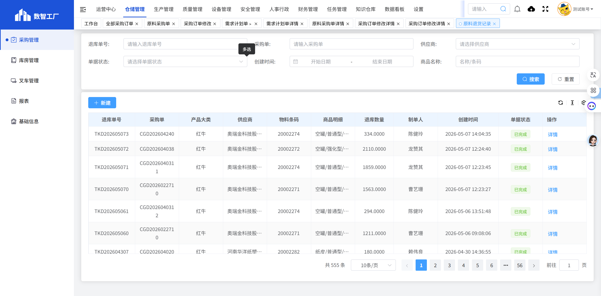
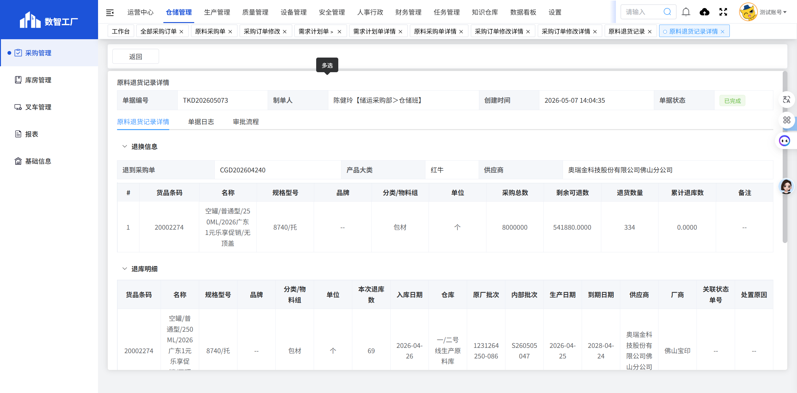

# 原料退货记录

## 页面概述

**功能说明**：管理原料的退货记录，包括退货申请、审核和跟踪等功能。

**页面URL**：https://gdmms.y1b.cn:8424/#/warehouse-manage/buy/Returns/raw-return-record

## 页面截图

### 主页面

### 详情页面

## 筛选条件

| 序号 | 字段名称 | 输入类型 | 默认值 | 约束条件 | 说明 |
| :--- | :--- | :--- | :--- | :--- | :--- |
| 1 | 退库单号 | 文本框 | 空 | 可选 | 支持模糊搜索 |
| 2 | 采购单 | 文本框 | 空 | 可选 | 采购单号搜索 |
| 3 | 供应商 | 下拉框 | 空 | 可选 | 选择供应商 |
| 4 | 单据状态 | 下拉框 | 空 | 可选 | 选择单据状态 |
| 5 | 创建时间-开始 | 日期选择器 | 空 | 可选 | 选择创建开始时间 |
| 6 | 创建时间-结束 | 日期选择器 | 空 | 可选 | 选择创建结束时间 |
| 7 | 商品名称 | 文本框 | 空 | 可选 | 支持模糊搜索 |

## 操作按钮

| 序号 | 按钮名称 | 功能描述 |
| :--- | :--- | :--- |
| 1 | 重置 | 清空所有筛选条件 |
| 2 | 搜索 | 根据筛选条件查询原料退货记录列表 |
| 3 | 新建 | 新建原料退货申请 |

## 数据列表字段

| 序号 | 字段名称 | 字段类型 | 说明 |
| :--- | :--- | :--- | :--- |
| 1 | 退库单号 | 文本 | 退库单据的唯一编号，如：TKD202605073 |
| 2 | 采购单 | 文本 | 关联的采购订单编号 |
| 3 | 产品大类 | 文本 | 产品大类，如：红牛 |
| 4 | 供应商 | 文本 | 供应商名称 |
| 5 | 物料条码 | 文本 | 物料的条码编号，如：20002274 |
| 6 | 商品明细 | 文本 | 商品的详细信息，如：空罐/普通型/250ML/2026广东1元乐享促销/无顶盖 |
| 7 | 退库数量 | 数字 | 本次退库的数量 |
| 8 | 制单人 | 文本 | 创建该退库单的人员姓名 |
| 9 | 创建时间 | 日期时间 | 退库单的创建时间 |
| 10 | 单据状态 | 文本 | 单据当前状态（已完成等） |
| 11 | 操作 | 按钮 | 详情 |

## 操作列按钮

| 序号 | 按钮名称 | 功能描述 |
| :--- | :--- | :--- |
| 1 | 详情 | 查看原料退货记录的详细信息 |

## 详情页面字段

### 基本信息

| 序号 | 字段名称 | 字段类型 | 说明 |
| :--- | :--- | :--- | :--- |
| 1 | 单据编号 | 文本 | 退库单据的唯一编号，如：TKD202605073 |
| 2 | 制单人 | 文本 | 创建人员及部门，如：陈健玲【储运采购部＞仓储班】 |
| 3 | 创建时间 | 日期时间 | 退库单的创建时间 |
| 4 | 单据状态 | 文本 | 当前状态（已完成等） |

### Tab标签

| 序号 | 标签名称 | 说明 |
| :--- | :--- | :--- |
| 1 | 原料退货记录详情 | 显示退货的详细信息 |
| 2 | 单据日志 | 显示单据的操作日志 |
| 3 | 审批流程 | 显示单据的审批流程 |

### 退换信息

| 序号 | 字段名称 | 字段类型 | 说明 |
| :--- | :--- | :--- | :--- |
| 1 | 退到采购单 | 文本 | 关联的采购订单编号，如：CGD202604240 |
| 2 | 产品大类 | 文本 | 产品大类，如：红牛 |
| 3 | 供应商 | 文本 | 供应商名称 |

#### 退换信息列表字段

| 序号 | 字段名称 | 字段类型 | 说明 |
| :--- | :--- | :--- | :--- |
| 1 | # | 数字 | 序号 |
| 2 | 货品条码 | 文本 | 货品的条码编号，如：20002274 |
| 3 | 名称 | 文本 | 货品的名称，如：空罐/普通型/250ML/2026广东1元乐享促销/无顶盖 |
| 4 | 规格型号 | 文本 | 货品的规格型号，如：8740/托 |
| 5 | 品牌 | 文本 | 货品的品牌 |
| 6 | 分类/物料组 | 文本 | 货品的分类，如：包材 |
| 7 | 单位 | 文本 | 货品的计量单位，如：个 |
| 8 | 采购总数 | 数字 | 采购的总数量 |
| 9 | 剩余可退数 | 数字 | 剩余可退库的数量 |
| 10 | 退货数量 | 数字 | 本次退货的数量 |
| 11 | 累计退库数 | 数字 | 累计退库的数量 |
| 12 | 备注 | 文本 | 备注信息 |

### 退库明细列表字段

| 序号 | 字段名称 | 字段类型 | 说明 |
| :--- | :--- | :--- | :--- |
| 1 | 货品条码 | 文本 | 货品的条码编号，如：20002274 |
| 2 | 名称 | 文本 | 货品的名称，如：空罐/普通型/250ML/2026广东1元乐享促销/无顶盖 |
| 3 | 规格型号 | 文本 | 货品的规格型号，如：8740/托 |
| 4 | 品牌 | 文本 | 货品的品牌 |
| 5 | 分类/物料组 | 文本 | 货品的分类，如：包材 |
| 6 | 单位 | 文本 | 货品的计量单位，如：个 |
| 7 | 本次退库数 | 数字 | 本次退库的数量 |
| 8 | 入库日期 | 日期 | 入库日期 |
| 9 | 仓库 | 文本 | 仓库名称，如：一/二号线生产原料库 |
| 10 | 原厂批次 | 文本 | 原厂批次号，如：1231264250-086 |
| 11 | 内部批次 | 文本 | 内部批次号，如：S260505047 |
| 12 | 生产日期 | 日期 | 生产日期 |
| 13 | 到期日期 | 日期 | 到期日期 |
| 14 | 供应商 | 文本 | 供应商名称 |
| 15 | 厂商 | 文本 | 厂商名称，如：佛山宝印 |
| 16 | 关联状态单号 | 文本 | 关联的状态单号 |
| 17 | 处置原因 | 文本 | 处置原因说明 |

### 操作按钮

| 序号 | 按钮名称 | 功能描述 |
| :--- | :--- | :--- |
| 1 | 返回 | 返回原料退货记录列表页面 |

## 分页控件

- 显示总条数：如"共 555 条"
- 每页显示条数：10条/页（可选择）
- 上一页/下一页按钮
- 页码跳转功能

## 数据示例

| 退库单号 | 采购单 | 产品大类 | 供应商 | 物料条码 | 商品明细 | 退库数量 | 单据状态 |
| :--- | :--- | :--- | :--- | :--- | :--- | :--- | :--- |
| TKD202605073 | CGD202604240 | 红牛 | 奥瑞金科技股份有限公司佛山分公司 | 20002274 | 空罐/普通型/250ML/2026广东1元乐享促销/无顶盖 | 334.0000 | 已完成 |
| TKD202605072 | CGD202604038 | 红牛 | 奥瑞金科技股份有限公司佛山分公司 | 20002272 | 空罐/强化型/250ml/蓝色/31周年版/无底盖 | 2110.0000 | 已完成 |
| TKD202605071 | CGD2026040311 | 红牛 | 奥瑞金科技股份有限公司佛山分公司 | 20002274 | 空罐/普通型/250ML/2026广东1元乐享促销/无顶盖 | 1859.0000 | 已完成 |

## 交互说明

1. 用户可通过筛选条件查询特定的原料退货记录
2. 点击"重置"按钮可清空所有筛选条件
3. 点击"新建"按钮可创建新的原料退货申请
4. 点击"详情"按钮可查看退货记录的详细信息
5. 在详情页面，可切换Tab查看原料退货记录详情、单据日志和审批流程
6. 详情页面包含退换信息和退库明细两个展开区域

## 注意事项

- 原料退货记录用于记录原料的退库历史
- 每条退货记录都关联一个采购订单
- 退库明细中显示了详细的批次信息和仓库信息
- 所有退货记录都需要经过审批流程
- 退库数量不能超过剩余可退数
