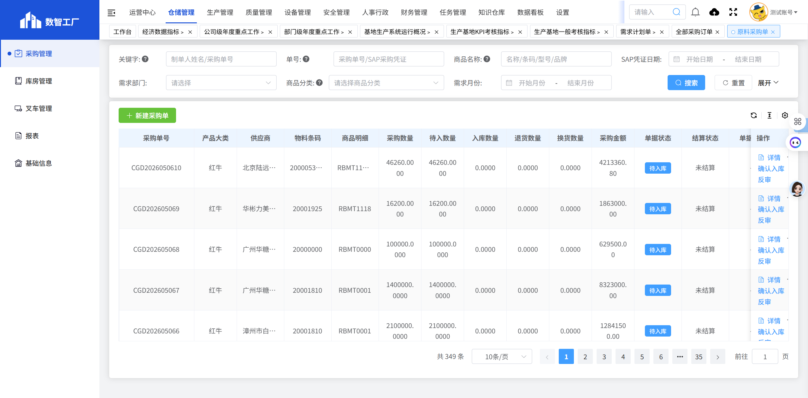
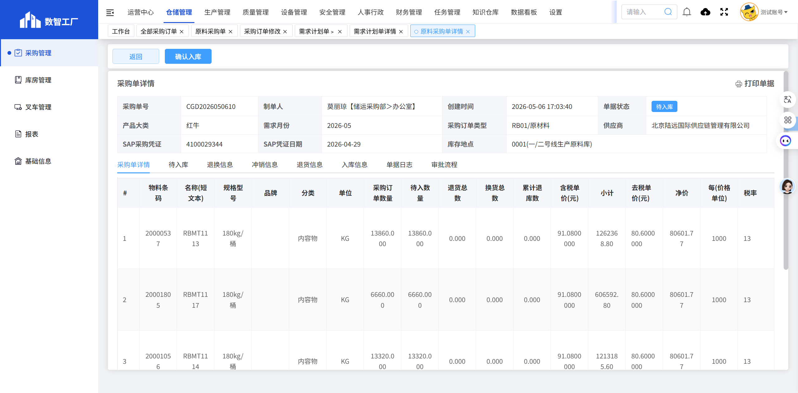

# 原料采购单

## 页面概述

**功能说明**：专门管理原材料采购订单，包括内容物、包材等原料的采购、入库和跟踪。

**页面URL**：https://gdmms.y1b.cn:8424/#/warehouse-manage/buy/routine-purchase/order-copy/raw

## 页面截图

### 主页面

### 详情页面

## 筛选条件

### 基础筛选条件

| 序号 | 字段名称 | 输入类型 | 默认值 | 约束条件 | 说明 |
| :--- | :--- | :--- | :--- | :--- | :--- |
| 1 | 关键字 | 文本框 | 空 | 可选 | 支持模糊搜索 |
| 2 | 单号 | 文本框 | 空 | 可选 | 采购单号搜索 |
| 3 | 商品名称 | 文本框 | 空 | 可选 | 支持模糊搜索 |
| 4 | SAP凭证日期-开始 | 日期选择器 | 空 | 可选 | 选择开始日期 |
| 5 | SAP凭证日期-结束 | 日期选择器 | 空 | 可选 | 选择结束日期 |
| 6 | 需求部门 | 文本框 | 空 | 可选 | 选择需求部门 |
| 7 | 商品分类-一级 | 下拉框 | 空 | 可选 | 选择商品一级分类 |
| 8 | 商品分类-二级 | 下拉框 | 空 | 可选 | 选择商品二级分类 |
| 9 | 需求月份-开始 | 月份选择器 | 空 | 可选 | 选择开始月份 |
| 10 | 需求月份-结束 | 月份选择器 | 空 | 可选 | 选择结束月份 |

### 展开后额外筛选条件

| 序号 | 字段名称 | 输入类型 | 默认值 | 约束条件 | 说明 |
| :--- | :--- | :--- | :--- | :--- | :--- |
| 11 | 结算状态 | 下拉框 | 空 | 可选 | 选择结算状态（未结算、已结算等） |
| 12 | 单据状态 | 下拉框 | 空 | 可选 | 选择单据状态（待入库、已完成等） |
| 13 | 创建部门 | 文本框 | 空 | 可选 | 选择创建部门 |
| 14 | 创建日期-开始 | 日期选择器 | 空 | 可选 | 选择创建开始日期 |
| 15 | 创建日期-结束 | 日期选择器 | 空 | 可选 | 选择创建结束日期 |
| 16 | 产品大类 | 下拉框 | 空 | 可选 | 选择产品大类（如：红牛） |

## 操作按钮

| 序号 | 按钮名称 | 功能描述 |
| :--- | :--- | :--- |
| 1 | 重置 | 清空所有筛选条件 |
| 2 | 搜索 | 根据筛选条件查询原料采购订单列表 |
| 3 | 展开/收起 | 展开/收起更多筛选条件 |
| 4 | 新建采购单 | 新建原料采购订单 |

## 数据列表字段

| 序号 | 字段名称 | 字段类型 | 说明 |
| :--- | :--- | :--- | :--- |
| 1 | 采购单号 | 文本 | 采购订单的唯一编号，如：CGD2026050610 |
| 2 | 产品大类 | 文本 | 产品大类，如：红牛 |
| 3 | 供应商 | 文本 | 供应商名称 |
| 4 | 物料条码 | 文本 | 物料的条码编号 |
| 5 | 商品明细 | 文本 | 采购商品的详细名称和规格 |
| 6 | 采购数量 | 数字 | 采购商品的总数量 |
| 7 | 待入数量 | 数字 | 待入库的数量 |
| 8 | 入库数量 | 数字 | 已入库的数量 |
| 9 | 退货数量 | 数字 | 退货的数量 |
| 10 | 换货数量 | 数字 | 换货的数量 |
| 11 | 采购金额 | 数字 | 采购订单的总金额 |
| 12 | 单据状态 | 文本 | 单据当前状态（待入库、已完成等） |
| 13 | 结算状态 | 文本 | 结算状态（未结算、已结算等） |
| 14 | 单据备注 | 文本 | 单据的备注信息 |
| 15 | SAP采购凭证 | 文本 | SAP系统中的采购凭证号 |
| 16 | SAP凭证日期 | 日期 | SAP凭证的创建日期 |
| 17 | 采购订单类型 | 文本 | 采购订单类型，如：RB01/原材料 |
| 18 | 分类 | 文本 | 商品分类（内容物、包材等） |
| 19 | 制单人 | 文本 | 创建该采购订单的人员姓名 |
| 20 | 创建时间 | 日期时间 | 采购订单的创建时间 |
| 21 | 操作 | 按钮 | 详情、确认入库、反审 |

## 操作列按钮

| 序号 | 按钮名称 | 功能描述 |
| :--- | :--- | :--- |
| 1 | 详情 | 查看原料采购订单的详细信息 |
| 2 | 确认入库 | 确认原料入库操作 |
| 3 | 反审 | 对采购订单进行反审操作 |

## 详情页面字段

### 基本信息

| 序号 | 字段名称 | 字段类型 | 说明 |
| :--- | :--- | :--- | :--- |
| 1 | 采购单号 | 文本 | 采购订单的唯一编号，如：CGD2026050610 |
| 2 | 制单人 | 文本 | 创建人员及部门，如：莫丽琼【储运采购部＞办公室】 |
| 3 | 创建时间 | 日期时间 | 采购订单的创建时间 |
| 4 | 单据状态 | 文本 | 当前状态（待入库、已完成等） |
| 5 | 产品大类 | 文本 | 产品大类，如：红牛 |
| 6 | 需求月份 | 文本 | 需求计划对应的月份 |
| 7 | 采购订单类型 | 文本 | 采购订单类型，如：RB01/原材料 |
| 8 | 供应商 | 文本 | 供应商名称 |
| 9 | SAP采购凭证 | 文本 | SAP系统中的采购凭证号 |
| 10 | SAP凭证日期 | 日期 | SAP凭证的创建日期 |
| 11 | 库存地点 | 文本 | 库存存放地点，如：0001(一/二号线生产原料库) |

### Tab标签

| 序号 | 标签名称 | 说明 |
| :--- | :--- | :--- |
| 1 | 采购单详情 | 显示采购商品的详细信息 |
| 2 | 退换信息 | 显示退换货信息 |
| 3 | 冲销信息 | 显示冲销信息 |
| 4 | 退货信息 | 显示退货信息 |
| 5 | 入库信息 | 显示入库信息 |
| 6 | 单据日志 | 显示单据的操作日志 |
| 7 | 审批流程 | 显示单据的审批流程 |

### 商品明细列表字段

| 序号 | 字段名称 | 字段类型 | 说明 |
| :--- | :--- | :--- | :--- |
| 1 | # | 数字 | 序号 |
| 2 | 物料条码 | 文本 | 物料的条码编号，如：20000537 |
| 3 | 名称(短文本) | 文本 | 物料的名称，如：RBMT1113 |
| 4 | 规格型号 | 文本 | 物料的规格型号，如：180kg/桶 |
| 5 | 品牌 | 文本 | 物料的品牌，如：内容物 |
| 6 | 分类 | 文本 | 物料的分类 |
| 7 | 单位 | 文本 | 物料的计量单位，如：KG |
| 8 | 采购订单数量 | 数字 | 采购订单数量 |
| 9 | 待入数量 | 数字 | 待入库数量 |
| 10 | 退货总数 | 数字 | 退货总数量 |
| 11 | 换货总数 | 数字 | 换货总数量 |
| 12 | 累计退库数 | 数字 | 累计退库数量 |
| 13 | 含税单价(元) | 数字 | 含税单价 |
| 14 | 小计 | 数字 | 小计金额 |
| 15 | 去税单价(元) | 数字 | 去税单价 |
| 16 | 净价 | 数字 | 净价 |
| 17 | 每(价格单位) | 数字 | 价格单位 |
| 18 | 税率 | 数字 | 税率，如：13 |
| 19 | PBXX金额 | 数字 | PBXX金额 |
| 20 | 供应商 | 文本 | 供应商名称 |
| 21 | 需求部门 | 文本 | 需求部门 |
| 22 | 提交日期 | 日期 | 提交日期 |
| 23 | 交货期 | 数字 | 交货期天数 |
| 24 | 合同号 | 文本 | 合同号 |
| 25 | 备注 | 文本 | 备注信息 |

### 汇总信息

| 序号 | 字段名称 | 字段类型 | 说明 |
| :--- | :--- | :--- | :--- |
| 1 | 合计 | 文本 | 采购订单总金额，如：合计: 4213360.80元 |
| 2 | 采购事由 | 文本 | 采购事由说明 |
| 3 | 备注 | 文本 | 单据备注 |
| 4 | 附件 | 文本 | 附件信息 |

### 操作按钮

| 序号 | 按钮名称 | 功能描述 |
| :--- | :--- | :--- |
| 1 | 返回 | 返回原料采购单列表页面 |
| 2 | 确认入库 | 确认原料入库操作 |
| 3 | 打印单据 | 打印采购单据 |

## 分页控件

- 显示总条数：如"共 349 条"
- 每页显示条数：10条/页（可选择）
- 上一页/下一页按钮
- 页码跳转功能
- 支持快速跳转（向后5页、最后一页）

## 数据示例

| 采购单号 | 产品大类 | 供应商 | 商品明细 | 分类 | 采购数量 | 采购金额 | 单据状态 |
| :--- | :--- | :--- | :--- | :--- | :--- | :--- | :--- |
| CGD2026050610 | 红牛 | 北京陆远国际供应链管理有限公司 | RBMT1113等 | 内容物 | 46260.0000 | 4213360.80 | 待入库 |
| CGD202605069 | 红牛 | 华彬力美科技（湖北）有限公司 | RBMT1118 | 内容物 | 16200.0000 | 1863000.00 | 待入库 |
| CGD202605065 | 红牛 | 佛山市三水华彩包装材料有限公司 | 机用胶带 | 包材 | 3600.0000 | 160914.60 | 待入库 |

## 与"全部采购订单"的区别

1. **新增字段**：产品大类、物料条码、换货数量
2. **操作按钮**：增加"确认入库"按钮
3. **数据范围**：仅显示原材料采购订单（内容物、包材等）
4. **数据量**：349条（全部采购订单400条）

## 交互说明

1. 用户可通过筛选条件查询特定的原料采购订单
2. 点击"重置"按钮可清空所有筛选条件
3. 点击"展开"可查看更多筛选选项（结算状态、单据状态、创建部门、创建日期、产品大类）
4. 点击"新建采购单"按钮可创建新的原料采购订单
5. 点击"详情"按钮可查看采购订单的详细信息
6. 点击"确认入库"按钮可确认原料入库操作
7. 点击"反审"按钮可对采购订单进行反审操作
8. 在详情页面，可切换Tab查看采购单详情、退换信息、冲销信息、退货信息、入库信息、单据日志和审批流程

## 注意事项

- 原料采购单专门用于管理原材料采购
- 产品大类用于区分不同产品线（如红牛）
- 物料条码便于物料追踪和管理
- 换货数量字段用于记录原料换货情况
- 确认入库操作需要仓库人员配合完成
- 详情页面包含采购单详情、退换信息、冲销信息、退货信息、入库信息、单据日志和审批流程七个Tab标签
