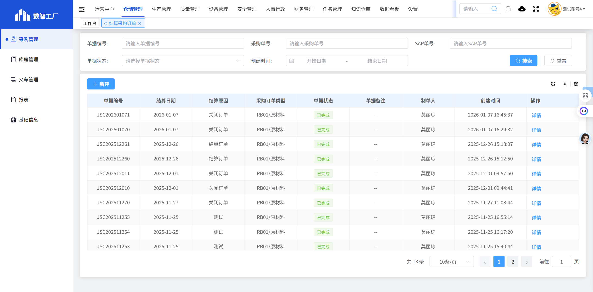
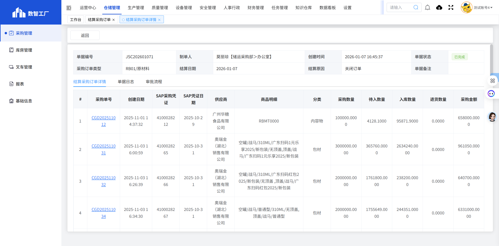

# 结算采购订单

## 页面概述

**功能说明**：管理采购订单的结算操作，包括结算申请、审核和跟踪等功能。

**页面URL**：https://gdmms.y1b.cn:8424/#/warehouse-manage/buy/settle

## 页面截图

### 列表页

### 详情页

## 筛选条件

| 序号 | 字段名称 | 输入类型 | 默认值 | 约束条件 | 说明 |
| :--- | :--- | :--- | :--- | :--- | :--- |
| 1 | 关键字 | 文本框 | 空 | 可选 | 支持模糊搜索 |
| 2 | 结算日期-开始 | 日期选择器 | 空 | 可选 | 选择结算开始日期 |
| 3 | 结算日期-结束 | 日期选择器 | 空 | 可选 | 选择结算结束日期 |
| 4 | 采购订单类型 | 下拉框 | 空 | 可选 | 选择采购订单类型 |
| 5 | 结算原因 | 下拉框 | 空 | 可选 | 选择结算原因 |
| 6 | 单据状态 | 下拉框 | 空 | 可选 | 选择单据状态 |
| 7 | 供应商 | 下拉框 | 空 | 可选 | 选择供应商 |
| 8 | 采购单号 | 文本框 | 空 | 可选 | 精确匹配采购单号 |
| 9 | 创建时间-开始 | 日期选择器 | 空 | 可选 | 选择创建开始时间 |
| 10 | 创建时间-结束 | 日期选择器 | 空 | 可选 | 选择创建结束时间 |

## 操作按钮

| 序号 | 按钮名称 | 功能描述 |
| :--- | :--- | :--- |
| 1 | 重置 | 清空所有筛选条件 |
| 2 | 搜索 | 根据筛选条件查询结算采购订单列表 |
| 3 | 新建 | 新建结算采购订单 |

## 数据列表字段

| 序号 | 字段名称 | 字段类型 | 说明 |
| :--- | :--- | :--- | :--- |
| 1 | 结算单号 | 文本 | 结算单据的唯一编号，如：JSC202601071 |
| 2 | 采购单号 | 文本 | 关联的采购订单编号 |
| 3 | 采购订单类型 | 文本 | 采购订单类型，如：RB01/原材料 |
| 4 | 供应商 | 文本 | 供应商名称 |
| 5 | 结算日期 | 日期 | 结算日期 |
| 6 | 结算原因 | 文本 | 结算原因，如：关闭订单 |
| 7 | 制单人 | 文本 | 创建该结算单的人员姓名 |
| 8 | 创建时间 | 日期时间 | 结算单的创建时间 |
| 9 | 单据状态 | 文本 | 单据当前状态（已完成等） |
| 10 | 操作 | 按钮 | 详情 |

## 操作列按钮

| 序号 | 按钮名称 | 功能描述 |
| :--- | :--- | :--- |
| 1 | 详情 | 查看结算采购订单的详细信息 |

## 详情页面字段

### 基本信息

| 序号 | 字段名称 | 字段类型 | 说明 |
| :--- | :--- | :--- | :--- |
| 1 | 单据编号 | 文本 | 结算单据的唯一编号，如：JSC202601071 |
| 2 | 制单人 | 文本 | 创建人员及部门，如：莫丽琼【储运采购部＞办公室】 |
| 3 | 创建时间 | 日期时间 | 结算单的创建时间 |
| 4 | 单据状态 | 文本 | 当前状态（已完成等） |
| 5 | 采购订单类型 | 文本 | 采购订单类型，如：RB01/原材料 |
| 6 | 结算日期 | 日期 | 结算日期 |
| 7 | 结算原因 | 文本 | 结算原因，如：关闭订单 |
| 8 | 单据备注 | 文本 | 结算采购订单详情 |

### Tab标签

| 序号 | 标签名称 | 说明 |
| :--- | :--- | :--- |
| 1 | 结算采购订单详情 | 显示结算的详细信息 |
| 2 | 单据日志 | 显示单据的操作日志 |
| 3 | 审批流程 | 显示单据的审批流程 |

### 商品明细列表字段

| 序号 | 字段名称 | 字段类型 | 说明 |
| :--- | :--- | :--- | :--- |
| 1 | # | 数字 | 序号 |
| 2 | 采购单号 | 文本 | 关联的采购订单编号 |
| 3 | 创建日期 | 日期时间 | 采购订单的创建日期 |
| 4 | SAP采购凭证 | 文本 | SAP系统中的采购凭证号 |
| 5 | 供应商 | 文本 | 供应商名称 |
| 6 | 商品明细 | 文本 | 商品明细编码 |
| 7 | 分类 | 文本 | 商品分类，如：内容物 |
| 8 | 采购数量 | 数字 | 采购的总数量 |
| 9 | 待入数量 | 数字 | 待入库的数量 |
| 10 | 入库数量 | 数字 | 已入库的数量 |
| 11 | 退货数量 | 数字 | 已退货的数量 |
| 12 | 采购金额 | 数字 | 采购金额（元） |

### 操作按钮

| 序号 | 按钮名称 | 功能描述 |
| :--- | :--- | :--- |
| 1 | 返回 | 返回结算采购订单列表页面 |

## 分页控件

- 显示总条数
- 每页显示条数：可选择
- 上一页/下一页按钮
- 页码跳转功能

## 数据示例

| 结算单号 | 采购单号 | 采购订单类型 | 供应商 | 结算日期 | 结算原因 | 单据状态 |
| :--- | :--- | :--- | :--- | :--- | :--- | :--- |
| JSC202601071 | CGD202511012 | RB01/原材料 | 广州华糖食品有限公司 | 2026-01-07 | 关闭订单 | 已完成 |

### 商品明细示例

| # | 采购单号 | 创建日期 | SAP采购凭证 | 供应商 | 商品明细 | 分类 | 采购数量 | 待入数量 | 入库数量 | 退货数量 | 采购金额 |
| :--- | :--- | :--- | :--- | :--- | :--- | :--- | :--- | :--- | :--- | :--- | :--- |
| 1 | CGD202511012 | 2025-11-01 14:37:32 | 4100028212 | 广州华糖食品有限公司 | RBMT0000 | 内容物 | 100000.0000 | 4128.1000 | 95871.9000 | 0.0000 | 658000.0000 |

## 交互说明

1. 用户可通过筛选条件查询特定的结算采购订单
2. 点击"重置"按钮可清空所有筛选条件
3. 点击"新建"按钮可创建新的结算采购订单
4. 点击"详情"按钮可查看结算采购订单的详细信息
5. 在详情页面，可切换Tab查看结算采购订单详情、单据日志和审批流程
6. 详情页面包含商品明细列表，展示关联采购订单的商品信息

## 注意事项

- 结算采购订单用于对采购订单进行结算操作
- 每条结算记录都关联一个或多个采购订单
- 商品明细中显示了采购数量、入库数量、退货数量等关键数据
- 结算原因包括关闭订单等场景
- 所有结算记录都需要经过审批流程
