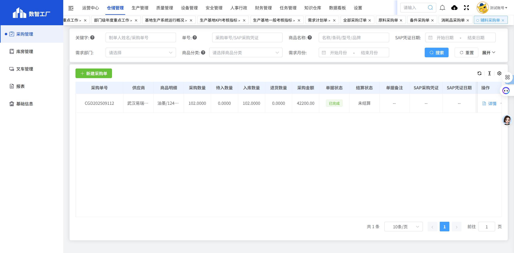

# 辅料采购单

## 页面概述

**功能说明**：专门管理辅料采购订单，包括油墨、溶剂、清洗剂等生产辅助材料的采购管理。

**页面URL**：https://gdmms.y1b.cn:8424/#/warehouse-manage/buy/routine-purchase/order-copy/ingredients

## 页面截图

## 筛选条件

| 序号 | 字段名称 | 输入类型 | 默认值 | 约束条件 | 说明 |
| :--- | :--- | :--- | :--- | :--- | :--- |
| 1 | 关键字 | 文本框 | 空 | 可选 | 支持模糊搜索 |
| 2 | 单号 | 文本框 | 空 | 可选 | 采购单号搜索 |
| 3 | 商品名称 | 文本框 | 空 | 可选 | 支持模糊搜索 |
| 4 | SAP凭证日期-开始 | 文本框 | 空 | 可选 | 选择开始日期 |
| 5 | SAP凭证日期-结束 | 文本框 | 空 | 可选 | 选择结束日期 |
| 6 | 需求部门 | 文本框 | 空 | 可选 | 选择需求部门 |
| 7 | 商品分类-一级 | 下拉框 | 空 | 可选 | 选择商品一级分类 |
| 8 | 商品分类-二级 | 下拉框 | 空 | 可选 | 选择商品二级分类 |
| 9 | 需求月份-开始 | 文本框 | 空 | 可选 | 选择开始月份 |
| 10 | 需求月份-结束 | 文本框 | 空 | 可选 | 选择结束月份 |

## 操作按钮

| 序号 | 按钮名称 | 功能描述 |
| :--- | :--- | :--- |
| 1 | 重置 | 清空所有筛选条件 |
| 2 | 搜索 | 根据筛选条件查询辅料采购订单列表 |
| 3 | 展开 | 展开更多筛选条件 |
| 4 | 新建采购单 | 新建辅料采购订单 |

## 数据列表字段

| 序号 | 字段名称 | 字段类型 | 说明 |
| :--- | :--- | :--- | :--- |
| 1 | 采购单号 | 文本 | 采购订单的唯一编号，如：CGD202509112 |
| 2 | 供应商 | 文本 | 供应商名称 |
| 3 | 商品明细 | 文本 | 采购商品的详细名称和规格 |
| 4 | 采购数量 | 数字 | 采购商品的总数量 |
| 5 | 待入数量 | 数字 | 待入库的数量 |
| 6 | 入库数量 | 数字 | 已入库的数量 |
| 7 | 退货数量 | 数字 | 退货的数量 |
| 8 | 采购金额 | 数字 | 采购订单的总金额 |
| 9 | 单据状态 | 文本 | 单据当前状态（待入库、已完成等） |
| 10 | 结算状态 | 文本 | 结算状态（未结算、已结算等） |
| 11 | 单据备注 | 文本 | 单据的备注信息 |
| 12 | SAP采购凭证 | 文本 | SAP系统中的采购凭证号 |
| 13 | SAP凭证日期 | 日期 | SAP凭证的创建日期 |
| 14 | 采购订单类型 | 文本 | 采购订单类型，如：RB02/辅料 |
| 15 | 分类 | 文本 | 商品分类（辅料） |
| 16 | 需求月份 | 文本 | 需求月份，如：2025-09 |
| 17 | 需求部门 | 文本 | 需求部门名称 |
| 18 | 采购事由 | 文本 | 采购的原因和用途 |
| 19 | 制单人 | 文本 | 创建该采购订单的人员姓名 |
| 20 | 创建时间 | 日期时间 | 采购订单的创建时间 |
| 21 | 操作 | 按钮 | 详情等操作 |

## 分页控件

- 显示总条数：如"共 1 条"
- 每页显示条数：10条/页（可选择）
- 上一页/下一页按钮
- 页码跳转功能

## 数据示例

| 采购单号 | 供应商 | 商品明细 | 分类 | 采购数量 | 采购金额 | 单据状态 |
| :--- | :--- | :--- | :--- | :--- | :--- | :--- |
| CGD202509112 | 武汉易瑞德标识设备有限公司 | 油墨/1240,溶剂/1512,清洗剂/0030 | 辅料 | 102.0000 | 42200.00 | 已完成 |

## 辅料分类说明

辅料采购单主要包含以下类型：

1. **油墨**：喷码机油墨、印刷油墨等
2. **溶剂**：清洗溶剂、稀释剂等
3. **清洗剂**：设备清洗剂、工业清洗剂等
4. **其他辅料**：生产过程中使用的其他辅助材料

## 与其他采购单的区别

1. **数据范围**：仅显示辅料类采购订单
2. **采购订单类型**：RB02/辅料
3. **用途**：专门用于生产辅助材料采购
4. **管理特点**：辅料通常与生产计划关联，需要定期补充

## 交互说明

1. 用户可通过筛选条件查询特定的辅料采购订单
2. 点击"重置"按钮可清空所有筛选条件
3. 点击"展开"可查看更多筛选选项
4. 点击"新建采购单"按钮可创建新的辅料采购订单
5. 点击"详情"按钮可查看采购订单的详细信息
6. 点击"确认入库"按钮可确认辅料入库操作
7. 点击"反审"按钮可对采购订单进行反审操作

## 注意事项

- 辅料采购单专门用于管理生产辅助材料采购
- 辅料通常与生产设备配套使用，需要关注兼容性
- 油墨、溶剂等需要关注安全存储和使用规范
- 辅料采购建议与生产计划联动，避免库存积压
- 部分辅料可能属于危险化学品，需要特殊管理
