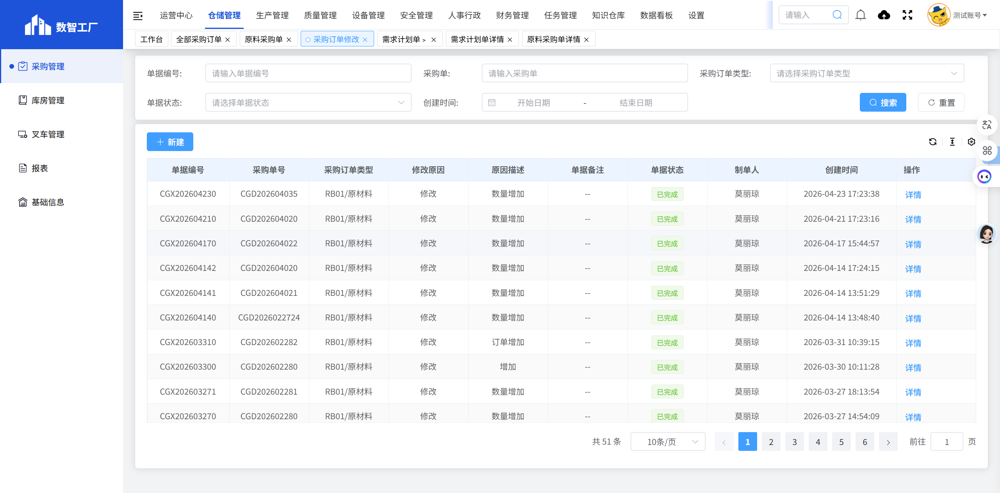
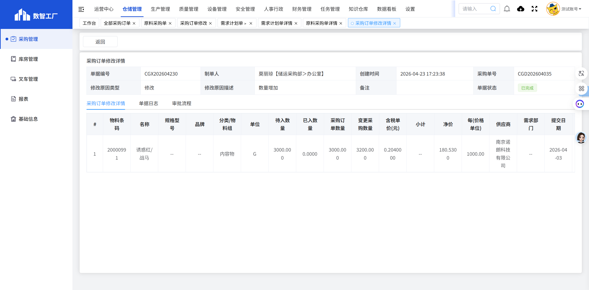

# 采购订单修改

## 页面概述

**功能说明**：管理采购订单的修改记录，包括修改申请、审核和跟踪等功能。

**页面URL**：https://gdmms.y1b.cn:8424/#/warehouse-manage/buy/order-modification

## 页面截图

### 主页面

### 详情页面

## 筛选条件

| 序号 | 字段名称 | 输入类型 | 默认值 | 约束条件 | 说明 |
| :--- | :--- | :--- | :--- | :--- | :--- |
| 1 | 单据编号 | 文本框 | 空 | 可选 | 支持模糊搜索 |
| 2 | 采购单 | 文本框 | 空 | 可选 | 采购单号搜索 |
| 3 | 采购订单类型 | 下拉框 | 空 | 可选 | 选择采购订单类型 |
| 4 | 单据状态 | 下拉框 | 空 | 可选 | 选择单据状态 |
| 5 | 创建时间-开始 | 日期选择器 | 空 | 可选 | 选择创建开始时间 |
| 6 | 创建时间-结束 | 日期选择器 | 空 | 可选 | 选择创建结束时间 |

## 操作按钮

| 序号 | 按钮名称 | 功能描述 |
| :--- | :--- | :--- |
| 1 | 重置 | 清空所有筛选条件 |
| 2 | 搜索 | 根据筛选条件查询采购订单修改列表 |
| 3 | 新建 | 新建采购订单修改申请 |

## 数据列表字段

| 序号 | 字段名称 | 字段类型 | 说明 |
| :--- | :--- | :--- | :--- |
| 1 | 单据编号 | 文本 | 修改单据的唯一编号，如：CGX202604230 |
| 2 | 采购单号 | 文本 | 关联的采购订单编号 |
| 3 | 采购订单类型 | 文本 | 采购订单类型，如：RB01/原材料 |
| 4 | 修改原因 | 文本 | 修改原因类型，如：修改 |
| 5 | 原因描述 | 文本 | 修改原因的详细描述，如：数量增加 |
| 6 | 单据备注 | 文本 | 单据的备注信息 |
| 7 | 单据状态 | 文本 | 单据当前状态（已完成等） |
| 8 | 制单人 | 文本 | 创建该修改单的人员姓名 |
| 9 | 创建时间 | 日期时间 | 修改单的创建时间 |
| 10 | 操作 | 按钮 | 详情 |

## 操作列按钮

| 序号 | 按钮名称 | 功能描述 |
| :--- | :--- | :--- |
| 1 | 详情 | 查看采购订单修改的详细信息 |

## 详情页面字段

### 基本信息

| 序号 | 字段名称 | 字段类型 | 说明 |
| :--- | :--- | :--- | :--- |
| 1 | 单据编号 | 文本 | 修改单据的唯一编号，如：CGX202604230 |
| 2 | 制单人 | 文本 | 创建人员及部门，如：莫丽琼【储运采购部＞办公室】 |
| 3 | 创建时间 | 日期时间 | 修改单的创建时间 |
| 4 | 采购单号 | 文本 | 关联的采购订单编号 |
| 5 | 修改原因类型 | 文本 | 修改原因类型，如：修改 |
| 6 | 修改原因描述 | 文本 | 修改原因的详细描述，如：数量增加 |
| 7 | 备注 | 文本 | 单据备注 |
| 8 | 单据状态 | 文本 | 当前状态（已完成等） |

### Tab标签

| 序号 | 标签名称 | 说明 |
| :--- | :--- | :--- |
| 1 | 采购订单修改详情 | 显示修改商品的详细信息 |
| 2 | 单据日志 | 显示单据的操作日志 |
| 3 | 审批流程 | 显示单据的审批流程 |

### 修改明细列表字段

| 序号 | 字段名称 | 字段类型 | 说明 |
| :--- | :--- | :--- | :--- |
| 1 | # | 数字 | 序号 |
| 2 | 物料条码 | 文本 | 物料的条码编号，如：20000991 |
| 3 | 名称 | 文本 | 物料的名称，如：诱惑红/战马 |
| 4 | 规格型号 | 文本 | 物料的规格型号 |
| 5 | 品牌 | 文本 | 物料的品牌 |
| 6 | 分类/物料组 | 文本 | 物料的分类，如：内容物 |
| 7 | 单位 | 文本 | 物料的计量单位，如：G |
| 8 | 待入数量 | 数字 | 待入库数量 |
| 9 | 已入数量 | 数字 | 已入库数量 |
| 10 | 采购订单数量 | 数字 | 原采购订单数量 |
| 11 | 变更采购数量 | 数字 | 变更后的采购数量 |
| 12 | 含税单价(元) | 数字 | 含税单价 |
| 13 | 小计 | 数字 | 小计金额 |
| 14 | 净价 | 数字 | 净价 |
| 15 | 每(价格单位) | 数字 | 价格单位 |
| 16 | 供应商 | 文本 | 供应商名称 |
| 17 | 需求部门 | 文本 | 需求部门 |
| 18 | 提交日期 | 日期 | 提交日期 |
| 19 | 交货期 | 文本 | 交货期天数 |
| 20 | 合同编号 | 文本 | 合同编号 |
| 21 | 标记 | 文本 | 标记状态，如：未标记 |

### 操作按钮

| 序号 | 按钮名称 | 功能描述 |
| :--- | :--- | :--- |
| 1 | 返回 | 返回采购订单修改列表页面 |

## 分页控件

- 显示总条数：如"共 51 条"
- 每页显示条数：10条/页（可选择）
- 上一页/下一页按钮
- 页码跳转功能

## 数据示例

| 单据编号 | 采购单号 | 采购订单类型 | 修改原因 | 原因描述 | 单据状态 |
| :--- | :--- | :--- | :--- | :--- | :--- |
| CGX202604230 | CGD202604035 | RB01/原材料 | 修改 | 数量增加 | 已完成 |
| CGX202604210 | CGD202604020 | RB01/原材料 | 修改 | 数量增加 | 已完成 |
| CGX202603310 | CGD202602282 | RB01/原材料 | 修改 | 订单增加 | 已完成 |

## 交互说明

1. 用户可通过筛选条件查询特定的采购订单修改记录
2. 点击"重置"按钮可清空所有筛选条件
3. 点击"新建"按钮可创建新的采购订单修改申请
4. 点击"详情"按钮可查看修改记录的详细信息
5. 在详情页面，可切换Tab查看采购订单修改详情、单据日志和审批流程

## 注意事项

- 采购订单修改用于记录采购订单的变更历史
- 修改原因类型包括：修改、增加等
- 原因描述详细说明修改的具体内容
- 修改明细中显示原采购订单数量和变更后的采购数量
- 所有修改记录都需要经过审批流程
