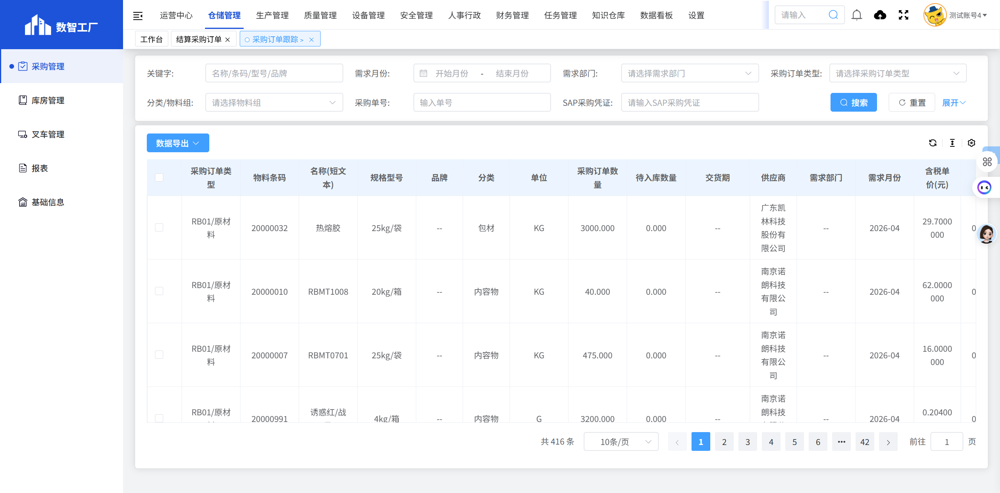

# 采购订单跟踪

## 页面概述

**功能说明**：跟踪采购订单的执行状态，包括采购进度、入库情况、交货状态等。

**页面URL**：<https://gdmms.y1b.cn:8424/#/warehouse-manage/buy/purchase-track>

## 页面截图

### 列表页

## 筛选条件

| 序号 | 字段名称       | 输入类型  | 默认值 | 约束条件 | 说明           |
| :- | :--------- | :---- | :-- | :--- | :----------- |
| 1  | 关键字        | 文本框   | 空   | 可选   | 支持模糊搜索       |
| 2  | 需求月份-开始    | 月份选择器 | 空   | 可选   | 选择需求开始月份     |
| 3  | 需求月份-结束    | 月份选择器 | 空   | 可选   | 选择需求结束月份     |
| 4  | 需求部门       | 文本框   | 空   | 只读   | 显示需求部门       |
| 5  | 采购订单类型     | 下拉框   | 空   | 可选   | 选择采购订单类型     |
| 6  | 分类/物料组     | 下拉框   | 空   | 可选   | 选择分类或物料组     |
| 7  | 采购单号       | 文本框   | 空   | 可选   | 精确匹配采购单号     |
| 8  | SAP采购凭证    | 文本框   | 空   | 可选   | 精确匹配SAP采购凭证号 |
| 9  | SAP凭证日期-开始 | 日期选择器 | 空   | 可选   | 选择SAP凭证开始日期  |
| 10 | SAP凭证日期-结束 | 日期选择器 | 空   | 可选   | 选择SAP凭证结束日期  |
| 11 | 交货逾期       | 单选框   | 未勾选 | 可选   | 筛选交货逾期的订单    |

## 操作按钮

| 序号 | 按钮名称 | 功能描述             |
| :- | :--- | :--------------- |
| 1  | 重置   | 清空所有筛选条件         |
| 2  | 搜索   | 根据筛选条件查询采购订单跟踪列表 |

## 数据列表字段

| 序号 | 字段名称    | 字段类型   | 说明                 |
| :- | :------ | :----- | :----------------- |
| 1  | 采购订单类型  | 文本     | 采购订单类型，如：RB01/原材料  |
| 2  | 物料条码    | 文本     | 物料的条码编号，如：20000032 |
| 3  | 名称(短文本) | 文本     | 物料的名称，如：热熔胶        |
| 4  | 规格型号    | 文本     | 物料的规格型号，如：25kg/袋   |
| 5  | 单位      | 文本     | 计量单位，如：KG          |
| 6  | 采购订单数量  | 数字     | 采购订单的数量            |
| 7  | 待入库数量   | 数字     | 待入库的数量             |
| 8  | 供应商     | 文本     | 供应商名称              |
| 9  | 需求月份    | 文本     | 需求月份，如：2026-04     |
| 10 | 含税单价(元) | 数字     | 含税单价               |
| 11 | 采购单号    | 文本     | 采购订单编号             |
| 12 | SAP采购凭证 | 文本     | SAP系统中的采购凭证号       |
| 13 | SAP凭证日期 | 日期     | SAP凭证日期            |
| 14 | 库存地点    | 布尔     | 期                  |
| 15 | 采购单号    |   |               |

## 分页控件

- 显示总条数
- 每页显示条数：可选择
- 上一页/下一页按钮
- 页码跳转功能

## 数据示例

| 采购订单类型   | 物料条码     | 名称(短文本) | 规格型号   | 单位 | 采购订单数量   | 待入库数量 | 供应商          | 需求月份    | 含税单价(元)    | 采购单号         |
| :------- | :------- | :------ | :----- | :- | :------- | :---- | :----------- | :------ | :--------- | :----------- |
| RB01/原材料 | 20000032 | 热熔胶     | 25kg/袋 | KG | 3000.000 | 0.000 | 广东凯林科技股份有限公司 | 2026-04 | 29.7000000 | CGD202604171 |

## 交互说明

1. 用户可通过筛选条件查询特定的采购订单跟踪信息
2. 点击"重置"按钮可清空所有筛选条件
3. 点击"搜索"按钮执行查询
4. 列表页无详情按钮，所有信息直接在列表中展示
5. 支持按交货逾期状态筛选订单

## 注意事项

- 采购订单跟踪用于监控采购订单的执行进度
- 重点关注待入库数量和交货逾期状态
- 支持按需求月份、采购订单类型、供应商等多维度筛选
- 数据来源于SAP系统，SAP采购凭证和SAP凭证日期为关键关联字段

