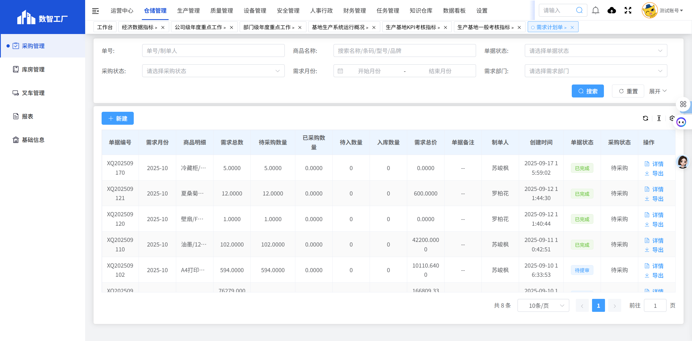
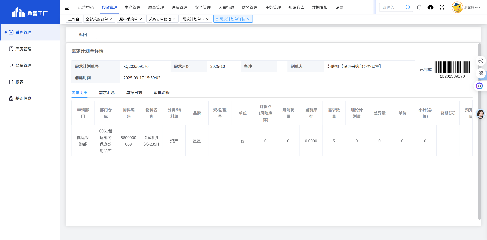

# 需求计划单

## 页面概述

**功能说明**：管理采购需求计划单，包括需求计划的创建、查询、审核和跟踪等功能。

**页面URL**：https://gdmms.y1b.cn:8424/#/warehouse-manage/buy/demand-plan

## 页面截图

### 主页面

### 详情页面

## 筛选条件

### 基础筛选条件

| 序号 | 字段名称 | 输入类型 | 默认值 | 约束条件 | 说明 |
| :--- | :--- | :--- | :--- | :--- | :--- |
| 1 | 单号 | 文本框 | 空 | 可选 | 支持模糊搜索 |
| 2 | 商品名称 | 文本框 | 空 | 可选 | 支持模糊搜索 |
| 3 | 单据状态 | 下拉框 | 空 | 可选 | 选择单据状态 |
| 4 | 采购状态 | 下拉框 | 空 | 可选 | 选择采购状态 |
| 5 | 需求月份-开始 | 月份选择器 | 空 | 可选 | 选择开始月份 |
| 6 | 需求月份-结束 | 月份选择器 | 空 | 可选 | 选择结束月份 |
| 7 | 需求部门 | 文本框 | 空 | 只读 | 自动填充当前用户部门 |

### 展开后额外筛选条件

| 序号 | 字段名称 | 输入类型 | 默认值 | 约束条件 | 说明 |
| :--- | :--- | :--- | :--- | :--- | :--- |
| 8 | 创建日期-开始 | 日期选择器 | 空 | 可选 | 选择创建开始日期 |
| 9 | 创建日期-结束 | 日期选择器 | 空 | 可选 | 选择创建结束日期 |

## 操作按钮

| 序号 | 按钮名称 | 功能描述 |
| :--- | :--- | :--- |
| 1 | 重置 | 清空所有筛选条件 |
| 2 | 搜索 | 根据筛选条件查询需求计划单列表 |
| 3 | 展开/收起 | 展开/收起更多筛选条件 |
| 4 | 新建 | 新建需求计划单 |

## 数据列表字段

| 序号 | 字段名称 | 字段类型 | 说明 |
| :--- | :--- | :--- | :--- |
| 1 | 单据编号 | 文本 | 需求计划单的唯一编号，如：XQ202509170 |
| 2 | 需求月份 | 文本 | 需求计划对应的月份，如：2025-10 |
| 3 | 商品明细 | 文本 | 需求商品的详细名称和规格 |
| 4 | 需求总数 | 数字 | 需求商品的总数量 |
| 5 | 待采购数量 | 数字 | 尚未采购的数量 |
| 6 | 已采购数量 | 数字 | 已完成采购的数量 |
| 7 | 待入数量 | 数字 | 待入库的数量 |
| 8 | 入库数量 | 数字 | 已入库的数量 |
| 9 | 需求总价 | 数字 | 需求商品的总价格 |
| 10 | 单据备注 | 文本 | 单据的备注信息，如无备注显示"--" |
| 11 | 制单人 | 文本 | 创建该需求计划单的人员姓名 |
| 12 | 创建时间 | 日期时间 | 需求计划单的创建时间 |
| 13 | 单据状态 | 文本 | 单据当前状态（待提审、已完成等） |
| 14 | 采购状态 | 文本 | 采购当前状态（待采购、已完成等） |
| 15 | 操作 | 按钮 | 详情、导出 |

## 操作列按钮

| 序号 | 按钮名称 | 功能描述 |
| :--- | :--- | :--- |
| 1 | 详情 | 查看需求计划单的详细信息 |
| 2 | 导出 | 导出需求计划单数据 |

## 详情页面字段

### 基本信息

| 序号 | 字段名称 | 字段类型 | 说明 |
| :--- | :--- | :--- | :--- |
| 1 | 需求计划单号 | 文本 | 需求计划单的唯一编号，如：XQ202509170 |
| 2 | 需求月份 | 文本 | 需求计划对应的月份，如：2025-10 |
| 3 | 备注 | 文本 | 单据备注信息 |
| 4 | 制单人 | 文本 | 创建人员及部门，如：苏峻枫【储运采购部＞办公室】 |
| 5 | 创建时间 | 日期时间 | 需求计划单的创建时间 |
| 6 | 单据状态 | 文本 | 当前状态（已完成等） |

### Tab标签

| 序号 | 标签名称 | 说明 |
| :--- | :--- | :--- |
| 1 | 需求明细 | 显示需求商品的详细信息 |
| 2 | 需求汇总 | 显示需求商品的汇总信息 |
| 3 | 单据日志 | 显示单据的操作日志 |
| 4 | 审批流程 | 显示单据的审批流程 |

### 需求明细列表字段

| 序号 | 字段名称 | 字段类型 | 说明 |
| :--- | :--- | :--- | :--- |
| 1 | 申请部门 | 文本 | 申请部门名称，如：储运采购部 |
| 2 | 部门仓库 | 文本 | 部门仓库名称，如：0061储运部劳保办公用品库 |
| 3 | 物料编码 | 文本 | 物料的唯一编码，如：5600000069 |
| 4 | 物料名称 | 文本 | 物料的名称，如：冷藏柜/LSC-235H |
| 5 | 分类/物料组 | 文本 | 物料的分类，如：资产 |
| 6 | 品牌 | 文本 | 物料的品牌，如：星星 |
| 7 | 规格/型号 | 文本 | 物料的规格型号 |
| 8 | 单位 | 文本 | 物料的计量单位，如：台 |
| 9 | 订货点(风险库存) | 数字 | 订货点或风险库存数量 |
| 10 | 月消耗量 | 数字 | 月消耗量 |
| 11 | 当前库存 | 数字 | 当前库存数量 |
| 12 | 需求数量 | 数字 | 需求数量 |
| 13 | 理论计划量 | 数字 | 理论计划量 |
| 14 | 差异量 | 数字 | 差异量 |
| 15 | 单价 | 数字 | 物料单价 |
| 16 | 小计(总价) | 数字 | 小计或总价 |
| 17 | 货期(天) | 数字 | 货期天数 |
| 18 | 预算科目 | 文本 | 预算科目 |
| 19 | 用途 | 文本 | 物料用途 |
| 20 | 请购原因 | 文本 | 请购原因 |
| 21 | 附件图片 | 图片 | 附件图片 |
| 22 | 备注 | 文本 | 备注信息 |

### 操作按钮

| 序号 | 按钮名称 | 功能描述 |
| :--- | :--- | :--- |
| 1 | 返回 | 返回需求计划单列表页面 |

## 分页控件

- 显示总条数：如"共 8 条"
- 每页显示条数：10条/页（可选择）
- 上一页/下一页按钮
- 页码跳转功能

## 数据示例

| 单据编号 | 需求月份 | 商品明细 | 需求总数 | 待采购数量 | 已采购数量 | 单据状态 | 采购状态 |
| :--- | :--- | :--- | :--- | :--- | :--- | :--- | :--- |
| XQ202509170 | 2025-10 | 冷藏柜/LSC-235H | 5.0000 | 5.0000 | 0.0000 | 已完成 | 待采购 |
| XQ202509121 | 2025-10 | 夏桑菊冲剂/10g*32小包/袋 | 12.0000 | 12.0000 | 0.0000 | 已完成 | 待采购 |
| XQ202509081 | 2025-10 | 异丙醇/4L色谱纯等 | 24052.0000 | 0.0000 | 24052.0000 | 已完成 | 已完成 |

## 交互说明

1. 用户可通过筛选条件查询特定的需求计划单
2. 点击"重置"按钮可清空所有筛选条件
3. 点击"展开"可查看更多筛选选项（创建日期）
4. 点击"新建"按钮可创建新的需求计划单
5. 点击"详情"按钮可查看需求计划单的详细信息
6. 点击"导出"按钮可导出需求计划单数据
7. 在详情页面，可切换Tab查看需求明细、需求汇总、单据日志和审批流程

## 注意事项

- 需求部门字段为只读，自动填充当前用户所属部门
- 单据状态包括：待提审、已完成等
- 采购状态包括：待采购、已完成等
- 需求计划单创建后需要经过审批流程
- 详情页面包含需求明细、需求汇总、单据日志和审批流程四个Tab标签
